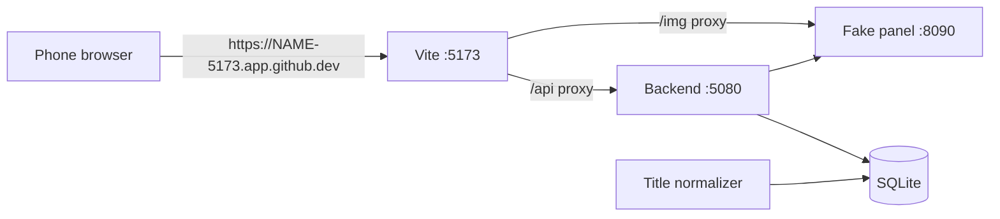

# .devcontainer

GitHub Codespaces setup: the web app with the fake panel, usable from a phone browser. Rationale: [D-035](../documentation/DECISIONS.md#d-035), [D-036](../documentation/DECISIONS.md#d-036).

| File | Purpose |
|------|---------|
| `devcontainer.json` | Ubuntu + Node 22, .NET 10, Python 3.11, GitHub CLI (`gh`). Forwards only port 5173 (the web app). |
| `setup.sh` | Runs once when the codespace is created: `npm ci`, worker venv, H.264 test media (plays on phones), backend build. |
| `get-tv-apk.sh` | Downloads the APK from the `tv-apk` prerelease; Vite then serves it at `<codespace link>/tv.apk` for an Android TV. |
| `start.sh` | Runs on every start and every time the codespace is opened (`--if-stopped`: skipped when the app already answers): `npm run dev:all -- --fake` in the background with the public HTTPS address as `APP_API_BASE_URL` / `BACKEND_PUBLIC_BASE_URL` / `FAKE_PANEL_IMAGE_BASE_URL`. Run `bash .devcontainer/start.sh` by hand to restart. Log: `/tmp/iptv-dev.log`. |

Sign in with server `http://localhost:8090`, username `demo`, password `demo` (the backend reaches the panel inside the codespace).

## Android TV

The TV app talks to the IPTV provider directly (D-038), so the codespace is only used to download the APK.

1. Every merge to `main` that changes the app builds a new APK by itself (~15 min). To build without a merge: GitHub → Actions → **TV APK for a real TV** → Run workflow (leave `api_base_url` empty).
2. In the codespace terminal: `bash .devcontainer/get-tv-apk.sh`.
3. Make port 5173 public while the TV downloads (the TV cannot do GitHub sign-in); set it back to private after.
4. On the TV, install the **Downloader** app, allow it to install unknown apps, and open `<codespace link>/tv.apk`.
5. Sign in on the TV with **IPTV provider** and your provider's address, username and password. The fake panel in the codespace is not reachable from the TV.
