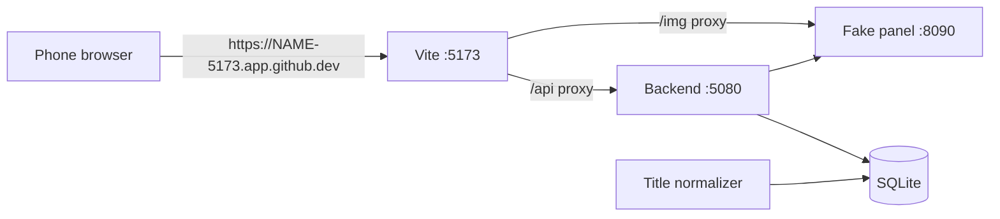

# .devcontainer

GitHub Codespaces setup: the web app with the fake panel, usable from a phone browser. Rationale: [D-035](../documentation/DECISIONS.md#d-035), [D-036](../documentation/DECISIONS.md#d-036).

| File | Purpose |
|------|---------|
| `devcontainer.json` | Ubuntu + Node 22, .NET 10, Python 3.11, GitHub CLI (`gh`). Forwards only port 5173 (the web app). |
| `setup.sh` | Runs once when the codespace is created: `npm ci`, worker venv, H.264 test media (plays on phones), backend build. |
| `start.sh` | Runs on every start and every time the codespace is opened (`--if-stopped`: skipped when the app already answers): `npm run dev:all -- --fake` in the background with the public HTTPS address as `APP_API_BASE_URL` / `BACKEND_PUBLIC_BASE_URL` / `FAKE_PANEL_IMAGE_BASE_URL`. Run `bash .devcontainer/start.sh` by hand to restart. Log: `/tmp/iptv-dev.log`. |

Sign in with server `http://localhost:8090`, username `demo`, password `demo` (the backend reaches the panel inside the codespace).
