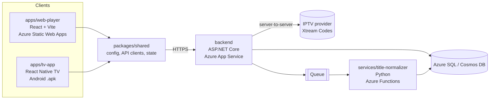

# iptv-player

Monorepo for an IPTV streaming platform: desktop web player, Android TV app, .NET API, Python processing service.
The product name is configurable (`APP_NAME` in `.env`).

## Architecture



## Structure

| Path | Description |
|------|-------------|
| [`apps/web-player`](./apps/web-player) | Desktop browser client. |
| [`apps/tv-app`](./apps/tv-app) | Android TV client. |
| [`packages/shared`](./packages/shared) | TypeScript code shared by both clients. |
| [`backend`](./backend) | C# .NET 8 Web API. |
| [`services`](./services) | Python Azure Functions. |
| [`documentation`](./documentation) | `DECISIONS.md`, `KNOWN-ISSUES.md`, `NEXT-STEPS.md`. |

## Prerequisites

| Tool | Version |
|------|---------|
| Node.js | 22+ (`.nvmrc`) |
| npm | 10+ |
| .NET SDK | 8.0 |
| Python | 3.11+ |
| Android SDK + JDK 17 | TV app native builds only |

## Quick start

```bash
npm install                 # all JS workspaces
npm run typecheck           # all JS workspaces
npm run test                # all JS workspaces
npm run build               # all JS workspaces
npm run dev:web             # web player on http://localhost:5173
npm run dev:tv              # Expo dev server for the TV app

npm run backend:test        # dotnet test
npm run backend:run         # API on http://localhost:5080

cd services/title-normalizer && python3 -m venv .venv && . .venv/bin/activate \
  && pip install -r requirements-dev.txt && python -m pytest
```

## Configuration

| File | Committed | Purpose |
|------|-----------|---------|
| `.env` | Yes | Public defaults: `APP_NAME`, `APP_SLUG`, `APP_ANDROID_PACKAGE`, `APP_API_BASE_URL`. |
| `.env.local` | No | Local overrides and secrets. |

Precedence (low → high): `.env` → `.env.local` → real environment variables.

## Root files

| File | Purpose |
|------|---------|
| `package.json` | npm workspaces, root scripts, `react-native` → `react-native-tvos` override. |
| `turbo.json` | Turborepo task pipeline. |
| `tsconfig.base.json` | Shared TypeScript compiler options. |
| `.editorconfig` | Editor formatting rules. |
