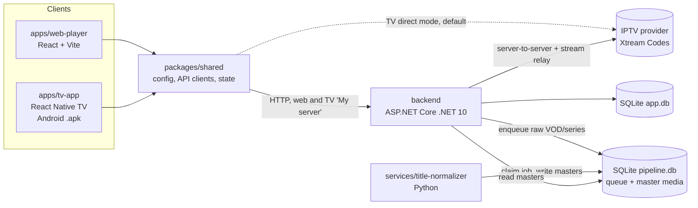

# iptv-player

Monorepo for an IPTV streaming platform: desktop web player, Android TV app, .NET API, Python processing service.
The product name is configurable (`APP_NAME` in `.env`). Phase 1 runs locally only; Azure targets are planned.

## Legal notes (Germany)

> **Not legal advice.** This is a summary of German law as of September 2026 for people who use or run this app. For a binding answer about your own situation, ask a lawyer (Rechtsanwalt for copyright / IT law).

This app is a **player**. It ships no TV channels, films, series, channel lists or provider accounts. You connect it to an IPTV provider you choose. Whether using it is legal depends almost entirely on **that provider and what you do with the streams**.

### At a glance

| What you do | Legal in Germany? |
|-------------|-------------------|
| Install and use the app itself | Yes. A player without content is legal software, like VLC. |
| Watch a provider that holds the rights (licensed, paid service) | Yes, within the provider's terms (e.g. number of devices, one household). |
| Watch a provider that is **obviously unlawful** (see below) | **No.** Copyright infringement, even if you only stream and never download. |
| Download titles for offline viewing from a **lawful** provider | Usually yes, as a private copy (§ 53 UrhG), if the provider's terms allow it. Only for yourself; never pass files or devices on. |
| Download from an **obviously unlawful** provider | **No.** Private copies from obviously unlawful sources are not allowed (§ 53 (1) UrhG). |
| Let people **outside your household and close personal circle** watch through your server, relay or account | **No.** That is making works available to the public (§§ 15 (3), 19a UrhG, retransmission §§ 20, 20b UrhG) and almost always breaks the provider's terms. |
| Sell or give away devices with this app **plus** access to unlawful streams | **No.** The EU Court of Justice treats this as communication to the public (C-527/15 "Filmspeler", 2017). |

### Streaming from unlawful sources

- Watching a stream creates temporary copies in memory. § 44a UrhG allows such copies only for a **lawful use**. The EU Court of Justice ruled on 26 April 2017 (C-527/15, "Filmspeler") that streaming from a source the viewer knows or should know is unlawful is **not** covered. So "I only streamed, I didn't download" is no defence.
- Typical signs of an unlawful offer:
  - thousands of channels, including premium sports and pay TV from many countries, plus the newest cinema films, for a few euros a month;
  - sold through resellers, Telegram or marketplaces;
  - paid with gift cards or crypto;
  - no Impressum and no company you can identify.
- Lawful offers come from broadcasters, network operators and established streaming companies. They name the company behind them (Impressum) and have clear terms.

### Possible consequences of infringement

- **Civil claims** by rights holders (§ 97 UrhG): stop and desist, damages, and a formal warning letter (Abmahnung, § 97a UrhG). For a first infringement by a private person, the lawyer fees for the warning are capped: they are calculated on a value of € 1,000 (§ 97a (3) UrhG). Damages come on top.
- **Criminal law:** unlawful copying is punishable by up to 3 years in prison or a fine; attempt is also punishable (§ 106 UrhG). It is usually prosecuted only on complaint, unless there is a special public interest (§ 109 UrhG). Commercial infringement, such as reselling access, carries up to 5 years (§ 108a UrhG).
- **How people get identified:** streaming uploads nothing, unlike file sharing, so it is harder to detect. However, investigators who shut down illegal services can seize their customer and payment data.

### Copy protection

- Circumventing effective copy protection is not allowed (§ 95a UrhG). This app does **not** break DRM. Xtream-type providers send streams without DRM, and the app plays only what your account can already access.
- The TV app sends a common player name (User-Agent, default `VLC/3.0.21`), because many providers answer only known players. This is not copy protection and unlocks nothing your account does not pay for. You can change it with `APP_PROVIDER_USER_AGENT`.
- The app protects its own downloads (D-050):
  - they are encrypted and never saved as normal video files;
  - they are deleted when you sign out;
  - they stop playing when the subscription expires or the app has not been online for 30 days.
  
  These measures support the private-copy rules. They are not a guarantee (see KI-002, KI-038).

### If you run the server for other people

Running the backend only for yourself or your household is private use. As soon as you run it for others, especially in the cloud:

- **Rights:** passing TV channels on to other people needs licences from the broadcasters and rights holders (§§ 20, 20b UrhG). Depending on the setup, it may also make you a media platform under the Medienstaatsvertrag. A private IPTV subscription does not include these rights.
- **Impressum:** a service offered to the public on a business-like basis needs a legal notice (§ 5 DDG).
- **Data protection (DSGVO / GDPR):**
  - The app stores provider logins, profiles, watch progress and diagnostic logs. For purely personal or household use, the GDPR does not apply (Art. 2 (2) (c)).
  - If you run the backend for others, you are the controller. You need a legal basis, a privacy notice (Art. 13), appropriate security (Art. 32), and you must answer access and deletion requests.
  - The backend stores provider passwords encrypted. The TV app keeps them in the Android Keystore.
- **Storage on devices (§ 25 TDDDG):** the apps store data on the device only where the function needs it (session, downloads, settings). They have no tracking or analytics, so no consent banner is needed for that.
- **Youth protection (JMStV):**
  - Offering adult content to the public requires age verification.
  - The app's "Kids" profile flag is only a label; it filters no content. It is not an approved youth protection system.

### Other points

- **Broadcasting fee (Rundfunkbeitrag):** unchanged. It is due per household, whatever devices or apps you use.
- **Provider terms:** even with a lawful provider, sharing your account, exceeding the allowed number of streams, or relaying to other homes usually breaks the contract. The provider can then close the account.
- **Licence of this repository:**
  - The repository has no licence file yet, so all rights are reserved by default. Anyone else needs the owner's permission to copy or redistribute it.
  - Third-party libraries keep their own licences (mostly MIT, BSD and Apache 2.0). Distributing an APK should include their licence notices.
- **Names:** "Xtream Codes" is used only to describe the provider API this app speaks. The app is not affiliated with any provider.

## Architecture



The TV app works without a server: by default it talks to the IPTV provider directly and builds the library on the device ([D-038](./documentation/DECISIONS.md#d-038)). The web app always needs the backend.

## Structure

| Path | Description |
|------|-------------|
| [`apps/web-player`](./apps/web-player) | Desktop browser client. |
| [`apps/tv-app`](./apps/tv-app) | Android TV client. |
| [`packages/shared`](./packages/shared) | TypeScript code shared by both clients. |
| [`backend`](./backend) | C# .NET 10 Web API. |
| [`services`](./services) | Python background services (title normalizer). |
| [`tools`](./tools) | Developer tools: fake Xtream panel with test media. |
| [`.devcontainer`](./.devcontainer) | GitHub Codespaces setup (web app + fake panel, works from a phone). |
| [`scripts`](./scripts) | One-command dev stack; start/stop the local end-to-end stack. |
| [`.github`](./.github) | CI workflows ([`workflows/`](./.github/workflows)). No README here: GitHub would show it instead of this one. |
| [`documentation`](./documentation) | `DECISIONS.md`, `KNOWN-ISSUES.md`, `NEXT-STEPS.md`. |

## Prerequisites

| Tool | Version |
|------|---------|
| Node.js | 22+ (`.nvmrc`) |
| npm | 10+ |
| .NET SDK | 10.0 |
| Python | 3.11+ |
| Android SDK + JDK 17 | TV app native builds only |

## Quick start

```bash
npm install                 # all JS workspaces
npm run typecheck           # all JS workspaces
npm run test                # all JS workspaces
npm run build               # all JS workspaces
npm run dev:all             # backend + worker + web together (add `-- --fake` for the fake panel)
npm run dev:web             # web player on http://localhost:5173
npm run dev:tv              # Expo dev server for the TV app

npm run backend:test        # dotnet test
npm run backend:run         # API on http://localhost:5080 (also reachable on LAN IP)

cd services/title-normalizer && python3 -m venv .venv && . .venv/bin/activate \
  && pip install -r requirements-dev.txt && python -m pytest
python -m title_normalizer  # dedup worker (venv active); needs the backend to have started once
```

No IPTV subscription? Start the fake panel (`tools/fake-xtream-server`, see its README) and sign in with `http://localhost:8090` / `demo` / `demo`.

TV app: unit tests run anywhere (`npm run test --workspace=@iptv/tv-app`); the APK build and Android TV emulator tests run in GitHub Actions (`.github/workflows/tv-app.yml`, artifacts `tv-app-apk` (x86, emulator only) and `maestro-output`; the ARM APK for real TVs comes from `tv-apk.yml`).

Try it from a phone (no computer needed), free within the GitHub Codespaces monthly allowance:

1. Open https://github.com/codespaces/new?repo=brunoccst/iptv-player and choose **Create codespace** (first start takes ~5–10 min).
2. When it is ready, open the **Ports** tab and tap the globe next to **Web app (5173)**, or open `https://<codespace-name>-5173.app.github.dev`.
3. Sign in with server `http://localhost:8090`, username `demo`, password `demo`.
4. Stop the codespace when done (github.com/codespaces → ⋯ → Stop); it also stops itself after 30 idle minutes.

End-to-end tests (starts its own stack on separate ports):

```bash
npm run test:e2e
```

Lint and format (CI runs the same checks; the Python part needs the worker venv active):

```bash
npm run lint                # ESLint + Prettier, dotnet format, Ruff (check only)
npm run format              # apply Prettier, dotnet format, Ruff fixes
git config blame.ignoreRevsFile .git-blame-ignore-revs   # hide bulk-format commits in blame
```

## API contract

`dotnet build` writes `packages/shared/openapi/backend-openapi.json`; `npm run generate:api --workspace=@iptv/shared` turns it into TypeScript types. Commit both after backend API changes.

## Configuration

| File | Committed | Purpose |
|------|-----------|---------|
| `.env` | Yes | Defaults: `APP_*` (public, shared by all apps), `DATA_DIR` (local databases, shared by backend + services), `BACKEND_*` (API only, see [`backend/README.md`](./backend/README.md#config)). |
| `.env.local` | No | Local overrides and secrets. |

Precedence (low → high): `.env` → `.env.local` → real environment variables. Relative paths resolve against the repo root.

TV app on a real device: direct mode needs no address. For "My server", `APP_API_BASE_URL=http://<PC LAN IP>:5080` in `.env.local` prefills it.

## Root files

| File | Purpose |
|------|---------|
| `package.json` | npm workspaces, root scripts, `react-native` → `react-native-tvos` override. |
| `turbo.json` | Turborepo task pipeline. |
| `tsconfig.base.json` | Shared TypeScript compiler options. |
| `.editorconfig` | Editor formatting rules (`backend/.editorconfig` marks EF migrations as generated). |
| `eslint.config.mjs` | ESLint for all TS/JS workspaces (typescript-eslint, react-hooks). |
| `.prettierrc.json`, `.prettierignore` | Prettier style (140 columns, single quotes) and scope (TS/TSX/JS/CSS). |
| `.git-blame-ignore-revs` | Bulk formatting commits to skip in `git blame`. |
| `.npmrc` | `legacy-peer-deps=true` (react-native-tvos pre-release versions, D-028). |
