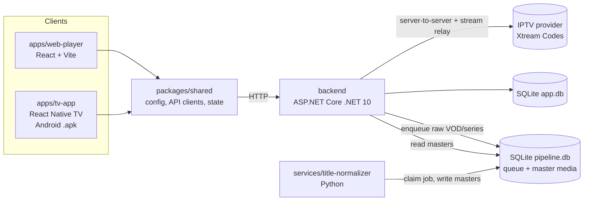

# iptv-player

Monorepo for an IPTV streaming platform: desktop web player, Android TV app, .NET API, Python processing service.
The product name is configurable (`APP_NAME` in `.env`). Phase 1 runs locally only; Azure targets are planned.

## Architecture



## Structure

| Path | Description |
|------|-------------|
| [`apps/web-player`](./apps/web-player) | Desktop browser client. |
| [`apps/tv-app`](./apps/tv-app) | Android TV client. |
| [`packages/shared`](./packages/shared) | TypeScript code shared by both clients. |
| [`backend`](./backend) | C# .NET 10 Web API. |
| [`services`](./services) | Python background services (title normalizer). |
| [`tools`](./tools) | Developer tools: fake Xtream panel with test media. |
| [`scripts`](./scripts) | One-command dev stack; start/stop the local end-to-end stack. |
| [`.github`](./.github) | CI workflows ([`workflows/`](./.github/workflows)). No README here: GitHub would show it instead of this one. |
| [`documentation`](./documentation) | `DECISIONS.md`, `KNOWN-ISSUES.md`, `NEXT-STEPS.md`. |

## Prerequisites

| Tool | Version |
|------|---------|
| Node.js | 22+ (`.nvmrc`) |
| npm | 10+ |
| .NET SDK | 10.0 |
| Python | 3.11+ |
| Android SDK + JDK 17 | TV app native builds only |

## Quick start

```bash
npm install                 # all JS workspaces
npm run typecheck           # all JS workspaces
npm run test                # all JS workspaces
npm run build               # all JS workspaces
npm run dev:all             # backend + worker + web together (add `-- --fake` for the fake panel)
npm run dev:web             # web player on http://localhost:5173
npm run dev:tv              # Expo dev server for the TV app

npm run backend:test        # dotnet test
npm run backend:run         # API on http://localhost:5080 (also reachable on LAN IP)

cd services/title-normalizer && python3 -m venv .venv && . .venv/bin/activate \
  && pip install -r requirements-dev.txt && python -m pytest
python -m title_normalizer  # dedup worker (venv active); needs the backend to have started once
```

No IPTV subscription? Start the fake panel (`tools/fake-xtream-server`, see its README) and sign in with `http://localhost:8090` / `demo` / `demo`.

TV app: unit tests run anywhere (`npm run test --workspace=@iptv/tv-app`); the APK build and Android TV emulator tests run in GitHub Actions (`.github/workflows/tv-app.yml`, artifacts `tv-app-apk` and `maestro-output`).

End-to-end tests (starts its own stack on separate ports):

```bash
npm run test:e2e
```

Lint and format (CI runs the same checks; the Python part needs the worker venv active):

```bash
npm run lint                # ESLint + Prettier, dotnet format, Ruff (check only)
npm run format              # apply Prettier, dotnet format, Ruff fixes
git config blame.ignoreRevsFile .git-blame-ignore-revs   # hide bulk-format commits in blame
```

## API contract

`dotnet build` writes `packages/shared/openapi/backend-openapi.json`; `npm run generate:api --workspace=@iptv/shared` turns it into TypeScript types. Commit both after backend API changes.

## Configuration

| File | Committed | Purpose |
|------|-----------|---------|
| `.env` | Yes | Defaults: `APP_*` (public, shared by all apps), `DATA_DIR` (local databases, shared by backend + services), `BACKEND_*` (API only, see [`backend/README.md`](./backend/README.md#config)). |
| `.env.local` | No | Local overrides and secrets. |

Precedence (low → high): `.env` → `.env.local` → real environment variables. Relative paths resolve against the repo root.

TV app on a real device: set `APP_API_BASE_URL=http://<PC LAN IP>:5080` in `.env.local`.

## Root files

| File | Purpose |
|------|---------|
| `package.json` | npm workspaces, root scripts, `react-native` → `react-native-tvos` override. |
| `turbo.json` | Turborepo task pipeline. |
| `tsconfig.base.json` | Shared TypeScript compiler options. |
| `.editorconfig` | Editor formatting rules (`backend/.editorconfig` marks EF migrations as generated). |
| `eslint.config.mjs` | ESLint for all TS/JS workspaces (typescript-eslint, react-hooks). |
| `.prettierrc.json`, `.prettierignore` | Prettier style (140 columns, single quotes) and scope (TS/TSX/JS/CSS). |
| `.git-blame-ignore-revs` | Bulk formatting commits to skip in `git blame`. |
| `.npmrc` | `legacy-peer-deps=true` (react-native-tvos pre-release versions, D-028). |
