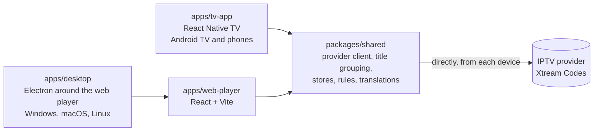

# iptv-player

[](https://github.com/brunoccst/iptv-player/actions/workflows/ci.yml)
[](https://github.com/brunoccst/iptv-player/actions/workflows/tv-app.yml)
[](https://github.com/brunoccst/iptv-player/actions/workflows/tv-apk.yml)
[](https://github.com/brunoccst/iptv-player/actions/workflows/desktop.yml)

Monorepo for an IPTV player: an Android TV and phone app and a desktop app (Windows, macOS, Linux). There is no server:
the apps talk to your IPTV provider directly and keep everything on the device ([D-088](./documentation/DECISIONS.md#d-088)).
Everything is TypeScript. The product name is configurable (`APP_NAME` in `.env`).

## Install the apps

No repository or commands needed. The apps talk to your IPTV provider directly; sign in with its address, username and password.

| Device | Download | First start |
|--------|----------|-------------|
| Windows | [iptv-player-setup.exe](https://github.com/brunoccst/iptv-player/releases/download/desktop/iptv-player-setup.exe) | SmartScreen: **More info → Run anyway** (the installer is not code-signed). The setup asks whether to install for you or for everyone, and in which folder (any drive). |
| macOS (Intel and Apple silicon) | [iptv-player.dmg](https://github.com/brunoccst/iptv-player/releases/download/desktop/iptv-player.dmg) | Drag the app to Applications. If macOS refuses to open it: **System Settings → Privacy & Security → Open Anyway**. |
| Linux | [iptv-player.AppImage](https://github.com/brunoccst/iptv-player/releases/download/desktop/iptv-player.AppImage) or [iptv-player.deb](https://github.com/brunoccst/iptv-player/releases/download/desktop/iptv-player.deb) | AppImage: make it executable (`chmod +x`) and open it. |
| Android TV / phone | [tv.apk](https://github.com/brunoccst/iptv-player/releases/download/tv-apk/tv.apk) | Allow installing from your browser or Downloader once. |

The apps look for new versions themselves (D-062, D-073); on Windows and with the AppImage the desktop app downloads and installs them, without the SmartScreen question. Signed in on the phone? On the computer choose **Sign in with your phone** (or account menu → Library & devices → Sync with phone) and scan the code with the phone app → account menu → Library & devices → Connect a TV or computer (D-072). The desktop app plays what web browsers play; for MKV-only titles and Dolby/DTS audio use the TV app ([KI-045](./documentation/KNOWN-ISSUES.md#ki-045)).

## Legal notes (Germany)

> **Not legal advice.** Full notes, with the laws and court rulings behind them: [documentation/LEGAL-NOTES.md](./documentation/LEGAL-NOTES.md) (German law as of September 2026).

- **The app is a player**, legal like VLC. It ships no channels, films, channel lists or provider accounts, and it does not break DRM.
- **Whether watching is legal depends on your provider.** A licensed, paid service is fine within its terms. Streaming from an **obviously unlawful** provider (thousands of channels and the newest films for a few euros, sold through resellers, Telegram or gift cards, no Impressum) is copyright infringement, even without downloading (EU Court of Justice C-527/15 "Filmspeler").
- **Downloads** for offline viewing are a private copy only from a lawful provider whose terms allow it, and only for yourself.
- **Never share** streams, your account or devices with access to unlawful streams with people outside your household.
- **Consequences** of infringement: warning letters (Abmahnung), damages, and criminal penalties (§§ 97, 97a, 106 UrhG).
- **Your data stays on your devices**: no server, no tracking or analytics; passwords are encrypted by the system. Kids profiles and the parental PIN help, but are not an approved youth protection system.
- **The code is [MIT No Attribution](./LICENSE)**, provided "as is" without warranty; whoever uses or distributes it is responsible for complying with the law and the provider's terms.

## Architecture


```mermaid
flowchart LR
  TV[apps/tv-app<br/>React Native TV<br/>Android TV and phones]
  WEB[apps/web-player<br/>React + Vite]
  DESK[apps/desktop<br/>Electron around the web player<br/>Windows, macOS, Linux]
  SHARED[packages/shared<br/>provider client, title grouping,<br/>stores, rules, translations]
  IPTV[(IPTV provider<br/>Xtream Codes)]

  TV --> SHARED
  DESK --> WEB --> SHARED
  SHARED -->|directly, from each device| IPTV
```

Each app talks to the IPTV provider directly, groups the provider's titles into one library on the device and keeps
profiles, progress and My List there ([D-038](./documentation/DECISIONS.md#d-038), [D-071](./documentation/DECISIONS.md#d-071),
[D-088](./documentation/DECISIONS.md#d-088)). Phones, TVs and computers share sign-in and data by scanning a code (D-060, D-072).
The web player runs inside the desktop app; in a plain browser it is only used for development and tests, because
providers do not let web pages read their answers.

## Structure

| Path | Description |
|------|-------------|
| [`apps/tv-app`](./apps/tv-app) | Android TV and phone app. |
| [`apps/desktop`](./apps/desktop) | Desktop app (Windows, macOS, Linux): the web player in Electron. |
| [`apps/web-player`](./apps/web-player) | The desktop app's screens (React); runs in a browser for development and tests. |
| [`packages/shared`](./packages/shared) | TypeScript code shared by the apps: provider client, title grouping, stores, rules, translations. |
| [`tools`](./tools) | Developer tools: fake Xtream panel with test media (Python, standard library only). |
| [`scripts`](./scripts) | One-command dev start; start/stop the fake panel for end-to-end tests; checks. |
| [`.github`](./.github) | CI workflows ([`workflows/`](./.github/workflows)). No README here: GitHub would show it instead of this one. |
| [`documentation`](./documentation) | `FEATURES.md` (what the apps do), `FEATURES-TECHNICAL.md` (how each feature works in the code), `PARITY.md` (what each app has and how it is reached), `RELEASE-NOTES.md` (what is new in each version; every release carries it), `LEGAL-NOTES.md` (German law for users), `DECISIONS.md`, `KNOWN-ISSUES.md`, `NEXT-STEPS.md`. |

## Prerequisites

| Tool | Version |
|------|---------|
| Node.js | 22+ (`.nvmrc`) |
| npm | 10+ |
| Python | 3.11+ (fake panel and its test media only) |
| Android SDK + JDK 17 | TV app native builds only |

## Quick start

```bash
npm install                 # all JS workspaces
npm run typecheck           # all JS workspaces
npm run test                # all JS workspaces
npm run build               # all JS workspaces
npm run dev:all             # fake panel (:8090) + web player (:5173); sign in with http://localhost:8090, demo / demo
npm run dev:web             # web player only, on http://localhost:5173
npm run dev:tv              # Expo dev server for the TV app
```

In a browser the web player can only reach the fake panel (it allows web pages to read its answers); real providers
work in the desktop, TV and phone apps.

TV app: unit tests run anywhere (`npm run test --workspace=@iptv/tv-app`); the APK build and Android TV emulator tests run in GitHub Actions (`.github/workflows/tv-app.yml`, artifacts `tv-app-apk` (x86, emulator only) and `maestro-output`; the ARM APK for real TVs comes from `tv-apk.yml`).

End-to-end tests (start their own fake panel and web build on separate ports):

```bash
npm run test:e2e
```

Lint and format (CI runs the same checks; the Python part needs `pip install ruff`):

```bash
npm run lint                # ESLint + Prettier, app parity, release notes, translations, Ruff (check only)
npm run format              # apply Prettier and Ruff fixes
git config blame.ignoreRevsFile .git-blame-ignore-revs   # hide bulk-format commits in blame
```

## Configuration

| File | Committed | Purpose |
|------|-----------|---------|
| `.env` | Yes | `APP_NAME`, `APP_SLUG`, `APP_ANDROID_PACKAGE`, `APP_PROVIDER_USER_AGENT` (public, read by all apps). |
| `.env.local` | No | Local overrides and secrets. |

Precedence (low → high): `.env` → `.env.local` → real environment variables. Relative paths resolve against the repo root.

## Root files

| File | Purpose |
|------|---------|
| `LICENSE` | MIT No Attribution (`MIT-0`). |
| `CLAUDE.md` | Rules every change follows (features, parity, release notes, translations), read by Claude Code. |
| `package.json` | npm workspaces, root scripts, `react-native` → `react-native-tvos` override. |
| `ruff.toml` | Ruff settings for the Python tools (fake panel, `scripts/*.py`). |
| `turbo.json` | Turborepo task pipeline. |
| `tsconfig.base.json` | Shared TypeScript compiler options. |
| `.editorconfig` | Editor formatting rules. |
| `eslint.config.mjs` | ESLint for all TS/JS workspaces (typescript-eslint, react-hooks). |
| `.prettierrc.json`, `.prettierignore` | Prettier style (140 columns, single quotes) and scope (TS/TSX/JS/CSS). |
| `.git-blame-ignore-revs` | Bulk formatting commits to skip in `git blame`. |
| `.npmrc` | `legacy-peer-deps=true` (react-native-tvos pre-release versions, D-028). |
