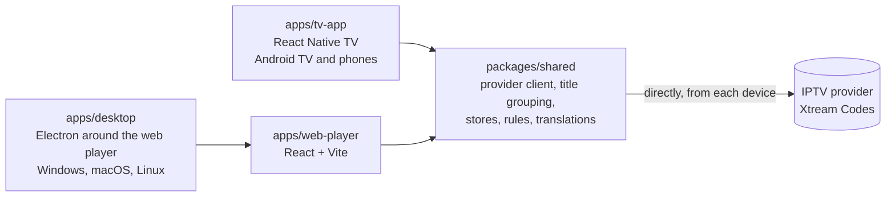

# iptv-player

[](https://github.com/brunoccst/iptv-player/actions/workflows/ci.yml)
[](https://github.com/brunoccst/iptv-player/actions/workflows/tv-app.yml)
[](https://github.com/brunoccst/iptv-player/actions/workflows/tv-apk.yml)
[](https://github.com/brunoccst/iptv-player/actions/workflows/desktop.yml)

Monorepo for an IPTV player: an Android TV and phone app and a desktop app (Windows, macOS, Linux). There is no server:
the apps talk to your IPTV provider directly and keep everything on the device ([D-088](./documentation/DECISIONS.md#d-088)).
Everything is TypeScript. The product name is configurable (`APP_NAME` in `.env`).

## Install the apps

No repository or commands needed. The apps talk to your IPTV provider directly; sign in with its address, username and password.

| Device | Download | First start |
|--------|----------|-------------|
| Windows | [iptv-player-setup.exe](https://github.com/brunoccst/iptv-player/releases/download/desktop/iptv-player-setup.exe) | SmartScreen: **More info → Run anyway** (the installer is not code-signed). The setup asks whether to install for you or for everyone, and in which folder (any drive). |
| macOS (Intel and Apple silicon) | [iptv-player.dmg](https://github.com/brunoccst/iptv-player/releases/download/desktop/iptv-player.dmg) | Drag the app to Applications. If macOS refuses to open it: **System Settings → Privacy & Security → Open Anyway**. |
| Linux | [iptv-player.AppImage](https://github.com/brunoccst/iptv-player/releases/download/desktop/iptv-player.AppImage) or [iptv-player.deb](https://github.com/brunoccst/iptv-player/releases/download/desktop/iptv-player.deb) | AppImage: make it executable (`chmod +x`) and open it. |
| Android TV / phone | [tv.apk](https://github.com/brunoccst/iptv-player/releases/download/tv-apk/tv.apk) | Allow installing from your browser or Downloader once. |

The apps look for new versions themselves (D-062, D-073); on Windows and with the AppImage the desktop app downloads and installs them, without the SmartScreen question. Signed in on the phone? On the computer choose **Sign in with your phone** (or account menu → Library & devices → Sync with phone) and scan the code with the phone app → account menu → Library & devices → Connect a TV or computer (D-072). The desktop app plays what web browsers play; for MKV-only titles and Dolby/DTS audio use the TV app ([KI-045](./documentation/KNOWN-ISSUES.md#ki-045)).

## Legal notes (Germany)

> **Not legal advice.** This is a summary of German law as of September 2026 for people who use or run this app. For a binding answer about your own situation, ask a lawyer (Rechtsanwalt for copyright / IT law).

This app is a **player**. It ships no TV channels, films, series, channel lists or provider accounts. You connect it to an IPTV provider you choose. Whether using it is legal depends almost entirely on **that provider and what you do with the streams**.

### At a glance

| What you do | Legal in Germany? |
|-------------|-------------------|
| Install and use the app itself | Yes. A player without content is legal software, like VLC. |
| Watch a provider that holds the rights (licensed, paid service) | Yes, within the provider's terms (e.g. number of devices, one household). |
| Watch a provider that is **obviously unlawful** (see below) | **No.** Copyright infringement, even if you only stream and never download. |
| Download titles for offline viewing from a **lawful** provider | Usually yes, as a private copy (§ 53 UrhG), if the provider's terms allow it. Only for yourself; never pass files or devices on. |
| Download from an **obviously unlawful** provider | **No.** Private copies from obviously unlawful sources are not allowed (§ 53 (1) UrhG). |
| Let people **outside your household and close personal circle** watch through your server, relay or account | **No.** That is making works available to the public (§§ 15 (3), 19a UrhG, retransmission §§ 20, 20b UrhG) and almost always breaks the provider's terms. |
| Sell or give away devices with this app **plus** access to unlawful streams | **No.** The EU Court of Justice treats this as communication to the public (C-527/15 "Filmspeler", 2017). |

### Streaming from unlawful sources

- Watching a stream creates temporary copies in memory. § 44a UrhG allows such copies only for a **lawful use**. The EU Court of Justice ruled on 26 April 2017 (C-527/15, "Filmspeler") that streaming from a source the viewer knows or should know is unlawful is **not** covered. So "I only streamed, I didn't download" is no defence.
- Typical signs of an unlawful offer:
  - thousands of channels, including premium sports and pay TV from many countries, plus the newest cinema films, for a few euros a month;
  - sold through resellers, Telegram or marketplaces;
  - paid with gift cards or crypto;
  - no Impressum and no company you can identify.
- Lawful offers come from broadcasters, network operators and established streaming companies. They name the company behind them (Impressum) and have clear terms.

### Possible consequences of infringement

- **Civil claims** by rights holders (§ 97 UrhG): stop and desist, damages, and a formal warning letter (Abmahnung, § 97a UrhG). For a first infringement by a private person, the lawyer fees for the warning are capped: they are calculated on a value of € 1,000 (§ 97a (3) UrhG). Damages come on top.
- **Criminal law:** unlawful copying is punishable by up to 3 years in prison or a fine; attempt is also punishable (§ 106 UrhG). It is usually prosecuted only on complaint, unless there is a special public interest (§ 109 UrhG). Commercial infringement, such as reselling access, carries up to 5 years (§ 108a UrhG).
- **How people get identified:** streaming uploads nothing, unlike file sharing, so it is harder to detect. However, investigators who shut down illegal services can seize their customer and payment data.

### Copy protection

- Circumventing effective copy protection is not allowed (§ 95a UrhG). This app does **not** break DRM. Xtream-type providers send streams without DRM, and the app plays only what your account can already access.
- The TV app sends a common player name (User-Agent, default `VLC/3.0.21`), because many providers answer only known players. This is not copy protection and unlocks nothing your account does not pay for. You can change it with `APP_PROVIDER_USER_AGENT`.
- The app protects its own downloads (D-050):
  - they are encrypted and never saved as normal video files;
  - they are deleted when you sign out;
  - they stop playing when the subscription expires or the app has not been online for 30 days.
  
  These measures support the private-copy rules. They are not a guarantee (see KI-002, KI-038).

### Sharing with other people

The apps have no server and relay nothing: each device talks to the provider itself. Passing streams on to people
outside your household (for example by sharing your account or re-streaming) is covered in the table above.

- **Rights:** passing TV channels on to other people needs licences from the broadcasters and rights holders (§§ 20, 20b UrhG). A private IPTV subscription does not include these rights.
- **Data protection (DSGVO / GDPR):**
  - The apps store provider logins, profiles, watch progress and diagnostic logs on your own devices only. For purely personal or household use, the GDPR does not apply (Art. 2 (2) (c)).
  - Provider passwords are encrypted: in the Android Keystore on TV and phone, by the operating system in the desktop app.
- **Storage on devices (§ 25 TDDDG):** the apps store data on the device only where the function needs it (session, downloads, settings). They have no tracking or analytics, so no consent banner is needed for that.
- **Youth protection (JMStV):**
  - Offering adult content to the public requires age verification.
  - A "Kids" profile only shows categories whose names mark them as children's content (e.g. "Kids", "Kinder", "Cartoons"), because providers send no age ratings (D-053). This depends on how the provider names its categories, and it does not know the age of individual titles. An optional parental PIN can lock leaving a Kids profile and managing profiles (D-054). It is not an approved youth protection system.

### Other points

- **Broadcasting fee (Rundfunkbeitrag):** unchanged. It is due per household, whatever devices or apps you use.
- **Provider terms:** even with a lawful provider, sharing your account, exceeding the allowed number of streams, or relaying to other homes usually breaks the contract. The provider can then close the account.
- **Licence of this repository:**
  - [MIT No Attribution](./LICENSE) (`MIT-0`). Anyone may use, copy, change, publish, sell and redistribute the code, without having to credit the author.
  - The software comes "as is", without any warranty, and the authors are not liable for any claim or damage arising from its use (see [LICENSE](./LICENSE)).
  - Third-party libraries keep their own licences (mostly MIT, BSD and Apache 2.0). Distributing an APK should include their licence notices.
- **Responsibility for use:**
  - The authors provide a player only. They do not provide, host, select or link to any content, provider or channel list.
  - They have no control over how the code or apps built from it are used.
  - Whoever uses, runs, modifies or distributes this software is solely responsible for complying with the law, including copyright, and with their provider's terms.
  - Using this software to watch, download or share content without the rights holder's permission is not intended or endorsed.
- **Names:** "Xtream Codes" is used only to describe the provider API this app speaks. The app is not affiliated with any provider.

## Architecture


```mermaid
flowchart LR
  TV[apps/tv-app<br/>React Native TV<br/>Android TV and phones]
  WEB[apps/web-player<br/>React + Vite]
  DESK[apps/desktop<br/>Electron around the web player<br/>Windows, macOS, Linux]
  SHARED[packages/shared<br/>provider client, title grouping,<br/>stores, rules, translations]
  IPTV[(IPTV provider<br/>Xtream Codes)]

  TV --> SHARED
  DESK --> WEB --> SHARED
  SHARED -->|directly, from each device| IPTV
```

Each app talks to the IPTV provider directly, groups the provider's titles into one library on the device and keeps
profiles, progress and My List there ([D-038](./documentation/DECISIONS.md#d-038), [D-071](./documentation/DECISIONS.md#d-071),
[D-088](./documentation/DECISIONS.md#d-088)). Phones, TVs and computers share sign-in and data by scanning a code (D-060, D-072).
The web player runs inside the desktop app; in a plain browser it is only used for development and tests, because
providers do not let web pages read their answers.

## Structure

| Path | Description |
|------|-------------|
| [`apps/tv-app`](./apps/tv-app) | Android TV and phone app. |
| [`apps/desktop`](./apps/desktop) | Desktop app (Windows, macOS, Linux): the web player in Electron. |
| [`apps/web-player`](./apps/web-player) | The desktop app's screens (React); runs in a browser for development and tests. |
| [`packages/shared`](./packages/shared) | TypeScript code shared by the apps: provider client, title grouping, stores, rules, translations. |
| [`tools`](./tools) | Developer tools: fake Xtream panel with test media (Python, standard library only). |
| [`.devcontainer`](./.devcontainer) | GitHub Codespaces setup (web app + fake panel, works from a phone). |
| [`scripts`](./scripts) | One-command dev start; start/stop the fake panel for end-to-end tests; checks. |
| [`.github`](./.github) | CI workflows ([`workflows/`](./.github/workflows)). No README here: GitHub would show it instead of this one. |
| [`documentation`](./documentation) | `DECISIONS.md`, `KNOWN-ISSUES.md`, `NEXT-STEPS.md`, `PARITY.md` (what each app has and how it is reached). |

## Prerequisites

| Tool | Version |
|------|---------|
| Node.js | 22+ (`.nvmrc`) |
| npm | 10+ |
| Python | 3.11+ (fake panel and its test media only) |
| Android SDK + JDK 17 | TV app native builds only |

## Quick start

```bash
npm install                 # all JS workspaces
npm run typecheck           # all JS workspaces
npm run test                # all JS workspaces
npm run build               # all JS workspaces
npm run dev:all             # fake panel (:8090) + web player (:5173); sign in with http://localhost:8090, demo / demo
npm run dev:web             # web player only, on http://localhost:5173
npm run dev:tv              # Expo dev server for the TV app
```

In a browser the web player can only reach the fake panel (it allows web pages to read its answers); real providers
work in the desktop, TV and phone apps.

TV app: unit tests run anywhere (`npm run test --workspace=@iptv/tv-app`); the APK build and Android TV emulator tests run in GitHub Actions (`.github/workflows/tv-app.yml`, artifacts `tv-app-apk` (x86, emulator only) and `maestro-output`; the ARM APK for real TVs comes from `tv-apk.yml`).

Try it from a phone (no computer needed), free within the GitHub Codespaces monthly allowance:

1. Open https://github.com/codespaces/new?repo=brunoccst/iptv-player and choose **Create codespace** (first start takes ~5–10 min).
2. When it is ready, open the **Ports** tab and tap the globe next to **Web app (5173)**, or open `https://<codespace-name>-5173.app.github.dev`.
3. Sign in with the page's own address (`https://<codespace-name>-5173.app.github.dev`) as the server, username `demo`, password `demo`.
4. Stop the codespace when done (github.com/codespaces → ⋯ → Stop); it also stops itself after 30 idle minutes.

End-to-end tests (start their own fake panel and web build on separate ports):

```bash
npm run test:e2e
```

Lint and format (CI runs the same checks; the Python part needs `pip install ruff`):

```bash
npm run lint                # ESLint + Prettier, app parity, translations, Ruff (check only)
npm run format              # apply Prettier and Ruff fixes
git config blame.ignoreRevsFile .git-blame-ignore-revs   # hide bulk-format commits in blame
```

## Configuration

| File | Committed | Purpose |
|------|-----------|---------|
| `.env` | Yes | `APP_NAME`, `APP_SLUG`, `APP_ANDROID_PACKAGE`, `APP_PROVIDER_USER_AGENT` (public, read by all apps). |
| `.env.local` | No | Local overrides and secrets. |

Precedence (low → high): `.env` → `.env.local` → real environment variables. Relative paths resolve against the repo root.

## Root files

| File | Purpose |
|------|---------|
| `LICENSE` | MIT No Attribution (`MIT-0`). |
| `package.json` | npm workspaces, root scripts, `react-native` → `react-native-tvos` override. |
| `ruff.toml` | Ruff settings for the Python tools (fake panel, `scripts/*.py`). |
| `turbo.json` | Turborepo task pipeline. |
| `tsconfig.base.json` | Shared TypeScript compiler options. |
| `.editorconfig` | Editor formatting rules. |
| `eslint.config.mjs` | ESLint for all TS/JS workspaces (typescript-eslint, react-hooks). |
| `.prettierrc.json`, `.prettierignore` | Prettier style (140 columns, single quotes) and scope (TS/TSX/JS/CSS). |
| `.git-blame-ignore-revs` | Bulk formatting commits to skip in `git blame`. |
| `.npmrc` | `legacy-peer-deps=true` (react-native-tvos pre-release versions, D-028). |
