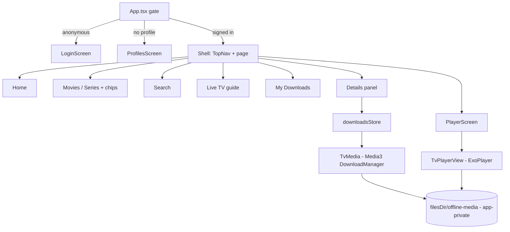

# @iptv/tv-app

Android TV client. Expo SDK 57 + `react-native-tvos` 0.86 + TypeScript + local native module `tv-media` (Media3 ExoPlayer + DownloadManager). Output: `.apk`.

Looks the same as the web app (shared design tokens and icons, [D-041](../../documentation/DECISIONS.md#d-041)). Works without a server: by default it talks to the IPTV provider directly; "My server" on the sign-in screen goes through the backend instead ([D-038](../../documentation/DECISIONS.md#d-038)).



## Remote control

| Key | Browsing | Player |
|-----|----------|--------|
| D-pad | Move focus (Android focus search) | ←/→ tap: ±10 s with circle animation · hold: accelerating scrub (×1 → ×64), seek on release |
| ↑ / ↓ | Move focus | Open quick drawer: Audio, Subtitles, Versions, Episodes |
| Select | Activate | Play / pause (or press Skip ahead / Play Now when shown) |
| Play/Pause, ⏪, ⏩ | – | Play/pause, −10 s, +10 s |
| Back | Previous screen | Close drawer or skip options, then leave player |

## Touch (phones)

| Gesture | Player |
|---------|--------|
| Tap | Show / hide controls |
| Double tap, left or right third | −10 s / +10 s with circle animation |
| Drag the timeline | Scrub (time shown above the thumb), seek on release |

The player turns to landscape and hides the navigation bar on phones, and the screen stays on while video plays (also on TV, no screensaver). See [D-046](../../documentation/DECISIONS.md#d-046).

## Config

`app.config.ts` loads the repo root `.env` (then `.env.local`) and sets:

| Expo field | Env key |
|------------|---------|
| `name` | `APP_NAME` |
| `slug` | `APP_SLUG` |
| `android.package` | `APP_ANDROID_PACKAGE` |
| `extra.*` | `APP_NAME`, `APP_SLUG`; optional `APP_API_BASE_URL` (prefills "My server"), `APP_PROVIDER_USER_AGENT` (from `BACKEND_PROVIDER_USER_AGENT`, default VLC), `APP_TV_DEBUG_REMOTE=1` (logs every remote event to logcat, used by the emulator CI build) |

Direct mode needs no address. For "My server": real device `http://<PC LAN IP>:5080`, emulator `http://10.0.2.2:5080`. Plain HTTP is allowed (`usesCleartextTraffic`).

## Commands

```bash
npm run test --workspace=@iptv/tv-app        # Jest (jest-expo/android) + React Native Testing Library
npm run typecheck --workspace=@iptv/tv-app
npm run start --workspace=@iptv/tv-app       # Metro dev server
npm run prebuild --workspace=@iptv/tv-app    # generates android/ (TV manifest, tv-media module linked)
npm run android --workspace=@iptv/tv-app     # build + install on emulator/device
```

Release `.apk`: `cd android && ./gradlew assembleRelease` after `prebuild`. It is signed with the release key when `ANDROID_KEYSTORE_FILE` and `ANDROID_KEYSTORE_PASSWORD` are set (`plugins/withReleaseSigning.js`, D-052), else with the debug key from Expo's template (the same public key in every Expo project, so anyone can sign an APK that installs over it). Output: `android/app/build/outputs/apk/release/app-release.apk`. CI builds an x86 one for the emulator on every TV-related push (artifact `tv-app-apk`); `tv-apk.yml` builds the ARM one for real TVs.

## Requirements

- Android SDK + JDK 17 for native builds; an Android TV emulator (API 31+) or device.
- Not needed for `npm run test`.

## Structure

| Path | Purpose |
|------|---------|
| `index.ts` | Registers the root component. |
| `app.config.ts` | Dynamic Expo config + plugins (TV + banner, splash screen, secure store, cleartext), app icon. |
| `assets/` | App icon, adaptive icon, splash image, TV banner. |
| `babel.config.js`, `jest.config.js` | Babel preset; Jest config with native-module and remote test doubles. |
| `modules/tv-media/` | Local Expo native module (Kotlin). |
| `src/` | Application source. |
| `test/` | Jest mocks and helpers. |
| `e2e/` | Maestro flows for the Android TV emulator. |
