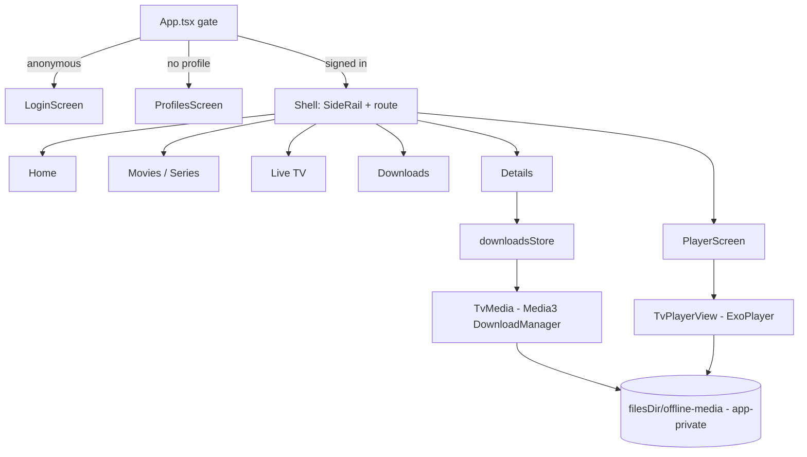

# @iptv/tv-app

Android TV client. Expo SDK 57 + `react-native-tvos` 0.86 + TypeScript + local native module `tv-media` (Media3 ExoPlayer + DownloadManager). Output: `.apk`.



## Remote control

| Key | Browsing | Player |
|-----|----------|--------|
| D-pad | Move focus (Android focus search) | ←/→ tap: ±10 s with circle animation · hold: accelerating scrub (×1 → ×64), seek on release |
| ↑ / ↓ | Move focus | Open quick drawer: Audio, Subtitles, Versions, Episodes |
| Select | Activate | Play / pause (or press Skip Intro / Play Now when shown) |
| Play/Pause, ⏪, ⏩ | – | Play/pause, −10 s, +10 s |
| Back | Previous screen | Close drawer, then leave player |

## Config

`app.config.ts` loads the repo root `.env` (then `.env.local`) and sets:

| Expo field | Env key |
|------------|---------|
| `name` | `APP_NAME` |
| `slug` | `APP_SLUG` |
| `android.package` | `APP_ANDROID_PACKAGE` |
| `extra.*` | `APP_NAME`, `APP_SLUG`, `APP_API_BASE_URL` |

Real device: `APP_API_BASE_URL=http://<PC LAN IP>:5080`. Emulator: `http://10.0.2.2:5080`. Plain HTTP is allowed (`usesCleartextTraffic`).

## Commands

```bash
npm run test --workspace=@iptv/tv-app        # Jest (jest-expo/android) + React Native Testing Library
npm run typecheck --workspace=@iptv/tv-app
npm run start --workspace=@iptv/tv-app       # Metro dev server
npm run prebuild --workspace=@iptv/tv-app    # generates android/ (TV manifest, tv-media module linked)
npm run android --workspace=@iptv/tv-app     # build + install on emulator/device
```

Release `.apk` (debug-signed): `cd android && ./gradlew assembleRelease` after `prebuild`. Output: `android/app/build/outputs/apk/release/app-release.apk`. CI builds it on every TV-related push (artifact `tv-app-apk`).

## Requirements

- Android SDK + JDK 17 for native builds; an Android TV emulator (API 31+) or device.
- Not needed for `npm run test`.

## Structure

| Path | Purpose |
|------|---------|
| `index.ts` | Registers the root component. |
| `app.config.ts` | Dynamic Expo config + plugins (TV, secure store, cleartext). |
| `babel.config.js`, `jest.config.js` | Babel preset; Jest config with native-module and remote test doubles. |
| `modules/tv-media/` | Local Expo native module (Kotlin). |
| `src/` | Application source. |
| `test/` | Jest mocks and helpers. |
| `e2e/` | Maestro flows for the Android TV emulator. |
