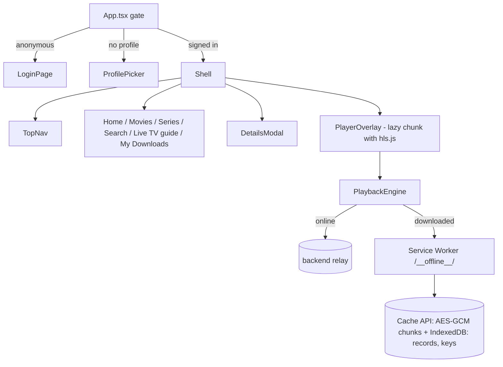

# @iptv/web-player

Desktop browser client. React 19 + Vite + TypeScript + hls.js. Netflix-style UI, mouse/keyboard controls, encrypted offline downloads.



## Config

Reads `APP_*` keys from the repo root `.env` (Vite `envDir`). Override locally in root `.env.local`.
The backend must allow the web origin in `BACKEND_CORS_ORIGINS` (defaults include `:5173` and `:4173`).

## Commands

```bash
npm run dev --workspace=@iptv/web-player        # http://localhost:5173
npm run build --workspace=@iptv/web-player      # typecheck + build to dist/ (incl. dist/sw.js)
npm run preview --workspace=@iptv/web-player    # serve dist/ on http://localhost:4173
npm run typecheck --workspace=@iptv/web-player  # app + Service Worker (tsconfig.sw.json)
npm run test --workspace=@iptv/web-player       # Vitest unit/component tests
npm run test:e2e --workspace=@iptv/web-player   # Playwright against a real local stack (see e2e/README.md)
```

## Try it without an IPTV subscription

```bash
cd tools/fake-xtream-server && python generate_media.py && python server.py   # panel on :8090
npm run backend:run                                                             # API on :5080
cd services/title-normalizer && . .venv/bin/activate && python -m title_normalizer
npm run dev:web                                                                 # sign in: http://localhost:8090 / demo / demo
```

## Player controls

| Input | Action |
|-------|--------|
| Space / K / click video | Play / pause |
| ← / → | −10 s / +10 s (animated flash) |
| ↑ / ↓ | Volume |
| M | Mute |
| F / double-click | Full screen |
| Esc / browser Back | Close panel, then player |
| Hover timeline | Time + frame preview |
| Click / drag timeline | Seek |

## Structure

| Path | Purpose |
|------|---------|
| `index.html` | HTML entry. `%APP_NAME%` replaced at build time. |
| `vite.config.ts` | Env from repo root; Service Worker bundling plugin (`/sw.js`). |
| `tsconfig.sw.json` | Type-checks the Service Worker with the WebWorker lib. |
| `playwright.config.ts`, `e2e/` | End-to-end tests. |
| `src/` | Application source. See [`src/README.md`](./src/README.md). |
