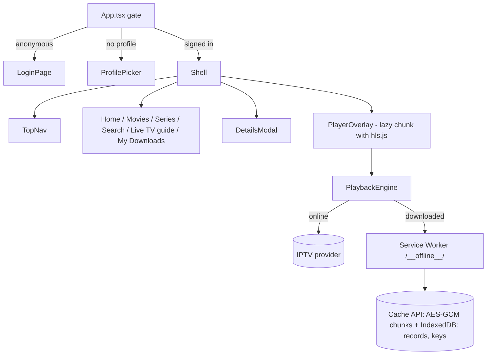

# @iptv/web-player

The desktop app's screens (`apps/desktop` wraps them). React 19 + Vite + TypeScript + hls.js. Netflix-style UI, mouse/keyboard controls, encrypted offline downloads. Talks to the IPTV provider directly (D-071, D-088); in a plain browser only the fake panel answers (providers do not let web pages read their answers), so the browser is for development and tests.


```mermaid
flowchart TD
  APP[App.tsx gate] -->|anonymous| LOGIN[LoginPage]
  APP -->|no profile| PICK[ProfilePicker]
  APP -->|signed in| SHELL[Shell]
  SHELL --> NAV[TopNav] & VIEWS[Home / Movies / Series / Search / Live TV guide / My Downloads]
  SHELL --> DETAILS[DetailsModal]
  SHELL --> PLAYER[PlayerOverlay - lazy chunk with hls.js]
  PLAYER --> ENGINE[PlaybackEngine]
  ENGINE -->|online| IPTV[(IPTV provider)]
  ENGINE -->|downloaded| SW[Service Worker /__offline__/]
  SW --> STORE[(Cache API: AES-GCM chunks + IndexedDB: records, keys)]
```

## Config

Reads `APP_*` keys from the repo root `.env` (Vite `envDir`). Override locally in root `.env.local`.

## Commands

```bash
npm run dev --workspace=@iptv/web-player        # http://localhost:5173
npm run build --workspace=@iptv/web-player      # typecheck + build to dist/ (incl. dist/sw.js)
npm run preview --workspace=@iptv/web-player    # serve dist/ on http://localhost:4173
npm run typecheck --workspace=@iptv/web-player  # app + Service Worker (tsconfig.sw.json)
npm run test --workspace=@iptv/web-player       # Vitest unit/component tests
npm run test:e2e --workspace=@iptv/web-player   # Playwright against the fake panel (see e2e/README.md)
```

## Try it without an IPTV subscription

```bash
python tools/fake-xtream-server/generate_media.py   # test videos, once
npm run dev:all                                      # fake panel :8090 + web :5173; sign in: http://localhost:8090 / demo / demo
```

## Player controls

| Input | Action |
|-------|--------|
| Space / K / click video | Play / pause |
| ← / → | −10 s / +10 s (animated flash) |
| ↑ / ↓ | Volume |
| M | Mute |
| F / double-click | Full screen |
| Esc / browser Back | Close panel, then player |
| Hover timeline | Time + frame preview |
| Click / drag timeline | Seek |

## Structure

| Path | Purpose |
|------|---------|
| `index.html` | HTML entry (favicon links). `%APP_NAME%` replaced at build time. |
| `public/` | Icons served at the site root. |
| `vite.config.ts` | Env from repo root; Service Worker bundling plugin (`/sw.js`). |
| `tsconfig.sw.json` | Type-checks the Service Worker with the WebWorker lib. |
| `playwright.config.ts`, `e2e/` | End-to-end tests. |
| `src/` | Application source. See [`src/README.md`](./src/README.md). |
