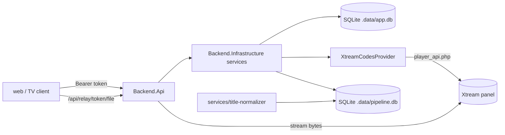

# backend

C# ASP.NET Core Web API (.NET 10). Runs locally.
Role: proxy between clients and IPTV providers (`IMediaProvider`), user profiles, stream relay.



## Requirements

- .NET 10 SDK (`global.json` allows any 10.0.1xx+ feature band).

## Commands

```bash
dotnet build backend/Backend.sln
dotnet test backend/Backend.sln
dotnet run --project backend/src/Backend.Api     # http://0.0.0.0:5080 (all interfaces)
```

Database migrations (tool pinned in `dotnet-tools.json`):

```bash
cd backend
dotnet tool restore
dotnet ef migrations add <Name> --project src/Backend.Infrastructure --startup-project src/Backend.Api --output-dir Persistence/Migrations
```

Pipeline database (shared with Python) uses a second context:

```bash
dotnet ef migrations add <Name> --context PipelineDbContext --project src/Backend.Infrastructure --startup-project src/Backend.Api --output-dir Pipeline/Migrations
UPDATE_PIPELINE_SCHEMA=1 dotnet test backend/Backend.sln   # refresh Pipeline/pipeline-schema.sql, then commit it
```

Migrations apply automatically on startup. Both databases run in WAL mode.

## Config

Loads the repo root `.env`, then `.env.local`, then real environment variables (last wins).

| Key | Default | Purpose |
|-----|---------|---------|
| `APP_NAME`, `APP_SLUG` | required | App identity. Startup fails if missing. |
| `DATA_DIR` | `.data` | `app.db`, `pipeline.db`, encryption keys. Relative to the repo root. Shared with `services/`. |
| `BACKEND_STREAM_DELIVERY` | `relay` | `relay`: streams pass through the API. `direct`: clients get upstream URLs (contain credentials). |
| `BACKEND_CORS_ORIGINS` | none | Comma-separated browser origins allowed to call the API. |
| `BACKEND_SESSION_DAYS` | `30` | Login token lifetime. |
| `BACKEND_RELAY_TOKEN_HOURS` | `12` | Relay URL lifetime. |
| `BACKEND_CATALOG_CACHE_MINUTES` | `15` | In-memory catalog cache. `0` disables. |
| `BACKEND_EPG_REFRESH_HOURS` | `6` | TV guide older than this is re-downloaded in the background. |
| `BACKEND_LIBRARY_REFRESH_HOURS` | `12` | Accounts with a valid session get a background library sync when their last one is older than this (checked every 30 min and at start). `0` disables. |
| `BACKEND_PUBLIC_BASE_URL` | (empty) | Public address when the API sits behind a proxy (e.g. Codespaces); relay URLs are built from it. Empty: request scheme + host. |
| `BACKEND_PROVIDER_USER_AGENT` | none | `User-Agent` sent to providers. |

Deleting `DATA_DIR` resets all accounts, profiles, sessions and the deduplicated library.

## Endpoints

OpenAPI document: served at `GET /openapi/v1.json` (Development only) and written on every build to `packages/shared/openapi/backend-openapi.json`. After API changes run `npm run generate:api --workspace=@iptv/shared` and commit both files.

| Method | Path | Auth | Purpose |
|--------|------|------|---------|
| GET | `/api/health` | – | Liveness + app name. |
| POST | `/api/auth/login` | – | `{serverUrl, username, password}` → `{token, expiresAt, account, profiles}`. |
| POST | `/api/auth/logout` | Bearer | Revokes current token. |
| GET | `/api/auth/me` | Bearer | Current account (no password). |
| GET/POST | `/api/profiles` | Bearer | List / create profile (max 5). |
| PUT/DELETE | `/api/profiles/{id}` | Bearer | Update / delete profile (last one cannot be deleted). |
| GET | `/api/profiles/{id}/progress?limit=` | Bearer | Watch progress, newest first ("Continue Watching"). |
| PUT/DELETE | `/api/profiles/{id}/progress/{movie\|episode}/{itemId}` | Bearer | Save / remove a position. |
| GET | `/api/catalog/live/categories`, `/api/catalog/live/channels?categoryId=` | Bearer | Live TV. |
| GET | `/api/catalog/movies/categories`, `/api/catalog/movies?categoryId=`, `/api/catalog/movies/{id}` | Bearer | VOD. |
| GET | `/api/catalog/series/categories`, `/api/catalog/series?categoryId=`, `/api/catalog/series/{id}` | Bearer | Series + seasons + episodes. |
| GET | `/api/epg?categoryId=&from=&hours=&offset=&limit=` | Bearer | Guide grid: channels (paged, `limit` ≤ 200, default 50) with programmes overlapping `[from, from+hours)`. `from` defaults to the current half hour; `hours` 1–12 (default 3). `status`: `ready`, `refreshing` (first download running) or `unavailable` (no XMLTV; short EPG only). |
| POST | `/api/epg/refresh` | Bearer | Queue a guide download. `202`. |
| GET | `/api/playback/{live\|movie\|episode}/{id}?container=` | Bearer | `{url, container, isLive, deliveryMode}`. |
| GET | `/api/relay/{token}/{fileName}` | token in path | Stream relay. Rewrites HLS playlists; forwards `Range`. |
| POST | `/api/library/sync` | Bearer | Queue a library sync (also runs after every login). `202`. |
| GET | `/api/library/status` | Bearer | Latest normalization job per kind + master count. |
| GET | `/api/library/{movies\|series}?categoryId=&search=&offset=&limit=&sort=&order=` | Bearer | Deduplicated master cards `{total, items, sorts}`. `limit` ≤ 500. `sort`: `added` (default), `title`, `released`; `order`: `asc`/`desc` (default `desc` for dates, `asc` for title). `sorts` lists the orders this library has data for (D-049). |
| GET | `/api/library/{movies\|series}/{masterId}` | Bearer | Master + variants (best first). Play a variant via `/api/playback/{movie\|...}/{streamId}`. |

Error bodies are RFC 9457 problem details with a `code` field:

| Status | `code` | Meaning |
|--------|--------|---------|
| 400 | `validation_failed` | Bad input. |
| 401 | `invalid_provider_credentials` | Login rejected by provider. |
| 401 | – | Missing/expired bearer token. |
| 502 | `provider_unavailable` | Provider unreachable or bad response. |
| 502 | `provider_credentials_rejected` | Stored credentials no longer accepted. Log in again. |

## Structure

| Path | Purpose |
|------|---------|
| `Backend.sln` | Solution file. |
| `global.json` | SDK version pin. |
| `dotnet-tools.json` | Local tools (`dotnet-ef`). |
| `Directory.Build.props` | Shared MSBuild settings (target framework, nullable, warnings as errors). |
| `Directory.Packages.props` | Central NuGet version list. |
| `src/Backend.Api` | HTTP host: endpoints, auth, error mapping, relay. |
| `src/Backend.Core` | Domain models, `IMediaProvider`, config. No database or HTTP client code. |
| `src/Backend.Infrastructure` | Xtream provider, EF Core SQLite (`app.db`, `pipeline.db`), encryption, services. |
| `tests/Backend.Tests` | xUnit tests. |
