# Decisions

Log of architectural, structural and feature decisions. Newest entries at the bottom.
Code comments reference entries as `DECISIONS.md#d-XXX`.

| ID | Date | Title |
|----|------|-------|
| [D-001](#d-001) | 2026-09-23 | Monorepo: npm workspaces + Turborepo |
| [D-002](#d-002) | 2026-09-23 | Folder layout and README rules |
| [D-003](#d-003) | 2026-09-23 | Central config via root `.env` |
| [D-004](#d-004) | 2026-09-23 | Frontend toolchain versions |
| [D-005](#d-005) | 2026-09-23 | TV app: Expo + react-native-tvos |
| [D-006](#d-006) | 2026-09-23 | Backend: .NET 8, layered projects |
| [D-007](#d-007) | 2026-09-23 | Shared package ships TypeScript source |
| [D-008](#d-008) | 2026-09-23 | Python service: Azure Functions v2 model, pure core package |
| [D-009](#d-009) | 2026-09-23 | Backend on .NET 10 LTS (supersedes D-006 runtime choice) |
| [D-010](#d-010) | 2026-09-23 | Local-only deployment for phase 1 |
| [D-011](#d-011) | 2026-09-23 | `IMediaProvider` + `XtreamCodesProvider` design |
| [D-012](#d-012) | 2026-09-23 | Authentication proxy: upstream-validated login, opaque sessions |
| [D-013](#d-013) | 2026-09-23 | Stream delivery: backend relay by default |
| [D-014](#d-014) | 2026-09-23 | Persistence: SQLite + EF Core migrations |
| [D-015](#d-015) | 2026-09-23 | Catalog cache: in-memory, per account |
| [D-016](#d-016) | 2026-09-23 | SQLite job queue + shared `pipeline.db` |
| [D-017](#d-017) | 2026-09-23 | Title normalizer: regex parsing + guarded fuzzy grouping |
| [D-018](#d-018) | 2026-09-23 | Python worker runs as a CLI poller locally |
| [D-019](#d-019) | 2026-09-23 | `DATA_DIR` shared key, paths relative to repo root |
| [D-020](#d-020) | 2026-09-23 | API contract: OpenAPI export at build → generated TypeScript types |
| [D-021](#d-021) | 2026-09-23 | Shared client + vanilla Zustand stores behind one app context |
| [D-022](#d-022) | 2026-09-23 | Session persistence per platform |
| [D-023](#d-023) | 2026-09-23 | Web playback engine: HLS first, file fallback, on-demand frame previews |
| [D-024](#d-024) | 2026-09-23 | Web offline downloads: Service Worker + AES-GCM chunks |
| [D-025](#d-025) | 2026-09-23 | Web UI architecture |
| [D-026](#d-026) | 2026-09-23 | Watch progress stored per profile on the backend |
| [D-027](#d-027) | 2026-09-23 | Fake Xtream panel + end-to-end tests |
| [D-028](#d-028) | 2026-09-23 | TV app architecture: focus, navigation, remote handling |
| [D-029](#d-029) | 2026-09-23 | TV playback + offline: local Expo module over Media3 |
| [D-030](#d-030) | 2026-09-23 | TV test environment: Jest here, Android TV emulator + Maestro in CI |
| [D-031](#d-031) | 2026-09-23 | EPG: XMLTV cache in `app.db`, short-EPG fallback, paged grid endpoint |
| [D-032](#d-032) | 2026-09-23 | Guide UI: shared layout math, 3 h web / 2 h TV windows, select plays the channel |
| [D-033](#d-033) | 2026-09-23 | Linters and formatters: ESLint + Prettier, dotnet format, Ruff; web e2e in CI |
| [D-034](#d-034) | 2026-09-23 | One-command dev stack: `scripts/dev.mjs` |
| [D-035](#d-035) | 2026-09-23 | Phone testing via GitHub Codespaces (web app + fake panel) |
| [D-036](#d-036) | 2026-09-24 | Codespaces: artwork through the web port, auto-start on open |
| [D-037](#d-037) | 2026-09-24 | TV APK for a real Android TV, delivered through the codespace |
| [D-038](#d-038) | 2026-09-24 | Hybrid: native apps work without a server |
| [D-039](#d-039) | 2026-09-24 | On-device diagnostics log with manual sharing |
| [D-040](#d-040) | 2026-09-24 | Category pages, load-on-scroll and one generated app icon |
| [D-041](#d-041) | 2026-09-24 | The TV/phone app copies the web design |
| [D-042](#d-042) | 2026-09-24 | "Skip ahead" with fixed choices instead of Skip Intro |
| [D-043](#d-043) | 2026-09-24 | APK Home rows: 10 titles and a "See all" arrow card |
| [D-044](#d-044) | 2026-09-24 | Faster pipelines: build one ABI for the emulator, run CI once per PR push |
| [D-045](#d-045) | 2026-09-24 | Smaller APK: compressed native libraries, R8 and resource shrinking |
| [D-046](#d-046) | 2026-09-24 | Phone player: full-screen landscape, double tap to seek, timeline drag, screen stays on |
| [D-047](#d-047) | 2026-09-24 | Expandable category chips in the TV/phone app |
| [D-048](#d-048) | 2026-09-24 | UI stress test: huge categories |
| [D-049](#d-049) | 2026-09-25 | Library sort: recently added by default; name and release date on request |
| [D-050](#d-050) | 2026-09-25 | Offline downloads: encrypted on Android, tied to the account, 30-day online check |
| [D-051](#d-051) | 2026-09-25 | Periodic library sync in the backend |
| [D-052](#d-052) | 2026-09-25 | Release-signed APK and increasing version codes |
| [D-053](#d-053) | 2026-09-25 | Kids profiles show only kids categories |
| [D-054](#d-054) | 2026-09-25 | Optional parental PIN |
| [D-055](#d-055) | 2026-09-25 | Watchlist ("My List") per profile |
| [D-056](#d-056) | 2026-09-25 | Password-protected backup and restore of user data |
| [D-057](#d-057) | 2026-09-25 | Open movies and episodes in an external player (TV/phone) |
| [D-058](#d-058) | 2026-09-25 | Live TV: see-through guide over the playing channel (TV/phone) |
| [D-059](#d-059) | 2026-09-26 | Bundled FFmpeg audio decoders (switchable) |
| [D-060](#d-060) | 2026-09-26 | Sign in and sync a TV by scanning a QR code with the phone app |
| [D-061](#d-061) | 2026-09-26 | Play on TV: start a title on the paired TV from the phone app |
| [D-062](#d-062) | 2026-09-26 | Self-update from the GitHub release (TV/phone) |
| [D-063](#d-063) | 2026-09-26 | Language filter per profile (audio or subtitles from the names) |
| [D-064](#d-064) | 2026-09-26 | Parents choose a Kids profile's categories |
| [D-065](#d-065) | 2026-09-26 | Merge translated titles by the TMDB id in provider lists |
| [D-066](#d-066) | 2026-09-26 | One episode list per series, across its versions |

---

## D-001

**Monorepo: npm workspaces + Turborepo** — 2026-09-23

Decision: npm workspaces for `apps/*` and `packages/*`. Turborepo runs `build`, `typecheck`, `test`, `dev` across them. `backend/` and `services/` are not npm workspaces; root scripts call `dotnet` and `pytest` directly.

Why:
- npm ships with Node. No extra package manager to install for juniors or CI.
- Expo (SDK 52+) detects npm workspaces and configures Metro automatically. pnpm's symlinked layout needs extra Metro config.
- Turborepo adds task caching and dependency-ordered runs with one small `turbo.json`.
- Wrapping .NET/Python in fake `package.json` files adds indirection with no caching benefit.

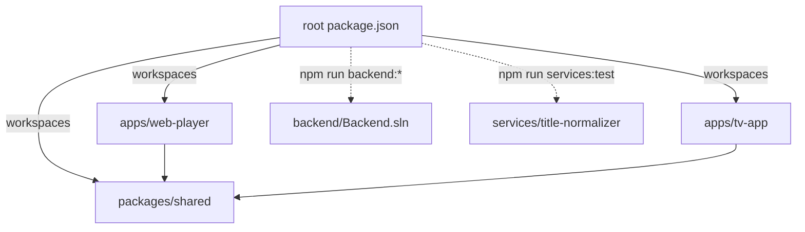

## D-002

**Folder layout and README rules** — 2026-09-23

Decision: layout follows the task spec (`apps/`, `packages/`, `backend/`, `services/`, `documentation/`). Every folder has a `README.md` with facts only, except:
- `documentation/`: spec requires exactly three files there. That rule wins.
- Generated/tool folders (`node_modules`, `bin`, `obj`, `dist`, `.venv`, `android`).
- `.github/` (2026-09-23): GitHub shows `.github/README.md` as the repository home page in place of the root README, so `.github/` has none; the root README describes it.
- Android `res/` folders: the resource merger rejects any non-resource file, so the parent folder's README documents them (2026-09-23).

Why: explicit spec rule for `documentation/` is more specific than the general README rule.

## D-003

**Central config via root `.env`** — 2026-09-23

Decision: one committed root `.env` holds public, non-secret settings (`APP_NAME`, `APP_SLUG`, `APP_ANDROID_PACKAGE`, `APP_API_BASE_URL`). `.env.local` (git-ignored) overrides it. Real environment variables override both. No code contains a fallback app name; every consumer fails fast when a key is missing.

Why:
- App name is undecided. Renaming must be a one-line change.
- `.env` is the only format all four runtimes read natively or with a tiny loader.
- Committing `.env` lets CI and fresh clones build with zero setup. Secrets never go in it.
- Azure (App Service, Functions, Static Web Apps build) injects App Settings as env vars, which already win.

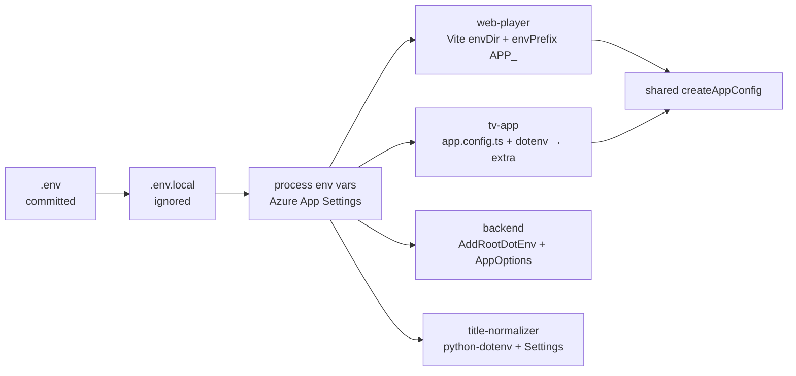

Per consumer:

| Consumer | Loader | Notes |
|----------|--------|-------|
| web-player | Vite `envDir` = repo root, `envPrefix` includes `APP_` | `index.html` uses `%APP_NAME%`. Values are public in the bundle by design. |
| tv-app | `dotenv` in `app.config.ts` | Sets Expo `name`, `slug`, `android.package`, and `extra`. |
| backend | `AddRootDotEnv()` walks up from content root | Re-adds env vars after `.env` so they win. `ValidateOnStart` stops boot on missing keys. |
| title-normalizer | `python-dotenv`, `override=False` | Loads `.env.local` before `.env`; first value set wins. |

Only `APP_`-prefixed keys reach the web bundle. Never put secrets under `APP_`.

## D-004

**Frontend toolchain versions** — 2026-09-23

Decision:
- React `19.2.3` pinned exactly in both apps.
- TypeScript `~5.9.3` everywhere.
- Vite 8 + `@vitejs/plugin-react` 6. Vitest 5 for `packages/shared`.

Why:
- Expo SDK 57 requires React 19.2.3. Web uses the same version so npm hoists one React copy. Two copies break hooks.
- TypeScript 7 (native port) is current, but Expo and editor tooling rely on the 5.x JS compiler API. 5.9 is the safe choice until the ecosystem confirms 7.x support.

## D-005

**TV app: Expo + react-native-tvos** — 2026-09-23

Decision: Expo SDK 57 with `react-native` aliased to `react-native-tvos@0.86.3-0`. Plugin `@react-native-tvos/config-tv` with `isTV: true` adds the Android TV manifest (leanback launcher, no touchscreen requirement). Platform list is `android` only.

Why:
- Core React Native removed TV support. `react-native-tvos` is the maintained fork and provides `TVEventHandler`, `hasTVPreferredFocus`, focus events.
- Expo gives config plugins, prebuild and native module tooling needed later for ExoPlayer `DownloadManager`.
- Fork version must match the Expo SDK's React Native minor (SDK 57 → RN 0.86).

Supporting settings:
- Root `package.json` `overrides.react-native` forces the fork everywhere. Without it, `@react-native-tvos/virtualized-lists` pulled a second, upstream `react-native@0.86.3`.
- `expo.install.exclude: ["react-native"]` stops `expo install` from "fixing" the alias back to upstream.

## D-006

**Backend: .NET 8, layered projects** — 2026-09-23

> Runtime choice superseded by [D-009](#d-009). Layering still applies, extended by `Backend.Infrastructure` (D-011).

Decision: ASP.NET Core minimal API on `net8.0`. Projects: `Backend.Api` (host), `Backend.Core` (config, domain, interfaces), `Backend.Tests` (xUnit + `WebApplicationFactory`). Central package versions in `Directory.Packages.props`. Warnings are errors.

Why:
- Spec allows .NET 8 or 9. The .NET 9 SDK download host is blocked in the build sandbox; .NET 8 is available from Ubuntu packages, so it can be compiled and tested here.
- Both 8 and 9 reach end of support on 2026-11-10. Migration to .NET 10 (LTS) is tracked in `NEXT-STEPS.md` and `KNOWN-ISSUES.md`.
- Project names use `Backend.*`, not a product name, because `APP_NAME` is undecided.
- `Backend.Core` has no endpoint code, so providers (`IMediaProvider`) can be reused by future workers and tested without HTTP.

## D-007

**Shared package ships TypeScript source** — 2026-09-23

Decision: `@iptv/shared` exports `src/index.ts` directly. No build step.

Why: Vite and Metro both compile workspace TypeScript. Skipping a build removes watch processes and stale `dist` bugs. Constraint: shared code must avoid DOM and React Native imports.

## D-008

**Python service: Azure Functions v2 model, pure core package** — 2026-09-23

Decision: `services/title-normalizer` uses the Python v2 decorator model (`function_app.py`). Logic lives in `title_normalizer/`, which never imports `azure.functions`.

Why: pure modules unit-test with plain `pytest`, no Functions host or Azurite. `function_app.py` stays a thin binding layer (HTTP now, queue trigger in Step 3).

## D-009

**Backend on .NET 10 LTS (supersedes D-006 runtime choice)** — 2026-09-23

Decision: all backend projects target `net10.0`. `global.json` pins SDK `10.0.100` with `latestFeature` roll-forward. Microsoft packages use `10.0.x`.

Why:
- .NET 8 and 9 leave support on 2026-11-10. .NET 10 is LTS (support until Nov 2028).
- The .NET 10 SDK is installable from Ubuntu packages in the build sandbox, so builds and tests are verified.
- Upgrade cost was zero: only target framework and package versions changed.

## D-010

**Local-only deployment for phase 1** — 2026-09-23

Decision: every component runs on the developer's machine. No Azure resources yet. Azure targets from the brief (Static Web Apps, App Service, Functions, Azure SQL/Cosmos) stay as the future direction.

Consequences:
- Database is a local SQLite file (D-014), not Azure SQL/Cosmos.
- Relay bandwidth costs nothing (D-013).
- The API listens on all interfaces (`0.0.0.0:5080`) so an Android TV device on the same LAN can reach it. Set `APP_API_BASE_URL` in `.env.local` to the PC's LAN IP for the TV build.
- Traffic is plain HTTP on the LAN. Accepted for phase 1 (KI-009).

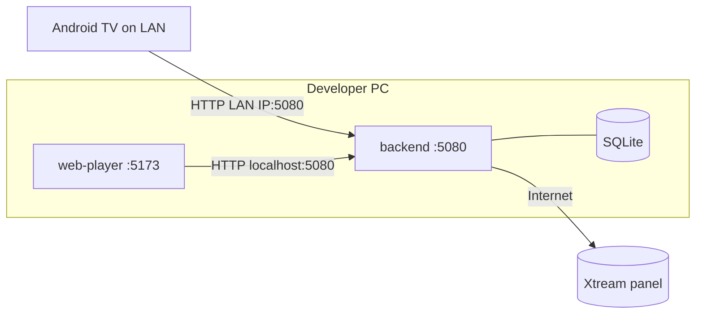

## D-011

**`IMediaProvider` + `XtreamCodesProvider` design** — 2026-09-23

Decision:
- `IMediaProvider` (in `Backend.Core`) is stateless. Every call receives `ProviderCredentials`. One singleton-style typed `HttpClient` instance serves all accounts.
- `IMediaProviderResolver` picks the implementation by the `ProviderType` string stored on each account (`xtream` today). New sources (M3U, Stalker) add a class, not new endpoints.
- Return types are provider-agnostic records (`Backend.Core.Media`). Clients never see Xtream field names.
- `BuildPlaybackSource` is pure (no network). It returns the upstream URL; `PlaybackService` decides relay vs. direct.
- Xtream JSON is parsed with `JsonDocument` + lenient readers (`LooseJson`), not strict DTOs.

Why lenient parsing: panels return the same field as `"55"`, `55`, `null` or `""`; `info` can be `{}` or `[]`; `episodes` can be an object keyed by season or an array of arrays; `backdrop_path` can be a string or an array. Strict deserialization fails on the first mismatch and takes a whole catalog down.

Other rules:
- Server URL normalization accepts `host:port`, strips `player_api.php`/`get.php`, and keeps any sub-path. Canonical form is stored, so the same login from different spellings maps to one account.
- Container extensions from clients are sanitized (letters/digits, max 8 chars) before entering URLs.
- Live streams prefer `m3u8`; fall back to `ts` when the account's `allowed_output_formats` excludes HLS.
- Errors: HTTP 401/403 or `auth: 0` → `ProviderAuthenticationException`; network, non-2xx, invalid JSON → `ProviderUnavailableException`.

## D-012

**Authentication proxy: upstream-validated login, opaque sessions** — 2026-09-23

Decision:
1. Client sends Xtream server URL, username, password once to `POST /api/auth/login`.
2. Backend validates them server-to-server (`player_api.php`). Rejects inactive/expired accounts.
3. Backend stores the account; password encrypted with ASP.NET Core Data Protection (key ring in `DATA_DIR/keys`).
4. Backend returns a random 256-bit opaque bearer token. Only its SHA-256 hash is stored.
5. First login creates one default profile named after the username.

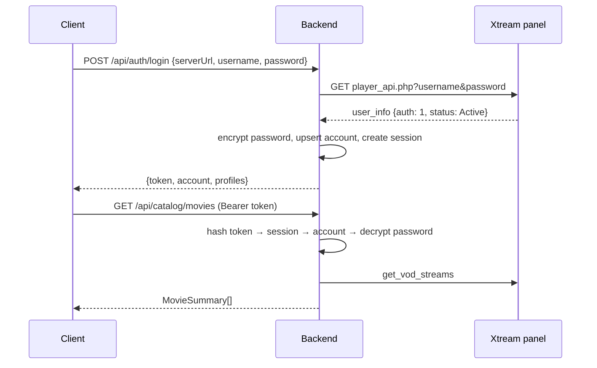

Why:
- Provider credentials never live on clients after login. A stolen TV device leaks a revocable token, not the IPTV subscription.
- Opaque tokens over JWT: revocation is one row delete; no signing-key management; the API is the only token consumer.
- Data Protection handles key generation, rotation and authenticated encryption. Application name is fixed to `backend` so renaming `APP_NAME`/`APP_SLUG` never makes stored passwords unreadable.
- Profiles belong to the account, not the session, so every device sees the same "Who's watching?" list.

## D-013

**Stream delivery: backend relay by default** — 2026-09-23

Decision: `BACKEND_STREAM_DELIVERY=relay` (default). `/api/playback/...` returns a relay URL. `direct` mode returns the upstream URL and stays available as a switch.

Options compared:

| | Relay (via backend) | Direct (client → provider) |
|---|---|---|
| Credentials exposure | Hidden. Relay URLs carry an encrypted, expiring token. | Username + password are in the stream URL path on every client. |
| Browser CORS | Solved. Backend sends CORS headers. | Most Xtream panels send none → hls.js cannot fetch playlists/segments. |
| Mixed content | Solved once backend has HTTPS. | HTTP-only panels blocked on HTTPS pages. |
| Web offline caching (Service Worker) | Works: same-origin/CORS responses are readable and cacheable. | Opaque cross-origin responses cannot be inspected or reliably cached. |
| Latency | +1 hop (LAN: negligible). | Lowest. |
| Bandwidth / cost | All video passes through the backend host. Local: free. Cloud: paid egress. | None on our side. |
| Availability | PC must be on and reachable. | Only provider needed. |
| Provider connection limits | Unchanged: one client stream = one upstream stream. | Same. |
| Provider IP blocking | Provider sees the PC's home IP (fine). In cloud, datacenter IPs may be blocked. | Provider sees each client IP. |

Why relay: in local-only phase 1 (D-010) its main cost (bandwidth) is zero, and it is required for web playback (CORS) and web offline caching. The TV app needs the backend for login and catalog anyway, so "PC must be on" adds no new dependency. Revisit when moving to cloud: likely hybrid (web relayed, TV direct via short-lived URLs).

How the relay works:

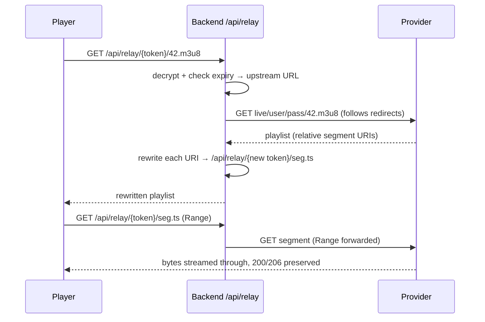

Rules:
- Tokens are Data Protection time-limited payloads (`BACKEND_RELAY_TOKEN_HOURS`). Clients cannot forge a URL, so the relay cannot be used as an open proxy (SSRF-safe).
- Playlist detection: `mpegurl` content type or `.m3u8` path; max 5 MB.
- Relative URIs resolve against the final URL after redirects (Xtream panels often redirect to a load-balancer host).
- The relay `HttpClient` has no timeout (live streams are endless) and its request logs are silenced because upstream paths contain credentials.

## D-014

**Persistence: SQLite + EF Core migrations** — 2026-09-23

Decision: EF Core 10 with SQLite at `DATA_DIR/app.db`. Migrations live in `Backend.Infrastructure/Persistence/Migrations` and run automatically on startup. `dotnet-ef` is a local tool (`backend/dotnet-tools.json`).

Why:
- Local-only (D-010): no database server to install.
- EF Core keeps the path to Azure SQL open: swap `UseSqlite` for `UseSqlServer` and regenerate migrations.
- `DateTimeOffset` is stored as UTC ticks (`long`) because SQLite cannot compare or sort `DateTimeOffset` natively.

## D-015

**Catalog cache: in-memory, per account** — 2026-09-23

Decision: `CatalogService` caches provider responses in `IMemoryCache` for `BACKEND_CATALOG_CACHE_MINUTES` (default 15), keyed by account + request.

Why: Xtream `get_vod_streams` without a category can return tens of thousands of items and take seconds. In-memory is enough for a single local process. Durable metadata storage belongs to Step 3 (master media objects).

## D-016

**SQLite job queue + shared `pipeline.db`** — 2026-09-23

Decision (owner-approved): the queue between backend and Python is a table in a second SQLite file, `DATA_DIR/pipeline.db`. The same file holds the output (`master_media`, `media_variants`). `app.db` (accounts, encrypted passwords) stays backend-only.

```mermaid
sequenceDiagram
  participant A as Backend
  participant Q as pipeline.db
  participant W as Python worker
  A->>A: login / POST /api/library/sync
  A->>A: fetch get_vod_streams + get_series (background)
  A->>Q: INSERT job (pending, payload JSON) or replace pending payload
  loop every 5 s
    W->>Q: UPDATE ... SET processing WHERE id = oldest pending RETURNING
  end
  W->>W: parse + group
  W->>Q: BEGIN IMMEDIATE; replace masters/variants; job = done; COMMIT
  A->>Q: SELECT masters for /api/library
```

Why:
- Local-only (D-010): no Azurite, Redis or broker to install. SQLite is already used.
- Separate file: the Python process never opens the database holding credentials. Large payloads and bulk rewrites do not bloat or lock `app.db`.
- One schema owner: EF Core (`PipelineDbContext`) creates and migrates `pipeline.db`. Python only reads/writes rows. Two writers of DDL would drift.
- Contract enforcement: `pipeline-schema.sql` is generated from the EF model and committed. A backend test fails if it is stale; Python tests build their database from it. A column rename breaks Python tests immediately, not at runtime.
- snake_case names and Unix-second integer timestamps: natural in Python/SQL, no `DateTimeOffset` text parsing.

Queue rules:
- Claim is a single `UPDATE ... RETURNING` statement: atomic, safe with several workers.
- One pending job per account + kind: a newer sync replaces the pending payload instead of stacking jobs.
- Retries: failure → `pending` until 3 attempts → `failed`. Jobs stuck in `processing` for 10 min (crashed worker) are requeued.
- Output is a full snapshot per account + kind, replaced in one transaction. Readers never see a half-written library.
- Processed payloads are cleared (`[]`) to keep the file small.
- Both processes use WAL mode + 30 s busy timeout, so API reads continue while the worker writes.

## D-017

**Title normalizer: regex parsing + guarded fuzzy grouping** — 2026-09-23

Decision: rule-based parsing (regex + vocabularies in `tags.py`) and `rapidfuzz` string similarity. No ML/NLP model.

Why: IPTV titles follow a small set of conventions (language prefixes, bracket tags, scene names). Rules are fast, deterministic, debuggable by juniors, and each failure becomes a test case. A model would add a large dependency and non-deterministic output for little gain.

Parsing steps (`parser.parse_title`):

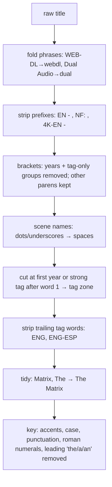

False-positive guards:
- Two-letter language codes (`IT`, `US`, `DE`) count only inside prefixes/brackets or when uppercase. "It (2017)" and "Us (2019)" keep their titles.
- Prefixes must be uppercase or contain a digit, and every token must be a known tag.
- The first word is never cut ("2001: A Space Odyssey", "1917"). Years outside 1900..next year are title words ("Blade Runner 2049").
- `US`/`UK` are not languages: "The Office (US)" and "The Office (UK)" stay distinct.

Grouping (`matching.group_titles`), in order:
1. Exact: same compact key (spaces removed) + same year. "Spider-Man" = "Spiderman".
2. Year-less join: a title without year joins the dated group with the same key only if exactly one exists. "Dune" with both 1984 and 2021 present stays separate.
3. Fuzzy: `fuzz.ratio ≥ 90` on compact keys within blocks sharing the first 4 characters. Requires equal years, equal number tokens (sequels: "Toy Story 2" ≠ "Toy Story 3"), and exact match for keys shorter than 6 characters ("Up" ≠ "Us").

Rule 3 requires equal years because a year-less title matching two dated titles would chain remakes into one group (found by test, 2026-09-23).

Master output:
- `id` = SHA-1 of account + kind + compact key + year (first 20 hex chars). Stable across re-syncs while the group's canonical key/year are unchanged.
- Display title: most frequent spelling in the group.
- Variants ordered by `quality_score` (resolution rank + source adjustment: CAM −300 … REMUX +30, HDR +5). Label example: `4K · HDR · ENG · DUAL`. Duplicate labels get `(2)`, `(3)`.

Performance (2026-09-23, sandbox CPU): ~50,000 items → ~22,000 masters in 4.6 s.

## D-018

**Python worker runs as a CLI poller locally** — 2026-09-23

Decision: `python -m title_normalizer` polls `pipeline.db` every 5 s. `function_app.py` keeps only the health route; no Functions trigger reads the SQLite queue.

Why: Azure Functions needs Core Tools + a storage emulator locally, and SQLite is not a supported trigger source. A plain loop is simpler to run and debug. Cloud move: swap the SQLite queue for an Azure Storage Queue trigger that calls the same `build_masters()`; the engine modules do not change (D-008).

## D-019

**`DATA_DIR` shared key, paths relative to repo root** — 2026-09-23

Decision: `BACKEND_DATA_DIR` is renamed `DATA_DIR`. Relative values resolve against the directory containing `.env` (repo root) in both backend and Python. Default: `<repo>/.data`.

Why: backend and worker must open the same `pipeline.db`. One key and one resolution rule removes a class of "worker looks in the wrong folder" bugs. The backend exposes the `.env` directory internally as `DOTENV_DIRECTORY`.

## D-020

**API contract: OpenAPI export at build → generated TypeScript types** — 2026-09-23

Decision:
- `Microsoft.Extensions.ApiDescription.Server` writes `packages/shared/openapi/backend-openapi.json` on every backend build.
- `openapi-typescript` turns it into `packages/shared/src/api/generated/schema.ts` (`npm run generate:api`). Both files are committed.
- The hand-written API client takes its return types from generated `operations` (`OperationResult<'listLibrary'>`). Renaming an operation or changing a DTO breaks the TypeScript build.
- A Vitest test regenerates the types in memory and fails if the committed file differs.

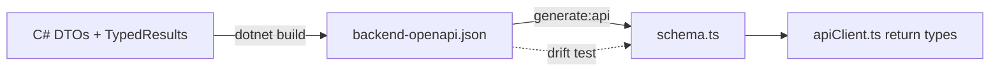

Backend changes needed for an accurate document:
- All endpoints return `TypedResults` / `Results<...>` so response bodies and status codes are documented. `.WithName()` sets stable operation ids.
- `JsonNumberHandling.Strict`: ASP.NET's default accepts numbers as strings, which made every number `integer | string` in the schema.
- `RequiredPropertiesSchemaTransformer`: System.Text.Json always writes every property (nulls included), so response properties are `required` (nullable ones stay `| null`). Request types (`*Request`) keep nullable properties optional so callers can omit them. Without this, every generated field would be optional (`?`).
- The build starts the app to export the document. `Program.cs` detects this (`GetDocument.Insider` entry assembly), uses a temp `DATA_DIR`, and skips migrations, so builds never touch real data.
- The relay endpoint is excluded from the document: players call it via URLs from `/api/playback`, never the client.

Why a hand-written client over a generated one (e.g. `openapi-fetch`): about 20 small functions that juniors can read, no `Request` object dependency (React Native's fetch polyfill differs from browsers), and friendly method names. Types still come from the contract.

## D-021

**Shared client + vanilla Zustand stores behind one app context** — 2026-09-23

Decision: `createAppContext({ config, storage, fetch? })` builds one HTTP client, one API client and four stores (`session`, `catalog`, `library`, `player`). Stores use `zustand/vanilla`; React reads them with `useAppStore(store, selector)`.

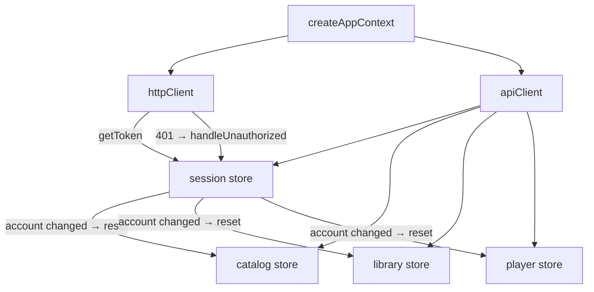

Why:
- Vanilla stores work outside React (tests, service workers, native modules later) and bind to React with one hook.
- Dependencies are injected (`storage`, `fetch`), so tests run the real stores against a fake backend with no mocking library.
- One factory per app means one place to wire cross-store rules: any 401 signs out; an account change clears account-scoped caches.

Store rules:
- Remote data lives in `Resource<T>` records (`data`, `status`, `error`, `updatedAt`) keyed by query. `createResourceLoader` returns cached data unless `force`, and shares one request between concurrent callers.
- Each loader has a generation counter. `reset()` bumps it, so a request still in flight when the user signs out cannot write stale data into the cleared store (found by test, 2026-09-23).
- Player `open()` ignores responses from older calls (fast channel zapping).
- Errors are stored, not thrown. UI reads `error.code` (`ApiErrorCode`).
- Library page size defaults to 100; the chosen variant per master lives in `selectedVariants` (missing = best variant, which the backend lists first).
- Login auto-selects the profile when the account has exactly one; otherwise UI shows the picker.

## D-022

**Session persistence per platform** — 2026-09-23

Decision: the session store persists one JSON snapshot (`token`, `account`, `profiles`, `activeProfileId`) through a `KeyValueStorage` adapter.

| Platform | Adapter | Protection |
|----------|---------|------------|
| Web | `localStorage`, key `<APP_SLUG>:session` | Readable by any script on the origin (XSS). |
| TV | `expo-secure-store` | Encrypted with an Android Keystore key. |

Why:
- Caching account + profiles lets the app start with the profile picker even when the backend is unreachable (`offline = true`), needed later for offline downloads.
- `restore()` re-validates the token (`/api/auth/me` + `/api/profiles`) whenever the backend answers; 401 clears everything.
- Persistence is manual (not Zustand `persist` middleware): explicit writes after each change are easier to follow and test with async storage.
- Web alternative (HttpOnly cookie) needs CSRF protection and same-site hosting; deferred while local-only (KI-017).

## D-023

**Web playback engine: HLS first, file fallback, on-demand frame previews** — 2026-09-23

Decision (owner-approved recommendation for KI-010): `PlaybackEngine` tries sources in order and stops at the first that loads.

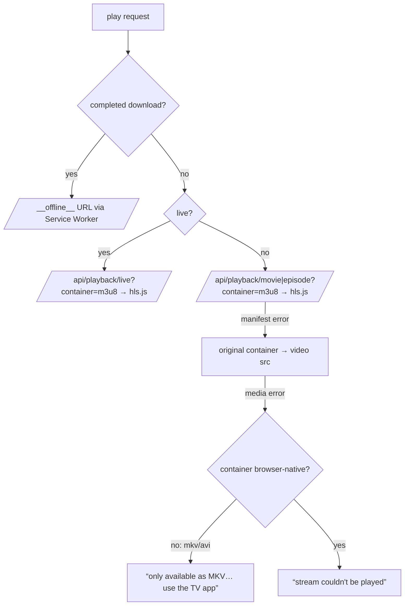

Why:
- Many Xtream panels transmux VOD to HLS on request (`/movie/u/p/{id}.m3u8`). HLS in hls.js plays MKV sources in any browser with no backend transcoding.
- If the panel has no HLS, MP4-family files still play natively; MKV/AVI get an honest explanation instead of a frozen player.
- hls.js fatal errors after start: network → `startLoad()`, media → `recoverMediaError()` (twice), then an error message.

Timeline frame previews: providers ship no trickplay sprites. `FrameGrabber` creates a hidden, muted second `<video>` (HLS at the lowest rendition, 4 s buffer) only on first timeline hover, seeks it to the hovered time (coalescing requests) and draws the frame into a canvas. Costs one extra stream connection while previewing (KI-020).

Other rules:
- Skip Intro: providers give no markers. Heuristic window 5–90 s on episodes ≥ 10 min (`INTRO_WINDOW` in `@iptv/shared`) (KI-019).
- Next-up: countdown card during the last 10 s; auto-plays the next episode on `ended` unless cancelled. Order: season, then episode number.
- Progress saved every 10 s while playing, on pause, on close, on version/episode switch.
- The player (and hls.js, ~500 kB) is a lazily loaded chunk; the initial bundle is ~255 kB.

## D-024

**Web offline downloads: Service Worker + AES-GCM chunks** — 2026-09-23

Decision: downloads are fetched by a page-side `DownloadManager`, encrypted per chunk, stored in the Cache API, and served back only through the Service Worker under `/__offline__/`.

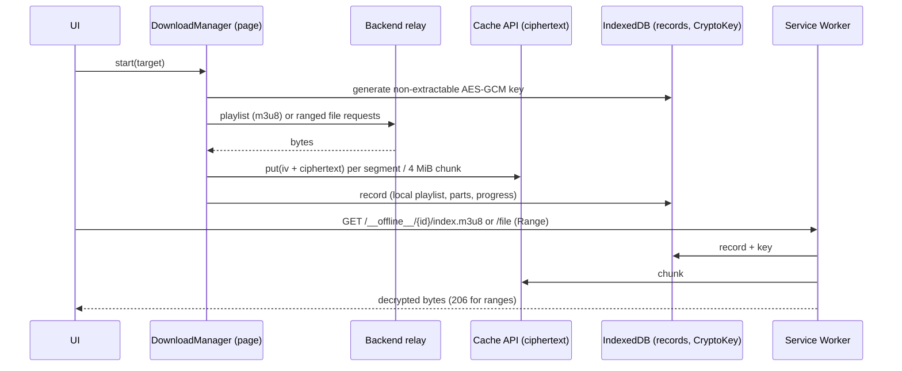

Why:
- Meets the brief: no `.mp4`/`.mkv` is ever written to the user's filesystem; data lives inside the browser's origin storage.
- AES-GCM with a non-extractable key: copying the cache contents off the machine yields ciphertext, and GCM detects tampering. It is not DRM: scripts on the origin (and DevTools) can still use the key through the SW (KI-002).
- HLS downloads store every playlist resource (segments, init maps, AES keys) and a rewritten local playlist, so hls.js plays offline exactly as online. Files are stored as 4 MiB chunks; the SW answers `Range` requests one chunk at a time (low memory).
- One download at a time: each download holds a provider connection (`max_connections`).
- Resumable: existing chunks are skipped; a changed upstream playlist restarts cleanly. Interrupted downloads come back paused.
- The SW also caches the built app shell (precache list injected at build), so the app opens offline and routes to My Downloads.
- The SW is bundled separately by a small Vite plugin using esbuild (classic script, works in all browsers; `/sw.js` in dev and build). Chosen over `vite-plugin-pwa` to avoid Workbox for ~5 kB of code.

## D-025

**Web UI architecture** — 2026-09-23

Decisions:
- **Navigation:** a small Zustand `uiStore` (view, search, details, playing) mirrored into `history.pushState`, not a router library. Browser Back closes the player, then the modal, then returns to the previous view. No shareable URLs yet (KI-023).
- **Data:** shared stores for everything account-scoped; `useAsync` (module cache) for one-off reads (movie metadata, series episodes).
- **Rows** load when scrolled within 400 px of the viewport (IntersectionObserver).
- **Hero trailer:** muted `youtube-nocookie.com` embed faded in after 3 s when the provider supplies a trailer id; backdrop image otherwise (owner-approved).
- **Library re-processing:** `LibraryBanner` polls status while the library is empty or processing. When that ends it calls `library.invalidate()` (keeps version choices) and bumps `libraryRevision`; mounted views reload. Polling while *empty* matters: right after the first login the sync job may not exist yet (found by e2e, 2026-09-23).
- **Selectors:** `useAppStore` wraps selectors in `useShallow`. Zustand 5 otherwise loops forever when a selector returns a new array (`?? []`), which crashed the first build (React error #185).
- Plain CSS with tokens in four files; no CSS framework.

## D-026

**Watch progress stored per profile on the backend** — 2026-09-23

Decision: `WatchProgress` table in `app.db` (profile, kind, provider stream id, position, duration, display fields). Endpoints under `/api/profiles/{id}/progress`. Clients save optimistically.

Why: "Continue Watching" must follow the profile across web and TV. Display fields (title, poster, series/season/episode) are copied into the row so the row renders without extra catalog calls. Items are keyed by provider stream id (what playback needs), with `masterId`/`seriesId` for grouping; Continue Watching shows one entry per series (latest episode). Completion: ≥ 95 % or < 2 min left on titles over 10 min.

## D-027

**Fake Xtream panel + end-to-end tests** — 2026-09-23

Decision: `tools/fake-xtream-server` (Python stdlib) emulates a panel: catalog with duplicates/sequels/MKV-only/series/live, 302 redirects to media (like real load balancers), HTTP Range, a sliding live window, SVG artwork. `generate_media.py` builds VP9/Opus test media with ffmpeg. Playwright tests (`apps/web-player/e2e`) start panel + backend (temp `DATA_DIR`) + worker + production web build on separate ports and drive a real browser.

Why:
- The whole chain (provider → relay → dedup worker → UI → hls.js → Service Worker) only fails in integration; unit tests missed three bugs the e2e run caught (render loop, stale details after re-processing, empty library after first login).
- VP9 plays in every Chromium build, including Playwright's (no proprietary codecs).
- Also a demo target: anyone can try the app without an IPTV subscription.

## D-028

**TV app architecture: focus, navigation, remote handling** — 2026-09-23

Decisions:
- **Focus:** Android's native focus search (react-native-tvos) moves between `Pressable`s; no JS spatial-navigation library. `hasTVPreferredFocus` sets the first focus per screen; `TVFocusGuideView` remembers rail focus (`autoFocus`) and traps focus in the player drawer.
- **Navigation:** a small Zustand stack (`section` root, `details`, `player`) instead of React Navigation. Hardware Back pops; at the root it returns `false` so Android exits. Mirrors the web's store-driven navigation (D-025).
- **Layout:** left side rail (Netflix TV pattern), rows per category (a grid with chips is awkward with a D-pad).
- **Remote in the player:** `useRemote` wraps `useTVEventHandler`. Android reports key-down (auto-repeated while held) and key-up via `eventKeyAction`. `RemoteSeekController` (shared, pure, clock-injected) turns that into:

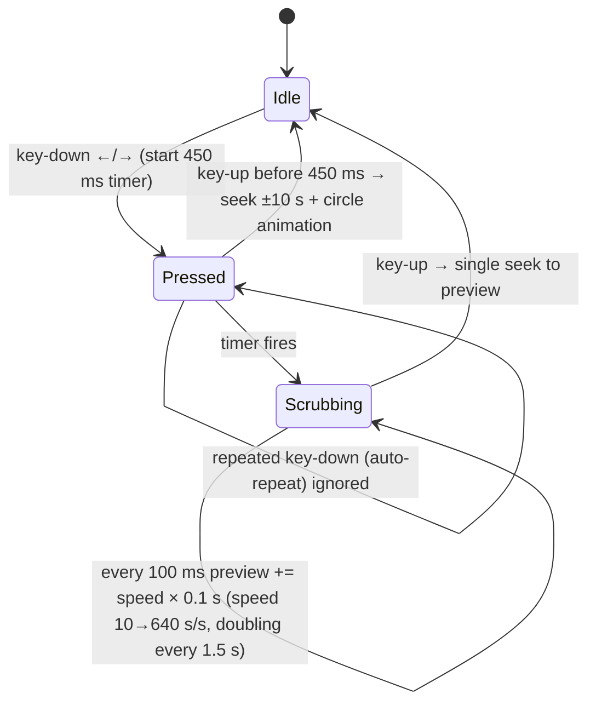

  Why seek once on release: seeking on every tick would re-buffer the stream 10× per second over the relay. Events without `eventKeyAction` (other platforms/remotes) are treated as taps.
- ↑/↓ open the quick drawer (Audio, Subtitles, Versions, Episodes). Select toggles play/pause unless a focusable overlay (Skip ahead, Play Now) is shown.
- The player overlay is not focusable, so ←/→ reach the remote handler instead of moving focus between buttons.
- Profiles are only picked on TV; creation/editing stays in the web app (text entry with a D-pad is slow).
- `.npmrc legacy-peer-deps=true`: `react-native-tvos` versions are semver pre-releases (`0.86.3-0`) that never satisfy peer ranges like `react-native >=0.78`. Peers that npm used to add automatically (`@testing-library/dom`, `@react-native/jest-preset`, `test-renderer`) are now explicit devDependencies.
- Player focus anchor (2026-09-23): Android TV delivers D-pad keys to `useTVEventHandler` only while a view inside the React root has focus. The player has no focusable controls, so after navigation nothing was focused and remote keys were lost (found by the emulator run, not by Jest, which mocks the remote). A transparent full-screen `Pressable` with `hasTVPreferredFocus` holds focus whenever the drawer, Skip Intro or next-up are not shown. react-native-tvos reports `select` and `playPause` on key release only (like a click), arrows on press and release; the player acts on release for those two and on press for the rest. On the emulator arrows also arrived as key-up only, so `createRemoteNormalizer` turns any release without a press into press + release before handlers see it (found with `APP_TV_DEBUG_REMOTE=1` logging).

## D-029

**TV playback + offline: local Expo module over Media3** — 2026-09-23

Decision: a local Expo module `apps/tv-app/modules/tv-media` (Kotlin, Media3 1.9 like `expo-video`) provides `TvPlayerView` and download functions. `expo-video` is not used.

Why:
- The brief requires ExoPlayer `DownloadManager` with private storage. Offline playback must read the same `SimpleCache` the downloads wrote; `expo-video` does not expose its data source or a download API (KI-005).
- One module owns both sides: `DownloadCenter` holds the cache (`filesDir/offline-media`, private to the app), the `DownloadManager` (1 parallel download) and data-source factories. Offline playback uses `DownloadHelper.createMediaSource(download.request, cacheDataSourceFactory)`, i.e. the exact request that was downloaded, so expiring relay tokens (D-013) don't matter offline.
- `TvDownloadService` (Media3 `DownloadService`, `dataSync` foreground type) keeps downloads alive in the background with a notification.
- The view has no built-in controller; React Native draws the UI and calls `seekTo`/`selectTrack`.

Playback order on TV: completed download → original container (ExoPlayer plays MKV/MP4/TS) → panel HLS (`tvPlaybackAttempts`). Live: HLS, then TS. Downloads probe the original file with a 1-byte range request and fall back to HLS, because Media3 reports a missing file only later, in the background.

Download metadata (title, poster, ids) is stored as JSON in `DownloadRequest.data`, so My Downloads needs no second database. Native events fire on state changes only; JS polls progress every second while a download is active.

## D-030

**TV test environment: Jest here, Android TV emulator + Maestro in CI** — 2026-09-23

Constraints (2026-09-23): the Claude Code sandbox has no `/dev/kvm` (no emulator) and its network policy blocks `dl.google.com` (no Android SDK, no Google Maven), so APKs cannot be built there.

Decision: three layers.

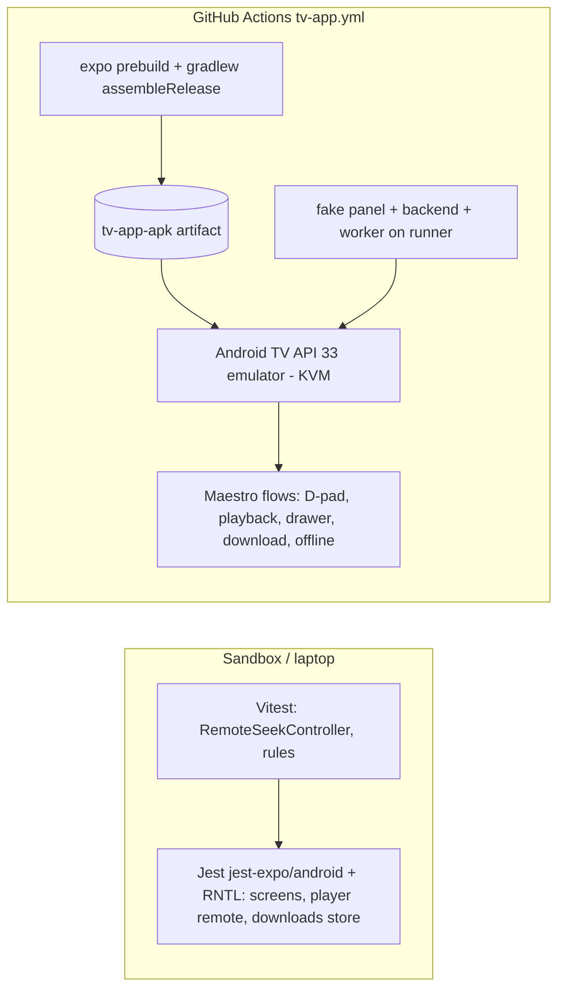

- Jest uses `jest-expo/android` (Android `BackHandler`), a mock of the native module that records player props/seeks and simulates downloads, and a remote mock (`pressRemote`).
- CI (`ubuntu-latest` has KVM) builds a debug-signed release APK for x86 (emulator) and ARM (devices), starts the same fake panel/backend/worker as the web e2e, and runs Maestro flows with `Remote Dpad` key presses. The emulator reaches the runner at `10.0.2.2`, baked into the APK via `APP_API_BASE_URL`.
- The second flow stops provider and backend first, proving the app restores offline and plays a download from private storage.
- Disk (2026-09-23): the runner ran out of space installing the TV system image after the Gradle build. The job deletes unused preinstalled toolchains first and drops Gradle output (keeping only the APK) before the emulator step.
- Emulator setup (2026-09-23): the TV emulator is 960×540 dp, so flows scroll to off-screen elements (`scrollUntilVisible`); it runs without `-noaudio` because ExoPlayer's clock follows audio output and stays at 0:00 without a sound device; 4 cores.
- Flow timing (2026-09-23): each Maestro screen read takes seconds on the emulator, longer than the 4 s the player controls stay up. Flows let playback run, then pause (paused controls stay visible) before reading the clock. The on-screen keyboard is closed with Enter: Maestro's `hideKeyboard` sends Back on Android TV, which exits the app when the keyboard has already closed.
- Failure output (2026-09-23): `e2e/run.sh` prints on-screen text/ids and filtered logcat into the job log, because the Maestro artifact cannot be downloaded from the Claude Code sandbox (blob storage is blocked by its network policy).
- Hold-to-scrub cannot be scripted with Maestro (single key events); it is covered by unit and component tests.

`ci.yml` also runs every fast suite (JS, .NET, Python) and fails when the committed OpenAPI/TypeScript contract is stale (closes KI-018).

## D-031

**EPG: XMLTV cache in `app.db`, short-EPG fallback, paged grid endpoint** — 2026-09-23

Context: Xtream panels expose the guide two ways. `xmltv.php` returns the whole guide for all channels (often 50–500 MB, sometimes gzip). `get_short_epg` returns the next few programmes for one channel, with base64 titles.

Decision:

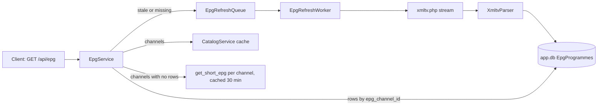

- One download per account in a background worker (like the library sync). The first grid request queues it and returns `status: refreshing`; clients poll every 3 s. Later downloads (older than `BACKEND_EPG_REFRESH_HOURS`, default 6) run in the background while the old guide is served.
- The XML is streamed with `XmlReader` (no DOM) and only programmes overlapping now −3 h … +48 h are kept: bounded rows even for huge feeds. Gzip is detected from the magic bytes because many panels send `.gz` bodies without `Content-Encoding`.
- Rows are replaced in one transaction with a prepared SQLite command. EF change tracking is too slow for 10⁵ rows. A broken feed rolls back and the previous guide stays.
- Matching uses `epg_channel_id` lower-cased (feeds and channel lists disagree on case). Channels without an id, or missing from the feed, fall back to `get_short_epg` for the channels on the requested page only (4 in parallel, cached 30 min, failures cached as empty).
- A failed download is not retried for 15 minutes. With no feed ever downloaded the status is `unavailable` and short EPG still fills rows.
- The grid pages channels (`offset`/`limit`, default 50, max 200) and the window (`from` aligned to UTC half hours, `hours` 1–12). Channel lists can have thousands of entries; clients load more on demand.

Why not per-channel short EPG only: one request per channel per page is slow on big categories and only covers a few hours ahead. Why not an in-memory cache: guides are large and would be lost on restart; SQLite is already there (D-014).

## D-032

**Guide UI: shared layout math, 3 h web / 2 h TV windows, select plays the channel** — 2026-09-23

- `@iptv/shared` owns the layout (`layoutGuideRow`: clip to the window, trim overlaps, fill gaps with empty cells) and paging/polling (`useEpgGuide`). Cells carry fractions, so web uses CSS percentages and TV multiplies by the measured row width.
- Web: a 3-hour window with a sticky channel column, time header and a red "now" line; Earlier / Now / Later move 1 hour. Clicking a channel plays it; clicking a programme opens details with "Watch live". On phones the timeline keeps 640 px and scrolls sideways.
- TV: a 2-hour window (960 dp width keeps titles readable). Rows are fixed-height so Android focus search moves naturally between programmes (←/→) and channels (↑/↓). The focused programme is described in a panel above the grid (Netflix-style, no extra key press). Select plays the channel. More channels load when the list nears its end.
- Playing from the guide passes the current programme title as the player subtitle.
- Past and future programmes are not playable on their own (no catch-up yet, KI-032); selecting them plays the live channel.

## D-033

**Linters and formatters: ESLint + Prettier, dotnet format, Ruff; web e2e in CI** — 2026-09-23 (requested by owner)

| Language | Lint | Format | Config |
|----------|------|--------|--------|
| TS/TSX/JS | ESLint: `js` + `typescript-eslint` recommended, `react-hooks` `rules-of-hooks` + `exhaustive-deps` as errors | Prettier (140 columns, single quotes, trailing commas) | `eslint.config.mjs`, `.prettierrc.json` |
| C# | Analyzer rules in `dotnet format` | `dotnet format` (whitespace, style) | `.editorconfig`, `backend/.editorconfig` |
| Python | Ruff `E F W I B UP` (E501 off) | `ruff format` | `services/title-normalizer/pyproject.toml` |

- Only the two `react-hooks` rules: the plugin's React Compiler rules would flag intentional patterns (setState in effects for data loading) without a compiler in the build.
- Style settings copy what the code already did, so the one-time reformat changed layout only (commit listed in `.git-blame-ignore-revs`).
- Markdown, YAML and JSON are not formatted: docs keep hand-written tables and Mermaid.
- EF migrations are marked generated (EF writes a BOM and its own layout).
- CI runs lint as its own job so a formatting slip does not hide test results. The Playwright suite runs as a third job (`web-e2e`) with the fake panel, backend, worker and a production build, the same stack as locally (D-027).

## D-034

**One-command dev stack: `scripts/dev.mjs`** — 2026-09-23 (requested by owner)

`npm run dev:all` starts backend, worker and web dev server; `-- --fake` adds the fake panel. A Node script instead of a package like `concurrently`: no extra dependency, it runs on Windows too (venv `Scripts/python.exe`, `taskkill /T`), it checks prerequisites with clear messages, and it stops everything when any process exits, so a crashed backend is never hidden behind a running web server. Each process runs in its own process group so `dotnet run` and `vite` grandchildren stop too.

## D-035

**Phone testing via GitHub Codespaces (web app + fake panel)** — 2026-09-23 (requested by owner: no computer or TV available)

Decision: a `.devcontainer` that runs `npm run dev:all -- --fake` in a codespace; the phone opens the forwarded web port.

- Only port 5173 is used from the phone. Vite proxies `/api` to the backend, so the app, API and relay share one HTTPS origin: no CORS, no mixed content, one private link that GitHub authenticates.
- Relay URLs are absolute; behind the Codespaces proxy the backend cannot see the public address, so `BACKEND_PUBLIC_BASE_URL` (set by `start.sh`) overrides the request's scheme and host.
- Vite accepts `*.app.github.dev` hosts and runs HMR over port 443 only when `CODESPACES=true`.
- Test media is generated as H.264 + AAC so it also plays in Safari on iPhone (VP9 does not).
- `start.sh` tracks its process group in a PID file instead of `pkill -f`, which can match the calling shell.

Why not a public deployment: free hosts sleep and wipe disks, relay video uses their bandwidth, providers often block cloud IPs, and the security work before any public exposure (KI-008) is not done. Codespaces is free within GitHub's monthly allowance, private, and stops when idle.

Phone layout fixes found while checking: the top navigation wraps to two rows under 720 px (links scroll sideways), and the volume slider is hidden on phones.

## D-036

**Codespaces: artwork through the web port, auto-start on open** — 2026-09-24 (found in the first real codespace run)

Decision: the fake panel builds artwork URLs from `FAKE_PANEL_IMAGE_BASE_URL` (the public web address, set by `start.sh`), and Vite proxies `/img` to the panel in Codespaces. `start.sh --if-stopped` runs on every start and every attach.

- Artwork URLs go straight from the panel to the browser. With the request's host they were `http://localhost:8090/...`, which the phone cannot reach (and which is mixed content on HTTPS).
- After a stop/start the app was not running. Running the start script on attach as well, and skipping it when the app answers, brings it back without restarting a healthy stack.
- `gh` is installed in the image so port visibility can be changed from the terminal.

Why not proxy artwork through the backend: real panels serve public image URLs; only the fake panel on localhost needs this, so the fix stays in dev tooling.

## D-037

**TV APK for a real Android TV, delivered through the codespace** — 2026-09-24 (requested by owner: test on an Android TV)

Decision: a manual workflow (`tv-apk.yml`) builds an ARM release APK with `APP_API_BASE_URL` from an input and uploads it to a `tv-apk` prerelease. In the codespace, `get-tv-apk.sh` downloads it and Vite serves it at `/tv.apk`, so the TV fetches it from the same link it will use.

- The API address is fixed at build time (`app.config.ts` `extra`), so the CI emulator APK (`10.0.2.2`) cannot reach a codespace.
- The repo is private: release and artifact downloads need a GitHub login, which a TV cannot do. The codespace's own token can download the release.
- Only ARM ABIs: real TVs are ARM; x86 is only for the emulator and makes the APK larger.
- The TV needs port 5173 public. Native requests get no Codespaces warning page, so the app works directly.

Why not a runtime "backend address" setting on the TV: better long-term, but it adds a settings screen and validation; the build input is enough for testing now (see NEXT-STEPS).

Update 2026-09-25 (requested by owner): `tv-apk.yml` also runs after every push to `main` that changes the app (`apps/tv-app`, `packages/shared`, `package-lock.json`, the workflow itself; Markdown files and the emulator flows excluded) and always publishes to the `tv-apk` prerelease, without a "My server" prefill. A newer merge cancels a build still running. Manual runs keep their inputs.

## D-038

**Hybrid: native apps work without a server** — 2026-09-24 (owner choice: TV and phone apps must not need a self-hosted backend)

Decision: the shared package gets a second `ApiClient` implementation that talks to the provider directly ("direct mode"). Native apps use it by default; "My server" (the existing backend) stays available and is required only for the web app.

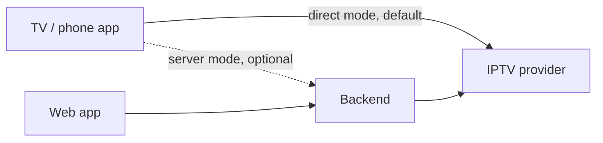

- Same interface as the backend client, so stores and screens do not change; only the app context picks the client.
- On the device: profiles, progress and the deduplicated library live in secure storage / memory. No sync between devices in direct mode (a later option).
- Title normalizer is ported to TypeScript. Both versions run the same JSON test cases to avoid drift.
- Live guide uses the provider's short EPG per visible channel; full XMLTV files are too large to parse on a TV.
- Playback goes straight to the provider with the configured User-Agent; no relay.
- The web app keeps needing the backend: browsers block direct provider calls (HTTP from an HTTPS page, no CORS).

Why not drop the backend: it still serves the web app, cross-device sync and heavier work (full XMLTV); keeping it optional costs nothing for native users.

Storage on TV: credentials in expo-secure-store; profiles, progress and the library cache in app-private JSON files (`expo-file-system`), because secure storage is meant for small values. The native player and downloads send the provider User-Agent (`BACKEND_PROVIDER_USER_AGENT`), saved natively so downloads resumed after a restart use it. Known limits: KI-034 – KI-036.

2026-09-24 update, after a real 125k-title catalog:
- Library files use a compact array format (`libraryCodec.ts`, about a third of plain JSON, 85 MB before). Old files are deleted, not migrated.
- Background refresh every 24 h instead of 12 h: grouping a big catalog takes about 2 minutes on a phone.
- Playback falls back to the stream server named in the login reply (`server_info`) when the portal address fails. Some panels answer API calls on one host and streams on another.

## D-039

**On-device diagnostics log with manual sharing** — 2026-09-24 (requested by owner: export the log for analysis)

Decision: a shared ring buffer (`appLog`, 600 lines) records provider requests, library save/load, player sources and native errors, and uncaught errors. It is saved in app storage across restarts. The TV **Log** screen shares it through the Android share sheet.

- Usernames and passwords are masked when a line is recorded (query strings and `/movie|series|live/<user>/<pass>/` paths), so a shared log never contains them.
- Nothing leaves the device unless the user taps **Share log**; there is no remote logging service.
- The native player now reports the underlying cause (HTTP status, connection error) with ExoPlayer's generic "Source error", both on screen and in the log.

Why not a crash/analytics service: it needs an account, sends data off the device by default and would still miss the provider-side causes this log records.

Update 2026-09-26 (requested by owner: clean the log after some time): lines older than 3 days are dropped when the app starts and while it logs, besides the 600-line cap.

## D-040

**Category pages, load-on-scroll and one generated app icon** — 2026-09-24 (requested by owner)

Decision:
- Row titles are links ("Drama ›"). On TV/phone they open a category grid screen; on the web they open the Movies/Series page with that category chip selected.
- Rows and grids load the next page when scrolled near the end and show a spinner meanwhile. The web grid loads automatically instead of a "Load more" button (the button stays where `IntersectionObserver` is missing).
- One icon design lives in `scripts/render-icons.mjs` and is rendered to all PNGs (launcher, adaptive icon, TV banner, splash, web favicon). The APK shows it on the native launch screen (`expo-splash-screen`) and on the first "Starting" screen, so start-up looks like one step.

Why generated PNGs are committed: builds (CI prebuild, Vite) then need no image tooling. The icon has no text because `APP_NAME` comes from `.env`.

## D-041

**The TV/phone app copies the web design** — 2026-09-24 (requested by owner: "the APK should look exactly like the web app")

Decision: the native screens are rebuilt to mirror the web pages instead of wrapping the web app in a WebView.
- Colours, the web's fluid sizes (`clamp()` of the screen width) and the icon set live in `@iptv/shared` (`design/`). A test checks the tokens against the web CSS, so the two cannot drift apart.
- Same layout: top nav with search and account menu (no side rail), hero, rows, category chips + grid, details as a panel over the page, web guide layout, web player controls, profile management.
- TV extras stay invisible to touch users: D-pad focus outlines, remote keys in the player, and in the guide focus describes a programme and Select plays it (on a phone a tap selects it, as on the web).
- The account menu adds **Log** (diagnostics, D-039); web search now also lists live channels, which the TV search already did.

Why not a WebView: it would need a running server again (browsers cannot call the provider, D-038), lose native playback/downloads and handle the remote poorly.

## D-042

**"Skip ahead" with fixed choices instead of Skip Intro** — 2026-09-24 (requested by owner: no processing in the backend)

Decision: no intro detection. Early in an episode (5–90 s, episodes ≥ 10 min, same window as before) the player shows **Skip ahead**. Pressing it opens 30 s, 1 min, 2 min and 3 min; choosing one jumps that far from the current position. Pressing Skip ahead again, Back on the remote or Esc on the web closes the choices without skipping. Same rule and labels on web and TV (`SKIP_AHEAD_*` in `@iptv/shared`).

Why: providers send no intro markers and detecting intros (audio fingerprinting, learning from skips) needs server-side processing the backend will not do. A fixed "Skip Intro" to 90 s was often wrong; letting the viewer pick the distance is honest and good enough.

## D-048

**UI stress test: huge categories** — 2026-09-24 (requested by owner)

Setup: `FAKE_PANEL_STRESS=5000` makes the fake panel serve a 4,000-title movie category, 60 small categories and 500 live channels. `scripts/stress-web.mjs` scrolls the web grid to the end; the same scroll ran against the TV/phone app in a browser build.

Findings:
- **TV/phone Movies/Series grid** (virtualized `FlatList`): about 36 cards stay mounted and the heap stays flat down to thousands of titles; no slowdown with depth.
- **Web grid** (not virtualized): every loaded page re-rendered all cards, and layout of thousands of cards dropped scrolling to ~100 ms frames (under 10 fps) after ~2,500 titles.
- **TV/phone Live TV guide**: all loaded channel rows stay mounted (500 rows ≈ 9,500 views); each next page of 50 channels takes a noticeable pause to mount in the browser build.

Decision:
- Web: `MasterCard` is memoized (a new page renders only its own cards) and grid cards use `content-visibility: auto`, so the browser skips off-screen cards. Result: scrolling stays at ~60 fps (17 ms p50) up to ~3,600 cards; short hitches remain when a page is added.
- TV/phone guide: rows are memoized and each row gets only its own selection, so moving focus or loading more channels does not re-render every row.

Not done: full virtualization of the web grid (fixed card height per breakpoint) and of the Live TV guide; worth it if providers with far larger categories show hitches on real devices.

## D-047

**Expandable category chips in the TV/phone app** — 2026-09-24 (requested by owner)

Decision: Movies/Series (and Live TV on phones in portrait) show category chips on one horizontal line. When they do not fit, a **Show all ⌄** button at the end of the line wraps every chip across the full width; the same spot then shows **Show less ⌃**, which returns to the single line. Picking a chip also returns to the line, scrolled so the chosen chip is visible (also when a category is opened from a Home row). The web page already wraps its chips, so it is unchanged.

Why: providers often have dozens of categories with long names; scrolling a single line sideways to find one is slow on a phone and with a remote.

## D-046

**Phone player: full-screen landscape, double tap to seek, timeline drag, screen stays on** — 2026-09-24 (Step 9, phone app)

Decision: on phones (not TV) the player locks to landscape while open (`expo-screen-orientation`) and hides the navigation bar (`expo-navigation-bar`; swipe from the edge shows it briefly); both come back on close, so the rest of the app follows the device. A tap shows or hides the controls; a second tap within 300 ms on the left or right third seeks −10 s / +10 s (same circle animation as the remote) and leaves the controls as they were. The timeline can be dragged: the thumb grows, the time shows above it, and the video seeks once on release. On phones and TV, the player view keeps the screen on while video plays (Android `keepScreenOn`), so neither the phone's screen timeout nor the TV screensaver starts mid-film; paused, the device may sleep again.

The details panel on phones uses 16 px sides, and each episode shows its Play/Download buttons under the title, so long episode names are not squeezed into a narrow column.

Why: these are the touch gestures phone users expect from video apps, and they reuse the TV seek logic (`SKIP_SECONDS`, `TapFlash`).

Update 2026-09-25 (reported by owner on a Pixel Pro XL): phones now show the status bar and start the app below it, so the rounded screen corners and the camera cut-out no longer cover the header; the player and TVs stay full screen. The compact "Sort by" select on Movies/Series is sized to its text and may shrink, so the "Sort by" label beside it is no longer pushed off the left edge.

## D-045

**Smaller APK: compressed native libraries, R8 and resource shrinking** — 2026-09-24 (requested by owner: the APK was ~40 MB)

Measured with `tv-apk.yml` (ARM APK, `armeabi-v7a` + `arm64-v8a`): **42.5 MB before**, but only 22.5 MB once zipped. Most of the difference was native libraries (`.so`) stored uncompressed, which newer Android Gradle defaults do so the phone can load them without extracting.

Decision (`expo-build-properties` in `app.config.ts`):
- `useLegacyPackaging: true`: native libraries are compressed inside the APK and extracted on install.
- `enableMinifyInReleaseBuilds` + `enableShrinkResourcesInReleaseBuilds`: R8 removes unused Java/Kotlin code and unused resources.

Result: **about 16 MB** (−62%). The Maestro emulator flows (online, offline, direct) pass on the shrunk release build. Trade-off: the installed app uses a little more storage (extracted libraries) and installs a bit slower; download and sideload size matter more for TVs.

`tv-apk.yml` now prints a size breakdown (native libraries, Dex, JS bundle, resources) and, with `publish: false`, keeps test builds out of the `tv-apk` release.

Not done: separate APKs per ABI (arm64 only would save a few more MB, but many Android TVs run 32-bit userland and users would have to pick the right file); an app bundle (`.aab`) only helps through Google Play.

## D-043

**APK Home rows: 10 titles and a "See all" arrow card** — 2026-09-24 (requested by owner: phone rows slowed down while scrolling)

Decision: in the TV/phone app, each Home row shows its first 10 items (titles or live channels) and no longer loads more while scrolling. When the category has more, the last card is an arrow ("See all") that opens that category: Movies/Series with its chip selected, or Live TV on that channel category. The row title link does the same. The web keeps D-040 (rows load more on scroll).

Why: loading and rendering more pages inside a horizontal row made fast scrolling stutter on phones. A short row plus one tap to the full, paged category grid keeps Home light.

## D-044

**Faster pipelines: build one ABI for the emulator, run CI once per PR push** — 2026-09-24 (requested by owner: evaluate faster pipelines)

Measured on PR #5 (2026-09-24): `tv-app.yml` took ~25 min: APK build 14 min (three ABIs), Maestro flows 8 min, local stack 1.5 min, setup 1.5 min. `ci.yml` jobs take 2–3 min each in parallel, but ran twice per push (push + pull_request events).

Decision:
- The emulator build compiles only `x86` (the emulator's ABI). Real-TV ARM APKs come from `tv-apk.yml` (D-037).
- `ci.yml` runs on pull requests and on pushes to `main` only.

Result: on busy runners (2026-09-24 evening) the APK build went 14.2 → 10.9 min and the whole emulator job 25.3 → 21.4 min. On quiet runners (2026-09-25 morning, same time, same commits otherwise) the build was 8.0 min with three ABIs and 6.6 min with x86 only (−17%), while the Maestro step alone varied between 5 and 8 min from run to run. The ABI saving is real but modest; most of the build (JS bundle, Kotlin/Java, per-module Gradle work) does not depend on the ABI count, and runner load matters more.

- The emulator build prefills "My server" with the backend address (`APP_API_BASE_URL`), so the server-mode flow no longer types it: long `inputText` on a busy emulator made Maestro's driver die (`DeviceServerDiedException`) twice on 2026-09-24.

Not done (small gain or risky): caching native (CMake) build output between runs; starting the local stack in the background during the Gradle build (~1.5 min); splitting Maestro flows across parallel emulators (three emulator boots and three APK builds cost more than they save).

Update 2026-09-25 (requested by owner): changes that touch only Markdown files or `LICENSE` skip the builds. In `ci.yml` a small `changes` job compares the pull request (or push) with its base; when nothing else changed, `checks` and `web-e2e` are skipped, which GitHub counts as passed, and `lint` still checks the Markdown formatting. `tv-app.yml` ignores `*.md` in its path filter. Manual runs always build everything.

Update 2026-09-26 (requested by owner): the emulator build keeps Gradle's cache between runs. `--build-cache` stores task outputs in `~/.gradle/caches`, and the cleanup step no longer deletes that folder, so `setup-gradle` saves it at the end of the job. Runs on `main` write the cache; pull requests only read it (the action's default), so branches cannot fill it with stale entries. Measured on 2026-09-26: "Build release APK" 7:19 without the cache, 6:44 on the run that filled it, **4:17** on the next run; the whole job 14.5 → 12 min. Saving the cache takes about 15 s and restoring it about 10 s. Pull requests gain once `main` has run with this change.

## D-049

**Library sort: recently added by default; name and release date on request** — 2026-09-25 (requested by owner)

Before: Movies/Series grids were always A–Z. That order came from this app (backend `LibraryService` and the direct-mode client sorted by title), not from the provider.

Decision:
- Sort keys per master title, computed by the normalizer (Python and the TypeScript port, same shared cases):
  - `added_at`: newest provider time among the variants. Movies use Xtream `added`; series use `last_modified` (series lists have no `added`).
  - `release_key`: `YYYYMMDD` from the provider release date (series), else `YYYY0000` from the year in the title.
- `GET /api/library/{kind}` takes `sort` (`added` default, `title`, `released`) and `order` (`asc`/`desc`; dates default to newest first, title to A–Z). Missing values sort last; ties go by title, then year. The response lists in `sorts` which orders the library has data for, and the apps only offer those.
- Web and TV/phone Movies/Series pages have a "Sort by" menu: Recently added, Oldest added, Name A–Z/Z–A, Newest/Oldest release. The choice is kept per section until sign-out. Home rows use the default; search results stay A–Z.
- Direct mode sorts the same way; the saved library format goes to 3, so it is rebuilt once.

Existing server libraries get the dates on their next sync (every login, or "Refresh library" in the account menu); until then only Name is offered.

## D-050

**Offline downloads: encrypted on Android, tied to the account, 30-day online check** — 2026-09-25 (requested by owner: offline anti-piracy hardening, KI-002, KI-003)

Decision:
- **Android (KI-003):** downloaded media is AES-encrypted in the Media3 cache (`AesCipherDataSink`/`AesCipherDataSource`). The key is random per install and stored only wrapped by an Android Keystore key, which cannot be exported. Downloads made before this change cannot be read and are deleted once on the first start.
- **Tied to the account (web + Android):** "Sign out" deletes the downloads on the device (the menu warns first). Signing in with a different account deletes the previous account's downloads. Before, downloads stayed after sign-out and were visible to the next account.
- **Online check (web + Android):** downloads play only if the provider subscription has not expired and the app reached the server (server mode) or the provider (direct mode) within the last 30 days. Opening the app online renews it; My Downloads shows the date. A device clock set back before the last check also blocks. When blocked, Play is hidden; online, the player streams instead.
- **Direct mode** now asks the provider for the account status on start (10 s limit). Unreachable → offline mode; rejected or inactive account → signed out. Before, it trusted the saved account.

Why: downloads are private copies for the subscriber. They should not outlive the subscription, move to another account, or be readable as plain files.

Limits (see KI-002, KI-038): the rules run inside the apps. Web chunks are encrypted, but any script on the origin (DevTools) can still get decrypted bytes; on a rooted Android device, code running as the app can use the key. Real protection needs DRM, which Xtream providers do not offer.

## D-051

**Periodic library sync in the backend** — 2026-09-25 (chosen by owner from the suggestions; KI-016)

Before: a server library was refreshed only at login or with "Refresh library". Sessions last 30 days, so new titles and the sort dates (D-049) could be weeks old.

Decision:
- A background timer in the backend checks at start and every 30 minutes.
- It queues a library sync for every account that has a valid session, has no queued or running job, and whose last sync is older than `BACKEND_LIBRARY_REFRESH_HOURS` (default 12; `0` turns it off).
- Syncs go through the existing queue (`LibrarySyncQueue`), one account at a time, like a login sync.

Why accounts with a valid session: signed-out accounts do not need fresh data, and each sync downloads the full provider catalog.

Direct mode is unchanged: the app already rebuilds its library in the background when it is older than 24 h (D-038).

## D-052

**Release-signed APK and increasing version codes** — 2026-09-25 (chosen by owner from the suggestions)

Before: every APK was signed with the debug key from Expo's project template (`android/app/debug.keystore`). That key is the same file in every Expo project, so updates did install over each other and kept their data, but so would any APK that anyone signs with that public key and gives the same package name: it could replace the app and read its data (sign-in, provider password, downloads). Every APK also had version code 1.

Decision:
- `scripts/create-signing-key.sh` creates one release key (PKCS12, RSA 2048, valid 100 years) in the git-ignored `.signing/` folder and prints two values for the repository secrets `ANDROID_KEYSTORE_BASE64` and `ANDROID_KEYSTORE_PASSWORD`. It uses keytool, or openssl when Java is missing.
- The config plugin `apps/tv-app/plugins/withReleaseSigning.js` adds a release signing config to the generated Gradle file. It uses the key only when `ANDROID_KEYSTORE_FILE` is set at build time, so local builds still work without it.
- `tv-apk.yml` decodes the secrets, signs with the release key, and prints the certificate fingerprint in the run summary. Without secrets it warns and falls back to the debug key.
- `tv-apk.yml` sets the version code to its run number, so each APK counts as newer than the last.
- The emulator CI signs with a throwaway key made by the same script, so the signing setup is tested on every TV change.

Consequences:
- Only APKs signed with this private key can replace an installed release-signed app.
- Switching an installed debug-signed app to the release key needs one uninstall (Android refuses a different signature). Back up first (D-056) and restore after installing; downloads are lost once.
- The key must be backed up. If it is lost, the next APK needs a new key and again one uninstall.

Update 2026-09-25 (requested by owner: automate the setup): the script also saves both secrets itself with the GitHub CLI (`gh secret set`) after a one-time browser login. It ignores the Codespace's own token, which cannot write secrets. A workflow cannot create and store the key by itself: its token has no permission to write secrets, and in a public repository artifacts, release files and caches are readable by others. Backing up `.signing/` stays manual.

Update 2026-09-25 (requested by owner): `--delete` removes both secrets from the repository (for example to stop signing, or before handing over the repo), and `--replace` makes a new key, keeps the old folder as `.signing.old-<time>` and saves the new secrets (a lost or leaked key). Both ask for "yes" first, because replacing the key means one uninstall on every device.

## D-053

**Kids profiles show only kids categories** — 2026-09-25 (chosen by owner from the suggestions)

Before: "Kids profile" was only a label; a Kids profile saw everything.

Decision:
- Xtream providers send no age ratings, so a category counts as "for kids" when its name says so, in several languages (Kids, Kinder, Children, Cartoons, Animation, Family, Disney, KiKA, Enfants, …), unless the name also suggests adult content (Adult, XXX, 18+, …). The rule lives in `packages/shared/src/profiles/kidsFilter.ts`.
- While a Kids profile is active, the shared API client (`withKidsFilter`) only returns kids categories, live channels in them, guide rows for them, and library titles with a version in one of them. This covers Home rows, Movies/Series, Live TV, the guide and search on web and TV/phone, in server and direct mode.
- The backend and the direct-mode client accept `categoryIds` (comma-separated) on `/api/library/{kind}` and `/api/epg` for the "all categories" views. When a provider has no kids categories, a Kids profile sees nothing rather than everything.
- Switching between a Kids and a regular profile drops cached categories, guide and library pages, so nothing loaded for an adult profile stays on screen.

Not done (see KI-039): a PIN to leave a Kids profile or edit it; per-profile choice of allowed categories.


## D-054

**Optional parental PIN** — 2026-09-25 (requested by owner: "it must be optional to set one up")

Decision:
- Account menu → "Parental PIN" (web and TV/phone) sets a 4-digit PIN, typed twice. It is off until someone sets one; changing or removing it needs the current PIN.
- With a PIN set, it is needed to open a regular profile from a Kids profile or from "Who's watching?", and to add, edit or delete profiles (asked once per visit to the picker). Opening a Kids profile, and switching between regular profiles, never asks.
- Stored per account on the device as a salted, repeatedly hashed value (secure storage on TV/phone, browser storage on the web), never in plain text. Five wrong tries lock checks for a minute.
- Signing out removes the PIN on that device, so a forgotten PIN costs one sign-in with the provider password (which a child should not have).
- The TV/phone prompt is an on-screen keypad that works with the D-pad and touch.

Why per device and not on the server: it also has to work in direct mode, where there is no server, and a child is kept out on the device they use.

Limits: the PIN is not shared between devices; on the web, clearing the site's data removes it but also signs out.

## D-055

**Watchlist ("My List") per profile** — 2026-09-25 (requested by owner)

Decision:
- Each profile can save movies and series to "My List" with a round +/✓ button on the details panel (web and TV/phone). Saved titles show as a "My List" row on Home (after Continue Watching) and on their own page in the top navigation.
- An entry points at a library title (section + master id, stable across re-syncs) and keeps its title, year and poster, so the list shows without loading the library.
- Stored like watch progress: in the backend (`/api/profiles/{id}/watchlist`, table `Watchlist`) in server mode, in the device's data storage in direct mode. Deleting a profile deletes its list. At most 500 titles per profile.
- Adding and removing update the screen at once and are undone if saving fails.

Kids profiles only reach kids titles (D-053), so their lists only hold those. The data backup (D-056) includes the lists.

## D-056

**Password-protected backup and restore of user data** — 2026-09-25 (requested by owner)

Decision:
- Account menu → "Back up data" (TV/phone) or "Back up & restore" (web) saves one `.iptvbackup` file. "Restore from backup" on the login screen (and in the web dialog) reads it back and signs in, without restarting the app (`AppContext.reload()`; the web reloads the page).
- The file holds what the app keeps in storage: the saved sign-in (session, and in direct mode the provider login), the connection choice and "My server" address, the parental PIN, and per profile the profiles, watch progress and My List. The library cache (rebuilt after sign-in), downloads (large, and tied to this device's key, D-050) and the diagnostics log stay out. Restoring a different account still removes the previous account's downloads.
- The contents are encrypted with a password chosen when saving (at least 8 characters): PBKDF2-SHA256 with 100,000 rounds and a random salt, then XChaCha20-Poly1305 (`@noble/hashes`, `@noble/ciphers`: audited, plain JavaScript, so the same code runs in browsers and on Hermes). A wrong password or a changed file fails the check and nothing is written.
- The file carries a format name and version; files from a newer app version are refused with a message to update first.
- TV/phone use the Android system pickers from `expo-file-system` to choose a folder (save) or a file (restore), e.g. Downloads, a USB stick or a cloud drive. No new native modules or permissions.

Alternatives: an unencrypted file (holds the provider password, rejected); syncing through the backend (most users run without one).

Update 2026-09-26 (requested by owner): device-wide app settings are included too. An app lists their keys in `BackupStorages.settingsKeys`; the TV/phone app lists its playback settings (audio decoder choice, D-059). Older backup files without them still restore; the device then keeps its current choice.

## D-057

**Open movies and episodes in an external player (TV/phone)** — 2026-09-25 (requested in PR #18)

Decision:
- The details panel has a round "open in another player" button next to Play (movies) and next to each episode's Play and Download buttons. It hands the stream to an installed video player such as VLC, MX Player or Just Player.
- The app asks for the same stream our player would start with (the original file, else HLS) and sends it with an Android `ACTION_VIEW` intent: MIME type `video/*` (`application/vnd.apple.mpegurl` for HLS), the title in the `title` extra, and the provider User-Agent in the `headers` extra (`["User-Agent", "…"]`, read by MX Player and Just Player).
- When the user has chosen a default video player, Android opens it directly; otherwise the system app chooser is shown. With no player app installed, a message suggests installing one.
- Server mode hands over the relay URL, which carries its own short-lived token, so the other app needs no login. Offline, and for downloads, the button explains that downloads only play in this app (they are encrypted, D-050).
- The manifest declares a `<queries>` entry for video intents, which Android 11+ needs to list other players.
- Web: not offered (browsers cannot start another app with a stream).

Consequences: progress watched in another app is not saved, so Continue Watching does not move (KI-041).

## D-058

**Live TV: see-through guide over the playing channel (TV/phone)** — 2026-09-25 (requested in PR #18)

Decision:
- While a live channel plays, a semi-transparent panel on the left lists the channels of the same category with the programme on now (time, progress bar) and the next one. The video keeps playing, visible beside and through the panel.
- TV remote: ↑ opens it (↓ still opens the audio/subtitles drawer); ↑/↓ move through the channels, starting on the one playing; Select switches to the focused channel; Back closes it. Focus stays inside the panel.
- Phones: swipe up on the video, or the Guide button in the player controls; tap a channel to switch, tap beside the panel to close.
- It closes by itself after 6 s without a key press, focus change or scroll.
- It shows the first 50 channels of the category (one guide page) for the next 3 hours; the full grid stays on the Live TV page. Players opened from the Home row or Search also know their channel's category (`liveTarget`, `PlayTarget.categoryId`).
- Web: not part of this change.

Alternative: a full-screen guide (the Live TV page) stops being "over" the video, which the request wanted to avoid.

## D-059

**Bundled FFmpeg audio decoders (switchable)** — 2026-09-26 (requested by owner after KI-043)

Decision:
- The TV/phone player bundles software audio decoders from FFmpeg (Dolby Digital, Dolby Digital Plus, DTS, TrueHD and more) through Jellyfin's prebuilt Media3 extension `org.jellyfin.media3:media3-ffmpeg-decoder` (same Media3 version, 1.9.0). No native build in this repository.
- The device's own decoders come first on every device (owner's choice), so Dolby audio can still reach a soundbar or receiver; FFmpeg decodes the formats the device cannot. Because some decoders claim support and then fail mid-stream (a Pixel with Dolby Digital Plus, KI-043), the user can switch to "FFmpeg first"; the audio error message points there.
- It is one switch: `modules/tv-media/android/build.gradle` adds the dependency unless the Gradle property `iptvFfmpegAudio=false` or the env var `IPTV_FFMPEG_AUDIO=0/false` is set. The player code works either way. `tv-apk.yml` has a `ffmpeg_audio` input (manual runs) so an APK without it can be built for comparison or as a second variant; pushes to `main` bundle it. The log's start line says whether it is bundled.
- Users can choose in the account menu → **Playback** (shown only when FFmpeg is bundled): Device decoders first (default) or FFmpeg first. The choice is saved on the device and applies to the next title. It is part of the data backup (D-056), so a reinstall or a restore keeps it.
- To remove it for good: delete those lines in `build.gradle` (and optionally the `ffmpeg_audio` input).

Open: the APK size cost is measured before deciding whether to keep it, ship two variants, or offer it as a separate download.

## D-060

**Sign in and sync a TV by scanning a QR code with the phone app** — 2026-09-26 (requested by owner)

Decision:
- The TV's sign-in page shows a QR code next to the form ("Sign in with your phone"); signed in, the TV's account menu has **Sync with phone** with the same code. On the phone app, account menu → **Connect a TV** opens the scanner.
- Scanning signs a signed-out TV in with the phone's account (sign-in, connection choice, provider login, parental PIN) and opens the TV's profile picker. A TV signed in to the same account is synced. A TV signed in to another account refuses with a message (sign out on the TV first).
- Both ways the profiles, watch progress and My List of the two devices are merged, and both devices end up with the same lists: profiles match by id, else by name (each device creates a profile named after the login on first sign-in), and the phone's profile ids are kept; per title the most recent progress wins; My List is the union (earliest "added" date). A title removed on only one device comes back, since removals are not recorded. In "My server" mode these live on the server already, so only the sign-in moves.
- Device settings stay on each device: the audio decoder choice (D-059) is never sent. A PIN set on the phone is copied to a synced TV only when the TV has none.
- Transport, no server needed: while the code is on screen the TV runs a small HTTP server on the home network (random port, `PairingServer.kt`). The code holds the TV's address, port and a one-time 32-byte key from `SecureRandom`. The phone sends its data encrypted with that key (XChaCha20-Poly1305, like the backup, D-056) and the TV answers with the merged data encrypted the same way, so plain HTTP on the LAN reveals nothing. Requests with another key are ignored; the server stops after one successful pairing or when the code closes.
- The phone scans with Google's code scanner from Play services (`play-services-code-scanner`): no camera permission, and the scanner UI is downloaded by Play services, so the APK barely grows.
- Protocol and merge live in `packages/shared/src/pairing/` (tested with two in-memory devices); the app side is `apps/tv-app/src/pairing/`.

Limits: phone and TV must be on the same network, and the phone needs Google Play services. The web app is not part of this change.

Alternatives: the TV scanning the phone (TVs have no camera); a relay service on the internet (the provider login would pass through a third party); typing a short code on the TV (still needs a way for the devices to find each other).

## D-061

**Play on TV: start a title on the paired TV from the phone app** — 2026-09-26 (requested by owner)

Decision:
- After a phone and a TV are paired (D-060), the phone app shows a round TV button next to Play (movies, the series Play/Resume, and each episode). It starts that title on the TV, on the TV's active profile, with the same resume position for movies. The phone shows "Playing on <TV name>" or why it did not work.
- Pairing hands the phone a remote key inside the encrypted pairing answer. Each phone gets its own random 32-byte key and id; the TV keeps the last 5 phones, the phone keeps its TV (name, address, port). Keys stay in the Keystore-backed storage and are not part of backups.
- While the TV app runs and is signed in, it listens on the home network on the first free port of 38127–38131 (`PairingServer.kt`, same small server as pairing, path `/remote`). The phone tries the saved port, then the rest of that range, so a TV app restart that lands on another port is found again.
- Each command is sealed with that phone's key (XChaCha20-Poly1305) and carries its send time; the TV refuses unknown phones, other keys and commands older than 5 minutes (replays). It also refuses titles for another account and asks to pick a profile first when none is active. A title already playing on the TV is replaced.
- Protocol in `packages/shared/src/pairing/remote.ts` (tested with a fake TV); app side in `apps/tv-app/src/pairing/remote.ts` and `PlayOnTvButton`.

Limits: the TV app must be open (Android does not keep it listening in the background) and both devices on the same network. If the TV gets a new address from the router, pair again (account menu → Sync with phone). No other remote controls (pause, seek) yet.

Alternatives: Google Cast (needs a registered receiver app and Google's cast framework on both sides, and the Chromecast would still need this app for the provider streams); finding the TV by network discovery (mDNS/NSD) instead of the saved address: more native code, left for when addresses change in practice.

## D-062

**Self-update from the GitHub release (TV/phone)** — 2026-09-26 (requested by owner: the app is only installed from this repository, not a store)

Decision:
- About 15 s after start the app reads this repository's `tv-apk` release from the GitHub API (no login; 60 requests per hour per address is plenty). The version is the `version N` in the release notes, which is the Android version code (`APP_ANDROID_VERSION_CODE`, D-052). When it is newer than the installed one, a dialog offers "Update now" or "Later". "Later" stops the automatic prompt for that version; account menu → **Check for updates** always shows it.
- "Update now" downloads `tv.apk` into the app cache with a progress bar and checks the SHA-256 GitHub publishes for the file. Before installing, the app checks the downloaded APK itself: same package, newer version code, and the same signing key as the installed app. Then it opens the Android installer (`FileProvider` + `ACTION_VIEW`), where the user confirms. Data stays, as with any update.
- Android 8+ asks once for permission to install apps from this app ("Install unknown apps"); the dialog opens that setting.
- An APK signed with another key (the one-time switch from the debug key to the release key, D-052) cannot be installed over the app; the dialog says so and explains back up → uninstall → install → restore instead of letting the installer fail.
- The workflow uploads the APK before it writes the new notes, so an app never sees a new version number next to the old file. `APP_UPDATE_REPO` is set by `tv-apk.yml`; local and CI emulator builds have none and never check.
- Code: `AppUpdater.kt` (download, checks, installer), `apps/tv-app/src/update/` (release parsing, flow, dialog). New permission: `REQUEST_INSTALL_PACKAGES`.

Limits: versions installed before this change cannot update themselves; install this version once by hand. Android always shows its own install confirmation; silent updates need device-owner rights.

Alternatives: a store (not wanted); a separate updater app such as Obtainium (one more app to install and configure); a version file in the repository instead of the release notes (the notes are already written by the same step).

## D-063

**Language filter per profile (audio or subtitles from the names)** — 2026-09-26 (requested by owner)

Decision:
- Account menu → **Language** (TV/phone and web) sets a language per profile, on this device: libraries, Home rows, category pages and search then only show titles with a version that has that audio **or** subtitle language. "All languages" turns it off. The choice is kept in `settings.profiles` (new per-profile preferences store) and is part of the TV/phone backup.
- Providers do not list tracks per title, so languages come from the names, as for the version labels (D-017): audio from tags like "EN - ", "[GER]"; subtitles from a language next to a subtitle word ("SUB ITA", "ENG-SUB", "[ENG SUB]") and from "VOSTFR" (French), "VOSE" (Spanish), "Legendado" (Portuguese), "Multi-Sub" (`MULTI`, several unnamed). A language next to a subtitle word no longer counts as audio. Same rules in the Python normalizer and the TypeScript port (shared cases).
- Titles whose names carry no language at all are hidden while a filter is on; that is what the filter asks for.
- Server mode: `media_variants.subtitle_languages` (migration `AddSubtitleLanguages`, default `[]`), `VariantInfo.subtitleLanguages`, and `GET /api/library/{kind}?language=ENG`. Direct mode filters the on-device library the same way. The saved direct-mode library keeps its format: subtitles are an optional last field, so existing libraries load and pick subtitles up at the next refresh.
- Live TV is not filtered (channels rarely have language tags in a usable form).

Alternatives: reading tracks per title with `get_vod_info` (one request per title, not possible for lists of 100,000+); the category name as a language hint (useful for some providers, needs category names in the server-mode pipeline; possible follow-up).

## D-064

**Parents choose a Kids profile's categories** — 2026-09-26 (chosen by owner from the suggestions; KI-039)

Decision:
- In the profile editor (profile picker → Manage Profiles, behind the parental PIN when one is set, D-054), a saved Kids profile has **Choose categories**. It lists the provider's categories for Movies, Series and Live TV with checkboxes, starting from the automatic choice (names, D-053). Only checked categories are shown to that profile; "Automatic" puts a section back on the name rule.
- The choice is kept per profile on this device (`settings.profiles`, the store from D-063; part of the TV/phone backup). A section left untouched keeps the name rule; an empty choice shows nothing of that section.
- `withKidsFilter` takes the chosen ids instead of the name rule for those sections; everything else (library lists and search, raw lists, channels, the guide) works as before. Changing the choice drops cached lists at once.
- TV/phone and web.

Alternatives: picking titles one by one (thousands of titles, and new ones would need picking too); storing the choice on the server (most users run without one).

## D-065

**Merge translated titles by the TMDB id in provider lists** — 2026-09-26 (requested by owner)

Decision:
- After name grouping (D-017), groups that share a TMDB id become one title: "La Casa de Papel (2017)" and "EN - Money Heist (2017)" show as one title with two versions. Same rule in the Python normalizer (`merge_by_tmdb`) and the TypeScript port (`mergeByTmdb`), with a shared case.
- The id is read from the provider lists (`get_vod_streams`, `get_series`: field `tmdb` or `tmdb_id`); "0" and empty mean none. Server mode passes it through `MovieSummary`/`SeriesSummary` to the pipeline; direct mode reads it in `xtream.ts`.
- A shared id only joins groups whose years agree, or when one side has no year: providers reuse ids for remakes or set them wrongly, and a wrong merge hides a title.
- Not all panels send ids in their lists. The direct-mode log line "N items downloaded … M with a TMDB id" shows whether a provider does; with none, titles group by name as before (KI-014).

Alternatives: `get_vod_info`/`get_series_info` per title (has the id more often, but one request per title, not possible for 100,000+ titles); looking titles up on TMDB itself (needs an API key and a network call per title; possible follow-up for providers without ids).

## D-066

**One episode list per series, across its versions** — 2026-09-26 (requested by owner; KI-025)

A series title can have several versions ("EN - Show 4K", "GE - Show"). Each is its own series at the provider with its own seasons and episodes, and they are often incomplete in different ways. Before, the details page showed only the chosen version's episodes.

Decision:
- The details page (TV/phone and web) loads the episode lists of all versions (three requests at a time; a version that fails is left out) and merges them by season and episode number into one list. Episodes without a number cannot be matched and stay separate; so do two episodes with the same number in one version.
- Each episode plays in the version chosen at the top ("Version / Stream Quality") when that version has it, otherwise in the best version that does. An episode in several versions has its own version picker; one in a single version says "Only in GER". Text and pictures come from whichever version has them.
- The player loads the same merged list for next-up and its episode list, preferring the version that is playing: after the last episode of one version it continues with the next episode from another. "Resume" and progress bars use saved progress from any version.
- Done in the clients (`playback/seriesVersions.ts` in shared), so server and direct mode behave the same; no backend or schema change.

Limits: episodes line up by their numbers only. A provider that numbers a season differently in two versions (specials in season 0 in one, at the end of season 1 in the other; one long season split in two) produces a list that does not line up; the version picker per episode is the way around it. Opening a series costs one provider request per version.

Alternatives: merging during library processing (would need `get_series_info` for every series version up front, too many requests for large lists); ranking versions by episode count (KI-025; still hides episodes that only exist in lower-ranked versions).

