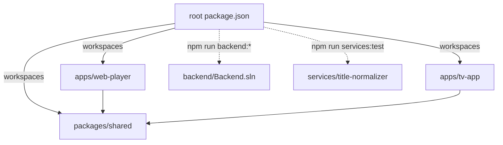
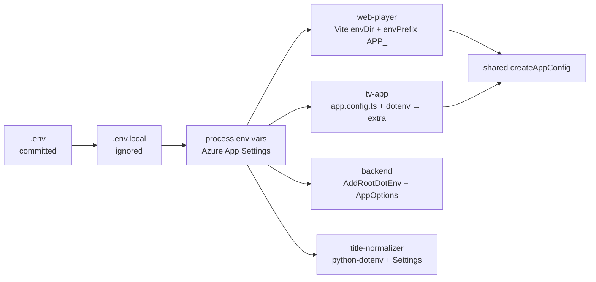
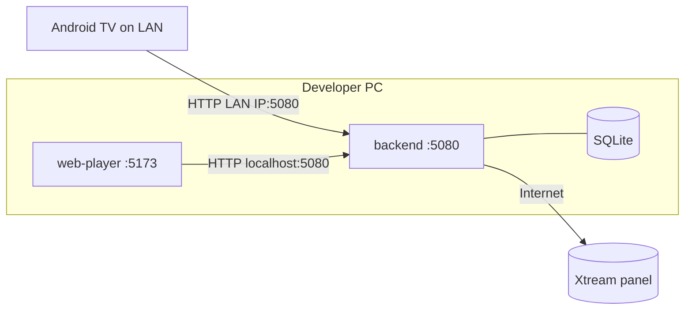
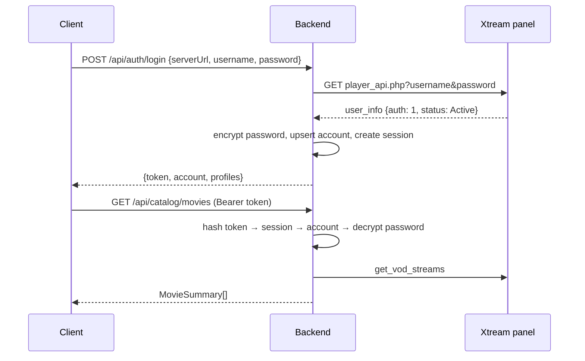
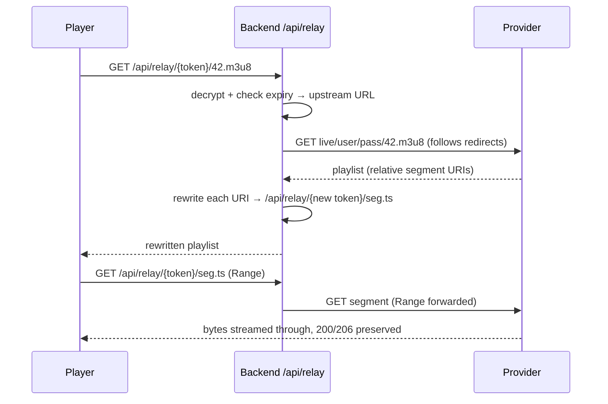
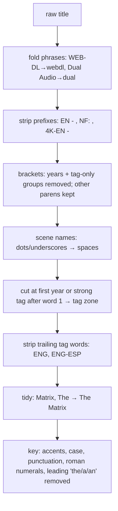
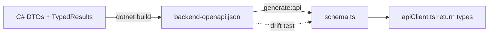
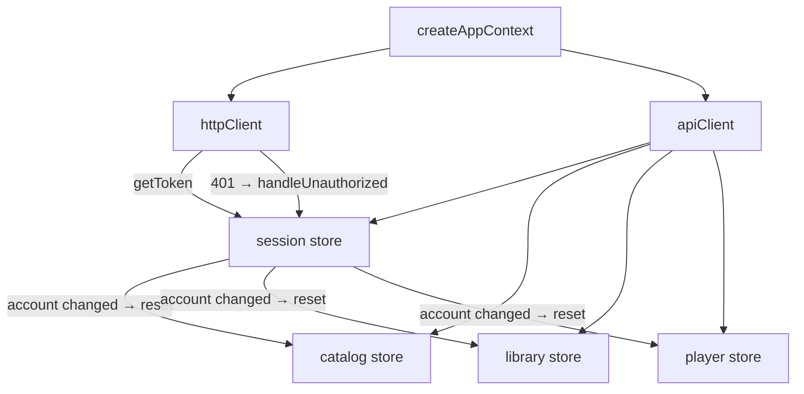
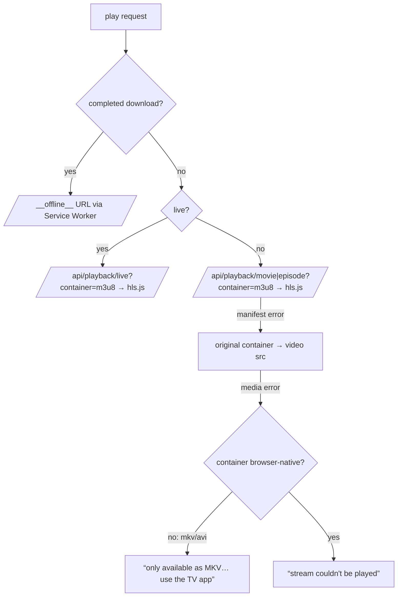
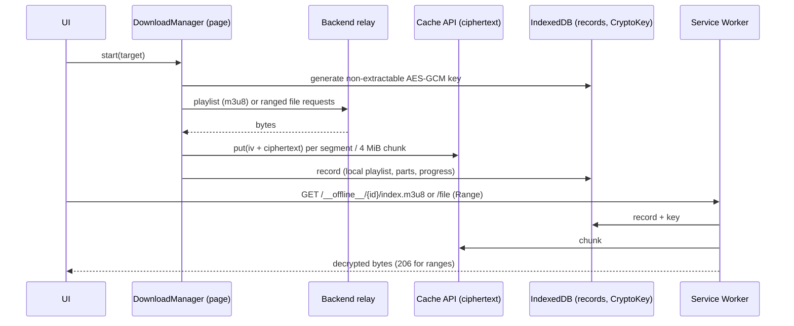

# Decisions

Log of architectural, structural and feature decisions. Newest entries at the bottom.
Code comments reference entries as `DECISIONS.md#d-XXX`.

| ID | Date | Title |
|----|------|-------|
| [D-001](#d-001) | 2026-09-23 | Monorepo: npm workspaces + Turborepo |
| [D-002](#d-002) | 2026-09-23 | Folder layout and README rules |
| [D-003](#d-003) | 2026-09-23 | Central config via root `.env` |
| [D-004](#d-004) | 2026-09-23 | Frontend toolchain versions |
| [D-005](#d-005) | 2026-09-23 | TV app: Expo + react-native-tvos |
| [D-006](#d-006) | 2026-09-23 | Backend: .NET 8, layered projects |
| [D-007](#d-007) | 2026-09-23 | Shared package ships TypeScript source |
| [D-008](#d-008) | 2026-09-23 | Python service: Azure Functions v2 model, pure core package |
| [D-009](#d-009) | 2026-09-23 | Backend on .NET 10 LTS (supersedes D-006 runtime choice) |
| [D-010](#d-010) | 2026-09-23 | Local-only deployment for phase 1 |
| [D-011](#d-011) | 2026-09-23 | `IMediaProvider` + `XtreamCodesProvider` design |
| [D-012](#d-012) | 2026-09-23 | Authentication proxy: upstream-validated login, opaque sessions |
| [D-013](#d-013) | 2026-09-23 | Stream delivery: backend relay by default |
| [D-014](#d-014) | 2026-09-23 | Persistence: SQLite + EF Core migrations |
| [D-015](#d-015) | 2026-09-23 | Catalog cache: in-memory, per account |
| [D-016](#d-016) | 2026-09-23 | SQLite job queue + shared `pipeline.db` |
| [D-017](#d-017) | 2026-09-23 | Title normalizer: regex parsing + guarded fuzzy grouping |
| [D-018](#d-018) | 2026-09-23 | Python worker runs as a CLI poller locally |
| [D-019](#d-019) | 2026-09-23 | `DATA_DIR` shared key, paths relative to repo root |
| [D-020](#d-020) | 2026-09-23 | API contract: OpenAPI export at build → generated TypeScript types |
| [D-021](#d-021) | 2026-09-23 | Shared client + vanilla Zustand stores behind one app context |
| [D-022](#d-022) | 2026-09-23 | Session persistence per platform |
| [D-023](#d-023) | 2026-09-23 | Web playback engine: HLS first, file fallback, on-demand frame previews |
| [D-024](#d-024) | 2026-09-23 | Web offline downloads: Service Worker + AES-GCM chunks |
| [D-025](#d-025) | 2026-09-23 | Web UI architecture |
| [D-026](#d-026) | 2026-09-23 | Watch progress stored per profile on the backend |
| [D-027](#d-027) | 2026-09-23 | Fake Xtream panel + end-to-end tests |

---

## D-001

**Monorepo: npm workspaces + Turborepo** — 2026-09-23

Decision: npm workspaces for `apps/*` and `packages/*`. Turborepo runs `build`, `typecheck`, `test`, `dev` across them. `backend/` and `services/` are not npm workspaces; root scripts call `dotnet` and `pytest` directly.

Why:
- npm ships with Node. No extra package manager to install for juniors or CI.
- Expo (SDK 52+) detects npm workspaces and configures Metro automatically. pnpm's symlinked layout needs extra Metro config.
- Turborepo adds task caching and dependency-ordered runs with one small `turbo.json`.
- Wrapping .NET/Python in fake `package.json` files adds indirection with no caching benefit.



## D-002

**Folder layout and README rules** — 2026-09-23

Decision: layout follows the task spec (`apps/`, `packages/`, `backend/`, `services/`, `documentation/`). Every folder has a `README.md` with facts only, except:
- `documentation/`: spec requires exactly three files there. That rule wins.
- Generated/tool folders (`node_modules`, `bin`, `obj`, `dist`, `.venv`, `android`).

Why: explicit spec rule for `documentation/` is more specific than the general README rule.

## D-003

**Central config via root `.env`** — 2026-09-23

Decision: one committed root `.env` holds public, non-secret settings (`APP_NAME`, `APP_SLUG`, `APP_ANDROID_PACKAGE`, `APP_API_BASE_URL`). `.env.local` (git-ignored) overrides it. Real environment variables override both. No code contains a fallback app name; every consumer fails fast when a key is missing.

Why:
- App name is undecided. Renaming must be a one-line change.
- `.env` is the only format all four runtimes read natively or with a tiny loader.
- Committing `.env` lets CI and fresh clones build with zero setup. Secrets never go in it.
- Azure (App Service, Functions, Static Web Apps build) injects App Settings as env vars, which already win.



Per consumer:

| Consumer | Loader | Notes |
|----------|--------|-------|
| web-player | Vite `envDir` = repo root, `envPrefix` includes `APP_` | `index.html` uses `%APP_NAME%`. Values are public in the bundle by design. |
| tv-app | `dotenv` in `app.config.ts` | Sets Expo `name`, `slug`, `android.package`, and `extra`. |
| backend | `AddRootDotEnv()` walks up from content root | Re-adds env vars after `.env` so they win. `ValidateOnStart` stops boot on missing keys. |
| title-normalizer | `python-dotenv`, `override=False` | Loads `.env.local` before `.env`; first value set wins. |

Only `APP_`-prefixed keys reach the web bundle. Never put secrets under `APP_`.

## D-004

**Frontend toolchain versions** — 2026-09-23

Decision:
- React `19.2.3` pinned exactly in both apps.
- TypeScript `~5.9.3` everywhere.
- Vite 8 + `@vitejs/plugin-react` 6. Vitest 5 for `packages/shared`.

Why:
- Expo SDK 57 requires React 19.2.3. Web uses the same version so npm hoists one React copy. Two copies break hooks.
- TypeScript 7 (native port) is current, but Expo and editor tooling rely on the 5.x JS compiler API. 5.9 is the safe choice until the ecosystem confirms 7.x support.

## D-005

**TV app: Expo + react-native-tvos** — 2026-09-23

Decision: Expo SDK 57 with `react-native` aliased to `react-native-tvos@0.86.3-0`. Plugin `@react-native-tvos/config-tv` with `isTV: true` adds the Android TV manifest (leanback launcher, no touchscreen requirement). Platform list is `android` only.

Why:
- Core React Native removed TV support. `react-native-tvos` is the maintained fork and provides `TVEventHandler`, `hasTVPreferredFocus`, focus events.
- Expo gives config plugins, prebuild and native module tooling needed later for ExoPlayer `DownloadManager`.
- Fork version must match the Expo SDK's React Native minor (SDK 57 → RN 0.86).

Supporting settings:
- Root `package.json` `overrides.react-native` forces the fork everywhere. Without it, `@react-native-tvos/virtualized-lists` pulled a second, upstream `react-native@0.86.3`.
- `expo.install.exclude: ["react-native"]` stops `expo install` from "fixing" the alias back to upstream.

## D-006

**Backend: .NET 8, layered projects** — 2026-09-23

> Runtime choice superseded by [D-009](#d-009). Layering still applies, extended by `Backend.Infrastructure` (D-011).

Decision: ASP.NET Core minimal API on `net8.0`. Projects: `Backend.Api` (host), `Backend.Core` (config, domain, interfaces), `Backend.Tests` (xUnit + `WebApplicationFactory`). Central package versions in `Directory.Packages.props`. Warnings are errors.

Why:
- Spec allows .NET 8 or 9. The .NET 9 SDK download host is blocked in the build sandbox; .NET 8 is available from Ubuntu packages, so it can be compiled and tested here.
- Both 8 and 9 reach end of support on 2026-11-10. Migration to .NET 10 (LTS) is tracked in `NEXT-STEPS.md` and `KNOWN-ISSUES.md`.
- Project names use `Backend.*`, not a product name, because `APP_NAME` is undecided.
- `Backend.Core` has no endpoint code, so providers (`IMediaProvider`) can be reused by future workers and tested without HTTP.

## D-007

**Shared package ships TypeScript source** — 2026-09-23

Decision: `@iptv/shared` exports `src/index.ts` directly. No build step.

Why: Vite and Metro both compile workspace TypeScript. Skipping a build removes watch processes and stale `dist` bugs. Constraint: shared code must avoid DOM and React Native imports.

## D-008

**Python service: Azure Functions v2 model, pure core package** — 2026-09-23

Decision: `services/title-normalizer` uses the Python v2 decorator model (`function_app.py`). Logic lives in `title_normalizer/`, which never imports `azure.functions`.

Why: pure modules unit-test with plain `pytest`, no Functions host or Azurite. `function_app.py` stays a thin binding layer (HTTP now, queue trigger in Step 3).

## D-009

**Backend on .NET 10 LTS (supersedes D-006 runtime choice)** — 2026-09-23

Decision: all backend projects target `net10.0`. `global.json` pins SDK `10.0.100` with `latestFeature` roll-forward. Microsoft packages use `10.0.x`.

Why:
- .NET 8 and 9 leave support on 2026-11-10. .NET 10 is LTS (support until Nov 2028).
- The .NET 10 SDK is installable from Ubuntu packages in the build sandbox, so builds and tests are verified.
- Upgrade cost was zero: only target framework and package versions changed.

## D-010

**Local-only deployment for phase 1** — 2026-09-23

Decision: every component runs on the developer's machine. No Azure resources yet. Azure targets from the brief (Static Web Apps, App Service, Functions, Azure SQL/Cosmos) stay as the future direction.

Consequences:
- Database is a local SQLite file (D-014), not Azure SQL/Cosmos.
- Relay bandwidth costs nothing (D-013).
- The API listens on all interfaces (`0.0.0.0:5080`) so an Android TV device on the same LAN can reach it. Set `APP_API_BASE_URL` in `.env.local` to the PC's LAN IP for the TV build.
- Traffic is plain HTTP on the LAN. Accepted for phase 1 (KI-009).



## D-011

**`IMediaProvider` + `XtreamCodesProvider` design** — 2026-09-23

Decision:
- `IMediaProvider` (in `Backend.Core`) is stateless. Every call receives `ProviderCredentials`. One singleton-style typed `HttpClient` instance serves all accounts.
- `IMediaProviderResolver` picks the implementation by the `ProviderType` string stored on each account (`xtream` today). New sources (M3U, Stalker) add a class, not new endpoints.
- Return types are provider-agnostic records (`Backend.Core.Media`). Clients never see Xtream field names.
- `BuildPlaybackSource` is pure (no network). It returns the upstream URL; `PlaybackService` decides relay vs. direct.
- Xtream JSON is parsed with `JsonDocument` + lenient readers (`LooseJson`), not strict DTOs.

Why lenient parsing: panels return the same field as `"55"`, `55`, `null` or `""`; `info` can be `{}` or `[]`; `episodes` can be an object keyed by season or an array of arrays; `backdrop_path` can be a string or an array. Strict deserialization fails on the first mismatch and takes a whole catalog down.

Other rules:
- Server URL normalization accepts `host:port`, strips `player_api.php`/`get.php`, and keeps any sub-path. Canonical form is stored, so the same login from different spellings maps to one account.
- Container extensions from clients are sanitized (letters/digits, max 8 chars) before entering URLs.
- Live streams prefer `m3u8`; fall back to `ts` when the account's `allowed_output_formats` excludes HLS.
- Errors: HTTP 401/403 or `auth: 0` → `ProviderAuthenticationException`; network, non-2xx, invalid JSON → `ProviderUnavailableException`.

## D-012

**Authentication proxy: upstream-validated login, opaque sessions** — 2026-09-23

Decision:
1. Client sends Xtream server URL, username, password once to `POST /api/auth/login`.
2. Backend validates them server-to-server (`player_api.php`). Rejects inactive/expired accounts.
3. Backend stores the account; password encrypted with ASP.NET Core Data Protection (key ring in `DATA_DIR/keys`).
4. Backend returns a random 256-bit opaque bearer token. Only its SHA-256 hash is stored.
5. First login creates one default profile named after the username.



Why:
- Provider credentials never live on clients after login. A stolen TV device leaks a revocable token, not the IPTV subscription.
- Opaque tokens over JWT: revocation is one row delete; no signing-key management; the API is the only token consumer.
- Data Protection handles key generation, rotation and authenticated encryption. Application name is fixed to `backend` so renaming `APP_NAME`/`APP_SLUG` never makes stored passwords unreadable.
- Profiles belong to the account, not the session, so every device sees the same "Who's watching?" list.

## D-013

**Stream delivery: backend relay by default** — 2026-09-23

Decision: `BACKEND_STREAM_DELIVERY=relay` (default). `/api/playback/...` returns a relay URL. `direct` mode returns the upstream URL and stays available as a switch.

Options compared:

| | Relay (via backend) | Direct (client → provider) |
|---|---|---|
| Credentials exposure | Hidden. Relay URLs carry an encrypted, expiring token. | Username + password are in the stream URL path on every client. |
| Browser CORS | Solved. Backend sends CORS headers. | Most Xtream panels send none → hls.js cannot fetch playlists/segments. |
| Mixed content | Solved once backend has HTTPS. | HTTP-only panels blocked on HTTPS pages. |
| Web offline caching (Service Worker) | Works: same-origin/CORS responses are readable and cacheable. | Opaque cross-origin responses cannot be inspected or reliably cached. |
| Latency | +1 hop (LAN: negligible). | Lowest. |
| Bandwidth / cost | All video passes through the backend host. Local: free. Cloud: paid egress. | None on our side. |
| Availability | PC must be on and reachable. | Only provider needed. |
| Provider connection limits | Unchanged: one client stream = one upstream stream. | Same. |
| Provider IP blocking | Provider sees the PC's home IP (fine). In cloud, datacenter IPs may be blocked. | Provider sees each client IP. |

Why relay: in local-only phase 1 (D-010) its main cost (bandwidth) is zero, and it is required for web playback (CORS) and web offline caching. The TV app needs the backend for login and catalog anyway, so "PC must be on" adds no new dependency. Revisit when moving to cloud: likely hybrid (web relayed, TV direct via short-lived URLs).

How the relay works:



Rules:
- Tokens are Data Protection time-limited payloads (`BACKEND_RELAY_TOKEN_HOURS`). Clients cannot forge a URL, so the relay cannot be used as an open proxy (SSRF-safe).
- Playlist detection: `mpegurl` content type or `.m3u8` path; max 5 MB.
- Relative URIs resolve against the final URL after redirects (Xtream panels often redirect to a load-balancer host).
- The relay `HttpClient` has no timeout (live streams are endless) and its request logs are silenced because upstream paths contain credentials.

## D-014

**Persistence: SQLite + EF Core migrations** — 2026-09-23

Decision: EF Core 10 with SQLite at `DATA_DIR/app.db`. Migrations live in `Backend.Infrastructure/Persistence/Migrations` and run automatically on startup. `dotnet-ef` is a local tool (`backend/dotnet-tools.json`).

Why:
- Local-only (D-010): no database server to install.
- EF Core keeps the path to Azure SQL open: swap `UseSqlite` for `UseSqlServer` and regenerate migrations.
- `DateTimeOffset` is stored as UTC ticks (`long`) because SQLite cannot compare or sort `DateTimeOffset` natively.

## D-015

**Catalog cache: in-memory, per account** — 2026-09-23

Decision: `CatalogService` caches provider responses in `IMemoryCache` for `BACKEND_CATALOG_CACHE_MINUTES` (default 15), keyed by account + request.

Why: Xtream `get_vod_streams` without a category can return tens of thousands of items and take seconds. In-memory is enough for a single local process. Durable metadata storage belongs to Step 3 (master media objects).

## D-016

**SQLite job queue + shared `pipeline.db`** — 2026-09-23

Decision (owner-approved): the queue between backend and Python is a table in a second SQLite file, `DATA_DIR/pipeline.db`. The same file holds the output (`master_media`, `media_variants`). `app.db` (accounts, encrypted passwords) stays backend-only.

```mermaid
sequenceDiagram
  participant A as Backend
  participant Q as pipeline.db
  participant W as Python worker
  A->>A: login / POST /api/library/sync
  A->>A: fetch get_vod_streams + get_series (background)
  A->>Q: INSERT job (pending, payload JSON) or replace pending payload
  loop every 5 s
    W->>Q: UPDATE ... SET processing WHERE id = oldest pending RETURNING
  end
  W->>W: parse + group
  W->>Q: BEGIN IMMEDIATE; replace masters/variants; job = done; COMMIT
  A->>Q: SELECT masters for /api/library
```

Why:
- Local-only (D-010): no Azurite, Redis or broker to install. SQLite is already used.
- Separate file: the Python process never opens the database holding credentials. Large payloads and bulk rewrites do not bloat or lock `app.db`.
- One schema owner: EF Core (`PipelineDbContext`) creates and migrates `pipeline.db`. Python only reads/writes rows. Two writers of DDL would drift.
- Contract enforcement: `pipeline-schema.sql` is generated from the EF model and committed. A backend test fails if it is stale; Python tests build their database from it. A column rename breaks Python tests immediately, not at runtime.
- snake_case names and Unix-second integer timestamps: natural in Python/SQL, no `DateTimeOffset` text parsing.

Queue rules:
- Claim is a single `UPDATE ... RETURNING` statement: atomic, safe with several workers.
- One pending job per account + kind: a newer sync replaces the pending payload instead of stacking jobs.
- Retries: failure → `pending` until 3 attempts → `failed`. Jobs stuck in `processing` for 10 min (crashed worker) are requeued.
- Output is a full snapshot per account + kind, replaced in one transaction. Readers never see a half-written library.
- Processed payloads are cleared (`[]`) to keep the file small.
- Both processes use WAL mode + 30 s busy timeout, so API reads continue while the worker writes.

## D-017

**Title normalizer: regex parsing + guarded fuzzy grouping** — 2026-09-23

Decision: rule-based parsing (regex + vocabularies in `tags.py`) and `rapidfuzz` string similarity. No ML/NLP model.

Why: IPTV titles follow a small set of conventions (language prefixes, bracket tags, scene names). Rules are fast, deterministic, debuggable by juniors, and each failure becomes a test case. A model would add a large dependency and non-deterministic output for little gain.

Parsing steps (`parser.parse_title`):



False-positive guards:
- Two-letter language codes (`IT`, `US`, `DE`) count only inside prefixes/brackets or when uppercase. "It (2017)" and "Us (2019)" keep their titles.
- Prefixes must be uppercase or contain a digit, and every token must be a known tag.
- The first word is never cut ("2001: A Space Odyssey", "1917"). Years outside 1900..next year are title words ("Blade Runner 2049").
- `US`/`UK` are not languages: "The Office (US)" and "The Office (UK)" stay distinct.

Grouping (`matching.group_titles`), in order:
1. Exact: same compact key (spaces removed) + same year. "Spider-Man" = "Spiderman".
2. Year-less join: a title without year joins the dated group with the same key only if exactly one exists. "Dune" with both 1984 and 2021 present stays separate.
3. Fuzzy: `fuzz.ratio ≥ 90` on compact keys within blocks sharing the first 4 characters. Requires equal years, equal number tokens (sequels: "Toy Story 2" ≠ "Toy Story 3"), and exact match for keys shorter than 6 characters ("Up" ≠ "Us").

Rule 3 requires equal years because a year-less title matching two dated titles would chain remakes into one group (found by test, 2026-09-23).

Master output:
- `id` = SHA-1 of account + kind + compact key + year (first 20 hex chars). Stable across re-syncs while the group's canonical key/year are unchanged.
- Display title: most frequent spelling in the group.
- Variants ordered by `quality_score` (resolution rank + source adjustment: CAM −300 … REMUX +30, HDR +5). Label example: `4K · HDR · ENG · DUAL`. Duplicate labels get `(2)`, `(3)`.

Performance (2026-09-23, sandbox CPU): ~50,000 items → ~22,000 masters in 4.6 s.

## D-018

**Python worker runs as a CLI poller locally** — 2026-09-23

Decision: `python -m title_normalizer` polls `pipeline.db` every 5 s. `function_app.py` keeps only the health route; no Functions trigger reads the SQLite queue.

Why: Azure Functions needs Core Tools + a storage emulator locally, and SQLite is not a supported trigger source. A plain loop is simpler to run and debug. Cloud move: swap the SQLite queue for an Azure Storage Queue trigger that calls the same `build_masters()`; the engine modules do not change (D-008).

## D-019

**`DATA_DIR` shared key, paths relative to repo root** — 2026-09-23

Decision: `BACKEND_DATA_DIR` is renamed `DATA_DIR`. Relative values resolve against the directory containing `.env` (repo root) in both backend and Python. Default: `<repo>/.data`.

Why: backend and worker must open the same `pipeline.db`. One key and one resolution rule removes a class of "worker looks in the wrong folder" bugs. The backend exposes the `.env` directory internally as `DOTENV_DIRECTORY`.

## D-020

**API contract: OpenAPI export at build → generated TypeScript types** — 2026-09-23

Decision:
- `Microsoft.Extensions.ApiDescription.Server` writes `packages/shared/openapi/backend-openapi.json` on every backend build.
- `openapi-typescript` turns it into `packages/shared/src/api/generated/schema.ts` (`npm run generate:api`). Both files are committed.
- The hand-written API client takes its return types from generated `operations` (`OperationResult<'listLibrary'>`). Renaming an operation or changing a DTO breaks the TypeScript build.
- A Vitest test regenerates the types in memory and fails if the committed file differs.



Backend changes needed for an accurate document:
- All endpoints return `TypedResults` / `Results<...>` so response bodies and status codes are documented. `.WithName()` sets stable operation ids.
- `JsonNumberHandling.Strict`: ASP.NET's default accepts numbers as strings, which made every number `integer | string` in the schema.
- `RequiredPropertiesSchemaTransformer`: System.Text.Json always writes every property (nulls included), so response properties are `required` (nullable ones stay `| null`). Request types (`*Request`) keep nullable properties optional so callers can omit them. Without this, every generated field would be optional (`?`).
- The build starts the app to export the document. `Program.cs` detects this (`GetDocument.Insider` entry assembly), uses a temp `DATA_DIR`, and skips migrations, so builds never touch real data.
- The relay endpoint is excluded from the document: players call it via URLs from `/api/playback`, never the client.

Why a hand-written client over a generated one (e.g. `openapi-fetch`): about 20 small functions that juniors can read, no `Request` object dependency (React Native's fetch polyfill differs from browsers), and friendly method names. Types still come from the contract.

## D-021

**Shared client + vanilla Zustand stores behind one app context** — 2026-09-23

Decision: `createAppContext({ config, storage, fetch? })` builds one HTTP client, one API client and four stores (`session`, `catalog`, `library`, `player`). Stores use `zustand/vanilla`; React reads them with `useAppStore(store, selector)`.



Why:
- Vanilla stores work outside React (tests, service workers, native modules later) and bind to React with one hook.
- Dependencies are injected (`storage`, `fetch`), so tests run the real stores against a fake backend with no mocking library.
- One factory per app means one place to wire cross-store rules: any 401 signs out; an account change clears account-scoped caches.

Store rules:
- Remote data lives in `Resource<T>` records (`data`, `status`, `error`, `updatedAt`) keyed by query. `createResourceLoader` returns cached data unless `force`, and shares one request between concurrent callers.
- Each loader has a generation counter. `reset()` bumps it, so a request still in flight when the user signs out cannot write stale data into the cleared store (found by test, 2026-09-23).
- Player `open()` ignores responses from older calls (fast channel zapping).
- Errors are stored, not thrown. UI reads `error.code` (`ApiErrorCode`).
- Library page size defaults to 100; the chosen variant per master lives in `selectedVariants` (missing = best variant, which the backend lists first).
- Login auto-selects the profile when the account has exactly one; otherwise UI shows the picker.

## D-022

**Session persistence per platform** — 2026-09-23

Decision: the session store persists one JSON snapshot (`token`, `account`, `profiles`, `activeProfileId`) through a `KeyValueStorage` adapter.

| Platform | Adapter | Protection |
|----------|---------|------------|
| Web | `localStorage`, key `<APP_SLUG>:session` | Readable by any script on the origin (XSS). |
| TV | `expo-secure-store` | Encrypted with an Android Keystore key. |

Why:
- Caching account + profiles lets the app start with the profile picker even when the backend is unreachable (`offline = true`), needed later for offline downloads.
- `restore()` re-validates the token (`/api/auth/me` + `/api/profiles`) whenever the backend answers; 401 clears everything.
- Persistence is manual (not Zustand `persist` middleware): explicit writes after each change are easier to follow and test with async storage.
- Web alternative (HttpOnly cookie) needs CSRF protection and same-site hosting; deferred while local-only (KI-017).

## D-023

**Web playback engine: HLS first, file fallback, on-demand frame previews** — 2026-09-23

Decision (owner-approved recommendation for KI-010): `PlaybackEngine` tries sources in order and stops at the first that loads.



Why:
- Many Xtream panels transmux VOD to HLS on request (`/movie/u/p/{id}.m3u8`). HLS in hls.js plays MKV sources in any browser with no backend transcoding.
- If the panel has no HLS, MP4-family files still play natively; MKV/AVI get an honest explanation instead of a frozen player.
- hls.js fatal errors after start: network → `startLoad()`, media → `recoverMediaError()` (twice), then an error message.

Timeline frame previews: providers ship no trickplay sprites. `FrameGrabber` creates a hidden, muted second `<video>` (HLS at the lowest rendition, 4 s buffer) only on first timeline hover, seeks it to the hovered time (coalescing requests) and draws the frame into a canvas. Costs one extra stream connection while previewing (KI-020).

Other rules:
- Skip Intro: providers give no markers. Heuristic window 5–90 s on episodes ≥ 10 min (`INTRO_WINDOW` in `@iptv/shared`) (KI-019).
- Next-up: countdown card during the last 10 s; auto-plays the next episode on `ended` unless cancelled. Order: season, then episode number.
- Progress saved every 10 s while playing, on pause, on close, on version/episode switch.
- The player (and hls.js, ~500 kB) is a lazily loaded chunk; the initial bundle is ~255 kB.

## D-024

**Web offline downloads: Service Worker + AES-GCM chunks** — 2026-09-23

Decision: downloads are fetched by a page-side `DownloadManager`, encrypted per chunk, stored in the Cache API, and served back only through the Service Worker under `/__offline__/`.



Why:
- Meets the brief: no `.mp4`/`.mkv` is ever written to the user's filesystem; data lives inside the browser's origin storage.
- AES-GCM with a non-extractable key: copying the cache contents off the machine yields ciphertext, and GCM detects tampering. It is not DRM: scripts on the origin (and DevTools) can still use the key through the SW (KI-002).
- HLS downloads store every playlist resource (segments, init maps, AES keys) and a rewritten local playlist, so hls.js plays offline exactly as online. Files are stored as 4 MiB chunks; the SW answers `Range` requests one chunk at a time (low memory).
- One download at a time: each download holds a provider connection (`max_connections`).
- Resumable: existing chunks are skipped; a changed upstream playlist restarts cleanly. Interrupted downloads come back paused.
- The SW also caches the built app shell (precache list injected at build), so the app opens offline and routes to My Downloads.
- The SW is bundled separately by a small Vite plugin using esbuild (classic script, works in all browsers; `/sw.js` in dev and build). Chosen over `vite-plugin-pwa` to avoid Workbox for ~5 kB of code.

## D-025

**Web UI architecture** — 2026-09-23

Decisions:
- **Navigation:** a small Zustand `uiStore` (view, search, details, playing) mirrored into `history.pushState`, not a router library. Browser Back closes the player, then the modal, then returns to the previous view. No shareable URLs yet (KI-023).
- **Data:** shared stores for everything account-scoped; `useAsync` (module cache) for one-off reads (movie metadata, series episodes).
- **Rows** load when scrolled within 400 px of the viewport (IntersectionObserver).
- **Hero trailer:** muted `youtube-nocookie.com` embed faded in after 3 s when the provider supplies a trailer id; backdrop image otherwise (owner-approved).
- **Library re-processing:** `LibraryBanner` polls status while the library is empty or processing. When that ends it calls `library.invalidate()` (keeps version choices) and bumps `libraryRevision`; mounted views reload. Polling while *empty* matters: right after the first login the sync job may not exist yet (found by e2e, 2026-09-23).
- **Selectors:** `useAppStore` wraps selectors in `useShallow`. Zustand 5 otherwise loops forever when a selector returns a new array (`?? []`), which crashed the first build (React error #185).
- Plain CSS with tokens in four files; no CSS framework.

## D-026

**Watch progress stored per profile on the backend** — 2026-09-23

Decision: `WatchProgress` table in `app.db` (profile, kind, provider stream id, position, duration, display fields). Endpoints under `/api/profiles/{id}/progress`. Clients save optimistically.

Why: "Continue Watching" must follow the profile across web and TV. Display fields (title, poster, series/season/episode) are copied into the row so the row renders without extra catalog calls. Items are keyed by provider stream id (what playback needs), with `masterId`/`seriesId` for grouping; Continue Watching shows one entry per series (latest episode). Completion: ≥ 95 % or < 2 min left on titles over 10 min.

## D-027

**Fake Xtream panel + end-to-end tests** — 2026-09-23

Decision: `tools/fake-xtream-server` (Python stdlib) emulates a panel: catalog with duplicates/sequels/MKV-only/series/live, 302 redirects to media (like real load balancers), HTTP Range, a sliding live window, SVG artwork. `generate_media.py` builds VP9/Opus test media with ffmpeg. Playwright tests (`apps/web-player/e2e`) start panel + backend (temp `DATA_DIR`) + worker + production web build on separate ports and drive a real browser.

Why:
- The whole chain (provider → relay → dedup worker → UI → hls.js → Service Worker) only fails in integration; unit tests missed three bugs the e2e run caught (render loop, stale details after re-processing, empty library after first login).
- VP9 plays in every Chromium build, including Playwright's (no proprietary codecs).
- Also a demo target: anyone can try the app without an IPTV subscription.
