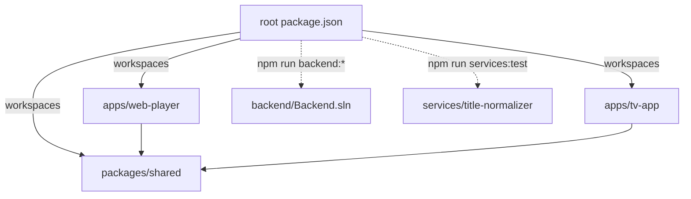
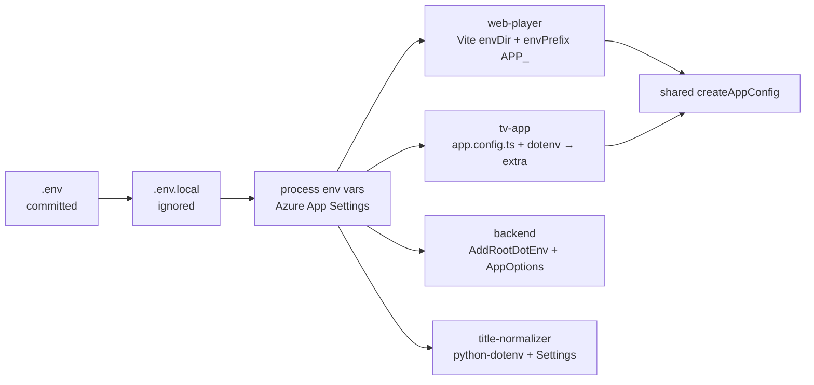

# Decisions

Log of architectural, structural and feature decisions. Newest entries at the bottom.
Code comments reference entries as `DECISIONS.md#d-XXX`.

| ID | Date | Title |
|----|------|-------|
| [D-001](#d-001) | 2026-09-23 | Monorepo: npm workspaces + Turborepo |
| [D-002](#d-002) | 2026-09-23 | Folder layout and README rules |
| [D-003](#d-003) | 2026-09-23 | Central config via root `.env` |
| [D-004](#d-004) | 2026-09-23 | Frontend toolchain versions |
| [D-005](#d-005) | 2026-09-23 | TV app: Expo + react-native-tvos |
| [D-006](#d-006) | 2026-09-23 | Backend: .NET 8, layered projects |
| [D-007](#d-007) | 2026-09-23 | Shared package ships TypeScript source |
| [D-008](#d-008) | 2026-09-23 | Python service: Azure Functions v2 model, pure core package |

---

## D-001

**Monorepo: npm workspaces + Turborepo** — 2026-09-23

Decision: npm workspaces for `apps/*` and `packages/*`. Turborepo runs `build`, `typecheck`, `test`, `dev` across them. `backend/` and `services/` are not npm workspaces; root scripts call `dotnet` and `pytest` directly.

Why:
- npm ships with Node. No extra package manager to install for juniors or CI.
- Expo (SDK 52+) detects npm workspaces and configures Metro automatically. pnpm's symlinked layout needs extra Metro config.
- Turborepo adds task caching and dependency-ordered runs with one small `turbo.json`.
- Wrapping .NET/Python in fake `package.json` files adds indirection with no caching benefit.

## D-002

**Folder layout and README rules** — 2026-09-23

Decision: layout follows the task spec (`apps/`, `packages/`, `backend/`, `services/`, `documentation/`). Every folder has a `README.md` with facts only, except:
- `documentation/`: spec requires exactly three files there. That rule wins.
- Generated/tool folders (`node_modules`, `bin`, `obj`, `dist`, `.venv`, `android`).

Why: explicit spec rule for `documentation/` is more specific than the general README rule.

## D-003

**Central config via root `.env`** — 2026-09-23

Decision: one committed root `.env` holds public, non-secret settings (`APP_NAME`, `APP_SLUG`, `APP_ANDROID_PACKAGE`, `APP_API_BASE_URL`). `.env.local` (git-ignored) overrides it. Real environment variables override both. No code contains a fallback app name; every consumer fails fast when a key is missing.

Why:
- App name is undecided. Renaming must be a one-line change.
- `.env` is the only format all four runtimes read natively or with a tiny loader.
- Committing `.env` lets CI and fresh clones build with zero setup. Secrets never go in it.
- Azure (App Service, Functions, Static Web Apps build) injects App Settings as env vars, which already win.

Per consumer:

| Consumer | Loader | Notes |
|----------|--------|-------|
| web-player | Vite `envDir` = repo root, `envPrefix` includes `APP_` | `index.html` uses `%APP_NAME%`. Values are public in the bundle by design. |
| tv-app | `dotenv` in `app.config.ts` | Sets Expo `name`, `slug`, `android.package`, and `extra`. |
| backend | `AddRootDotEnv()` walks up from content root | Re-adds env vars after `.env` so they win. `ValidateOnStart` stops boot on missing keys. |
| title-normalizer | `python-dotenv`, `override=False` | Loads `.env.local` before `.env`; first value set wins. |

Only `APP_`-prefixed keys reach the web bundle. Never put secrets under `APP_`.

## D-004

**Frontend toolchain versions** — 2026-09-23

Decision:
- React `19.2.3` pinned exactly in both apps.
- TypeScript `~5.9.3` everywhere.
- Vite 8 + `@vitejs/plugin-react` 6. Vitest 5 for `packages/shared`.

Why:
- Expo SDK 57 requires React 19.2.3. Web uses the same version so npm hoists one React copy. Two copies break hooks.
- TypeScript 7 (native port) is current, but Expo and editor tooling rely on the 5.x JS compiler API. 5.9 is the safe choice until the ecosystem confirms 7.x support.

## D-005

**TV app: Expo + react-native-tvos** — 2026-09-23

Decision: Expo SDK 57 with `react-native` aliased to `react-native-tvos@0.86.3-0`. Plugin `@react-native-tvos/config-tv` with `isTV: true` adds the Android TV manifest (leanback launcher, no touchscreen requirement). Platform list is `android` only.

Why:
- Core React Native removed TV support. `react-native-tvos` is the maintained fork and provides `TVEventHandler`, `hasTVPreferredFocus`, focus events.
- Expo gives config plugins, prebuild and native module tooling needed later for ExoPlayer `DownloadManager`.
- Fork version must match the Expo SDK's React Native minor (SDK 57 → RN 0.86).

Supporting settings:
- Root `package.json` `overrides.react-native` forces the fork everywhere. Without it, `@react-native-tvos/virtualized-lists` pulled a second, upstream `react-native@0.86.3`.
- `expo.install.exclude: ["react-native"]` stops `expo install` from "fixing" the alias back to upstream.

## D-006

**Backend: .NET 8, layered projects** — 2026-09-23

Decision: ASP.NET Core minimal API on `net8.0`. Projects: `Backend.Api` (host), `Backend.Core` (config, domain, interfaces), `Backend.Tests` (xUnit + `WebApplicationFactory`). Central package versions in `Directory.Packages.props`. Warnings are errors.

Why:
- Spec allows .NET 8 or 9. The .NET 9 SDK download host is blocked in the build sandbox; .NET 8 is available from Ubuntu packages, so it can be compiled and tested here.
- Both 8 and 9 reach end of support on 2026-11-10. Migration to .NET 10 (LTS) is tracked in `NEXT-STEPS.md` and `KNOWN-ISSUES.md`.
- Project names use `Backend.*`, not a product name, because `APP_NAME` is undecided.
- `Backend.Core` has no endpoint code, so providers (`IMediaProvider`) can be reused by future workers and tested without HTTP.

## D-007

**Shared package ships TypeScript source** — 2026-09-23

Decision: `@iptv/shared` exports `src/index.ts` directly. No build step.

Why: Vite and Metro both compile workspace TypeScript. Skipping a build removes watch processes and stale `dist` bugs. Constraint: shared code must avoid DOM and React Native imports.

## D-008

**Python service: Azure Functions v2 model, pure core package** — 2026-09-23

Decision: `services/title-normalizer` uses the Python v2 decorator model (`function_app.py`). Logic lives in `title_normalizer/`, which never imports `azure.functions`.

Why: pure modules unit-test with plain `pytest`, no Functions host or Azurite. `function_app.py` stays a thin binding layer (HTTP now, queue trigger in Step 3).
