# Decisions

Log of architectural, structural and feature decisions. Newest entries at the bottom.
Code comments reference entries as `DECISIONS.md#d-XXX`.

| ID | Date | Title |
|----|------|-------|
| [D-001](#d-001) | 2026-09-23 | Monorepo: npm workspaces + Turborepo |
| [D-002](#d-002) | 2026-09-23 | Folder layout and README rules |
| [D-003](#d-003) | 2026-09-23 | Central config via root `.env` |
| [D-004](#d-004) | 2026-09-23 | Frontend toolchain versions |
| [D-005](#d-005) | 2026-09-23 | TV app: Expo + react-native-tvos |
| [D-006](#d-006) | 2026-09-23 | Backend: .NET 8, layered projects |
| [D-007](#d-007) | 2026-09-23 | Shared package ships TypeScript source |
| [D-008](#d-008) | 2026-09-23 | Python service: Azure Functions v2 model, pure core package |
| [D-009](#d-009) | 2026-09-23 | Backend on .NET 10 LTS (supersedes D-006 runtime choice) |
| [D-010](#d-010) | 2026-09-23 | Local-only deployment for phase 1 |
| [D-011](#d-011) | 2026-09-23 | `IMediaProvider` + `XtreamCodesProvider` design |
| [D-012](#d-012) | 2026-09-23 | Authentication proxy: upstream-validated login, opaque sessions |
| [D-013](#d-013) | 2026-09-23 | Stream delivery: backend relay by default |
| [D-014](#d-014) | 2026-09-23 | Persistence: SQLite + EF Core migrations |
| [D-015](#d-015) | 2026-09-23 | Catalog cache: in-memory, per account |
| [D-016](#d-016) | 2026-09-23 | SQLite job queue + shared `pipeline.db` |
| [D-017](#d-017) | 2026-09-23 | Title normalizer: regex parsing + guarded fuzzy grouping |
| [D-018](#d-018) | 2026-09-23 | Python worker runs as a CLI poller locally |
| [D-019](#d-019) | 2026-09-23 | `DATA_DIR` shared key, paths relative to repo root |
| [D-020](#d-020) | 2026-09-23 | API contract: OpenAPI export at build → generated TypeScript types |
| [D-021](#d-021) | 2026-09-23 | Shared client + vanilla Zustand stores behind one app context |
| [D-022](#d-022) | 2026-09-23 | Session persistence per platform |
| [D-023](#d-023) | 2026-09-23 | Web playback engine: HLS first, file fallback, on-demand frame previews |
| [D-024](#d-024) | 2026-09-23 | Web offline downloads: Service Worker + AES-GCM chunks |
| [D-025](#d-025) | 2026-09-23 | Web UI architecture |
| [D-026](#d-026) | 2026-09-23 | Watch progress stored per profile on the backend |
| [D-027](#d-027) | 2026-09-23 | Fake Xtream panel + end-to-end tests |
| [D-028](#d-028) | 2026-09-23 | TV app architecture: focus, navigation, remote handling |
| [D-029](#d-029) | 2026-09-23 | TV playback + offline: local Expo module over Media3 |
| [D-030](#d-030) | 2026-09-23 | TV test environment: Jest here, Android TV emulator + Maestro in CI |
| [D-031](#d-031) | 2026-09-23 | EPG: XMLTV cache in `app.db`, short-EPG fallback, paged grid endpoint |
| [D-032](#d-032) | 2026-09-23 | Guide UI: shared layout math, 3 h web / 2 h TV windows, select plays the channel |
| [D-033](#d-033) | 2026-09-23 | Linters and formatters: ESLint + Prettier, dotnet format, Ruff; web e2e in CI |
| [D-034](#d-034) | 2026-09-23 | One-command dev stack: `scripts/dev.mjs` |
| [D-035](#d-035) | 2026-09-23 | Phone testing via GitHub Codespaces (web app + fake panel) |
| [D-036](#d-036) | 2026-09-24 | Codespaces: artwork through the web port, auto-start on open |
| [D-037](#d-037) | 2026-09-24 | TV APK for a real Android TV, delivered through the codespace |
| [D-038](#d-038) | 2026-09-24 | Hybrid: native apps work without a server |
| [D-039](#d-039) | 2026-09-24 | On-device diagnostics log with manual sharing |
| [D-040](#d-040) | 2026-09-24 | Category pages, load-on-scroll and one generated app icon |
| [D-041](#d-041) | 2026-09-24 | The TV/phone app copies the web design |
| [D-042](#d-042) | 2026-09-24 | "Skip ahead" with fixed choices instead of Skip Intro |
| [D-043](#d-043) | 2026-09-24 | APK Home rows: 10 titles and a "See all" arrow card |
| [D-044](#d-044) | 2026-09-24 | Faster pipelines: build one ABI for the emulator, run CI once per PR push |
| [D-045](#d-045) | 2026-09-24 | Smaller APK: compressed native libraries, R8 and resource shrinking |
| [D-046](#d-046) | 2026-09-24 | Phone player: full-screen landscape, double tap to seek, timeline drag, screen stays on |
| [D-047](#d-047) | 2026-09-24 | Expandable category chips in the TV/phone app |
| [D-048](#d-048) | 2026-09-24 | UI stress test: huge categories |
| [D-049](#d-049) | 2026-09-25 | Library sort: recently added by default; name and release date on request |
| [D-050](#d-050) | 2026-09-25 | Offline downloads: encrypted on Android, tied to the account, 30-day online check |
| [D-051](#d-051) | 2026-09-25 | Periodic library sync in the backend |
| [D-052](#d-052) | 2026-09-25 | Release-signed APK and increasing version codes |
| [D-053](#d-053) | 2026-09-25 | Kids profiles show only kids categories |
| [D-054](#d-054) | 2026-09-25 | Optional parental PIN |
| [D-055](#d-055) | 2026-09-25 | Watchlist ("My List") per profile |
| [D-056](#d-056) | 2026-09-25 | Password-protected backup and restore of user data |
| [D-057](#d-057) | 2026-09-25 | Open movies and episodes in an external player (TV/phone) |
| [D-058](#d-058) | 2026-09-25 | Live TV: see-through guide over the playing channel (TV/phone) |
| [D-059](#d-059) | 2026-09-26 | Bundled FFmpeg audio decoders (switchable) |
| [D-060](#d-060) | 2026-09-26 | Sign in and sync a TV by scanning a QR code with the phone app |
| [D-061](#d-061) | 2026-09-26 | Play on TV: start a title on the paired TV from the phone app |
| [D-062](#d-062) | 2026-09-26 | Self-update from the GitHub release (TV/phone) |
| [D-063](#d-063) | 2026-09-26 | Language filter per profile (audio or subtitles from the names) |
| [D-064](#d-064) | 2026-09-26 | Parents choose a Kids profile's categories |
| [D-065](#d-065) | 2026-09-26 | Merge translated titles by the TMDB id in provider lists |
| [D-066](#d-066) | 2026-09-26 | One episode list per series, across its versions |
| [D-067](#d-067) | 2026-09-26 | Several languages per profile in the language filter |
| [D-068](#d-068) | 2026-09-26 | TV sleep mode instead of the system screensaver |
| [D-069](#d-069) | 2026-09-26 | TV navigation: Left/Right stay in their row; Home centres the focused row |
| [D-070](#d-070) | 2026-09-26 | App versions MAJOR.MINOR.PATCH; the update installer opens on top of the app |
| [D-071](#d-071) | 2026-09-26 | Desktop app: the web player in Electron, talking to the provider directly |
| [D-072](#d-072) | 2026-09-26 | Desktop app: sync with the phone by QR code, choose the install folder, smaller download |
| [D-073](#d-073) | 2026-09-26 | Desktop in-app updates, TV-style login, cards of one size; phone search focus |
| [D-074](#d-074) | 2026-09-27 | Log what the provider sent when a stream is not a video |
| [D-075](#d-075) | 2026-09-27 | TV: focus stays in the details panel; ↓ walks the player buttons; "See all" card fill |
| [D-076](#d-076) | 2026-09-27 | TV: holding Right in a row no longer drops the focus to the nav (focused card toggled zIndex) |
| [D-077](#d-077) | 2026-09-27 | Player: previous / next episode and "from the beginning" buttons |
| [D-078](#d-078) | 2026-09-27 | Card menu (hold OK): remove from Continue Watching; TV rows no longer clip the focused card |
| [D-079](#d-079) | 2026-09-27 | One look and one feature set across TV, phone, web and desktop; right-click card menu |
| [D-080](#d-080) | 2026-09-27 | Keeping the apps level: pull request checklist and a CI check of PARITY.md against the backlog |
| [D-081](#d-081) | 2026-09-27 | "Watched" tag and card menu options in every app; guide over the channel and Open in VLC on web/desktop |
| [D-082](#d-082) | 2026-09-27 | Watched episodes and series: mark each episode, mark a whole series, tag on fully watched series |
| [D-083](#d-083) | 2026-09-27 | Episode rows: Play, "…" and the version; the other options in the episode's menu |
| [D-084](#d-084) | 2026-09-27 | The app in four languages: English (source and default), Brazilian Portuguese, German, Serbo-Croatian (Bosnia) |
| [D-085](#d-085) | 2026-09-27 | Web and desktop: category chips on one line with Show all; row titles take the mouse |
| [D-086](#d-086) | 2026-09-27 | Content language filter: the category's name as the hint; short tags and episode numbers in names; desktop polish |
| [D-087](#d-087) | 2026-09-27 | Subtitles, audio and version: what you last picked is what every title starts with |
| [D-088](#d-088) | 2026-09-28 | No server: the apps only talk to the provider directly; backend and Python normalizer removed |
| [D-089](#d-089) | 2026-09-28 | Albanian and Kurdish titles join the grouped entry; language names for unnamed tracks; the episodes button opens Episodes |
| [D-090](#d-090) | 2026-09-28 | A lone unnamed audio track is "Default"; Live TV keeps its category |
| [D-091](#d-091) | 2026-09-28 | Expanded category chips: full width, own scroll, "Show less" in view |
| [D-092](#d-092) | 2026-09-28 | Pause when the headphones go away |
| [D-093](#d-093) | 2026-09-28 | Large libraries on slow TVs: faster grouping, series first, category chips in pages |
| [D-094](#d-094) | 2026-09-28 | TV browsing: focused title in the middle, light grid, simpler category bar, reachable search clear, no brand link |
| [D-095](#d-095) | 2026-09-28 | TV centering without the two-step scroll; search results in pages |
| [D-096](#d-096) | 2026-09-28 | TV grid centering the Home way: rows of one height, scrolled straight to |
| [D-097](#d-097) | 2026-09-28 | Phone player: double taps keep working after the "−10"/"+10" circle fades |
| [D-098](#d-098) | 2026-09-28 | TV grid and search: only the centering scrolls, as on Home |
| [D-099](#d-099) | 2026-09-28 | TV grid: light Up/Down moves, and held Up stays in the grid |
| [D-100](#d-100) | 2026-09-28 | "Skip ahead" on screen for 10 s; focus glow centered |
| [D-101](#d-101) | 2026-09-28 | TV player: ↑ opens the buttons on Back, ↓ on Play/Pause |
| [D-102](#d-102) | 2026-09-28 | TV/phone player: Audio, Subtitles and Episodes buttons in the drawer's order |
| [D-103](#d-103) | 2026-09-28 | TV Live TV: the category list fits the screen; focusing a category keeps the page at the top |
| [D-104](#d-104) | 2026-09-28 | Watched toggle in details (movies and whole series); My List in card menus; an eye for Watched |
| [D-105](#d-105) | 2026-09-29 | TV category bar: only the categories that fit, so ‹ › and "Show all" stay on screen; focus after Show all / Show less |
| [D-106](#d-106) | 2026-09-29 | The web player is the desktop app's screens: no Codespaces setup |
| [D-107](#d-107) | 2026-09-29 | Greek, Ex-Yu, Punjabi and EAR (English, Arabic subtitles) title languages; longer prefix groups |
| [D-108](#d-108) | 2026-09-29 | TV: ‹ › keep the focus at the ends; "Show all" no longer scrolls the page; search filter and a fixed search title; Close the app in the avatar menu |
| [D-109](#d-109) | 2026-09-29 | Library updates reuse the names and titles that did not change |
| [D-110](#d-110) | 2026-09-29 | Categories shown: a profile can leave categories out of browsing; search still finds them |
| [D-111](#d-111) | 2026-09-29 | Automatic subtitles from OpenSubtitles.com, with the user's own API key |
| [D-112](#d-112) | 2026-09-29 | TV: the avatar menu keeps the focus; "Show all" keeps the category box on screen; "PL = …" and "BL - …" prefixes |
| [D-113](#d-113) | 2026-09-29 | Provider lists are read one entry at a time; the saved library is kept in 4 MB parts; large heap; native crashes in the Log |
| [D-114](#d-114) | 2026-09-29 | TV: after "Show all" the focus stays on the button ("Show less") |
| [D-115](#d-115) | 2026-09-29 | TV/phone: provider lists are read by native code on another thread |
| [D-116](#d-116) | 2026-09-29 | Grouping: time per step in the Log; longer work slices between screen updates |
| [D-117](#d-117) | 2026-09-29 | Faster start with a large saved library; "Loading your library…" on Home |
| [D-118](#d-118) | 2026-09-29 | Faster grouping: title ids hashed natively, lighter similarity keys, each name read once |
| [D-119](#d-119) | 2026-09-29 | "Refresh library" shows the update from the first press, then says what it did |

---

## D-001

**Monorepo: npm workspaces + Turborepo** — 2026-09-23

Decision: npm workspaces for `apps/*` and `packages/*`. Turborepo runs `build`, `typecheck`, `test`, `dev` across them. `backend/` and `services/` are not npm workspaces; root scripts call `dotnet` and `pytest` directly.

Why:
- npm ships with Node. No extra package manager to install for juniors or CI.
- Expo (SDK 52+) detects npm workspaces and configures Metro automatically. pnpm's symlinked layout needs extra Metro config.
- Turborepo adds task caching and dependency-ordered runs with one small `turbo.json`.
- Wrapping .NET/Python in fake `package.json` files adds indirection with no caching benefit.

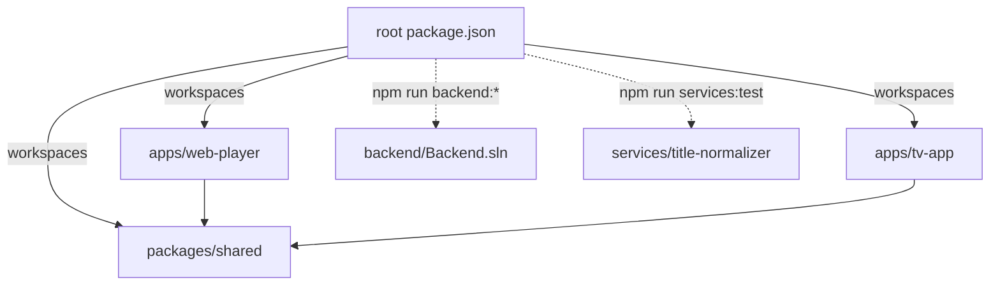
```mermaid
flowchart TD
  ROOT[root package.json] -->|workspaces| WEB[apps/web-player]
  ROOT -->|workspaces| TV[apps/tv-app]
  ROOT -->|workspaces| SH[packages/shared]
  WEB --> SH
  TV --> SH
  ROOT -.->|npm run backend:*| BE[backend/Backend.sln]
  ROOT -.->|npm run services:test| PY[services/title-normalizer]
```

## D-002

**Folder layout and README rules** — 2026-09-23

Decision: layout follows the task spec (`apps/`, `packages/`, `backend/`, `services/`, `documentation/`). Every folder has a `README.md` with facts only, except:
- `documentation/`: spec requires exactly three files there. That rule wins.
- Generated/tool folders (`node_modules`, `bin`, `obj`, `dist`, `.venv`, `android`).
- `.github/` (2026-09-23): GitHub shows `.github/README.md` as the repository home page in place of the root README, so `.github/` has none; the root README describes it.
- Android `res/` folders: the resource merger rejects any non-resource file, so the parent folder's README documents them (2026-09-23).

Why: explicit spec rule for `documentation/` is more specific than the general README rule.

## D-003

**Central config via root `.env`** — 2026-09-23

Decision: one committed root `.env` holds public, non-secret settings (`APP_NAME`, `APP_SLUG`, `APP_ANDROID_PACKAGE`, `APP_API_BASE_URL`). `.env.local` (git-ignored) overrides it. Real environment variables override both. No code contains a fallback app name; every consumer fails fast when a key is missing.

Why:
- App name is undecided. Renaming must be a one-line change.
- `.env` is the only format all four runtimes read natively or with a tiny loader.
- Committing `.env` lets CI and fresh clones build with zero setup. Secrets never go in it.
- Azure (App Service, Functions, Static Web Apps build) injects App Settings as env vars, which already win.

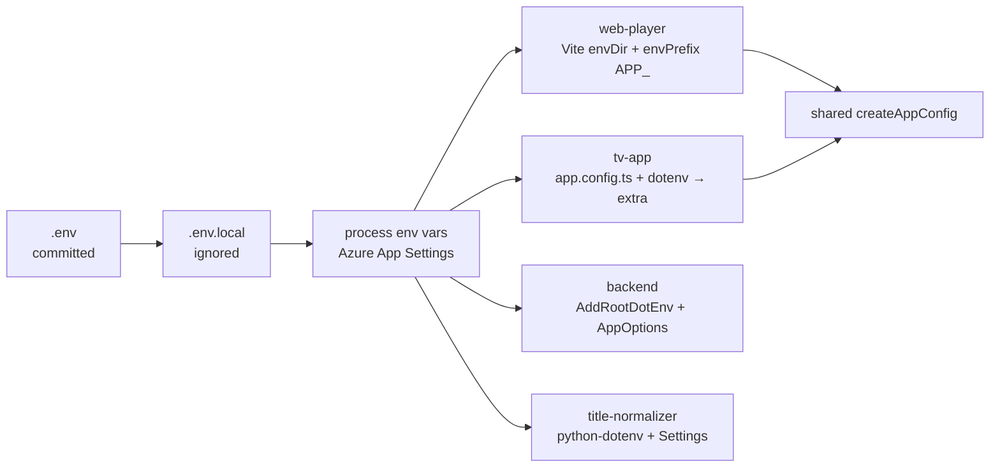
```mermaid
flowchart LR
  ENV[.env<br/>committed] --> LOCAL[.env.local<br/>ignored] --> REAL[process env vars<br/>Azure App Settings]
  REAL --> WEB[web-player<br/>Vite envDir + envPrefix APP_]
  REAL --> TV[tv-app<br/>app.config.ts + dotenv → extra]
  REAL --> BE[backend<br/>AddRootDotEnv + AppOptions]
  REAL --> PY[title-normalizer<br/>python-dotenv + Settings]
  WEB --> CFG[shared createAppConfig]
  TV --> CFG
```

Per consumer:

| Consumer | Loader | Notes |
|----------|--------|-------|
| web-player | Vite `envDir` = repo root, `envPrefix` includes `APP_` | `index.html` uses `%APP_NAME%`. Values are public in the bundle by design. |
| tv-app | `dotenv` in `app.config.ts` | Sets Expo `name`, `slug`, `android.package`, and `extra`. |
| backend | `AddRootDotEnv()` walks up from content root | Re-adds env vars after `.env` so they win. `ValidateOnStart` stops boot on missing keys. |
| title-normalizer | `python-dotenv`, `override=False` | Loads `.env.local` before `.env`; first value set wins. |

Only `APP_`-prefixed keys reach the web bundle. Never put secrets under `APP_`.

## D-004

**Frontend toolchain versions** — 2026-09-23

Decision:
- React `19.2.3` pinned exactly in both apps.
- TypeScript `~5.9.3` everywhere.
- Vite 8 + `@vitejs/plugin-react` 6. Vitest 5 for `packages/shared`.

Why:
- Expo SDK 57 requires React 19.2.3. Web uses the same version so npm hoists one React copy. Two copies break hooks.
- TypeScript 7 (native port) is current, but Expo and editor tooling rely on the 5.x JS compiler API. 5.9 is the safe choice until the ecosystem confirms 7.x support.

## D-005

**TV app: Expo + react-native-tvos** — 2026-09-23

Decision: Expo SDK 57 with `react-native` aliased to `react-native-tvos@0.86.3-0`. Plugin `@react-native-tvos/config-tv` with `isTV: true` adds the Android TV manifest (leanback launcher, no touchscreen requirement). Platform list is `android` only.

Why:
- Core React Native removed TV support. `react-native-tvos` is the maintained fork and provides `TVEventHandler`, `hasTVPreferredFocus`, focus events.
- Expo gives config plugins, prebuild and native module tooling needed later for ExoPlayer `DownloadManager`.
- Fork version must match the Expo SDK's React Native minor (SDK 57 → RN 0.86).

Supporting settings:
- Root `package.json` `overrides.react-native` forces the fork everywhere. Without it, `@react-native-tvos/virtualized-lists` pulled a second, upstream `react-native@0.86.3`.
- `expo.install.exclude: ["react-native"]` stops `expo install` from "fixing" the alias back to upstream.

## D-006

**Backend: .NET 8, layered projects** — 2026-09-23

> Runtime choice superseded by [D-009](#d-009). Layering still applies, extended by `Backend.Infrastructure` (D-011).

Decision: ASP.NET Core minimal API on `net8.0`. Projects: `Backend.Api` (host), `Backend.Core` (config, domain, interfaces), `Backend.Tests` (xUnit + `WebApplicationFactory`). Central package versions in `Directory.Packages.props`. Warnings are errors.

Why:
- Spec allows .NET 8 or 9. The .NET 9 SDK download host is blocked in the build sandbox; .NET 8 is available from Ubuntu packages, so it can be compiled and tested here.
- Both 8 and 9 reach end of support on 2026-11-10. Migration to .NET 10 (LTS) is tracked in `NEXT-STEPS.md` and `KNOWN-ISSUES.md`.
- Project names use `Backend.*`, not a product name, because `APP_NAME` is undecided.
- `Backend.Core` has no endpoint code, so providers (`IMediaProvider`) can be reused by future workers and tested without HTTP.

## D-007

**Shared package ships TypeScript source** — 2026-09-23

Decision: `@iptv/shared` exports `src/index.ts` directly. No build step.

Why: Vite and Metro both compile workspace TypeScript. Skipping a build removes watch processes and stale `dist` bugs. Constraint: shared code must avoid DOM and React Native imports.

## D-008

**Python service: Azure Functions v2 model, pure core package** — 2026-09-23

Decision: `services/title-normalizer` uses the Python v2 decorator model (`function_app.py`). Logic lives in `title_normalizer/`, which never imports `azure.functions`.

Why: pure modules unit-test with plain `pytest`, no Functions host or Azurite. `function_app.py` stays a thin binding layer (HTTP now, queue trigger in Step 3).

## D-009

**Backend on .NET 10 LTS (supersedes D-006 runtime choice)** — 2026-09-23

Decision: all backend projects target `net10.0`. `global.json` pins SDK `10.0.100` with `latestFeature` roll-forward. Microsoft packages use `10.0.x`.

Why:
- .NET 8 and 9 leave support on 2026-11-10. .NET 10 is LTS (support until Nov 2028).
- The .NET 10 SDK is installable from Ubuntu packages in the build sandbox, so builds and tests are verified.
- Upgrade cost was zero: only target framework and package versions changed.

## D-010

**Local-only deployment for phase 1** — 2026-09-23

Decision: every component runs on the developer's machine. No Azure resources yet. Azure targets from the brief (Static Web Apps, App Service, Functions, Azure SQL/Cosmos) stay as the future direction.

Consequences:
- Database is a local SQLite file (D-014), not Azure SQL/Cosmos.
- Relay bandwidth costs nothing (D-013).
- The API listens on all interfaces (`0.0.0.0:5080`) so an Android TV device on the same LAN can reach it. Set `APP_API_BASE_URL` in `.env.local` to the PC's LAN IP for the TV build.
- Traffic is plain HTTP on the LAN. Accepted for phase 1 (KI-009).

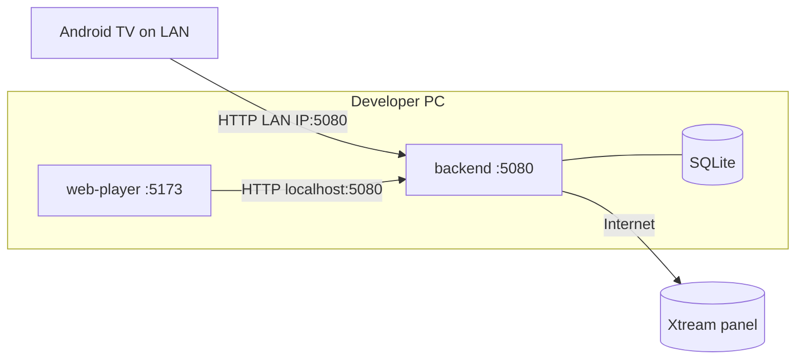
```mermaid
flowchart LR
  subgraph PC[Developer PC]
    WEB[web-player :5173]
    API[backend :5080]
    DB[(SQLite)]
    API --- DB
  end
  TV[Android TV on LAN] -->|HTTP LAN IP:5080| API
  WEB -->|HTTP localhost:5080| API
  API -->|Internet| IPTV[(Xtream panel)]
```

## D-011

**`IMediaProvider` + `XtreamCodesProvider` design** — 2026-09-23

Decision:
- `IMediaProvider` (in `Backend.Core`) is stateless. Every call receives `ProviderCredentials`. One singleton-style typed `HttpClient` instance serves all accounts.
- `IMediaProviderResolver` picks the implementation by the `ProviderType` string stored on each account (`xtream` today). New sources (M3U, Stalker) add a class, not new endpoints.
- Return types are provider-agnostic records (`Backend.Core.Media`). Clients never see Xtream field names.
- `BuildPlaybackSource` is pure (no network). It returns the upstream URL; `PlaybackService` decides relay vs. direct.
- Xtream JSON is parsed with `JsonDocument` + lenient readers (`LooseJson`), not strict DTOs.

Why lenient parsing: panels return the same field as `"55"`, `55`, `null` or `""`; `info` can be `{}` or `[]`; `episodes` can be an object keyed by season or an array of arrays; `backdrop_path` can be a string or an array. Strict deserialization fails on the first mismatch and takes a whole catalog down.

Other rules:
- Server URL normalization accepts `host:port`, strips `player_api.php`/`get.php`, and keeps any sub-path. Canonical form is stored, so the same login from different spellings maps to one account.
- Container extensions from clients are sanitized (letters/digits, max 8 chars) before entering URLs.
- Live streams prefer `m3u8`; fall back to `ts` when the account's `allowed_output_formats` excludes HLS.
- Errors: HTTP 401/403 or `auth: 0` → `ProviderAuthenticationException`; network, non-2xx, invalid JSON → `ProviderUnavailableException`.

## D-012

**Authentication proxy: upstream-validated login, opaque sessions** — 2026-09-23

Decision:
1. Client sends Xtream server URL, username, password once to `POST /api/auth/login`.
2. Backend validates them server-to-server (`player_api.php`). Rejects inactive/expired accounts.
3. Backend stores the account; password encrypted with ASP.NET Core Data Protection (key ring in `DATA_DIR/keys`).
4. Backend returns a random 256-bit opaque bearer token. Only its SHA-256 hash is stored.
5. First login creates one default profile named after the username.

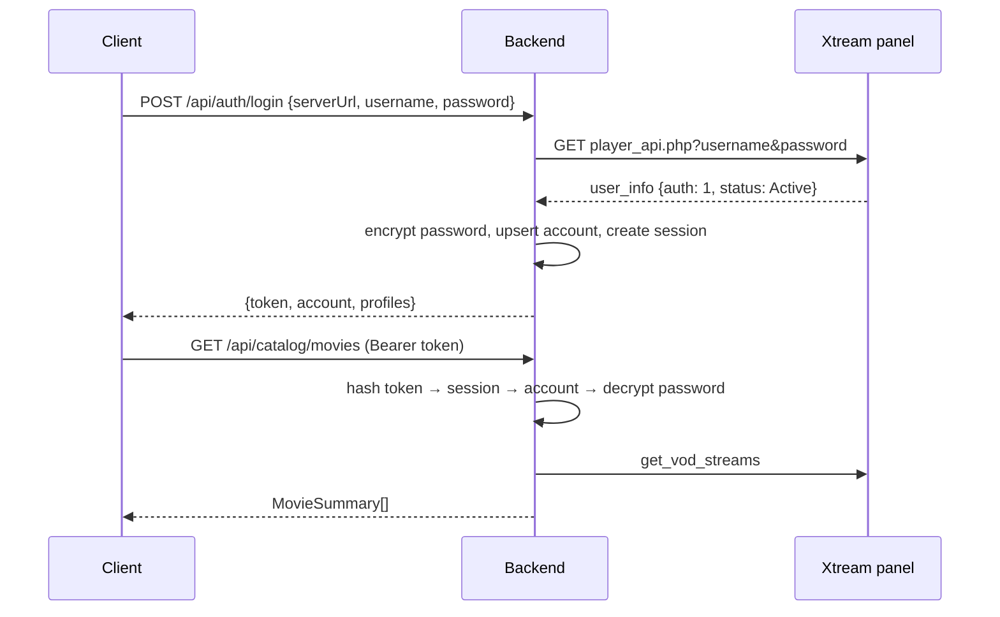
```mermaid
sequenceDiagram
  participant C as Client
  participant A as Backend
  participant X as Xtream panel
  C->>A: POST /api/auth/login {serverUrl, username, password}
  A->>X: GET player_api.php?username&password
  X-->>A: user_info {auth: 1, status: Active}
  A->>A: encrypt password, upsert account, create session
  A-->>C: {token, account, profiles}
  C->>A: GET /api/catalog/movies (Bearer token)
  A->>A: hash token → session → account → decrypt password
  A->>X: get_vod_streams
  A-->>C: MovieSummary[]
```

Why:
- Provider credentials never live on clients after login. A stolen TV device leaks a revocable token, not the IPTV subscription.
- Opaque tokens over JWT: revocation is one row delete; no signing-key management; the API is the only token consumer.
- Data Protection handles key generation, rotation and authenticated encryption. Application name is fixed to `backend` so renaming `APP_NAME`/`APP_SLUG` never makes stored passwords unreadable.
- Profiles belong to the account, not the session, so every device sees the same "Who's watching?" list.

## D-013

**Stream delivery: backend relay by default** — 2026-09-23

Decision: `BACKEND_STREAM_DELIVERY=relay` (default). `/api/playback/...` returns a relay URL. `direct` mode returns the upstream URL and stays available as a switch.

Options compared:

| | Relay (via backend) | Direct (client → provider) |
|---|---|---|
| Credentials exposure | Hidden. Relay URLs carry an encrypted, expiring token. | Username + password are in the stream URL path on every client. |
| Browser CORS | Solved. Backend sends CORS headers. | Most Xtream panels send none → hls.js cannot fetch playlists/segments. |
| Mixed content | Solved once backend has HTTPS. | HTTP-only panels blocked on HTTPS pages. |
| Web offline caching (Service Worker) | Works: same-origin/CORS responses are readable and cacheable. | Opaque cross-origin responses cannot be inspected or reliably cached. |
| Latency | +1 hop (LAN: negligible). | Lowest. |
| Bandwidth / cost | All video passes through the backend host. Local: free. Cloud: paid egress. | None on our side. |
| Availability | PC must be on and reachable. | Only provider needed. |
| Provider connection limits | Unchanged: one client stream = one upstream stream. | Same. |
| Provider IP blocking | Provider sees the PC's home IP (fine). In cloud, datacenter IPs may be blocked. | Provider sees each client IP. |

Why relay: in local-only phase 1 (D-010) its main cost (bandwidth) is zero, and it is required for web playback (CORS) and web offline caching. The TV app needs the backend for login and catalog anyway, so "PC must be on" adds no new dependency. Revisit when moving to cloud: likely hybrid (web relayed, TV direct via short-lived URLs).

How the relay works:

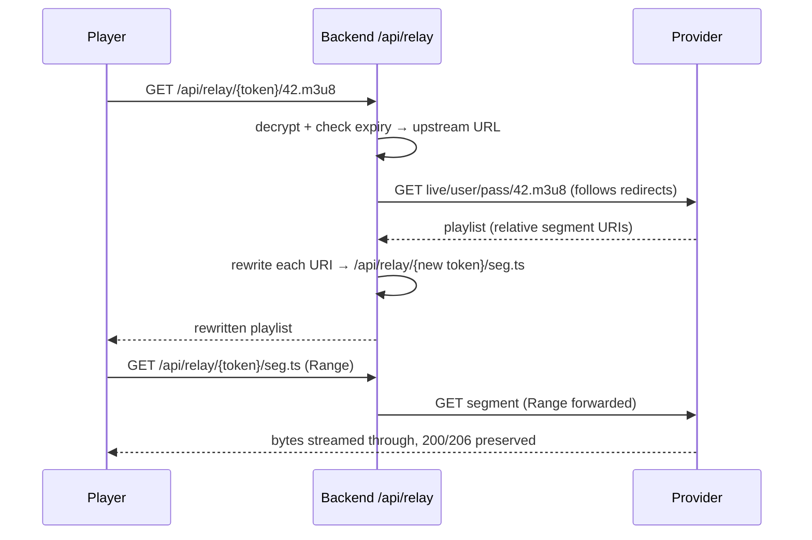
```mermaid
sequenceDiagram
  participant P as Player
  participant A as Backend /api/relay
  participant X as Provider
  P->>A: GET /api/relay/{token}/42.m3u8
  A->>A: decrypt + check expiry → upstream URL
  A->>X: GET live/user/pass/42.m3u8 (follows redirects)
  X-->>A: playlist (relative segment URIs)
  A->>A: rewrite each URI → /api/relay/{new token}/seg.ts
  A-->>P: rewritten playlist
  P->>A: GET /api/relay/{token}/seg.ts (Range)
  A->>X: GET segment (Range forwarded)
  X-->>P: bytes streamed through, 200/206 preserved
```

Rules:
- Tokens are Data Protection time-limited payloads (`BACKEND_RELAY_TOKEN_HOURS`). Clients cannot forge a URL, so the relay cannot be used as an open proxy (SSRF-safe).
- Playlist detection: `mpegurl` content type or `.m3u8` path; max 5 MB.
- Relative URIs resolve against the final URL after redirects (Xtream panels often redirect to a load-balancer host).
- The relay `HttpClient` has no timeout (live streams are endless) and its request logs are silenced because upstream paths contain credentials.

## D-014

**Persistence: SQLite + EF Core migrations** — 2026-09-23

Decision: EF Core 10 with SQLite at `DATA_DIR/app.db`. Migrations live in `Backend.Infrastructure/Persistence/Migrations` and run automatically on startup. `dotnet-ef` is a local tool (`backend/dotnet-tools.json`).

Why:
- Local-only (D-010): no database server to install.
- EF Core keeps the path to Azure SQL open: swap `UseSqlite` for `UseSqlServer` and regenerate migrations.
- `DateTimeOffset` is stored as UTC ticks (`long`) because SQLite cannot compare or sort `DateTimeOffset` natively.

## D-015

**Catalog cache: in-memory, per account** — 2026-09-23

Decision: `CatalogService` caches provider responses in `IMemoryCache` for `BACKEND_CATALOG_CACHE_MINUTES` (default 15), keyed by account + request.

Why: Xtream `get_vod_streams` without a category can return tens of thousands of items and take seconds. In-memory is enough for a single local process. Durable metadata storage belongs to Step 3 (master media objects).

## D-016

**SQLite job queue + shared `pipeline.db`** — 2026-09-23

Decision (owner-approved): the queue between backend and Python is a table in a second SQLite file, `DATA_DIR/pipeline.db`. The same file holds the output (`master_media`, `media_variants`). `app.db` (accounts, encrypted passwords) stays backend-only.

```mermaid
sequenceDiagram
  participant A as Backend
  participant Q as pipeline.db
  participant W as Python worker
  A->>A: login / POST /api/library/sync
  A->>A: fetch get_vod_streams + get_series (background)
  A->>Q: INSERT job (pending, payload JSON) or replace pending payload
  loop every 5 s
    W->>Q: UPDATE ... SET processing WHERE id = oldest pending RETURNING
  end
  W->>W: parse + group
  W->>Q: BEGIN IMMEDIATE; replace masters/variants; job = done; COMMIT
  A->>Q: SELECT masters for /api/library
```

Why:
- Local-only (D-010): no Azurite, Redis or broker to install. SQLite is already used.
- Separate file: the Python process never opens the database holding credentials. Large payloads and bulk rewrites do not bloat or lock `app.db`.
- One schema owner: EF Core (`PipelineDbContext`) creates and migrates `pipeline.db`. Python only reads/writes rows. Two writers of DDL would drift.
- Contract enforcement: `pipeline-schema.sql` is generated from the EF model and committed. A backend test fails if it is stale; Python tests build their database from it. A column rename breaks Python tests immediately, not at runtime.
- snake_case names and Unix-second integer timestamps: natural in Python/SQL, no `DateTimeOffset` text parsing.

Queue rules:
- Claim is a single `UPDATE ... RETURNING` statement: atomic, safe with several workers.
- One pending job per account + kind: a newer sync replaces the pending payload instead of stacking jobs.
- Retries: failure → `pending` until 3 attempts → `failed`. Jobs stuck in `processing` for 10 min (crashed worker) are requeued.
- Output is a full snapshot per account + kind, replaced in one transaction. Readers never see a half-written library.
- Processed payloads are cleared (`[]`) to keep the file small.
- Both processes use WAL mode + 30 s busy timeout, so API reads continue while the worker writes.

## D-017

**Title normalizer: regex parsing + guarded fuzzy grouping** — 2026-09-23

Decision: rule-based parsing (regex + vocabularies in `tags.py`) and `rapidfuzz` string similarity. No ML/NLP model.

Why: IPTV titles follow a small set of conventions (language prefixes, bracket tags, scene names). Rules are fast, deterministic, debuggable by juniors, and each failure becomes a test case. A model would add a large dependency and non-deterministic output for little gain.

Parsing steps (`parser.parse_title`):

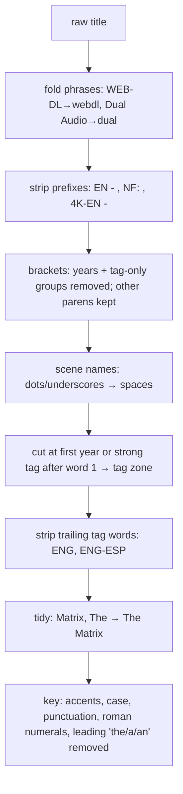
```mermaid
flowchart TD
  R[raw title] --> F[fold phrases: WEB-DL→webdl, Dual Audio→dual]
  F --> P[strip prefixes: EN - , NF: , 4K-EN - ]
  P --> B[brackets: years + tag-only groups removed; other parens kept]
  B --> D[scene names: dots/underscores → spaces]
  D --> Z[cut at first year or strong tag after word 1 → tag zone]
  Z --> T[strip trailing tag words: ENG, ENG-ESP]
  T --> C[tidy: Matrix, The → The Matrix]
  C --> K[key: accents, case, punctuation, roman numerals, leading 'the/a/an' removed]
```

False-positive guards:
- Two-letter language codes (`IT`, `US`, `DE`) count only inside prefixes/brackets or when uppercase. "It (2017)" and "Us (2019)" keep their titles.
- Prefixes must be uppercase or contain a digit, and every token must be a known tag.
- The first word is never cut ("2001: A Space Odyssey", "1917"). Years outside 1900..next year are title words ("Blade Runner 2049").
- `US`/`UK` are not languages: "The Office (US)" and "The Office (UK)" stay distinct.

Grouping (`matching.group_titles`), in order:
1. Exact: same compact key (spaces removed) + same year. "Spider-Man" = "Spiderman".
2. Year-less join: a title without year joins the dated group with the same key only if exactly one exists. "Dune" with both 1984 and 2021 present stays separate.
3. Fuzzy: `fuzz.ratio ≥ 90` on compact keys within blocks sharing the first 4 characters. Requires equal years, equal number tokens (sequels: "Toy Story 2" ≠ "Toy Story 3"), and exact match for keys shorter than 6 characters ("Up" ≠ "Us").

Rule 3 requires equal years because a year-less title matching two dated titles would chain remakes into one group (found by test, 2026-09-23).

Master output:
- `id` = SHA-1 of account + kind + compact key + year (first 20 hex chars). Stable across re-syncs while the group's canonical key/year are unchanged.
- Display title: most frequent spelling in the group.
- Variants ordered by `quality_score` (resolution rank + source adjustment: CAM −300 … REMUX +30, HDR +5). Label example: `4K · HDR · ENG · DUAL`. Duplicate labels get `(2)`, `(3)`.

Performance (2026-09-23, sandbox CPU): ~50,000 items → ~22,000 masters in 4.6 s.

## D-018

**Python worker runs as a CLI poller locally** — 2026-09-23

Decision: `python -m title_normalizer` polls `pipeline.db` every 5 s. `function_app.py` keeps only the health route; no Functions trigger reads the SQLite queue.

Why: Azure Functions needs Core Tools + a storage emulator locally, and SQLite is not a supported trigger source. A plain loop is simpler to run and debug. Cloud move: swap the SQLite queue for an Azure Storage Queue trigger that calls the same `build_masters()`; the engine modules do not change (D-008).

## D-019

**`DATA_DIR` shared key, paths relative to repo root** — 2026-09-23

Decision: `BACKEND_DATA_DIR` is renamed `DATA_DIR`. Relative values resolve against the directory containing `.env` (repo root) in both backend and Python. Default: `<repo>/.data`.

Why: backend and worker must open the same `pipeline.db`. One key and one resolution rule removes a class of "worker looks in the wrong folder" bugs. The backend exposes the `.env` directory internally as `DOTENV_DIRECTORY`.

## D-020

**API contract: OpenAPI export at build → generated TypeScript types** — 2026-09-23

Decision:
- `Microsoft.Extensions.ApiDescription.Server` writes `packages/shared/openapi/backend-openapi.json` on every backend build.
- `openapi-typescript` turns it into `packages/shared/src/api/generated/schema.ts` (`npm run generate:api`). Both files are committed.
- The hand-written API client takes its return types from generated `operations` (`OperationResult<'listLibrary'>`). Renaming an operation or changing a DTO breaks the TypeScript build.
- A Vitest test regenerates the types in memory and fails if the committed file differs.

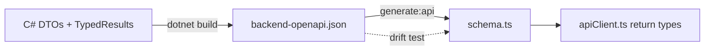
```mermaid
flowchart LR
  CS[C# DTOs + TypedResults] -->|dotnet build| JSON[backend-openapi.json]
  JSON -->|generate:api| TS[schema.ts]
  TS --> CLIENT[apiClient.ts return types]
  JSON -. drift test .-> TS
```

Backend changes needed for an accurate document:
- All endpoints return `TypedResults` / `Results<...>` so response bodies and status codes are documented. `.WithName()` sets stable operation ids.
- `JsonNumberHandling.Strict`: ASP.NET's default accepts numbers as strings, which made every number `integer | string` in the schema.
- `RequiredPropertiesSchemaTransformer`: System.Text.Json always writes every property (nulls included), so response properties are `required` (nullable ones stay `| null`). Request types (`*Request`) keep nullable properties optional so callers can omit them. Without this, every generated field would be optional (`?`).
- The build starts the app to export the document. `Program.cs` detects this (`GetDocument.Insider` entry assembly), uses a temp `DATA_DIR`, and skips migrations, so builds never touch real data.
- The relay endpoint is excluded from the document: players call it via URLs from `/api/playback`, never the client.

Why a hand-written client over a generated one (e.g. `openapi-fetch`): about 20 small functions that juniors can read, no `Request` object dependency (React Native's fetch polyfill differs from browsers), and friendly method names. Types still come from the contract.

## D-021

**Shared client + vanilla Zustand stores behind one app context** — 2026-09-23

Decision: `createAppContext({ config, storage, fetch? })` builds one HTTP client, one API client and four stores (`session`, `catalog`, `library`, `player`). Stores use `zustand/vanilla`; React reads them with `useAppStore(store, selector)`.

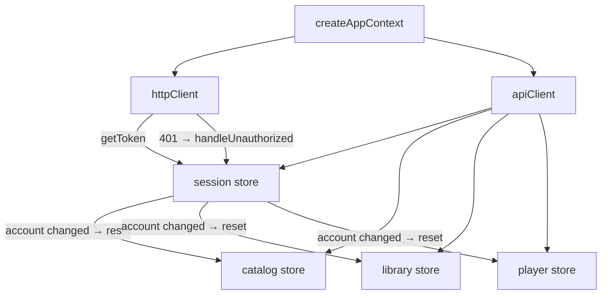
```mermaid
flowchart TD
  CTX[createAppContext] --> HTTP[httpClient]
  HTTP -->|getToken| SESSION[session store]
  HTTP -->|401 → handleUnauthorized| SESSION
  CTX --> API[apiClient]
  API --> SESSION & CATALOG[catalog store] & LIBRARY[library store] & PLAYER[player store]
  SESSION -->|account changed → reset| CATALOG & LIBRARY & PLAYER
```

Why:
- Vanilla stores work outside React (tests, service workers, native modules later) and bind to React with one hook.
- Dependencies are injected (`storage`, `fetch`), so tests run the real stores against a fake backend with no mocking library.
- One factory per app means one place to wire cross-store rules: any 401 signs out; an account change clears account-scoped caches.

Store rules:
- Remote data lives in `Resource<T>` records (`data`, `status`, `error`, `updatedAt`) keyed by query. `createResourceLoader` returns cached data unless `force`, and shares one request between concurrent callers.
- Each loader has a generation counter. `reset()` bumps it, so a request still in flight when the user signs out cannot write stale data into the cleared store (found by test, 2026-09-23).
- Player `open()` ignores responses from older calls (fast channel zapping).
- Errors are stored, not thrown. UI reads `error.code` (`ApiErrorCode`).
- Library page size defaults to 100; the chosen variant per master lives in `selectedVariants` (missing = best variant, which the backend lists first).
- Login auto-selects the profile when the account has exactly one; otherwise UI shows the picker.

## D-022

**Session persistence per platform** — 2026-09-23

Decision: the session store persists one JSON snapshot (`token`, `account`, `profiles`, `activeProfileId`) through a `KeyValueStorage` adapter.

| Platform | Adapter | Protection |
|----------|---------|------------|
| Web | `localStorage`, key `<APP_SLUG>:session` | Readable by any script on the origin (XSS). |
| TV | `expo-secure-store` | Encrypted with an Android Keystore key. |

Why:
- Caching account + profiles lets the app start with the profile picker even when the backend is unreachable (`offline = true`), needed later for offline downloads.
- `restore()` re-validates the token (`/api/auth/me` + `/api/profiles`) whenever the backend answers; 401 clears everything.
- Persistence is manual (not Zustand `persist` middleware): explicit writes after each change are easier to follow and test with async storage.
- Web alternative (HttpOnly cookie) needs CSRF protection and same-site hosting; deferred while local-only (KI-017).

## D-023

**Web playback engine: HLS first, file fallback, on-demand frame previews** — 2026-09-23

Decision (owner-approved recommendation for KI-010): `PlaybackEngine` tries sources in order and stops at the first that loads.

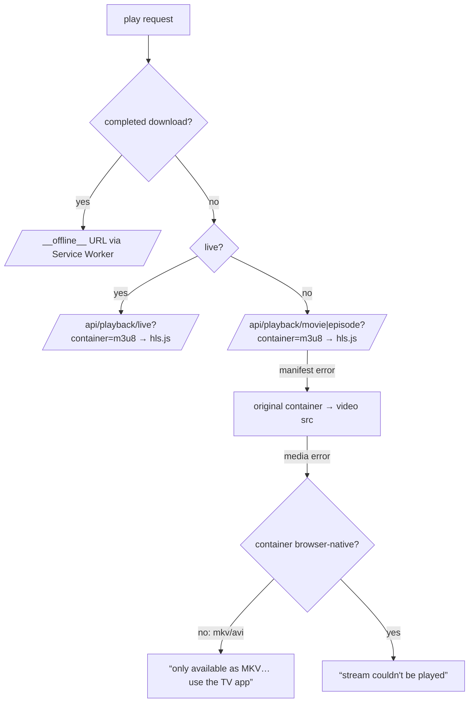
```mermaid
flowchart TD
  START[play request] --> DL{completed download?}
  DL -->|yes| LOCAL[/__offline__ URL via Service Worker/]
  DL -->|no| LIVE{live?}
  LIVE -->|yes| LHLS[/api/playback/live?container=m3u8 → hls.js/]
  LIVE -->|no| VHLS[/api/playback/movie|episode?container=m3u8 → hls.js/]
  VHLS -->|manifest error| FILE[original container → video src]
  FILE -->|media error| ERR{container browser-native?}
  ERR -->|no: mkv/avi| HINT[“only available as MKV… use the TV app”]
  ERR -->|yes| GENERIC[“stream couldn't be played”]
```

Why:
- Many Xtream panels transmux VOD to HLS on request (`/movie/u/p/{id}.m3u8`). HLS in hls.js plays MKV sources in any browser with no backend transcoding.
- If the panel has no HLS, MP4-family files still play natively; MKV/AVI get an honest explanation instead of a frozen player.
- hls.js fatal errors after start: network → `startLoad()`, media → `recoverMediaError()` (twice), then an error message.

Timeline frame previews: providers ship no trickplay sprites. `FrameGrabber` creates a hidden, muted second `<video>` (HLS at the lowest rendition, 4 s buffer) only on first timeline hover, seeks it to the hovered time (coalescing requests) and draws the frame into a canvas. Costs one extra stream connection while previewing (KI-020).

Other rules:
- Skip Intro: providers give no markers. Heuristic window 5–90 s on episodes ≥ 10 min (`INTRO_WINDOW` in `@iptv/shared`) (KI-019).
- Next-up: countdown card during the last 10 s; auto-plays the next episode on `ended` unless cancelled. Order: season, then episode number.
- Progress saved every 10 s while playing, on pause, on close, on version/episode switch.
- The player (and hls.js, ~500 kB) is a lazily loaded chunk; the initial bundle is ~255 kB.

## D-024

**Web offline downloads: Service Worker + AES-GCM chunks** — 2026-09-23

Decision: downloads are fetched by a page-side `DownloadManager`, encrypted per chunk, stored in the Cache API, and served back only through the Service Worker under `/__offline__/`.

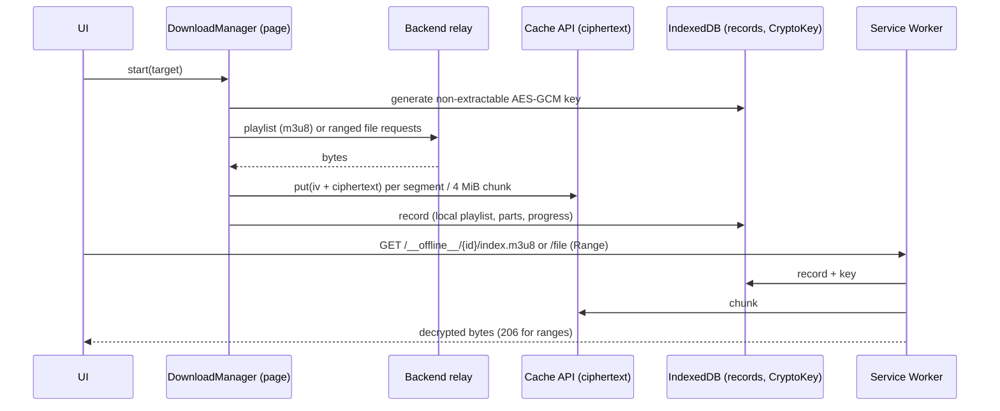
```mermaid
sequenceDiagram
  participant UI
  participant DM as DownloadManager (page)
  participant R as Backend relay
  participant C as Cache API (ciphertext)
  participant I as IndexedDB (records, CryptoKey)
  participant SW as Service Worker
  UI->>DM: start(target)
  DM->>I: generate non-extractable AES-GCM key
  DM->>R: playlist (m3u8) or ranged file requests
  R-->>DM: bytes
  DM->>C: put(iv + ciphertext) per segment / 4 MiB chunk
  DM->>I: record (local playlist, parts, progress)
  UI->>SW: GET /__offline__/{id}/index.m3u8 or /file (Range)
  SW->>I: record + key
  SW->>C: chunk
  SW-->>UI: decrypted bytes (206 for ranges)
```

Why:
- Meets the brief: no `.mp4`/`.mkv` is ever written to the user's filesystem; data lives inside the browser's origin storage.
- AES-GCM with a non-extractable key: copying the cache contents off the machine yields ciphertext, and GCM detects tampering. It is not DRM: scripts on the origin (and DevTools) can still use the key through the SW (KI-002).
- HLS downloads store every playlist resource (segments, init maps, AES keys) and a rewritten local playlist, so hls.js plays offline exactly as online. Files are stored as 4 MiB chunks; the SW answers `Range` requests one chunk at a time (low memory).
- One download at a time: each download holds a provider connection (`max_connections`).
- Resumable: existing chunks are skipped; a changed upstream playlist restarts cleanly. Interrupted downloads come back paused.
- The SW also caches the built app shell (precache list injected at build), so the app opens offline and routes to My Downloads.
- The SW is bundled separately by a small Vite plugin using esbuild (classic script, works in all browsers; `/sw.js` in dev and build). Chosen over `vite-plugin-pwa` to avoid Workbox for ~5 kB of code.

## D-025

**Web UI architecture** — 2026-09-23

Decisions:
- **Navigation:** a small Zustand `uiStore` (view, search, details, playing) mirrored into `history.pushState`, not a router library. Browser Back closes the player, then the modal, then returns to the previous view. No shareable URLs yet (KI-023).
- **Data:** shared stores for everything account-scoped; `useAsync` (module cache) for one-off reads (movie metadata, series episodes).
- **Rows** load when scrolled within 400 px of the viewport (IntersectionObserver).
- **Hero trailer:** muted `youtube-nocookie.com` embed faded in after 3 s when the provider supplies a trailer id; backdrop image otherwise (owner-approved).
- **Library re-processing:** `LibraryBanner` polls status while the library is empty or processing. When that ends it calls `library.invalidate()` (keeps version choices) and bumps `libraryRevision`; mounted views reload. Polling while *empty* matters: right after the first login the sync job may not exist yet (found by e2e, 2026-09-23).
- **Selectors:** `useAppStore` wraps selectors in `useShallow`. Zustand 5 otherwise loops forever when a selector returns a new array (`?? []`), which crashed the first build (React error #185).
- Plain CSS with tokens in four files; no CSS framework.

## D-026

**Watch progress stored per profile on the backend** — 2026-09-23

Decision: `WatchProgress` table in `app.db` (profile, kind, provider stream id, position, duration, display fields). Endpoints under `/api/profiles/{id}/progress`. Clients save optimistically.

Why: "Continue Watching" must follow the profile across web and TV. Display fields (title, poster, series/season/episode) are copied into the row so the row renders without extra catalog calls. Items are keyed by provider stream id (what playback needs), with `masterId`/`seriesId` for grouping; Continue Watching shows one entry per series (latest episode). Completion: ≥ 95 % or < 2 min left on titles over 10 min.

## D-027

**Fake Xtream panel + end-to-end tests** — 2026-09-23

Decision: `tools/fake-xtream-server` (Python stdlib) emulates a panel: catalog with duplicates/sequels/MKV-only/series/live, 302 redirects to media (like real load balancers), HTTP Range, a sliding live window, SVG artwork. `generate_media.py` builds VP9/Opus test media with ffmpeg. Playwright tests (`apps/web-player/e2e`) start panel + backend (temp `DATA_DIR`) + worker + production web build on separate ports and drive a real browser.

Why:
- The whole chain (provider → relay → dedup worker → UI → hls.js → Service Worker) only fails in integration; unit tests missed three bugs the e2e run caught (render loop, stale details after re-processing, empty library after first login).
- VP9 plays in every Chromium build, including Playwright's (no proprietary codecs).
- Also a demo target: anyone can try the app without an IPTV subscription.

## D-028

**TV app architecture: focus, navigation, remote handling** — 2026-09-23

Decisions:
- **Focus:** Android's native focus search (react-native-tvos) moves between `Pressable`s; no JS spatial-navigation library. `hasTVPreferredFocus` sets the first focus per screen; `TVFocusGuideView` remembers rail focus (`autoFocus`) and traps focus in the player drawer.
- **Navigation:** a small Zustand stack (`section` root, `details`, `player`) instead of React Navigation. Hardware Back pops; at the root it returns `false` so Android exits. Mirrors the web's store-driven navigation (D-025).
- **Layout:** left side rail (Netflix TV pattern), rows per category (a grid with chips is awkward with a D-pad).
- **Remote in the player:** `useRemote` wraps `useTVEventHandler`. Android reports key-down (auto-repeated while held) and key-up via `eventKeyAction`. `RemoteSeekController` (shared, pure, clock-injected) turns that into:

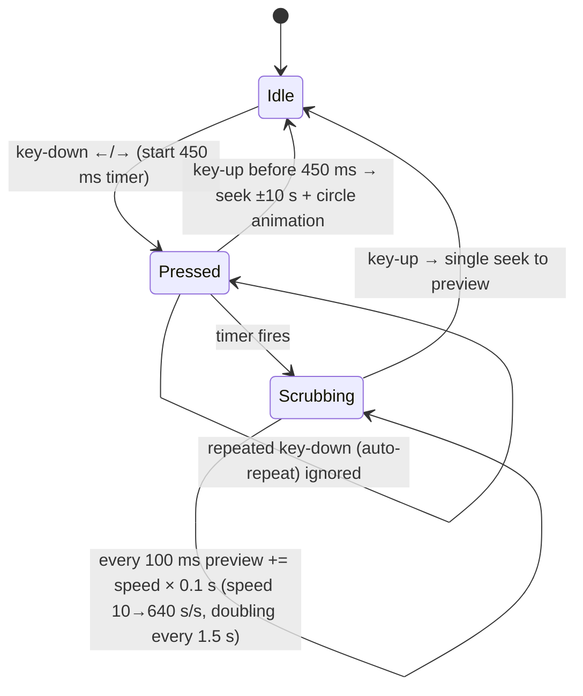
```mermaid
stateDiagram-v2
  [*] --> Idle
  Idle --> Pressed: key-down ←/→ (start 450 ms timer)
  Pressed --> Idle: key-up before 450 ms → seek ±10 s + circle animation
  Pressed --> Scrubbing: timer fires
  Scrubbing --> Scrubbing: every 100 ms preview += speed × 0.1 s (speed 10→640 s/s, doubling every 1.5 s)
  Scrubbing --> Idle: key-up → single seek to preview
  Pressed --> Pressed: repeated key-down (auto-repeat) ignored
```

  Why seek once on release: seeking on every tick would re-buffer the stream 10× per second over the relay. Events without `eventKeyAction` (other platforms/remotes) are treated as taps.
- ↑/↓ open the quick drawer (Audio, Subtitles, Versions, Episodes). Select toggles play/pause unless a focusable overlay (Skip ahead, Play Now) is shown.
- The player overlay is not focusable, so ←/→ reach the remote handler instead of moving focus between buttons.
- Profiles are only picked on TV; creation/editing stays in the web app (text entry with a D-pad is slow).
- `.npmrc legacy-peer-deps=true`: `react-native-tvos` versions are semver pre-releases (`0.86.3-0`) that never satisfy peer ranges like `react-native >=0.78`. Peers that npm used to add automatically (`@testing-library/dom`, `@react-native/jest-preset`, `test-renderer`) are now explicit devDependencies.
- Player focus anchor (2026-09-23): Android TV delivers D-pad keys to `useTVEventHandler` only while a view inside the React root has focus. The player has no focusable controls, so after navigation nothing was focused and remote keys were lost (found by the emulator run, not by Jest, which mocks the remote). A transparent full-screen `Pressable` with `hasTVPreferredFocus` holds focus whenever the drawer, Skip Intro or next-up are not shown. react-native-tvos reports `select` and `playPause` on key release only (like a click), arrows on press and release; the player acts on release for those two and on press for the rest. On the emulator arrows also arrived as key-up only, so `createRemoteNormalizer` turns any release without a press into press + release before handlers see it (found with `APP_TV_DEBUG_REMOTE=1` logging).

## D-029

**TV playback + offline: local Expo module over Media3** — 2026-09-23

Decision: a local Expo module `apps/tv-app/modules/tv-media` (Kotlin, Media3 1.9 like `expo-video`) provides `TvPlayerView` and download functions. `expo-video` is not used.

Why:
- The brief requires ExoPlayer `DownloadManager` with private storage. Offline playback must read the same `SimpleCache` the downloads wrote; `expo-video` does not expose its data source or a download API (KI-005).
- One module owns both sides: `DownloadCenter` holds the cache (`filesDir/offline-media`, private to the app), the `DownloadManager` (1 parallel download) and data-source factories. Offline playback uses `DownloadHelper.createMediaSource(download.request, cacheDataSourceFactory)`, i.e. the exact request that was downloaded, so expiring relay tokens (D-013) don't matter offline.
- `TvDownloadService` (Media3 `DownloadService`, `dataSync` foreground type) keeps downloads alive in the background with a notification.
- The view has no built-in controller; React Native draws the UI and calls `seekTo`/`selectTrack`.

Playback order on TV: completed download → original container (ExoPlayer plays MKV/MP4/TS) → panel HLS (`tvPlaybackAttempts`). Live: HLS, then TS. Downloads probe the original file with a 1-byte range request and fall back to HLS, because Media3 reports a missing file only later, in the background.

Download metadata (title, poster, ids) is stored as JSON in `DownloadRequest.data`, so My Downloads needs no second database. Native events fire on state changes only; JS polls progress every second while a download is active.

## D-030

**TV test environment: Jest here, Android TV emulator + Maestro in CI** — 2026-09-23

Constraints (2026-09-23): the Claude Code sandbox has no `/dev/kvm` (no emulator) and its network policy blocks `dl.google.com` (no Android SDK, no Google Maven), so APKs cannot be built there.

Decision: three layers.

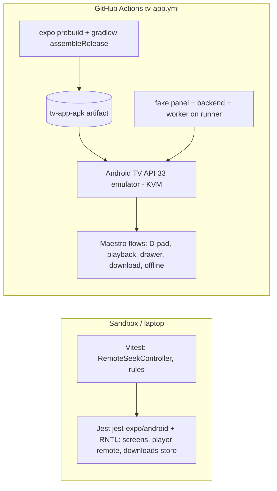
```mermaid
flowchart LR
  subgraph Sandbox / laptop
    U1[Vitest: RemoteSeekController, rules] --> U2[Jest jest-expo/android + RNTL: screens, player remote, downloads store]
  end
  subgraph GitHub Actions tv-app.yml
    B[expo prebuild + gradlew assembleRelease] --> APK[(tv-app-apk artifact)]
    APK --> EMU[Android TV API 33 emulator - KVM]
    STACK[fake panel + backend + worker on runner] --> EMU
    EMU --> M[Maestro flows: D-pad, playback, drawer, download, offline]
  end
```

- Jest uses `jest-expo/android` (Android `BackHandler`), a mock of the native module that records player props/seeks and simulates downloads, and a remote mock (`pressRemote`).
- CI (`ubuntu-latest` has KVM) builds a debug-signed release APK for x86 (emulator) and ARM (devices), starts the same fake panel/backend/worker as the web e2e, and runs Maestro flows with `Remote Dpad` key presses. The emulator reaches the runner at `10.0.2.2`, baked into the APK via `APP_API_BASE_URL`.
- The second flow stops provider and backend first, proving the app restores offline and plays a download from private storage.
- Disk (2026-09-23): the runner ran out of space installing the TV system image after the Gradle build. The job deletes unused preinstalled toolchains first and drops Gradle output (keeping only the APK) before the emulator step.
- Emulator setup (2026-09-23): the TV emulator is 960×540 dp, so flows scroll to off-screen elements (`scrollUntilVisible`); it runs without `-noaudio` because ExoPlayer's clock follows audio output and stays at 0:00 without a sound device; 4 cores.
- Flow timing (2026-09-23): each Maestro screen read takes seconds on the emulator, longer than the 4 s the player controls stay up. Flows let playback run, then pause (paused controls stay visible) before reading the clock. The on-screen keyboard is closed with Enter: Maestro's `hideKeyboard` sends Back on Android TV, which exits the app when the keyboard has already closed.
- Failure output (2026-09-23): `e2e/run.sh` prints on-screen text/ids and filtered logcat into the job log, because the Maestro artifact cannot be downloaded from the Claude Code sandbox (blob storage is blocked by its network policy).
- Hold-to-scrub cannot be scripted with Maestro (single key events); it is covered by unit and component tests.

`ci.yml` also runs every fast suite (JS, .NET, Python) and fails when the committed OpenAPI/TypeScript contract is stale (closes KI-018).

## D-031

**EPG: XMLTV cache in `app.db`, short-EPG fallback, paged grid endpoint** — 2026-09-23

Context: Xtream panels expose the guide two ways. `xmltv.php` returns the whole guide for all channels (often 50–500 MB, sometimes gzip). `get_short_epg` returns the next few programmes for one channel, with base64 titles.

Decision:

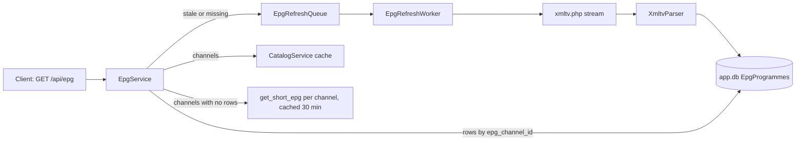
```mermaid
flowchart LR
  C[Client: GET /api/epg] --> S[EpgService]
  S -- stale or missing --> Q[EpgRefreshQueue] --> W[EpgRefreshWorker] --> X[xmltv.php stream] --> P[XmltvParser] --> DB[(app.db EpgProgrammes)]
  S -- channels --> CAT[CatalogService cache]
  S -- rows by epg_channel_id --> DB
  S -- channels with no rows --> SE[get_short_epg per channel, cached 30 min]
```

- One download per account in a background worker (like the library sync). The first grid request queues it and returns `status: refreshing`; clients poll every 3 s. Later downloads (older than `BACKEND_EPG_REFRESH_HOURS`, default 6) run in the background while the old guide is served.
- The XML is streamed with `XmlReader` (no DOM) and only programmes overlapping now −3 h … +48 h are kept: bounded rows even for huge feeds. Gzip is detected from the magic bytes because many panels send `.gz` bodies without `Content-Encoding`.
- Rows are replaced in one transaction with a prepared SQLite command. EF change tracking is too slow for 10⁵ rows. A broken feed rolls back and the previous guide stays.
- Matching uses `epg_channel_id` lower-cased (feeds and channel lists disagree on case). Channels without an id, or missing from the feed, fall back to `get_short_epg` for the channels on the requested page only (4 in parallel, cached 30 min, failures cached as empty).
- A failed download is not retried for 15 minutes. With no feed ever downloaded the status is `unavailable` and short EPG still fills rows.
- The grid pages channels (`offset`/`limit`, default 50, max 200) and the window (`from` aligned to UTC half hours, `hours` 1–12). Channel lists can have thousands of entries; clients load more on demand.

Why not per-channel short EPG only: one request per channel per page is slow on big categories and only covers a few hours ahead. Why not an in-memory cache: guides are large and would be lost on restart; SQLite is already there (D-014).

## D-032

**Guide UI: shared layout math, 3 h web / 2 h TV windows, select plays the channel** — 2026-09-23

- `@iptv/shared` owns the layout (`layoutGuideRow`: clip to the window, trim overlaps, fill gaps with empty cells) and paging/polling (`useEpgGuide`). Cells carry fractions, so web uses CSS percentages and TV multiplies by the measured row width.
- Web: a 3-hour window with a sticky channel column, time header and a red "now" line; Earlier / Now / Later move 1 hour. Clicking a channel plays it; clicking a programme opens details with "Watch live". On phones the timeline keeps 640 px and scrolls sideways.
- TV: a 2-hour window (960 dp width keeps titles readable). Rows are fixed-height so Android focus search moves naturally between programmes (←/→) and channels (↑/↓). The focused programme is described in a panel above the grid (Netflix-style, no extra key press). Select plays the channel. More channels load when the list nears its end.
- Playing from the guide passes the current programme title as the player subtitle.
- Past and future programmes are not playable on their own (no catch-up yet, KI-032); selecting them plays the live channel.

## D-033

**Linters and formatters: ESLint + Prettier, dotnet format, Ruff; web e2e in CI** — 2026-09-23 (requested by owner)

| Language | Lint | Format | Config |
|----------|------|--------|--------|
| TS/TSX/JS | ESLint: `js` + `typescript-eslint` recommended, `react-hooks` `rules-of-hooks` + `exhaustive-deps` as errors | Prettier (140 columns, single quotes, trailing commas) | `eslint.config.mjs`, `.prettierrc.json` |
| C# | Analyzer rules in `dotnet format` | `dotnet format` (whitespace, style) | `.editorconfig`, `backend/.editorconfig` |
| Python | Ruff `E F W I B UP` (E501 off) | `ruff format` | `services/title-normalizer/pyproject.toml` |

- Only the two `react-hooks` rules: the plugin's React Compiler rules would flag intentional patterns (setState in effects for data loading) without a compiler in the build.
- Style settings copy what the code already did, so the one-time reformat changed layout only (commit listed in `.git-blame-ignore-revs`).
- Markdown, YAML and JSON are not formatted: docs keep hand-written tables and Mermaid.
- EF migrations are marked generated (EF writes a BOM and its own layout).
- CI runs lint as its own job so a formatting slip does not hide test results. The Playwright suite runs as a third job (`web-e2e`) with the fake panel, backend, worker and a production build, the same stack as locally (D-027).

## D-034

**One-command dev stack: `scripts/dev.mjs`** — 2026-09-23 (requested by owner)

`npm run dev:all` starts backend, worker and web dev server; `-- --fake` adds the fake panel. A Node script instead of a package like `concurrently`: no extra dependency, it runs on Windows too (venv `Scripts/python.exe`, `taskkill /T`), it checks prerequisites with clear messages, and it stops everything when any process exits, so a crashed backend is never hidden behind a running web server. Each process runs in its own process group so `dotnet run` and `vite` grandchildren stop too.

## D-035

**Phone testing via GitHub Codespaces (web app + fake panel)** — 2026-09-23 (requested by owner: no computer or TV available)

Decision: a `.devcontainer` that runs `npm run dev:all -- --fake` in a codespace; the phone opens the forwarded web port.

- Only port 5173 is used from the phone. Vite proxies `/api` to the backend, so the app, API and relay share one HTTPS origin: no CORS, no mixed content, one private link that GitHub authenticates.
- Relay URLs are absolute; behind the Codespaces proxy the backend cannot see the public address, so `BACKEND_PUBLIC_BASE_URL` (set by `start.sh`) overrides the request's scheme and host.
- Vite accepts `*.app.github.dev` hosts and runs HMR over port 443 only when `CODESPACES=true`.
- Test media is generated as H.264 + AAC so it also plays in Safari on iPhone (VP9 does not).
- `start.sh` tracks its process group in a PID file instead of `pkill -f`, which can match the calling shell.

Why not a public deployment: free hosts sleep and wipe disks, relay video uses their bandwidth, providers often block cloud IPs, and the security work before any public exposure (KI-008) is not done. Codespaces is free within GitHub's monthly allowance, private, and stops when idle.

Phone layout fixes found while checking: the top navigation wraps to two rows under 720 px (links scroll sideways), and the volume slider is hidden on phones.

## D-036

**Codespaces: artwork through the web port, auto-start on open** — 2026-09-24 (found in the first real codespace run)

Decision: the fake panel builds artwork URLs from `FAKE_PANEL_IMAGE_BASE_URL` (the public web address, set by `start.sh`), and Vite proxies `/img` to the panel in Codespaces. `start.sh --if-stopped` runs on every start and every attach.

- Artwork URLs go straight from the panel to the browser. With the request's host they were `http://localhost:8090/...`, which the phone cannot reach (and which is mixed content on HTTPS).
- After a stop/start the app was not running. Running the start script on attach as well, and skipping it when the app answers, brings it back without restarting a healthy stack.
- `gh` is installed in the image so port visibility can be changed from the terminal.

Why not proxy artwork through the backend: real panels serve public image URLs; only the fake panel on localhost needs this, so the fix stays in dev tooling.

## D-037

**TV APK for a real Android TV, delivered through the codespace** — 2026-09-24 (requested by owner: test on an Android TV)

Decision: a manual workflow (`tv-apk.yml`) builds an ARM release APK with `APP_API_BASE_URL` from an input and uploads it to a `tv-apk` prerelease. In the codespace, `get-tv-apk.sh` downloads it and Vite serves it at `/tv.apk`, so the TV fetches it from the same link it will use.

- The API address is fixed at build time (`app.config.ts` `extra`), so the CI emulator APK (`10.0.2.2`) cannot reach a codespace.
- The repo is private: release and artifact downloads need a GitHub login, which a TV cannot do. The codespace's own token can download the release.
- Only ARM ABIs: real TVs are ARM; x86 is only for the emulator and makes the APK larger.
- The TV needs port 5173 public. Native requests get no Codespaces warning page, so the app works directly.

Why not a runtime "backend address" setting on the TV: better long-term, but it adds a settings screen and validation; the build input is enough for testing now (see NEXT-STEPS).

Update 2026-09-25 (requested by owner): `tv-apk.yml` also runs after every push to `main` that changes the app (`apps/tv-app`, `packages/shared`, `package-lock.json`, the workflow itself; Markdown files and the emulator flows excluded) and always publishes to the `tv-apk` prerelease, without a "My server" prefill. A newer merge cancels a build still running. Manual runs keep their inputs.

## D-038

**Hybrid: native apps work without a server** — 2026-09-24 (owner choice: TV and phone apps must not need a self-hosted backend)

Decision: the shared package gets a second `ApiClient` implementation that talks to the provider directly ("direct mode"). Native apps use it by default; "My server" (the existing backend) stays available and is required only for the web app.

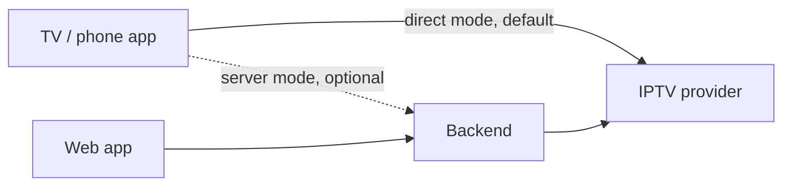
```mermaid
flowchart LR
  TV[TV / phone app] -->|direct mode, default| P[IPTV provider]
  TV -.->|server mode, optional| B[Backend] --> P
  WEB[Web app] --> B
```

- Same interface as the backend client, so stores and screens do not change; only the app context picks the client.
- On the device: profiles, progress and the deduplicated library live in secure storage / memory. No sync between devices in direct mode (a later option).
- Title normalizer is ported to TypeScript. Both versions run the same JSON test cases to avoid drift.
- Live guide uses the provider's short EPG per visible channel; full XMLTV files are too large to parse on a TV.
- Playback goes straight to the provider with the configured User-Agent; no relay.
- The web app keeps needing the backend: browsers block direct provider calls (HTTP from an HTTPS page, no CORS).

Why not drop the backend: it still serves the web app, cross-device sync and heavier work (full XMLTV); keeping it optional costs nothing for native users.

Storage on TV: credentials in expo-secure-store; profiles, progress and the library cache in app-private JSON files (`expo-file-system`), because secure storage is meant for small values. The native player and downloads send the provider User-Agent (`BACKEND_PROVIDER_USER_AGENT`), saved natively so downloads resumed after a restart use it. Known limits: KI-034 – KI-036.

2026-09-24 update, after a real 125k-title catalog:
- Library files use a compact array format (`libraryCodec.ts`, about a third of plain JSON, 85 MB before). Old files are deleted, not migrated.
- Background refresh every 24 h instead of 12 h: grouping a big catalog takes about 2 minutes on a phone.
- Playback falls back to the stream server named in the login reply (`server_info`) when the portal address fails. Some panels answer API calls on one host and streams on another.

Update 2026-09-28: "My server" and the backend are removed; direct mode is the only mode ([D-088](#d-088)).

## D-039

**On-device diagnostics log with manual sharing** — 2026-09-24 (requested by owner: export the log for analysis)

Decision: a shared ring buffer (`appLog`, 600 lines) records provider requests, library save/load, player sources and native errors, and uncaught errors. It is saved in app storage across restarts. The TV **Log** screen shares it through the Android share sheet.

- Usernames and passwords are masked when a line is recorded (query strings and `/movie|series|live/<user>/<pass>/` paths), so a shared log never contains them.
- Nothing leaves the device unless the user taps **Share log**; there is no remote logging service.
- The native player now reports the underlying cause (HTTP status, connection error) with ExoPlayer's generic "Source error", both on screen and in the log.

Why not a crash/analytics service: it needs an account, sends data off the device by default and would still miss the provider-side causes this log records.

Update 2026-09-26 (requested by owner: clean the log after some time): lines older than 3 days are dropped when the app starts and while it logs, besides the 600-line cap.

## D-040

**Category pages, load-on-scroll and one generated app icon** — 2026-09-24 (requested by owner)

Decision:
- Row titles are links ("Drama ›"). On TV/phone they open a category grid screen; on the web they open the Movies/Series page with that category chip selected.
- Rows and grids load the next page when scrolled near the end and show a spinner meanwhile. The web grid loads automatically instead of a "Load more" button (the button stays where `IntersectionObserver` is missing).
- One icon design lives in `scripts/render-icons.mjs` and is rendered to all PNGs (launcher, adaptive icon, TV banner, splash, web favicon). The APK shows it on the native launch screen (`expo-splash-screen`) and on the first "Starting" screen, so start-up looks like one step.

Why generated PNGs are committed: builds (CI prebuild, Vite) then need no image tooling. The icon has no text because `APP_NAME` comes from `.env`.

## D-041

**The TV/phone app copies the web design** — 2026-09-24 (requested by owner: "the APK should look exactly like the web app")

Decision: the native screens are rebuilt to mirror the web pages instead of wrapping the web app in a WebView.
- Colours, the web's fluid sizes (`clamp()` of the screen width) and the icon set live in `@iptv/shared` (`design/`). A test checks the tokens against the web CSS, so the two cannot drift apart.
- Same layout: top nav with search and account menu (no side rail), hero, rows, category chips + grid, details as a panel over the page, web guide layout, web player controls, profile management.
- TV extras stay invisible to touch users: D-pad focus outlines, remote keys in the player, and in the guide focus describes a programme and Select plays it (on a phone a tap selects it, as on the web).
- The account menu adds **Log** (diagnostics, D-039); web search now also lists live channels, which the TV search already did.

Why not a WebView: it would need a running server again (browsers cannot call the provider, D-038), lose native playback/downloads and handle the remote poorly.

## D-042

**"Skip ahead" with fixed choices instead of Skip Intro** — 2026-09-24 (requested by owner: no processing in the backend)

Decision: no intro detection. Early in an episode (5–90 s, episodes ≥ 10 min, same window as before) the player shows **Skip ahead**. Pressing it opens 30 s, 1 min, 2 min and 3 min; choosing one jumps that far from the current position. Pressing Skip ahead again, Back on the remote or Esc on the web closes the choices without skipping. Same rule and labels on web and TV (`SKIP_AHEAD_*` in `@iptv/shared`).

Why: providers send no intro markers and detecting intros (audio fingerprinting, learning from skips) needs server-side processing the backend will not do. A fixed "Skip Intro" to 90 s was often wrong; letting the viewer pick the distance is honest and good enough.

## D-048

**UI stress test: huge categories** — 2026-09-24 (requested by owner)

Setup: `FAKE_PANEL_STRESS=5000` makes the fake panel serve a 4,000-title movie category, 60 small categories and 500 live channels. `scripts/stress-web.mjs` scrolls the web grid to the end; the same scroll ran against the TV/phone app in a browser build.

Findings:
- **TV/phone Movies/Series grid** (virtualized `FlatList`): about 36 cards stay mounted and the heap stays flat down to thousands of titles; no slowdown with depth.
- **Web grid** (not virtualized): every loaded page re-rendered all cards, and layout of thousands of cards dropped scrolling to ~100 ms frames (under 10 fps) after ~2,500 titles.
- **TV/phone Live TV guide**: all loaded channel rows stay mounted (500 rows ≈ 9,500 views); each next page of 50 channels takes a noticeable pause to mount in the browser build.

Decision:
- Web: `MasterCard` is memoized (a new page renders only its own cards) and grid cards use `content-visibility: auto`, so the browser skips off-screen cards. Result: scrolling stays at ~60 fps (17 ms p50) up to ~3,600 cards; short hitches remain when a page is added.
- TV/phone guide: rows are memoized and each row gets only its own selection, so moving focus or loading more channels does not re-render every row.

Not done: full virtualization of the web grid (fixed card height per breakpoint) and of the Live TV guide; worth it if providers with far larger categories show hitches on real devices.

## D-047

**Expandable category chips in the TV/phone app** — 2026-09-24 (requested by owner)

Decision: Movies/Series (and Live TV on phones in portrait) show category chips on one horizontal line. When they do not fit, a **Show all ⌄** button at the end of the line wraps every chip across the full width; the same spot then shows **Show less ⌃**, which returns to the single line. Picking a chip also returns to the line, scrolled so the chosen chip is visible (also when a category is opened from a Home row). The web page already wraps its chips, so it is unchanged.

Why: providers often have dozens of categories with long names; scrolling a single line sideways to find one is slow on a phone and with a remote.

## D-046

**Phone player: full-screen landscape, double tap to seek, timeline drag, screen stays on** — 2026-09-24 (Step 9, phone app)

Decision: on phones (not TV) the player locks to landscape while open (`expo-screen-orientation`) and hides the navigation bar (`expo-navigation-bar`; swipe from the edge shows it briefly); both come back on close, so the rest of the app follows the device. A tap shows or hides the controls; a second tap within 300 ms on the left or right third seeks −10 s / +10 s (same circle animation as the remote) and leaves the controls as they were. The timeline can be dragged: the thumb grows, the time shows above it, and the video seeks once on release. On phones and TV, the player view keeps the screen on while video plays (Android `keepScreenOn`), so neither the phone's screen timeout nor the TV screensaver starts mid-film; paused, the device may sleep again.

The details panel on phones uses 16 px sides, and each episode shows its Play/Download buttons under the title, so long episode names are not squeezed into a narrow column.

Why: these are the touch gestures phone users expect from video apps, and they reuse the TV seek logic (`SKIP_SECONDS`, `TapFlash`).

Update 2026-09-25 (reported by owner on a Pixel Pro XL): phones now show the status bar and start the app below it, so the rounded screen corners and the camera cut-out no longer cover the header; the player and TVs stay full screen. The compact "Sort by" select on Movies/Series is sized to its text and may shrink, so the "Sort by" label beside it is no longer pushed off the left edge.

## D-045

**Smaller APK: compressed native libraries, R8 and resource shrinking** — 2026-09-24 (requested by owner: the APK was ~40 MB)

Measured with `tv-apk.yml` (ARM APK, `armeabi-v7a` + `arm64-v8a`): **42.5 MB before**, but only 22.5 MB once zipped. Most of the difference was native libraries (`.so`) stored uncompressed, which newer Android Gradle defaults do so the phone can load them without extracting.

Decision (`expo-build-properties` in `app.config.ts`):
- `useLegacyPackaging: true`: native libraries are compressed inside the APK and extracted on install.
- `enableMinifyInReleaseBuilds` + `enableShrinkResourcesInReleaseBuilds`: R8 removes unused Java/Kotlin code and unused resources.

Result: **about 16 MB** (−62%). The Maestro emulator flows (online, offline, direct) pass on the shrunk release build. Trade-off: the installed app uses a little more storage (extracted libraries) and installs a bit slower; download and sideload size matter more for TVs.

`tv-apk.yml` now prints a size breakdown (native libraries, Dex, JS bundle, resources) and, with `publish: false`, keeps test builds out of the `tv-apk` release.

Not done: separate APKs per ABI (arm64 only would save a few more MB, but many Android TVs run 32-bit userland and users would have to pick the right file); an app bundle (`.aab`) only helps through Google Play.

## D-043

**APK Home rows: 10 titles and a "See all" arrow card** — 2026-09-24 (requested by owner: phone rows slowed down while scrolling)

Decision: in the TV/phone app, each Home row shows its first 10 items (titles or live channels) and no longer loads more while scrolling. When the category has more, the last card is an arrow ("See all") that opens that category: Movies/Series with its chip selected, or Live TV on that channel category. The row title link does the same. The web keeps D-040 (rows load more on scroll).

Why: loading and rendering more pages inside a horizontal row made fast scrolling stutter on phones. A short row plus one tap to the full, paged category grid keeps Home light.

## D-044

**Faster pipelines: build one ABI for the emulator, run CI once per PR push** — 2026-09-24 (requested by owner: evaluate faster pipelines)

Measured on PR #5 (2026-09-24): `tv-app.yml` took ~25 min: APK build 14 min (three ABIs), Maestro flows 8 min, local stack 1.5 min, setup 1.5 min. `ci.yml` jobs take 2–3 min each in parallel, but ran twice per push (push + pull_request events).

Decision:
- The emulator build compiles only `x86` (the emulator's ABI). Real-TV ARM APKs come from `tv-apk.yml` (D-037).
- `ci.yml` runs on pull requests and on pushes to `main` only.

Result: on busy runners (2026-09-24 evening) the APK build went 14.2 → 10.9 min and the whole emulator job 25.3 → 21.4 min. On quiet runners (2026-09-25 morning, same time, same commits otherwise) the build was 8.0 min with three ABIs and 6.6 min with x86 only (−17%), while the Maestro step alone varied between 5 and 8 min from run to run. The ABI saving is real but modest; most of the build (JS bundle, Kotlin/Java, per-module Gradle work) does not depend on the ABI count, and runner load matters more.

- The emulator build prefills "My server" with the backend address (`APP_API_BASE_URL`), so the server-mode flow no longer types it: long `inputText` on a busy emulator made Maestro's driver die (`DeviceServerDiedException`) twice on 2026-09-24.

Not done (small gain or risky): caching native (CMake) build output between runs; starting the local stack in the background during the Gradle build (~1.5 min); splitting Maestro flows across parallel emulators (three emulator boots and three APK builds cost more than they save).

Update 2026-09-25 (requested by owner): changes that touch only Markdown files or `LICENSE` skip the builds. In `ci.yml` a small `changes` job compares the pull request (or push) with its base; when nothing else changed, `checks` and `web-e2e` are skipped, which GitHub counts as passed, and `lint` still checks the Markdown formatting. `tv-app.yml` ignores `*.md` in its path filter. Manual runs always build everything.

Update 2026-09-26 (requested by owner): the emulator build keeps Gradle's cache between runs. `--build-cache` stores task outputs in `~/.gradle/caches`, and the cleanup step no longer deletes that folder, so `setup-gradle` saves it at the end of the job. Runs on `main` write the cache; pull requests only read it (the action's default), so branches cannot fill it with stale entries. Measured on 2026-09-26: "Build release APK" 7:19 without the cache, 6:44 on the run that filled it, **4:17** on the next run; the whole job 14.5 → 12 min. Saving the cache takes about 15 s and restoring it about 10 s. Pull requests gain once `main` has run with this change.

## D-049

**Library sort: recently added by default; name and release date on request** — 2026-09-25 (requested by owner)

Before: Movies/Series grids were always A–Z. That order came from this app (backend `LibraryService` and the direct-mode client sorted by title), not from the provider.

Decision:
- Sort keys per master title, computed by the normalizer (Python and the TypeScript port, same shared cases):
  - `added_at`: newest provider time among the variants. Movies use Xtream `added`; series use `last_modified` (series lists have no `added`).
  - `release_key`: `YYYYMMDD` from the provider release date (series), else `YYYY0000` from the year in the title.
- `GET /api/library/{kind}` takes `sort` (`added` default, `title`, `released`) and `order` (`asc`/`desc`; dates default to newest first, title to A–Z). Missing values sort last; ties go by title, then year. The response lists in `sorts` which orders the library has data for, and the apps only offer those.
- Web and TV/phone Movies/Series pages have a "Sort by" menu: Recently added, Oldest added, Name A–Z/Z–A, Newest/Oldest release. The choice is kept per section until sign-out. Home rows use the default; search results stay A–Z.
- Direct mode sorts the same way; the saved library format goes to 3, so it is rebuilt once.

Existing server libraries get the dates on their next sync (every login, or "Refresh library" in the account menu); until then only Name is offered.

## D-050

**Offline downloads: encrypted on Android, tied to the account, 30-day online check** — 2026-09-25 (requested by owner: offline anti-piracy hardening, KI-002, KI-003)

Decision:
- **Android (KI-003):** downloaded media is AES-encrypted in the Media3 cache (`AesCipherDataSink`/`AesCipherDataSource`). The key is random per install and stored only wrapped by an Android Keystore key, which cannot be exported. Downloads made before this change cannot be read and are deleted once on the first start.
- **Tied to the account (web + Android):** "Sign out" deletes the downloads on the device (the menu warns first). Signing in with a different account deletes the previous account's downloads. Before, downloads stayed after sign-out and were visible to the next account.
- **Online check (web + Android):** downloads play only if the provider subscription has not expired and the app reached the server (server mode) or the provider (direct mode) within the last 30 days. Opening the app online renews it; My Downloads shows the date. A device clock set back before the last check also blocks. When blocked, Play is hidden; online, the player streams instead.
- **Direct mode** now asks the provider for the account status on start (10 s limit). Unreachable → offline mode; rejected or inactive account → signed out. Before, it trusted the saved account.

Why: downloads are private copies for the subscriber. They should not outlive the subscription, move to another account, or be readable as plain files.

Limits (see KI-002, KI-038): the rules run inside the apps. Web chunks are encrypted, but any script on the origin (DevTools) can still get decrypted bytes; on a rooted Android device, code running as the app can use the key. Real protection needs DRM, which Xtream providers do not offer.

## D-051

**Periodic library sync in the backend** — 2026-09-25 (chosen by owner from the suggestions; KI-016)

Before: a server library was refreshed only at login or with "Refresh library". Sessions last 30 days, so new titles and the sort dates (D-049) could be weeks old.

Decision:
- A background timer in the backend checks at start and every 30 minutes.
- It queues a library sync for every account that has a valid session, has no queued or running job, and whose last sync is older than `BACKEND_LIBRARY_REFRESH_HOURS` (default 12; `0` turns it off).
- Syncs go through the existing queue (`LibrarySyncQueue`), one account at a time, like a login sync.

Why accounts with a valid session: signed-out accounts do not need fresh data, and each sync downloads the full provider catalog.

Direct mode is unchanged: the app already rebuilds its library in the background when it is older than 24 h (D-038).

## D-052

**Release-signed APK and increasing version codes** — 2026-09-25 (chosen by owner from the suggestions)

Before: every APK was signed with the debug key from Expo's project template (`android/app/debug.keystore`). That key is the same file in every Expo project, so updates did install over each other and kept their data, but so would any APK that anyone signs with that public key and gives the same package name: it could replace the app and read its data (sign-in, provider password, downloads). Every APK also had version code 1.

Decision:
- `scripts/create-signing-key.sh` creates one release key (PKCS12, RSA 2048, valid 100 years) in the git-ignored `.signing/` folder and prints two values for the repository secrets `ANDROID_KEYSTORE_BASE64` and `ANDROID_KEYSTORE_PASSWORD`. It uses keytool, or openssl when Java is missing.
- The config plugin `apps/tv-app/plugins/withReleaseSigning.js` adds a release signing config to the generated Gradle file. It uses the key only when `ANDROID_KEYSTORE_FILE` is set at build time, so local builds still work without it.
- `tv-apk.yml` decodes the secrets, signs with the release key, and prints the certificate fingerprint in the run summary. Without secrets it warns and falls back to the debug key.
- `tv-apk.yml` sets the version code to its run number, so each APK counts as newer than the last.
- The emulator CI signs with a throwaway key made by the same script, so the signing setup is tested on every TV change.

Consequences:
- Only APKs signed with this private key can replace an installed release-signed app.
- Switching an installed debug-signed app to the release key needs one uninstall (Android refuses a different signature). Back up first (D-056) and restore after installing; downloads are lost once.
- The key must be backed up. If it is lost, the next APK needs a new key and again one uninstall.

Update 2026-09-25 (requested by owner: automate the setup): the script also saves both secrets itself with the GitHub CLI (`gh secret set`) after a one-time browser login. It ignores the Codespace's own token, which cannot write secrets. A workflow cannot create and store the key by itself: its token has no permission to write secrets, and in a public repository artifacts, release files and caches are readable by others. Backing up `.signing/` stays manual.

Update 2026-09-25 (requested by owner): `--delete` removes both secrets from the repository (for example to stop signing, or before handing over the repo), and `--replace` makes a new key, keeps the old folder as `.signing.old-<time>` and saves the new secrets (a lost or leaked key). Both ask for "yes" first, because replacing the key means one uninstall on every device.

## D-053

**Kids profiles show only kids categories** — 2026-09-25 (chosen by owner from the suggestions)

Before: "Kids profile" was only a label; a Kids profile saw everything.

Decision:
- Xtream providers send no age ratings, so a category counts as "for kids" when its name says so, in several languages (Kids, Kinder, Children, Cartoons, Animation, Family, Disney, KiKA, Enfants, …), unless the name also suggests adult content (Adult, XXX, 18+, …). The rule lives in `packages/shared/src/profiles/kidsFilter.ts`.
- While a Kids profile is active, the shared API client (`withKidsFilter`) only returns kids categories, live channels in them, guide rows for them, and library titles with a version in one of them. This covers Home rows, Movies/Series, Live TV, the guide and search on web and TV/phone, in server and direct mode.
- The backend and the direct-mode client accept `categoryIds` (comma-separated) on `/api/library/{kind}` and `/api/epg` for the "all categories" views. When a provider has no kids categories, a Kids profile sees nothing rather than everything.
- Switching between a Kids and a regular profile drops cached categories, guide and library pages, so nothing loaded for an adult profile stays on screen.

Not done (see KI-039): a PIN to leave a Kids profile or edit it; per-profile choice of allowed categories.

Update 2026-09-26 (requested by owner): a Kids profile's account menu only offers the other profiles and **Switch profile**. Settings, languages, Parental PIN, sync with phone, backup, refresh library, updates, the log, About and sign-out are gone there, and so is "Open in another player" (that app is outside the Kids limits). Parents set a Kids profile's categories and languages in the profile editor (Manage Profiles → the profile, behind the parental PIN when one is set), which now also has **Choose languages**.

## D-054

**Optional parental PIN** — 2026-09-25 (requested by owner: "it must be optional to set one up")

Decision:
- Account menu → "Parental PIN" (web and TV/phone) sets a 4-digit PIN, typed twice. It is off until someone sets one; changing or removing it needs the current PIN.
- With a PIN set, it is needed to open a regular profile from a Kids profile or from "Who's watching?", and to add, edit or delete profiles (asked once per visit to the picker). Opening a Kids profile, and switching between regular profiles, never asks.
- Stored per account on the device as a salted, repeatedly hashed value (secure storage on TV/phone, browser storage on the web), never in plain text. Five wrong tries lock checks for a minute.
- Signing out removes the PIN on that device, so a forgotten PIN costs one sign-in with the provider password (which a child should not have).
- The TV/phone prompt is an on-screen keypad that works with the D-pad and touch.

Why per device and not on the server: it also has to work in direct mode, where there is no server, and a child is kept out on the device they use.

Limits: the PIN is not shared between devices; on the web, clearing the site's data removes it but also signs out.

## D-055

**Watchlist ("My List") per profile** — 2026-09-25 (requested by owner)

Decision:
- Each profile can save movies and series to "My List" with a round +/✓ button on the details panel (web and TV/phone). Saved titles show as a "My List" row on Home (after Continue Watching) and on their own page in the top navigation.
- An entry points at a library title (section + master id, stable across re-syncs) and keeps its title, year and poster, so the list shows without loading the library.
- Stored like watch progress: in the backend (`/api/profiles/{id}/watchlist`, table `Watchlist`) in server mode, in the device's data storage in direct mode. Deleting a profile deletes its list. At most 500 titles per profile.
- Adding and removing update the screen at once and are undone if saving fails.

Kids profiles only reach kids titles (D-053), so their lists only hold those. The data backup (D-056) includes the lists.

## D-056

**Password-protected backup and restore of user data** — 2026-09-25 (requested by owner)

Decision:
- Account menu → "Back up data" (TV/phone) or "Back up & restore" (web) saves one `.iptvbackup` file. "Restore from backup" on the login screen (and in the web dialog) reads it back and signs in, without restarting the app (`AppContext.reload()`; the web reloads the page).
- The file holds what the app keeps in storage: the saved sign-in (session, and in direct mode the provider login), the connection choice and "My server" address, the parental PIN, and per profile the profiles, watch progress and My List. The library cache (rebuilt after sign-in), downloads (large, and tied to this device's key, D-050) and the diagnostics log stay out. Restoring a different account still removes the previous account's downloads.
- The contents are encrypted with a password chosen when saving (at least 8 characters): PBKDF2-SHA256 with 100,000 rounds and a random salt, then XChaCha20-Poly1305 (`@noble/hashes`, `@noble/ciphers`: audited, plain JavaScript, so the same code runs in browsers and on Hermes). A wrong password or a changed file fails the check and nothing is written.
- The file carries a format name and version; files from a newer app version are refused with a message to update first.
- TV/phone use the Android system pickers from `expo-file-system` to choose a folder (save) or a file (restore), e.g. Downloads, a USB stick or a cloud drive. No new native modules or permissions.

Alternatives: an unencrypted file (holds the provider password, rejected); syncing through the backend (most users run without one).

Update 2026-09-26 (requested by owner): device-wide app settings are included too. An app lists their keys in `BackupStorages.settingsKeys`; the TV/phone app lists its playback settings (audio decoder choice, D-059). Older backup files without them still restore; the device then keeps its current choice.

## D-057

**Open movies and episodes in an external player (TV/phone)** — 2026-09-25 (requested in PR #18)

Decision:
- The details panel has a round "open in another player" button next to Play (movies) and next to each episode's Play and Download buttons. It hands the stream to an installed video player such as VLC, MX Player or Just Player.
- The app asks for the same stream our player would start with (the original file, else HLS) and sends it with an Android `ACTION_VIEW` intent: MIME type `video/*` (`application/vnd.apple.mpegurl` for HLS), the title in the `title` extra, and the provider User-Agent in the `headers` extra (`["User-Agent", "…"]`, read by MX Player and Just Player).
- When the user has chosen a default video player, Android opens it directly; otherwise the system app chooser is shown. With no player app installed, a message suggests installing one.
- Server mode hands over the relay URL, which carries its own short-lived token, so the other app needs no login. Offline, and for downloads, the button explains that downloads only play in this app (they are encrypted, D-050).
- The manifest declares a `<queries>` entry for video intents, which Android 11+ needs to list other players.
- Web: not offered (browsers cannot start another app with a stream).

Consequences: progress watched in another app is not saved, so Continue Watching does not move (KI-041).

## D-058

**Live TV: see-through guide over the playing channel (TV/phone)** — 2026-09-25 (requested in PR #18)

Decision:
- While a live channel plays, a semi-transparent panel on the left lists the channels of the same category with the programme on now (time, progress bar) and the next one. The video keeps playing, visible beside and through the panel.
- TV remote: ↑ opens it (↓ still opens the audio/subtitles drawer); ↑/↓ move through the channels, starting on the one playing; Select switches to the focused channel; Back closes it. Focus stays inside the panel.
- Phones: swipe up on the video, or the Guide button in the player controls; tap a channel to switch, tap beside the panel to close.
- It closes by itself after 6 s without a key press, focus change or scroll.
- It shows the first 50 channels of the category (one guide page) for the next 3 hours; the full grid stays on the Live TV page. Players opened from the Home row or Search also know their channel's category (`liveTarget`, `PlayTarget.categoryId`).
- Web: not part of this change.

Alternative: a full-screen guide (the Live TV page) stops being "over" the video, which the request wanted to avoid.

## D-059

**Bundled FFmpeg audio decoders (switchable)** — 2026-09-26 (requested by owner after KI-043)

Decision:
- The TV/phone player bundles software audio decoders from FFmpeg (Dolby Digital, Dolby Digital Plus, DTS, TrueHD and more) through Jellyfin's prebuilt Media3 extension `org.jellyfin.media3:media3-ffmpeg-decoder` (same Media3 version, 1.9.0). No native build in this repository.
- The device's own decoders come first on every device (owner's choice), so Dolby audio can still reach a soundbar or receiver; FFmpeg decodes the formats the device cannot. Because some decoders claim support and then fail mid-stream (a Pixel with Dolby Digital Plus, KI-043), the user can switch to "FFmpeg first"; the audio error message points there.
- It is one switch: `modules/tv-media/android/build.gradle` adds the dependency unless the Gradle property `iptvFfmpegAudio=false` or the env var `IPTV_FFMPEG_AUDIO=0/false` is set. The player code works either way. `tv-apk.yml` has a `ffmpeg_audio` input (manual runs) so an APK without it can be built for comparison or as a second variant; pushes to `main` bundle it. The log's start line says whether it is bundled.
- Users can choose in the account menu → **Playback** (shown only when FFmpeg is bundled): Device decoders first (default) or FFmpeg first. The choice is saved on the device and applies to the next title. It is part of the data backup (D-056), so a reinstall or a restore keeps it.
- To remove it for good: delete those lines in `build.gradle` (and optionally the `ffmpeg_audio` input).

Open: the APK size cost is measured before deciding whether to keep it, ship two variants, or offer it as a separate download.

## D-060

**Sign in and sync a TV by scanning a QR code with the phone app** — 2026-09-26 (requested by owner)

Decision:
- The TV's sign-in page shows a QR code next to the form ("Sign in with your phone"); signed in, the TV's account menu has **Sync with phone** with the same code. On the phone app, account menu → **Connect a TV** opens the scanner.
- Scanning signs a signed-out TV in with the phone's account (sign-in, connection choice, provider login, parental PIN) and opens the TV's profile picker. A TV signed in to the same account is synced. A TV signed in to another account refuses with a message (sign out on the TV first).
- Both ways the profiles, watch progress and My List of the two devices are merged, and both devices end up with the same lists: profiles match by id, else by name (each device creates a profile named after the login on first sign-in), and the phone's profile ids are kept; per title the most recent progress wins; My List is the union (earliest "added" date). A title removed on only one device comes back, since removals are not recorded. In "My server" mode these live on the server already, so only the sign-in moves.
- Device settings stay on each device: the audio decoder choice (D-059) is never sent. A PIN set on the phone is copied to a synced TV only when the TV has none.
- Transport, no server needed: while the code is on screen the TV runs a small HTTP server on the home network (random port, `PairingServer.kt`). The code holds the TV's address, port and a one-time 32-byte key from `SecureRandom`. The phone sends its data encrypted with that key (XChaCha20-Poly1305, like the backup, D-056) and the TV answers with the merged data encrypted the same way, so plain HTTP on the LAN reveals nothing. Requests with another key are ignored; the server stops after one successful pairing or when the code closes.
- The phone scans with Google's code scanner from Play services (`play-services-code-scanner`): no camera permission, and the scanner UI is downloaded by Play services, so the APK barely grows.
- Protocol and merge live in `packages/shared/src/pairing/` (tested with two in-memory devices); the app side is `apps/tv-app/src/pairing/`.

Limits: phone and TV must be on the same network, and the phone needs Google Play services. The web app is not part of this change.

Alternatives: the TV scanning the phone (TVs have no camera); a relay service on the internet (the provider login would pass through a third party); typing a short code on the TV (still needs a way for the devices to find each other).

## D-061

**Play on TV: start a title on the paired TV from the phone app** — 2026-09-26 (requested by owner)

Decision:
- After a phone and a TV are paired (D-060), the phone app shows a round TV button next to Play (movies, the series Play/Resume, and each episode). It starts that title on the TV, on the TV's active profile, with the same resume position for movies. The phone shows "Playing on <TV name>" or why it did not work.
- Pairing hands the phone a remote key inside the encrypted pairing answer. Each phone gets its own random 32-byte key and id; the TV keeps the last 5 phones, the phone keeps its TV (name, address, port). Keys stay in the Keystore-backed storage and are not part of backups.
- While the TV app runs and is signed in, it listens on the home network on the first free port of 38127–38131 (`PairingServer.kt`, same small server as pairing, path `/remote`). The phone tries the saved port, then the rest of that range, so a TV app restart that lands on another port is found again.
- Each command is sealed with that phone's key (XChaCha20-Poly1305) and carries its send time; the TV refuses unknown phones, other keys and commands older than 5 minutes (replays). It also refuses titles for another account and asks to pick a profile first when none is active. A title already playing on the TV is replaced.
- Protocol in `packages/shared/src/pairing/remote.ts` (tested with a fake TV); app side in `apps/tv-app/src/pairing/remote.ts` and `PlayOnTvButton`.

Limits: the TV app must be open (Android does not keep it listening in the background) and both devices on the same network. If the TV gets a new address from the router, pair again (account menu → Sync with phone). No other remote controls (pause, seek) yet.

Alternatives: Google Cast (needs a registered receiver app and Google's cast framework on both sides, and the Chromecast would still need this app for the provider streams); finding the TV by network discovery (mDNS/NSD) instead of the saved address: more native code, left for when addresses change in practice.

## D-062

**Self-update from the GitHub release (TV/phone)** — 2026-09-26 (requested by owner: the app is only installed from this repository, not a store)

Decision:
- About 15 s after start the app reads this repository's `tv-apk` release from the GitHub API (no login; 60 requests per hour per address is plenty). The version is the `version N` in the release notes, which is the Android version code (`APP_ANDROID_VERSION_CODE`, D-052; the readable MAJOR.MINOR.PATCH is D-070). When it is newer than the installed one, a dialog offers "Update now" or "Later". "Later" stops the automatic prompt for that version; account menu → **Check for updates** always shows it.
- "Update now" downloads `tv.apk` into the app cache with a progress bar and checks the SHA-256 GitHub publishes for the file. Before installing, the app checks the downloaded APK itself: same package, newer version code, and the same signing key as the installed app. Then it opens the Android installer (`FileProvider` + `ACTION_VIEW`), where the user confirms. Data stays, as with any update.
- Android 8+ asks once for permission to install apps from this app ("Install unknown apps"); the dialog opens that setting.
- An APK signed with another key (the one-time switch from the debug key to the release key, D-052) cannot be installed over the app; the dialog says so and explains back up → uninstall → install → restore instead of letting the installer fail.
- The workflow uploads the APK before it writes the new notes, so an app never sees a new version number next to the old file. `APP_UPDATE_REPO` is set by `tv-apk.yml`; local and CI emulator builds have none and never check.
- Code: `AppUpdater.kt` (download, checks, installer), `apps/tv-app/src/update/` (release parsing, flow, dialog). New permission: `REQUEST_INSTALL_PACKAGES`.

Limits: versions installed before this change cannot update themselves; install this version once by hand. Android always shows its own install confirmation; silent updates need device-owner rights.

Alternatives: a store (not wanted); a separate updater app such as Obtainium (one more app to install and configure); a version file in the repository instead of the release notes (the notes are already written by the same step).

## D-063

**Language filter per profile (audio or subtitles from the names)** — 2026-09-26 (requested by owner)

Decision (several languages since D-067):
- Account menu → **Language** (TV/phone and web) sets a language per profile, on this device: libraries, Home rows, category pages and search then only show titles with a version that has that audio **or** subtitle language. "All languages" turns it off. The choice is kept in `settings.profiles` (new per-profile preferences store) and is part of the TV/phone backup.
- Providers do not list tracks per title, so languages come from the names, as for the version labels (D-017): audio from tags like "EN - ", "[GER]"; subtitles from a language next to a subtitle word ("SUB ITA", "ENG-SUB", "[ENG SUB]") and from "VOSTFR" (French), "VOSE" (Spanish), "Legendado" (Portuguese), "Multi-Sub" (`MULTI`, several unnamed). A language next to a subtitle word no longer counts as audio. Same rules in the Python normalizer and the TypeScript port (shared cases).
- Titles whose names carry no language at all are hidden while a filter is on; that is what the filter asks for.
- Server mode: `media_variants.subtitle_languages` (migration `AddSubtitleLanguages`, default `[]`), `VariantInfo.subtitleLanguages`, and `GET /api/library/{kind}?language=ENG`. Direct mode filters the on-device library the same way. The saved direct-mode library keeps its format: subtitles are an optional last field, so existing libraries load and pick subtitles up at the next refresh.
- Live TV is not filtered (channels rarely have language tags in a usable form).

Alternatives: reading tracks per title with `get_vod_info` (one request per title, not possible for lists of 100,000+); the category name as a language hint (useful for some providers, needs category names in the server-mode pipeline; possible follow-up).

## D-064

**Parents choose a Kids profile's categories** — 2026-09-26 (chosen by owner from the suggestions; KI-039)

Decision:
- In the profile editor (profile picker → Manage Profiles, behind the parental PIN when one is set, D-054), a saved Kids profile has **Choose categories**. It lists the provider's categories for Movies, Series and Live TV with checkboxes, starting from the automatic choice (names, D-053). Only checked categories are shown to that profile; "Automatic" puts a section back on the name rule.
- The choice is kept per profile on this device (`settings.profiles`, the store from D-063; part of the TV/phone backup). A section left untouched keeps the name rule; an empty choice shows nothing of that section.
- `withKidsFilter` takes the chosen ids instead of the name rule for those sections; everything else (library lists and search, raw lists, channels, the guide) works as before. Changing the choice drops cached lists at once.
- TV/phone and web.

Alternatives: picking titles one by one (thousands of titles, and new ones would need picking too); storing the choice on the server (most users run without one).

## D-065

**Merge translated titles by the TMDB id in provider lists** — 2026-09-26 (requested by owner)

Decision:
- After name grouping (D-017), groups that share a TMDB id become one title: "La Casa de Papel (2017)" and "EN - Money Heist (2017)" show as one title with two versions. Same rule in the Python normalizer (`merge_by_tmdb`) and the TypeScript port (`mergeByTmdb`), with a shared case.
- The id is read from the provider lists (`get_vod_streams`, `get_series`: field `tmdb` or `tmdb_id`); "0" and empty mean none. Server mode passes it through `MovieSummary`/`SeriesSummary` to the pipeline; direct mode reads it in `xtream.ts`.
- A shared id only joins groups whose years agree, or when one side has no year: providers reuse ids for remakes or set them wrongly, and a wrong merge hides a title.
- Not all panels send ids in their lists. The direct-mode log line "N items downloaded … M with a TMDB id" shows whether a provider does; with none, titles group by name as before (KI-014).

Alternatives: `get_vod_info`/`get_series_info` per title (has the id more often, but one request per title, not possible for 100,000+ titles); looking titles up on TMDB itself (needs an API key and a network call per title; possible follow-up for providers without ids).

## D-066

**One episode list per series, across its versions** — 2026-09-26 (requested by owner; KI-025)

A series title can have several versions ("EN - Show 4K", "GE - Show"). Each is its own series at the provider with its own seasons and episodes, and they are often incomplete in different ways. Before, the details page showed only the chosen version's episodes.

Decision:
- The details page (TV/phone and web) loads the episode lists of all versions (three requests at a time; a version that fails is left out) and merges them by season and episode number into one list. Episodes without a number cannot be matched and stay separate; so do two episodes with the same number in one version.
- Each episode plays in the version chosen at the top ("Version / Stream Quality") when that version has it, otherwise in the best version that does. An episode in several versions has its own version picker; one in a single version says "Only in GER". Text and pictures come from whichever version has them.
- The player loads the same merged list for next-up and its episode list, preferring the version that is playing: after the last episode of one version it continues with the next episode from another. "Resume" and progress bars use saved progress from any version.
- Done in the clients (`playback/seriesVersions.ts` in shared), so server and direct mode behave the same; no backend or schema change.

Limits: episodes line up by their numbers only. A provider that numbers a season differently in two versions (specials in season 0 in one, at the end of season 1 in the other; one long season split in two) produces a list that does not line up; the version picker per episode is the way around it. Opening a series costs one provider request per version.

Alternatives: merging during library processing (would need `get_series_info` for every series version up front, too many requests for large lists); ranking versions by episode count (KI-025; still hides episodes that only exist in lower-ranked versions).

## D-067

**Several languages per profile in the language filter** — 2026-09-26 (requested by owner; extends D-063)

Decision:
- Account menu → **Languages** takes any number of languages per profile: titles show when a version has audio or subtitles in **one** of them. None ticked (or "All languages") turns the filter off. The dialog names the profile ("Languages for Alex"); each profile keeps its own choice on this device (`settings.profiles`, as before, part of the TV/phone backup).
- Saved as `languages: ['ENG', 'GER']`. A single `language` saved by the earlier version still counts until the profile's languages are changed.
- `GET /api/library/{kind}?language=` takes a comma-separated list (`ENG,GER`); a single code works as before. Direct mode filters the same way.
- On TV, Select toggles a language and the lists reload when the dialog closes.

Alternatives: a repeated query parameter (`language=ENG&language=GER`; the comma list keeps the endpoint's parameter a plain string, like `categoryIds`); an ordered preference list that ranks rather than filters (more to explain; the version picker already lets users choose).

## D-068

**TV sleep mode instead of the system screensaver** — 2026-09-26 (requested by owner)

Problem: with the app left open, the Chromecast's screensaver started after a while. That sends the app to the background, and on a TV with little memory Android closes it (a 160k-title library is large). The next button press then restarted the app from scratch.

Decision:
- While the app is open on a TV, it keeps the screen on (`FLAG_KEEP_SCREEN_ON`, `TvMedia.setKeepScreenOn`), so the system screensaver does not start and the app stays in the foreground.
- After **10 minutes** without a button press, the app shows its own sleep screen: black, with a dim clock and the app name that move every minute (no fixed image on the screen). Never while a video plays; a paused video counts as idle. Any button wakes it, and the page, focus and player are exactly as they were.
- After **3 hours** asleep, the app no longer keeps the screen on, so the TV's own power and screensaver settings apply again (then the system may close the app, as before).
- Phones keep their usual behaviour (screen timeout; the player keeps the screen on while playing).

Alternatives: only making restarts faster (still a restart, and the saved library has to load again); a wake lock (keeps the CPU on, not needed); keeping the screen on forever (burn-in risk, wastes power).

## D-069

**TV navigation: Left/Right stay in their row; Home centres the focused row** — 2026-09-26 (requested by owner)

Decision:
- Left/Right never move focus up or down. Every horizontal group of focusable items is a `FocusRow`, a `TVFocusGuideView` that traps Left/Right: the nav (already since #51), Home rows including their "See all" card, the lines of the Movies/Series grids (the grid now renders line by line), the category chips, the details buttons and each episode row. At the ends, focus stops. The Live TV page is the exception: there, Left/Right move between the category list and the guide on purpose.
- Home (TV) scrolls the focused row to the middle of the screen, instead of Android's minimal scroll that left rows cut off at the top.
- Choosing Home, Movies, Series or Live TV shows a spinner on the first frame and builds the page right after, so the choice is answered at once. Search, lists and the log switch directly.
- Movies/Series also show the "organizing your library" banner, and while it runs an empty grid says that titles appear when it is done, instead of a black page.
- Cards no longer draw an SVG gradient behind the poster (one per card made scrolling rows stutter); a solid colour takes its place.

Update 2026-09-26 (requested by owner): on TV, Home rows draw all their cards at once (at most ~10), because holding Right outran a list still drawing its last cards and focus fell out of the row to the nav. The details page scrolls the focused part (version, season, an episode) to the middle of the screen, and entering an episode from above or below lands on Play (the row is a focus guide with `autoFocus`; the episode's version picker now follows its buttons).

## D-070

**App versions MAJOR.MINOR.PATCH; the update installer opens on top of the app** — 2026-09-26 (requested by owner)

Versions: until now the TV/phone app was only numbered by its build (the `tv-apk.yml` run number, D-052).

Decision:
- The app has a Semantic Versioning version, MAJOR.MINOR.PATCH (Android's version name), starting at 1.0.0. MAJOR.MINOR are set by hand in `apps/tv-app/package.json` (write `X.Y.0`): raise MAJOR for changes that need something from the user (e.g. a reinstall or a new sign-in), MINOR for new features. PATCH counts the builds on `main` since then, computed by `scripts/app-version.mjs` from the git history (the first build of 1.1 is 1.1.0). No manual step per pull request, so merges never conflict on it.
- The build number stays as Android's version code (the run number): Android and the self-update compare it.
- The release notes start with "TV app X.Y.Z" and keep "version N" (the build number), which apps before this change read. The release title shows the version too.
- About shows "1.2.3 (build 57)"; the update dialog says "Version 1.2.4 is available (you have 1.2.3)". Builds from before have no version name and show as "build 55".

Update installer (bug: after "Update now" and the download the dialog said Android would ask to confirm, but no installer appeared until the app was force-closed and the update downloaded again):
- The installer was started from the application context as a new task. Android then looks for an existing task of the installer, such as the one left from the previous update (whose "Open" button also started the app inside it), and may only bring that forward: nothing visible happens. After a force close no such task is left, so the second try worked.
- Now the installer is started from the app's own screen, in the app's task, on the main thread; only without a screen does it fall back to a new task. The dialog also offers "Open the installer again", which reuses the downloaded file, and says so when Android refuses to open it.

Limits: not reproduced on a device in CI (the emulator flows do not install updates); the fix follows how Android places activities in tasks.

## D-071

**Desktop app: the web player in Electron, talking to the provider directly** — 2026-09-26 (requested by owner: use it on the computer like a normal application, without the repository or commands)

Decision:
- `apps/desktop` is an Electron app with installers for Windows (`.exe`, per user, no administrator rights), macOS (`.dmg`, Intel and Apple silicon) and Linux (`.AppImage`, `.deb`). It shows the web player (`apps/web-player`, bundled) in its own window.
- No server: like the TV app it talks to the IPTV provider directly (D-038) and builds the library on the computer (`createAppContext` with `direct`). The web player notices the app from what its preload script adds (`window.iptvDesktop`, `apps/web-player/src/desktop.ts`); in a browser nothing changes.
- A browser page may not read another site's answers (CORS), and providers send no permission for it. The app serves the page from `http://127.0.0.1:47831` itself and adds the permission to provider answers (`webRequest`); provider requests get the player User-Agent (as on the TV) and no page origin. 127.0.0.1 is a secure context, so offline downloads (Service Worker, Web Crypto) work as in the browser. The port is fixed because the page's saved state belongs to its address; if another program uses it, a free port is taken (then only the sign-in carries over).
- Storage goes through the main process: `secure` (session, provider password, PIN) is encrypted by the system (`safeStorage`: Windows DPAPI, macOS Keychain, Linux secret store); `data` (library, profiles, progress) is plain files, since a large library does not fit in `localStorage`. The backup (D-056) covers both, in the same format as the TV app's.
- `desktop.yml` builds the installers on Windows, macOS and Linux runners after changes to the app, the web player or the shared package reach `main`, and publishes them to the `desktop` prerelease with fixed names. The version is MAJOR.MINOR.PATCH (D-070) from `apps/desktop/package.json`. About 15 s after start the app reads that release; for a newer version it offers to open the download page.
- `apps/desktop` is not an npm workspace (its own `package-lock.json`), so the other pipelines do not download Electron. CI (`ci.yml` → Desktop) runs its unit tests and starts it against the fake panel: sign-in without a backend, a movie that plays, and the sign-in kept after a restart.

Limits:
- Plays what Chromium plays, like the web player: MKV-only titles and Dolby/DTS audio need the TV app or an external player (KI-045).
- Installers are not code-signed: Windows SmartScreen and macOS Gatekeeper ask once before the first start. Signing needs paid certificates.
- Updates are downloaded and installed by hand (the app only points to the new version). Automatic updates need signed builds on macOS.

Alternatives: the backend bundled in the app (a .NET runtime and the Python worker per system, much larger, and only useful for the web's server mode); Tauri (smaller, but the system web view differs per system: no HLS on Windows WebView2 without extra work, older WebKit on Linux); a PWA installed from the browser (still needs the backend because of CORS).

## D-072

**Desktop app: sync with the phone by QR code, choose the install folder, smaller download** — 2026-09-26 (requested by owner)

Decision:
- **Sync with phone:** the desktop app is a pairing target like the TV (D-060, same protocol and merge). The login page has **Sign in with your phone** and the account menu → Library & data has **Sync with phone**; both show a QR code. On the phone app, account menu → **Connect a TV or computer** (renamed from "Connect a TV") scans it. While the code is shown, the main process listens on the home network (random port, `/pair`, 8 MB limit) and passes each request to the page, which checks the one-time key and merges (`apps/web-player/src/features/pairing/`); the answer goes back to the phone. The address in the code is the first private IPv4 address, skipping virtual adapters (WSL, Hyper-V, VirtualBox, Docker, VPNs). Windows asks once whether the app may use private networks. The computer does not accept "Play on TV" (D-061).
- **Install folder (Windows):** a setup wizard instead of the one-click installer: for this user only (no administrator rights, default `%LOCALAPPDATA%\Programs\<app>`) or for all users (Program Files), then any folder on any drive. The data (sign-in, library) stays in the user's profile (`%APPDATA%\<app>`), as usual for Windows apps.
- **Size:** only the English Chromium texts and the strongest installer compression. Linux: installed 284 → 276 MB, AppImage 120 → 93 MB.

Why still ~270 MB installed: Electron brings its own Chromium (about 200 MB, plus ~20 MB of licence notices that must ship with it); the app itself is about 1 MB. Much smaller needs the system's web view instead (Tauri, ~10–20 MB): WebView2 on Windows is Chromium and would behave like now, but macOS (WebKit) and Linux (WebKitGTK) play differently, and without Electron's request hooks the provider's CORS and User-Agent need a small proxy for every stream. Not done without the owner's choice.

## D-073

**Desktop in-app updates, TV-style login, cards of one size; phone search focus** — 2026-09-26 (requested by owner)

Decision:
- **In-app updates.** Free code signing (SignPath Foundation) needs an application and still starts without SmartScreen reputation; paid signing (~$10/month) builds reputation the same way. Windows only asks the SmartScreen question for files marked as downloaded from the internet, and a file the app downloads itself carries no such mark. So the app installs updates itself:
  - Windows and the Linux AppImage use `electron-updater` with a generic feed on the `desktop` release (`latest.yml`, `latest-linux.yml`, fixed file names).
  - About 15 s after start, and from account menu → Library & data → **Check for updates (version X)**, the app offers the new version. "Install now" downloads it (progress in the taskbar), checks its SHA-512, and asks "Restart now" or "When I close the app".
  - The Windows installer then runs silently into the same folder, and the app opens again.
  - macOS (unsigned apps cannot replace themselves) and the `.deb` still open the download page.
  - `desktop.yml` uploads the installers first and the feed files after them.
- **Login like the TV.**
  - The form has the chips **IPTV provider** / **My server**; "My server" adds the server address.
  - Beside the form is the **Sign in with your phone** card with the QR code.
  - In a browser the page shows only the form, since the browser always uses the backend.
- **Cards of one size.** A card's minimum width was its content's: a long title (one line, never wrapped) widened its card, and the cover grew with it. Cards now have `min-width: 0`, rows cap them at the card width, and the image fills its box without adding size. This applies to the web and desktop apps.

- **Phone search box keeps its focus.** Reproduced on a phone emulator (new CI flow `04-phone-search.yaml`): after tapping the search box the first Live TV card had focus and typing went nowhere; logcat said the text field was detached from the window. Focusing the box switched on the focus glow (`elevation`), and React Native then rebuilt the box's native views, detaching the text field; Android gave focus to the first focusable card. The search box keeps its border and background highlight without the glow.

Tested: a 1.0.3 AppImage found 1.0.4 on a local feed, downloaded it, replaced itself and restarted (Linux). The Windows installer's silent update is electron-updater's standard path; not run on a real Windows PC.

## D-074

**Log what the provider sent when a stream is not a video** — 2026-09-27 (requested by owner)

Context: an episode failed with "the provider did not send a playable video". The log showed only the player's view: the file was no known video format (no MP4 signature), and the HLS address did not return a playlist. VLC could not play it either. The provider's actual answer, often an error page such as "max connections reached", was not visible.

Decision:
- When the TV/phone player fails with a "not a video" error (`ERROR_CODE_PARSING_*`) or an HTTP error, the app asks the provider for the first 2 KB of the same address, with the player's User-Agent. It logs the status, content type, length, final host (after redirects), and the start of the answer as one line of text (or the first bytes in hex for binary data). Answers longer than 64 KB are not read.
- Credentials from the stream address, and the provider's echo of them, are masked (`***`), besides the log's usual masking.
- After the last attempt, a recognised answer replaces the general error text: all connections in use, file missing (404), subscription expired or account blocked, refused (401/403), empty answer.
- Code: `packages/shared/src/playback/probe.ts` (`probeStream`, `describeProbe`, `probeHint`, `probeMessage`), used in `PlayerScreen`.

Limits: one extra small request per failed attempt. On an account with one connection, the check itself counts briefly as a connection. The web player does not use it yet.

## D-075

**TV: focus stays in the details panel; ↓ walks the player buttons; "See all" card fill** — 2026-09-27 (requested by owner)

Decision:
- **Details panel.** It is a focus guide that traps all four directions (TV only). Before, Down past the version picker left the panel for the grid behind it.
- **Player buttons.** ↓ no longer opens the audio/subtitles drawer (↑ still does). It puts the focus on the on-screen buttons, play/pause first: Back at the top left; play/pause, −10 s, +10 s at the bottom left; episodes, audio and subtitles at the bottom right. The D-pad walks them and Select presses the focused one. Back, or 8 s without a key, returns to the video, where ←/→ seek again. Buttons that open a panel (audio and subtitles, episodes, guide) leave button mode.
- **Holding Right in a Home row.** First attempt: the row's scroll view stopped handling the arrow keys (`scrollEnabled={false}`). It did not fix the escape, and the row stopped scrolling to the focused card; reverted in D-076, which has the real cause and fix.
- **"See all" card.** Like a card, the whole card has the background and fills the row's height, so it lines up with cards that have a second line.

- **Rows of buttons in the player** (added 2026-09-27): while Skip ahead's options (30 s … 3 min) or next-up's Play Now / Cancel are on screen, ←/→ only move between them. Before, each step also sought ±10 s, so a chosen option seemed to skip only 10 s. The single Skip ahead button still leaves ←/→ seeking.

Tests: unit tests for the trap, the player buttons and the row's scrolling. The emulator flow checks ↑ drawer, ↓ buttons (play/pause focused, Right moves on, Up reaches Back, Back returns), and that Down ×8 in the details panel never focuses the page. Hold-Right: see D-076 (emulator check).

## D-076

**TV: holding Right in a row no longer drops the focus to the nav (focused card toggled zIndex)** — 2026-09-27 (reported by owner)

Context: holding Right on a Home row sent the focus up to Live TV or the top nav instead of stopping on "See all"; single presses worked. The first fix (D-075, `scrollEnabled={false}` on the row) did not help and broke the row's scrolling to the focused card.

Reproduced on the Android TV emulator before changing anything: against a stress panel (a row ending in "See all"), 16 quick Right presses from the first card left the focus on the nav's account button. Focus had been lost mid-row; the remaining presses then walked the nav.

Cause: the focused card's style set `zIndex: 2`. In the new renderer (Fabric) a zIndex change reorders the row's native views, taking the focused card out and putting it back. A focused view that is removed loses the focus, and Android hands it to the first focusable view on screen (the nav, or Live TV). With single presses the reorder landed between key presses; with a held key the next press found no focus in the row. Same class of bug as the phone search box (D-073): a focus style that changes how native views are arranged.

Decision:
- The focused card no longer sets `zIndex`; its glow's elevation already draws it above its neighbours. `scrollEnabled` on TV rows is back to default, so the row follows the focus again.
- Emulator check (`apps/tv-app/e2e/05-hold-right.yaml`, `06-hold-right-check.yaml`, `run.sh`): with the fake panel's `FAKE_PANEL_STRESS`, 16 and then 40 quick Right presses from the first card of the "Stress Test (huge)" row must end on its "See all" card. Maestro cannot hold a key, and `input keyevent --duration` sends one press without repeats, so quick bursts stand in for a held key (it repeats every ~50 ms). Before the fix the 16-press burst ended on the nav; after it, both end on "See all".

Rule for focus styles: change only drawing properties on focus (colour, border, shadow, transform, opacity), never zIndex or anything that can change which native views exist or their order.
## D-077

**Player: previous / next episode and "from the beginning" buttons** — 2026-09-27 (requested by owner)

Decision:
- The TV/phone player's bottom row reads: play/pause, **from the beginning**, **previous episode**, −10 s, +10 s, **next episode**, time. On TV, ↓ reaches them like the other buttons (D-075).
- "From the beginning" seeks to 0:00; movies and episodes have it, live channels do not.
- Previous / next follow the watch order of the merged episode list (season, then episode, across versions of the series, D-066), the same as next-up. The first episode has no previous button and the last has no next one. Switching saves the progress of the current episode, like the episode drawer.
- Code: `previousEpisode` next to `nextEpisode` (`packages/shared/src/playback/rules.ts`); icons `restart`, `previous`, `next`.

Limits: the web and desktop player do not have these buttons yet.

## D-078

**Card menu (hold OK): remove from Continue Watching; TV rows no longer clip the focused card** — 2026-09-27 (requested by owner)

Decision:
- **Card menu.** Holding OK on a Continue Watching card (a long touch on phones; `Pressable.onLongPress`, about 0.5 s) opens a small menu with the title: "Remove from Continue Watching", then "Cancel". Back closes it too. `CardMenu` takes a list of actions, so other rows can add their own later.
- **What "remove" deletes.** For a series, every unfinished episode's progress (else an older unfinished episode would take the card's place); finished episodes keep their progress, so they still show as watched. For a movie, its progress. `continueWatchingEntries` in `packages/shared/src/playback/rules.ts`. Works on both connections (`DELETE …/progress/{kind}/{id}` on the backend, local storage in direct mode).
- **Focused card clipped (TV).** A row's horizontal scroll view clips its content, and it had only 8 dp above and below the cards. The focused card grows 8 % (about 10 dp at each edge) and glows (about 16 dp), so its ring and glow were cut at the top and bottom. TV rows now have 32 dp above and below, with a negative margin of the same extra amount, so the page layout does not move.

Ideas for the menu later: "Mark as watched", "Play from the beginning", "Go to series / details", "Add to My List", "Download", "Choose another version"; on My List: "Remove from My List"; on Live TV: "Add to favourites".

## D-079

**One look and one feature set across TV, phone, web and desktop; right-click card menu** — 2026-09-27 (requested by owner)

Context: the owner asked for all apps, the web player included, to look and work the same where feasible, adapted to each device (e.g. the TV's hold-OK card menu opens with a right-click on a computer).

Decision:
- **[PARITY.md](PARITY.md)** lists every feature per app and how it is reached (remote, touch, mouse and keyboard); each new feature updates it.
- **Card menu on web and desktop.** A right-click on a Continue Watching card opens the same options as holding OK on TV (D-078), at the pointer like a normal context menu (kept on screen). The menu key or Shift+F10 opens it at the card; browsers that report a long touch as a context menu open it too. ↑/↓ move between the items; Escape, a click elsewhere, the mouse wheel or leaving the window close it. Cards without options keep the browser's own menu. `CardMenu` (`apps/web-player/src/components`), `PosterCard.onMenu`.
- **Player.** From the beginning, previous / next episode, in the TV's order (D-077).
- **Why a stream failed.** On a playback error the web player asks the provider for the first bytes of the last address it tried, logs the answer and shows the recognised message (D-074). Not for formats the browser cannot play (MKV): the message already says why.
- **Account menu.** The TV's groups: Profiles · Library & devices · App. App has Check for updates (desktop), About (app, version, build, connection) and Log (save as a text file or copy; the TV shares it instead). The web log is kept across reloads in its own storage, outside the backup, with uncaught errors.
- **Look.** A hovered or keyboard-focused card on the web looks like a focused TV card: grows 8 %, light ring, soft white glow (`--focus-glow`), instead of a dark shadow. Rows have room above and below so it is not cut.

Not done yet (backlog): the guide over the playing channel and "open in another player" on the desktop.

## D-080

**Keeping the apps level: pull request checklist and a CI check of PARITY.md against the backlog** — 2026-09-27 (requested by owner)

Context: the owner asked whether new features can reach every app (Android TV/phone, web, desktop) without being forgotten. Releases already reach every app: the desktop app is the web player (D-071), and a merge to `main` builds and publishes the APK and the desktop installers, which update themselves (D-062, D-073); the web player has no hosting yet (cloud deferred). What can be forgotten is the second implementation: TV/phone screens (React Native) and web/desktop screens (React DOM) are separate, and only the logic in `packages/shared` is written once.

Options considered:
1. **Checks** (chosen now): a checklist in every pull request and a CI check of the parity table. No double work saved, but no app is forgotten.
2. **Shared feature logic** (backlog): view-models / hooks in `packages/shared`, thin screens per app.
3. **One set of screens** with React Native Web (backlog): largest saving, a real migration; try one screen first.

Decision (option 1):
- `.github/pull_request_template.md`: which apps the change covers, and whether `PARITY.md` was updated.
- `scripts/check-parity.mjs` (`npm run lint:parity`, CI *Lint and format*, with its own tests): every app cell of the Features table in `PARITY.md` is ✅, ➖ or ⏳; every ⏳ row names an open `Parity: <title>` item in `NEXT-STEPS.md`; every open `Parity: …` item is named in the table.

Limits: the check cannot see features that are missing from the table itself; the pull request checklist is the reminder for that.

## D-081

**"Watched" tag and card menu options in every app; guide over the channel and Open in VLC on web/desktop** — 2026-09-27 (requested by owner)

Decision:
- **Watched.** A title is watched when its saved progress is finished (95 % played or under 2 minutes left, D-042). A movie is watched when any of its versions is. Shown as a "Watched" tag (check mark, light pill) at the bottom right of the cover, next to the title in the movie's details, and on watched episodes' stills. Series covers have none: a card does not know how many episodes there are.
- **Card menu** (hold OK on TV, long touch on phones, right-click on web and desktop; D-078, D-079) on every title card: Go to details; Mark as watched / Mark as not watched (movies). Continue Watching cards: Go to details (when the entry knows its series or movie title), Mark as watched (Mark episode as watched), Remove from Continue Watching.
- **Marking** saves finished progress on the chosen (else first) version; without a known runtime, 1 of 1 second. "Not watched" removes the progress of every version of the movie.
- **One place for the rules** (app parity step 2, D-080): `packages/shared/src/playback/watched.ts` has `isWatched`, `isMovieWatched`, `setMovieWatched`, `markEntryWatched`, `removeFromContinueWatching` and `cardMenuItems` (the menu's items and labels). Each app only draws the tag and the menu.
- **Progress list** raised to 1000 entries per profile (backend `MaxListSize`, direct mode, `PROGRESS_LIST_LIMIT`) so older watched titles keep their tag.
- **Guide over the playing channel on web and desktop** (the TV's D-058): a Guide button in the live player, and G (↑/↓ stay the volume there). Channels of the same category with now and next; a click switches channel; Escape, a click beside the panel or the button close it. No auto-hide with a mouse.
- **Open in VLC in the desktop app** (the TV's "open in another player", D-057): a button next to Play in movie details and on each episode. The main process looks for VLC in the usual folders and on PATH and starts it with the stream (original file first) and the provider User-Agent; only http(s) addresses. When VLC is missing, the app says so. Not in a browser (it cannot start programs), not on Kids profiles.

## D-082

**Watched episodes and series: mark each episode, mark a whole series, tag on fully watched series** — 2026-09-27 (requested by owner)

Context: D-081 tagged and marked movies only; series had the tag only on episodes finished by playing them.

Decision:
- **Episodes.** In a series' details every episode has a check button next to Play and Download ("Mark as watched" / "Mark as not watched"), and a menu with the same: hold OK on its Play button (TV), a long touch (phone), a right-click on the episode (web, desktop). Marking saves finished progress on the version shown; "not watched" removes the progress of all its versions (D-066).
- **Whole series.** The series card menu offers "Mark series as watched" / "Mark series as not watched": the app loads the episode lists of all versions, merges them, and marks every episode (a few requests at a time).
- **Tag on series covers.** A card does not know how many episodes a series has, and loading every series' episodes on Home would be far too slow. So the profile keeps a note of fully watched series (`ProfilePrefs.watchedSeries`, on this device, in the backup's settings): set when the series is marked watched or when its details show every episode finished (after the progress list has loaded), cleared when marked not watched or an episode is unwatched. The details show the tag next to the title whenever every episode is finished.
- Code: `isEpisodeWatched`, `allEpisodesWatched`, `setEpisodeWatched`, `setSeriesWatched`, `isSeriesWatched`, `noteSeriesWatched` and the menu items in `packages/shared/src/playback/watched.ts`.

Limits: the note is per device; another device learns it when the series' details open there. A series that gains new episodes keeps its tag until its details are opened again.

Later: the episode's check button moved into its "…" menu (D-083).

## D-083

**Episode rows: Play, "…" and the version; the other options in the episode's menu** — 2026-09-27 (requested by owner)

Context: on phones an episode row had six round buttons under the title (Play, Download, Mark as watched, Play on TV, Open in another player, version) and they were cramped. The check button (D-082) was also easy to mistake for a per-episode "My List"; the watchlist is per title only (the button in the details header).

Decision:
- An episode row shows only **Play**, a **"…"** button and, when the episode is in more than one version, the **version** choice. Same on every app (D-079), so they look alike and the TV row is shorter too.
- "…" opens the episode's menu (the card menu, D-078): **Mark as watched / not watched**, **Download** (or Pause / Resume with the percentage, Retry after a failure, a greyed-out "Downloaded"), **Play on <TV>** (phone with a paired TV), **Open in another player** (TV and phone; "Open in VLC" in the desktop app; not on Kids profiles), then Cancel. Holding OK on Play (TV), a long touch (phone) and a right-click on the episode (web, desktop) open the same menu. On web it opens under the "…" button.
- The episode's progress bar or "Watched" tag on its still stays, so its state is still visible without opening the menu.
- Code: `episodeMenuItems` in `packages/shared/src/playback/watched.ts` decides the items and their words; the apps pass what the device can do (`useDownload`, `usePlayOnTv`, `useExternalPlayer` on TV/phone; `useDownload`, `useVlc` on web). Movies keep their buttons in the details header, which has the room.

Limits: a download's progress is no longer drawn in the episode row; it shows in the menu item and on the Downloads page.

## D-084

**The app in four languages: English (source and default), Brazilian Portuguese, German, Serbo-Croatian (Bosnia)** — 2026-09-27 (requested by owner)

Context: every text was English. The owner asked for English as the source and default, with Brazilian Portuguese, German and Serbo-Croatian for Bosnia.

Decision:
- **One set of texts for every app**, in `packages/shared/src/i18n`: the English text is the key (`t('Mark as watched')`, `t('Play {title} on {tv}', { title, tv })`, `tn('{count} Season', '{count} Seasons', n)`), so the code reads as before and a missing translation shows English. One catalog per language (`catalogs/pt-BR.json`, `de.json`, `sh-BA.json`), with plural forms where a number decides the word (Serbo-Croatian has three: 1 sezona, 3 sezone, 5 sezona). The plural rules are in the code, not `Intl.PluralRules`, which not every TV's JavaScript engine has.
- **Serbo-Croatian as written in Bosnia and Herzegovina**: Latin script, ijekavian ("sljedeća", "dječiji"). Dates and numbers use `bs-Latn-BA`. The other languages use `pt-BR`, `de-DE` and, for English, `en-GB` (day before month, 24-hour clock, as before).
- **Per profile, with a device default**: Account menu → App → App language (TV, phone, web, desktop) keeps the choice for the open profile (`ProfilePrefs.appLanguage`, so it is in backups) and as the device's language for the sign-in page and the profile picker, which also have the choice. Until anything is chosen, the app starts in the device's language when it has it (any Portuguese → Brazilian Portuguese; Bosnian, Croatian, Serbian, Montenegrin → Serbo-Croatian; German), else English; that start is not saved, so it follows a later change of the device's language. The menu item also says "App language" in English, so someone who opened the app in a language they cannot read can find it.
- A change redraws the whole app (its root is keyed on the language), so no screen keeps old words; what was typed on the sign-in page is lost, so the choice sits at the top of it.
- **Not translated**: titles, categories, channel names, guide texts and other provider data; season names the provider sends; the diagnostics log (it goes to support); the server's own messages; the "Open with" chooser on Android (Android's own, in the device language). The desktop app's update dialogs (main process) get their texts from the page (`setTexts`).
- **Kept complete by CI**: `npm run lint:i18n` finds every `t`/`tn` text in the apps and the shared package and fails when a catalog misses one, has an unused one, uses an unknown `{placeholder}` or lacks a plural form; `t` must get a string literal and must not run when a module loads. `npm run i18n:sync` adds new texts to the catalogs. The pull request template asks for it.

Limits: the translations were written with the code, not by native speakers of each language; wording fixes are changes to the catalogs only. The Maestro and Playwright flows run in English.

## D-085

**Web and desktop: category chips on one line with Show all; row titles take the mouse** — 2026-09-27 (requested by owner)

Context: on Movies and Series, the web and desktop apps listed every category chip, a dozen lines with a large provider, before any title. The TV and phone apps already show one line with "Show all" (ChipBar). Separately, the Home row titles ("Open Action") only reacted to the mouse in a few spots.

Decision:
- **Chips like the TV and phone apps**: one line; when the chips do not fit, a "Show all ⌄" button wraps them across the width and "Show less ⌃" returns to the line. Picking a chip returns to the line with the chosen chip in view (also when a Home row title opened the category). On the line the mouse wheel scrolls sideways. `components/ChipBar.tsx` (web), `components/ChipBar.tsx` (TV/phone).
- **Row titles**: a row's card track has 28 px of room above and below for the hovered card's growth and glow (D-078, D-079); that room lay over the row's title and took the mouse. The title now sits above the track (`position: relative; z-index: 1`); a hovered card still draws over it.

Limits: Live TV on the web keeps its category list at the side.

## D-086

**Content language filter: the category's name as the hint; short tags and episode numbers in names; desktop polish** — 2026-09-27 (requested by owner)

Context: with a profile's language filter on German, a provider's "VOD | DOCUMENTARIES FHD" category showed only a few of its titles. Titles like "DOCS - WILD PLANET EP197" carry no language in their names, so the filter hid them (D-063); the few that showed passed only because "DE" in "RIO DE JANEIRO" was read as German. The same name lost its end: "TS" (a "telesync" release tag) cut it, and "…EP197" and "…EP196" were merged as two versions of one title.

Decision:
- **Category hint.** A version whose name has no language takes its category's: "SRS | EN - ACTION" is English, "SRS | DEUTSCH" German, "SRS | ITALY" Italian (language names, capital two-letter codes, and country names; not "IN", "US" and the like, which are common words). A version in a category whose name has no language either ("VOD | DOCUMENTARIES FHD", "SRS | MULTI-LANG - NETFLIX") passes whatever the filter. The app reads the category names (`profiles/contentLanguages.ts`) and sends the passing category ids with the list (`languageCategoryIds`); the on-device library and the server (`GET /api/library/{kind}?languageCategoryIds=`) apply them the same way. Live TV stays unfiltered.
- **Name.** The profile setting is now **Content language filter** (account menu → Profiles, and the profile editor), apart from the app language (D-084). Its text explains the category rule.
- **Short tags in names.** A short strong tag ("TS", "TC", "CAM", "WEB", "NF"…) only ends the title when nothing but tags follows it ("The Heist TS x264"); in the middle of a name ("…WILD PLANET TS RIO DE JANEIRO…") it is part of the name, and so is the "DE" after it. Longer tags ("1080p", "WEBRip", "BluRay") and years still end it. Same rule in the Python normalizer and the TypeScript port (shared cases).
- **Numbers inside words keep titles apart.** "EP197" and "EP196", "Scene 3" and "Scene 4" are different titles; leading zeros do not count ("Part 02" = "Part 2").
- **Rebuild.** The on-device library records the rules version it was built with (`NORMALIZER_RULES`); one built with older rules keeps showing and is rebuilt in the background once. Server libraries regroup at their next scheduled refresh.
- **Desktop polish (web and desktop).** Sync with phone is a compact, centred card with room around its content; drop-down selects draw their own chevron with room on the right; the episode "…" menu shows the row buttons' icons after each item's text (TV and phone too).

Limits: a category name in a language the hint does not know stays "no language" (its titles show under any filter).

## D-087

**Subtitles, audio and version: what you last picked is what every title starts with** — 2026-09-27 (requested by owner)

Context: every movie and episode started with the player's default subtitles, audio and the best version, so the viewer picked the same language again each time.

Decision:
- **One choice per profile, for every movie and series.** The subtitles (or Off), the audio track and the version last picked are kept in the profile's preferences on this device (`ProfilePrefs.playback`, `playback/playbackChoices.ts`). Live channels keep what the stream sends.
- **Tracks matched by language.** Titles list their own tracks, often in another order, so a choice is matched again: same language and name, then same language, then same name. Without a match the player's default stays. Applied once per title when its tracks are known; a new pick in the player replaces the choice. TV and phone use ExoPlayer's tracks; web and desktop hls.js's (subtitles also the video element's own; a plain file plays its default audio).
- **Version by language, then quality.** Picking a version in details or in the player keeps its audio languages and quality. A title without a version picked for it starts with one in that language, the same quality first (English 4K → English 4K, else English in another quality); without one in that language, the best version as before (`preferredVariant`, used by `selectVariant`). A version picked for a title stays that title's; resuming another version still preselects it.

Limits: kept on each device, not synced between devices or through the server.

## D-088

**No server: the apps only talk to the provider directly; backend and Python normalizer removed** — 2026-09-28 (requested by owner)

Context: the owner uses only the TV, phone and desktop apps, which have talked to the provider directly by default since D-038 (D-071 for desktop). The server (.NET backend, Python title normalizer, OpenAPI types) was only needed for the web player in a plain browser and the optional "My server" sign-in. It doubled the work on library rules (the same change in Python, C# and TypeScript, e.g. D-086) and kept three languages in the project, which made maintenance by hand harder.

Decision:
- **One way to connect.** `createAppContext` always builds the direct client (`direct.dataStorage` is required); the connection store, the hybrid client and the HTTP API client are gone. Sign-in on TV, phone and desktop has no "IPTV provider / My server" choice or server address; About and the diagnostics log no longer name a connection. `APP_API_BASE_URL` and the `api_base_url` input of `tv-apk.yml` are removed; the provider User-Agent is `APP_PROVIDER_USER_AGENT`.
- **Existing installs.** A login saved through a server has no provider credentials on the device: the app opens the sign-in screen once. The saved connection choice is deleted at startup; pairing and backups no longer carry it.
- **Types without the server.** The data types (`api/types.ts`) and `ApiClient` (`api/apiClient.ts`) are written by hand; `ApiError` lives in `api/errors.ts`.
- **Removed:** `backend/`, `services/title-normalizer/` (its JSON cases moved to `packages/shared/src/direct/normalizer/cases/`), `packages/shared/openapi` and the type generator, the .NET and Python CI steps, `dotnet format`, and the server settings in `.env`. Ruff now only checks the fake panel and `scripts/*.py` (`ruff.toml`).
- **Tests.** Unit tests describe the app's data as routes on a fake (`testing/fakeBackend.ts`: `createFakeApi`, `createTestAppContext`; the TV and web apps plug it in with `appContext.replaceApi`), so the existing tests kept their shape. The web end-to-end tests and the TV emulator flows run against the fake panel only; the panel now allows web pages to read its answers (CORS) so the web player can use it from a browser.
- **The browser.** The web player is the desktop app's screens. In a plain browser it also talks to the provider directly, with its data in localStorage, which only works against the fake panel (development, Codespaces, end-to-end tests): real providers do not allow it.

Consequences: one implementation of every library rule (TypeScript, `packages/shared`); the guide comes from each channel's short EPG (the server's XMLTV parser is gone); no sync between devices other than pairing (D-060, D-072). The cloud deployment backlog item is dropped.

## D-089

**Albanian and Kurdish titles join the grouped entry; language names for unnamed tracks; the episodes button opens Episodes** — 2026-09-28 (requested by owner)

Context: a provider sends films as "ALB - Backrooms" and "KU - Backrooms" next to the other versions of "Backrooms". The parser did not know those codes, so both stayed separate cards. On TV and phones, the player's episodes button opened the quick drawer on Audio.

Decision:
- **Languages.** Albanian (`ALB`: "albanian", "shqip", "alb", "sqi"; two-letter `SQ`) and Kurdish (`KUR`: "kurdish", "kurdi", "kur"; two-letter `KU`) are title languages (`direct/normalizer/tags.ts`). Two-letter codes count only as a prefix, in brackets or in capitals, as for the other languages, so "KU - Backrooms" joins "Backrooms" and a title word like "Ku" does not. Both are offered in the content language filter (D-063), and "Albania", "Kosovo" and "Kurdistan" in a category name hint the language (D-086). The library rules version goes to 3, so on-device libraries are regrouped once after the update.
- **Track names.** A player track the stream gives no name of its own (the TV player then reported its language code, "en") shows the language's name in the app's language ("English", "Inglês"; `trackLabel` in `playback/playbackChoices.ts`: the app's language names first, then `Intl.DisplayNames`). Names the stream does give ("English 5.1", "Forced") stay as they are. TV, phone, web and desktop.
- **Episodes button.** The quick drawer opens on the tab the button names: the episodes button on Episodes (with the focus there on TV), the audio and subtitles button and ↑/↓ on Audio. Web and desktop already have their own episodes panel.

## D-090

**A lone unnamed audio track is "Default"; Live TV keeps its category** — 2026-09-28 (requested by owner)

Context: on a Brazilian live channel the audio option read "English". The name came from the stream itself: the TV player reports the audio track's language tag, and IPTV restreams often tag every track "en" whatever is spoken; D-089 only turned "en" into "English". Separately, on TV and phones the Live TV category went back to "All channels" after closing the player, because the page kept it in its own state and the page is rebuilt when the player closes.

Decision:
- **"Default" audio.** When a stream has one audio track and it has no name of its own (empty, only its language code, or the player's "Track 1"), the audio option reads "Default" (`audioTrackLabels` in `playback/playbackChoices.ts`). With several tracks, each shows its language's name as in D-089, since there the tags are what tells them apart; a name the stream gives ("Português 5.1") always shows. The language of a title's version still comes from its name ("PT - …", D-087). TV, phone, web and desktop.
- **Live TV category.** The TV and phone Live TV page keeps the chosen category in the navigation store (`navStore.categoryId`, like Movies and Series), so it is still selected after Back from the player; picking another section resets it. The web and desktop Live TV page stays open under the player, so it already kept it.

## D-091

**Expanded category chips: full width, own scroll, "Show less" in view** — 2026-09-28 (requested by owner)

Context: with "Show all", the chips wrapped in a column next to the "Show less" button, which left the button's column empty below it; with many categories the page scrolled far down and "Show less" scrolled away with it.

Decision: expanded, the category bar shows its name and "Show less" on one line, then every chip across the full width in a box of at most half the screen that scrolls on its own. "Show less" stays where it is while the chips scroll, and more chips fit on each line. The chip size is unchanged: smaller chips would fit a few more but are harder to read and to hit on a TV and a phone. TV, phone (`ScrollView` with `nestedScrollEnabled`), web and desktop (`max-height: 50vh; overflow-y: auto`). Picking a chip or "Show less" returns to the single line as before (D-085).

## D-092

**Pause when the headphones go away** — 2026-09-28 (issue #83)

Context: when wired headphones were unplugged or a Bluetooth headset switched off (battery), playback carried on through the phone's speaker.

Decision:
- **TV and phone**: ExoPlayer handles Android's "audio becoming noisy" signal (`setHandleAudioBecomingNoisy`), so it pauses as soon as the sound would move to the speaker. The native player reports the pause (`pausedByAudioOutput` on the status event), so the screen shows it paused and Play resumes. `modules/tv-media/…/TvPlayerView.kt`, `player/PlayerScreen.tsx`.
- **Desktop**: the player pauses when an audio output it was able to see disappears (`devicechange`; `features/player/audioOutput.ts`). Adding a device (plugging headphones in) never pauses. A plain browser that hides the devices' ids does nothing, as before.

Pausing rather than stopping keeps the position, so Play continues where it left off.

## D-093

**Large libraries on slow TVs: faster grouping, series first, category chips in pages** — 2026-09-28 (requested by owner)

Context: on a Chromecast with Google TV, grouping 100k+ movies took far longer than on a phone, the series list was only grouped after all the movies, and opening Movies or Series after the library was ready froze the app (Home worked).

Decision:
- **Faster grouping, same result.** The TV app runs JavaScript on Hermes, which has no JIT, so every regex, helper call and allocation per name counts. Measured with the Hermes command-line VM on 110k realistic names (80k titles), grouping went from 21.7 s to 11.1 s, and parsing the names alone from 11.6 s to 4.4 s. On Android the gain is larger still, because the Unicode `normalize` that plain ASCII names now skip goes through Java there. What changed:
  - Most names skip the subtitle and phrase regexes, found with a quick substring check.
  - Numbered instead of named regex groups: Babel wraps named groups in a slow helper.
  - Tokens are split with a character loop instead of a regex split, and each token is folded (accents, case) and looked up in the tag tables once, then cached.
  - Plain ASCII skips `normalize` and the Unicode character classes.
  - The fuzzy matcher's character count uses sorted arrays instead of a Map.
  - A leaner SHA-1 for title ids (same ids).
  - No array destructuring in hot code.
  - Grouping yields to the UI after 50 ms of work, not after every 500 names: on React Native each yield waits for the next frame.

  An old-versus-new comparison on 255k distinct names (accents, other scripts, odd spacing), on a whole 60k-item library and on 50k strings for SHA-1 gave identical output. `direct/normalizer/*`.
- **Series do not wait for movies.** Both lists still download at once. Grouping (one JavaScript thread) now takes the lists in the order they arrive, the smaller first when both are in, so series, usually far fewer, are ready in seconds. A list that is in but waiting shows "Series: 9,000 titles downloaded, grouping next…". `syncLibrary` in `direct/directApiClient.ts`.
- **Category chips in pages (TV, phone).** The Movies and Series bar built a focusable chip for every provider category at once. With thousands of categories that stalled a Chromecast, while Home, which has no chip bar, worked. The line now renders 40 chips and adds 40 more as it scrolls toward its end. A chosen category further down shows right after "All". The expanded box renders 150 at a time, adding more as it scrolls. `components/ChipBar.tsx`. Web and desktop are unchanged: a browser lays out thousands of buttons without trouble.

Follow-up (same day):

- **The real cause of the Movies/Series freeze** was the grid, not the chips. An emulator run with 160k titles (`tv-stress` workflow, `07-large-library` flow) reproduced it. On Android TV, the grid's FlatList got a 2 px tall viewport: the header, chips and cards were laid out but clipped, and each frame took seconds to draw. The JavaScript thread stayed responsive; the Android view system is what stalled. Home had already switched to a plain ScrollView on TV for a similar FlatList problem. The TV grid (`TitleGrid`) now does the same: a ScrollView that loads the next 100 titles when its end is within one and a half screens. Phones keep the virtualized FlatList. The paged category chips stay: they cost nothing and keep large category lists light.
- **Series still waited for movies** when the movie list arrived first, as it did on the Chromecast, by 2 s. A smaller list that arrives while the larger one is grouping now goes first: the larger one pauses at its next break (`yieldTo` in `buildMastersInChunks`), the smaller one is grouped and shown, and the larger one resumes.
- **Diagnostics.** The Log screen now records when the JavaScript thread was busy for 2 s or more, which page was opened, and slow library lists. CI builds also print these lines to logcat. The `tv-stress` workflow runs by hand, or on branches whose name contains "stress". It prints the grid's on-screen bounds, the focus and the frame statistics.

## D-094

**TV browsing: focused title in the middle, light grid, simpler category bar, reachable search clear, no brand link** — 2026-09-28 (requested by owner)

Context: on the Chromecast, the Movies/Series grid gave no sign that the next page was loading and stayed slow after it loaded, until the page was reopened. The focused title could sit at the edge of the screen. Reaching "Show all" meant walking through every category. The search "X" could not be reached with the remote. "IPTV Player" in the header only repeated "Home".

Decision:
- **Light grid on TV.** Only the lines within six of the focused one are mounted; the others are empty spacers of the same height, so the page keeps its length and scroll position. Every loaded page used to stay mounted, 100 posters more each time, which is what kept the grid slow. While a page loads, a "Loading more titles…" note shows at the bottom of the screen (`TvGrid` in `screens/titles.tsx`).
- **Focus in the middle, everywhere on TV.** A shared `CenteringScrollView` (`components/CenterScroll.tsx`) scrolls so that the focused card or button sits in the middle of the screen. Cards (`PosterCard`) and buttons (`FocusButton`) report their focus to it. It is used by the Movies/Series grid, Search, My List and Downloads. Home and Details already centered their rows and sections and keep doing so. Phones are unchanged.
- **Category bar on TV.** "All", three categories, then ‹ › buttons that move three categories at a time, then "Show all" for the full list. It opens with the chosen category in view. Phones keep the swipeable line (D-085, D-091, D-093).
- **Search clear on TV.** The "X" sits next to the search box, as its own stop for the remote (Right from the box). Inside the box it could not get the focus.
- **No brand link.** "IPTV Player" in the header is plain text on every app; "Home" goes home.

## D-095

**TV centering without the two-step scroll; search results in pages** — 2026-09-28 (requested by owner)

Context: on the Series page (and the other pages using D-094's centering), moving to the next row scrolled in two steps, half then the rest. Pressing or holding Up/Down quickly jumped back to earlier titles. A search with many results ("th") made the whole page slow to move through.

Decision:
- **Centering from the place in the page.** `CenteringScrollView` measured the focused element on screen and added the current scroll offset. While a scroll animates, that offset is stale, so each focus gave a different target: two steps for one move, and earlier titles on quick presses. It now measures the element inside the page content (`measureLayout` against the scroll view's content), the same way Home centers its rows, so a title always gives the same target. A target that equals the last one is not sent again.
- **Search results in pages on TV.** 36 results per section, loaded as the focus reaches the last two lines. Only the lines near the focus are mounted, through the same `TvLines` the Movies/Series grid now uses. "More results" was plain text the remote could not reach; on TV it is gone, and the next page loads by itself. Phones keep 100 results and "More results".

## D-096

**TV grid centering the Home way: rows of one height, scrolled straight to** — 2026-09-28 (requested by owner)

Context: after D-095, the Movies/Series grid (and TV search) still scrolled in two steps on the Chromecast, while Home did not.

Decision:
- **Rows of one height.** A card without a subtitle (no year, one version) was shorter, so its line was too. The spacers that replace far lines (D-094) all took the first line's height, so every move, as lines turned into spacers and back, grew or shrank the page above the focus and shifted what was on screen: the second step. Grid cards now always keep the subtitle line, and every line, mounted or spacer, has the first line's height.
- **Centered like Home.** Home knows where each row sits and scrolls straight there. `TvLines` now does the same: the focused line's place is the start of the block plus its index times the line height, so the scroll starts on the same key press with nothing to measure. The block's start is measured again after each move, in case a section above it grew (search). The cards inside no longer measure and scroll on their own. My List and Downloads keep D-095's per-card centering: they have no spacers, so nothing moves under them.

## D-097

**Phone player: double taps keep working after the "−10"/"+10" circle fades** — 2026-09-28 (requested by owner)

Context: on the phone, double taps on the left or right of the video seeked ∓10 s only while the "−10"/"+10" circle was on screen; after it faded, they did nothing (the buttons still worked).

Decision: the circle (`TapFlash`) faded out but stayed on screen, invisible, over the spot where the user taps, and it took those taps, so the video underneath never saw them. It now never takes touches (`pointerEvents="none"`, like the web's `.skip-flash`) and is removed once it has faded. The same circle shows for D-pad taps on TV, where it took no part in focus.

## D-098

**TV grid and search: only the centering scrolls, as on Home** — 2026-09-28 (requested by owner)

Context: after D-096 the Movies/Series grid still scrolled in two steps on the Chromecast (1.0.28): half, then the rest. Home did not.

Decision:
- **The cause was Android's own scrolling.** On every Up/Down, Android's scroll view scrolls first, by itself, just enough to bring the next row onto the screen; then the centering scrolls the rest. On Home the next row is already on screen when the focused one is in the middle (its rows are short), so Android does not move and the centering is the only scroll. Grid rows are taller, so both moved.
- **Only the centering moves the grid, search and My List pages on TV.** `CenteringScrollView` takes `onlyCentering`, which turns the scroll view's own D-pad scrolling off on TV (`scrollEnabled={false}`: Up/Down still move the focus, and `scrollTo` still scrolls). Everything focusable on those pages centers itself: cards, buttons, and now the category chips, their ‹ › buttons, "Show all" and "Sort by" (`useCenterOnFocus`).
- **Row places come from layout, as on Home.** `TvLines` reads where its block sits from `onLayout` (plus the search section's place), adds index × row height and scrolls there on the key press. It no longer measures anything after the move, and the "same target" filter from D-095 is gone.
- My List is a grid of title cards like Movies/Series, so it gets the same treatment. Downloads keeps Android's scrolling: its rows are short and its buttons do not center themselves.

## D-099

**TV grid: light Up/Down moves, and held Up stays in the grid** — 2026-09-28 (requested by owner)

Context: with D-098 the grid scrolled in one step, but on the Chromecast each Up/Down came about half a second late, while Left/Right was smooth. Holding Up for a second jumped to the category bar's › button, and the grid then showed no titles until Down was pressed a few times.

Decision:
- **Why Up/Down was slow.** Every line change re-rendered every mounted line of `TvLines` and mounted/unmounted one more; Left/Right stays on the same line, so nothing re-rendered. Lines are now memoised (`TvLine`), so a move re-renders none of them. The mounted lines (now eight on each side) move only when the focus is within three lines of their edge, and as a low-priority update (`startTransition`) that never holds up the key press or the focus highlight.
- **Why held Up jumped to the category bar.** Android moves the focus on its own as fast as the key repeats. Once it outran the mounting, the next line up was an empty spacer, so the focus skipped over the spacers to the next focusable above: the category bar. That scrolled the page to the top, where there were only spacers. `TvLines` now keeps Up inside its block (`TVFocusGuideView trapFocusUp`) while the focus is below its first line: at the edge of the mounted lines the focus waits for the next ones instead of leaving the grid. From the first line, Up leaves as before.
- **The first line always stays mounted.** Its first card asks for the focus when it mounts (`hasTVPreferredFocus`); remounted when coming back up, it could have pulled the focus to the top.
- Stress flow: 20 quick Up presses must leave the focus on a card.

## D-100

**"Skip ahead" on screen for 10 s; focus glow centered** — 2026-09-28 (requested by owner)

Decision:
- **Skip ahead** shows 5–15 s into an episode (10 s on screen) instead of 5–90 s (D-042's window), on every app (`SKIP_AHEAD_WINDOW` in `@iptv/shared`). While its choices are open it stays, as before.
- **Focus glow centered (TV/phone).** The glow came from Android's `elevation` shadow, which Android lights from above the screen, so it fell lower and to one side of the focused card or button. `focus.glow` now draws it with `boxShadow` (`0 0 16px 2px`, white at 50 %), the same on every side (Android 9+). The elevation stays, with a transparent shadow, so a focused card is still drawn over its neighbours (D-076).

## D-101

**TV player: ↑ opens the buttons on Back, ↓ on Play/Pause** — 2026-09-28 (requested by owner)

Context: in the TV player ↑ opened the audio/subtitles drawer (D-028) and ↓ the on-screen buttons with Play/Pause focused (D-075).

Decision: ↑ and ↓ both open the on-screen buttons. ↓ puts the focus on Play/Pause, ↑ on Back at the top left. The drawer opens from its button on the bar (audio and subtitles, episodes). On Live TV ↑ still opens the guide over the playing channel (D-058): it is the only way to reach it with the remote. Phones are unchanged (a tap shows the controls).

## D-102

**TV/phone player: Audio, Subtitles and Episodes buttons in the drawer's order** — 2026-09-28 (requested by owner)

Context: the player bar had two buttons into the quick drawer, Episodes then "Audio and subtitles", the reverse of the drawer's tabs (Audio, Subtitles, Versions, Episodes).

Decision: three buttons, in the drawer's order: **Audio** (a new note icon), **Subtitles** and **Episodes** (series only), each opening the drawer on its tab. Versions stays a tab inside the drawer, reached from any of them. Web and desktop keep their single "Audio, subtitles and version" panel, which has no tabs.

## D-103

**TV Live TV: the category list fits the screen; focusing a category keeps the page at the top** — 2026-09-28 (requested by owner)

Context: on the TV's Live TV page, Down (to "Earlier") then Left (to "All channels") scrolled the page: "All channels" went under the top bar and the first channel was cut in half.

Decision: the category list had no height limit, so with many categories it was taller than the screen. When a category got the focus, Android scrolled the page to show the whole list as far as it could: its top at the top of the screen, under the see-through top bar. Now the list is only as tall as the rest of the screen and scrolls on its own, and focusing a category scrolls the page back to the top (the list sits at the top of the page). Phones keep their category chips.

## D-104

**Watched toggle in details (movies and whole series); My List in card menus; an eye for Watched** — 2026-09-28 (requested by owner)

Context: "Mark as watched" for a movie or a whole series was only in the card menu (D-081, D-082); in series details only episodes had it. "Add to My List" was only a button in details. The Watched tag used a check, too close to My List's check.

Decision:
- **Details:** a round Watched toggle next to My List, on every app: for a movie it marks the movie, for a series every episode (`setMovieWatched` / `setSeriesWatched`, the same as the card menu). An open eye when watched, a closed eye when not (`eye` / `eyeOff` in `@iptv/shared`).
- **Card menus:** Add to My List / Remove from My List on movie and series cards, and on Continue Watching cards that have a title (`cardMenuItems`, `continueWatchlistEntry`).
- **Eye instead of check:** the Watched tag on covers, in details and on episodes, and the episode menu's Mark as (not) watched, now show the eye. My List keeps plus / check.

## D-105

**TV category bar: only the categories that fit, so ‹ › and "Show all" stay on screen** — 2026-09-29 (requested by owner)

Context: the TV category bar (D-094) always showed "All" and three categories. With long names (a provider's "VOD | MULTI-LANG 2020 AND BEYOND") the three pushed "Show all" and part of › off the screen in Movies; Series, with shorter names, fit.

Decision: the bar measures its width, "All", ‹ ›, "Show all" and each category chip (off-screen copies of the chips near the shown ones), and shows as many categories as fit, at most three and at least one. ‹ › page by as many as fit; the last page is full. Until the widths are known, three show, as before. ‹ › and "Show all" are pinned to the right end of the bar, so they stay in the same place whatever the width of the categories shown.

Also: after "Show all" the focus goes to the chosen category in the box (a chosen one beyond the box's first page moves right after "All", as on the line), and after "Show less" it stays on "Show all". Before, the button was replaced as the bar changed shape and the focus fell to the grid's first title (the page scrolled down) or to "Sort by". Focused, "Show all" has dark text and arrow on its white fill, like a focused chip.

## D-106

**The web player is the desktop app's screens: no Codespaces setup** — 2026-09-29 (requested by owner)

Context: since there is no server (D-088), the web player only works inside the desktop app against real providers; in a plain browser it reaches only the fake panel. The Codespaces setup (D-035, D-036, D-037) existed to try the web app from a phone and to hand the TV an APK; both are covered by the TV/phone APK and the README's release links.

Decision: `.devcontainer` is removed with its README section, Vite's Codespaces proxy and `/tv.apk` download, and the fake panel's `FAKE_PANEL_IMAGE_BASE_URL`. The browser stays for development and the end-to-end tests. In a browser, About now says "Development build (browser)" instead of "Web player (browser)". The folder keeps its name, `apps/web-player`: moving it would touch CI, scripts and docs for no user-visible gain. D-035, D-036 and D-037 are superseded.

## D-107

**Greek, Ex-Yu, Punjabi and EAR (English, Arabic subtitles) title languages; longer prefix groups** — 2026-09-29 (requested by owner)

Context: the owner's provider names titles and categories "GR - …", "EXYU - …", "PL - …", "PUNJABI - …" and "EAR - …". Greek, Ex-Yu, Punjabi and EAR were not known, so those versions did not join their title's other versions and the content language filter (D-063, D-086) could not offer them; "PUNJABI" (seven letters) was also too long for a prefix group.

Decision (`direct/normalizer/tags.ts`, `parser.ts`, `profiles/contentLanguages.ts`):

- **Greek** (`GRE`): "greek", "ellinika", "gre", "ell"; two-letter `GR`; "Greece" and "Hellas" in a category name.
- **Ex-Yu** (`EXYU`): "exyu" (also written "EX-YU", "Ex Yu"), "serbian", "srpski", "croatian", "hrvatski", "bosnian", "bosanski"; "Yugoslavia", "Serbia", "Srbija", "Croatia", "Hrvatska", "Bosnia" and "Montenegro" in a category name. Providers group these languages together, so the filter offers them as one: "Ex-Yu (Bosnian, Croatian, Serbian)".
- **Punjabi** (`PAN`): "punjabi", "panjabi"; two-letter `PA`; "Punjab" in a category name. Not "pan", a title word ("Pan", "Peter Pan").
- **EAR** (capitals only; "ear" is a word): English audio with Arabic subtitles burned into the picture. The version counts as English, with Arabic subtitles (which cannot be turned off); "EAR" in a category name hints English.
- **Polish** was already known (`PL`, "polish", "Poland").
- A leading prefix group may be up to eight letters ("PUNJABI - "), still only in capitals and only when every part is a known tag.
- The library rules version goes to 4, so on-device libraries are regrouped once after the update.

## D-108

**TV: ‹ › keep the focus at the ends; "Show all" no longer scrolls the page; search filter and a fixed search title; Close the app in the avatar menu** — 2026-09-29 (requested by owner)

Context:

- On TV, pressing ‹ until the first categories (or › until the last) moved the focus to a category chip; pressing OK again chose it. The button was marked disabled through `accessibilityState`, which on Android disables the view, and a disabled view cannot keep the focus.
- After "Show all", the chosen chip in the box took the focus (D-105) and, like every chip, centered itself in the page, which scrolled the page down to the titles.
- Search listed every matching movie before the series: with a common word, the series were a long way down. The "Results for …" title scrolled away with the first results, and Up from them went to the top bar, so it could not be seen again.
- "Close the app" was hidden under avatar → App, and missing for Kids profiles.

Decision:

- **‹ ›** stay enabled at the ends: dimmed, and OK does nothing; the focus stays on them until the user moves it.
- **Chips in the "Show all" box** do not center the page; the box scrolls to them itself.
- **Search filter:** All · Movies · Series · Live TV above the results (TV, phone and desktop); "No channels." when Live TV finds none.
- **Fixed title:** on TV and phone, the title and the filter sit above the scrolling results, so they stay on screen; Up from the first results goes to the filter.
- **Close the app** (TV, phone) moves from avatar → App to the avatar menu itself, for every profile (Kids too), so nobody needs Settings → Apps → Force stop.

## D-109

**Library updates reuse the names and titles that did not change** — 2026-09-29 (requested by owner)

Context: every library update (daily, after an app update, or Refresh library) downloaded both full lists and rebuilt every title from scratch. The provider's API has no "changes since" request, so the download stays whole; but reading the names (about half the time) and building the titles (most of the rest) repeated the same work for the same 100k+ names every day, which takes minutes on a Chromecast.

Decision (`direct/normalizer/pipeline.ts`, `libraryCodec.ts`, `directApiClient.ts`):

- **Saved per version:** what the parser read from the name, its clean title (only when it differs from the title's) and the name's year. Files saved before have none of it, so the first update after this one still does everything.
- **Names:** a name seen in the last library is not parsed again.
- **Grouping** always runs over the whole list (it is fast), so new versions still join existing titles, and removed ones leave them.
- **Titles:** a group made of exactly the same versions as a title in the last library, each with the same name, category, poster, rating and container, keeps that title; only its dates are taken again. Versions with a release date are always rebuilt (it can change the year, and it is not saved).
- The result is the same as a full rebuild (tests compare both). A library built with older title rules is never reused.
- The log says how many names and titles were reused ("… 159500 names and 3929 titles unchanged").
- Measured on a PC, 160,000 names with 500 removed and 300 new: 1.8 s → 0.45 s. The download is unchanged.

## D-110

**Categories shown: a profile can leave categories out of browsing; search still finds them** — 2026-09-29 (issue #104, raised by Ale)

Context: providers send hundreds of categories for Live TV, Movies and Series, many of no interest (other countries, shopping, adult). The category bars and lists grow too long to browse.

Decision (`profiles/hiddenCategories.ts`, `HiddenCategories` on TV/phone and desktop):

- **Where:** avatar menu → Profiles → Categories shown: the categories per section (Movies, Series, Live TV), all checked at first; unchecked ones are hidden. Saved per profile on the device, like the content language filter (D-063); applied when saved (every list reloads).
- **Hidden from browsing:** the category bars, the Movies and Series lists (a title goes only when every version is in a hidden category), Home rows, Live TV's channel lists and the guide.
- **Not hidden:** search (titles and channels), My List, Continue watching, and the settings themselves.
- It sits on top of the Kids filter (D-053, D-064): a Kids profile sees its kids categories minus the hidden ones; the menu entry is not offered to Kids profiles.

## D-111

**Automatic subtitles from OpenSubtitles.com, with the user's own API key** — 2026-09-29 (issue #103, raised by Ale)

Context: many provider streams carry no subtitles, or none in the viewer's language. OpenSubtitles.com has a REST API; other sources (Subdl, Podnapisi, Addic7ed) are smaller or have no stable public API, so OpenSubtitles is the one supported.

Decision (`subtitles/openSubtitles.ts`; TV/phone `SubtitleSettings`, `TvPlayerView.addSubtitle`; desktop `SubtitleSettings`, `tracks.ts`):

- **Settings:** avatar menu → App → Automatic subtitles: on/off, the API key, an optional OpenSubtitles account, and the languages in order of preference. Kept on the device in secure storage (the key and password are secrets). There is no key built into the app: each user brings their own (free at opensubtitles.com, "API consumers").
- **When:** a movie or episode that streams (not live TV, not downloads) starts playing and none of its own subtitle tracks is in a preferred language.
- **What:** a search by title and year (movies) or by series title, season and episode, in the preferred languages. The first language that has a subtitle wins; within it, subtitles made by people come before machine or AI translations, trusted uploaders next, then the most downloaded. The subtitle is added to the player, turned on, and named in a short notice ("Subtitles: English · OpenSubtitles"). It is listed with the stream's own subtitles, so it can be switched off or changed.
- **Quota:** without an account, OpenSubtitles allows 5 downloads per day per IP; with one, the account's quota (the app logs in and uses the server the login names). A downloaded subtitle is kept (the last 40), so watching again costs no download. When the quota is used up, the key is refused or nothing is found, the notice says so.
- **Players:** the TV/phone player (ExoPlayer) sets the streamed item again with the SubRip file attached, from the current position. The desktop player converts it to WebVTT and adds it as a `<track>` after hls.js's own subtitles.

## D-112

**TV: the avatar menu keeps the focus; "Show all" keeps the category box on screen; "PL = …" and "BL - …" prefixes** — 2026-09-29 (requested by owner)

Context:

- With the avatar menu open, Down past its last item walked into the page (categories, titles).
- "Show all" still scrolled the page down to the titles (after D-108): the button is replaced when the bar changes shape, the focus passes through a title of the grid (which scrolls the page to it) and only then reaches the chosen category, which no longer centered anything.
- Some of the owner's Polish titles are named "PL = Title"; many Indian films are named "BL - Title" (BL = Bollywood, not a language).

Decision:

- **Menu:** the open menu traps the D-pad in every direction; Back (or a pick) closes it.
- **Show all:** a category in the box centers the whole box in the page, so the page comes back to the box whatever the focus passed through.
- **"=" prefixes:** "=" separates a prefix group like ":" and " - " do. The group must still be known tags in capitals ("PL = Title" → Polish), so "E=MC2" or "ABC = Murders" stay titles. "BL - " (Bollywood) is dropped from the name as a leading prefix group, with no language, so "BL - Amaanat" is "Amaanat" and joins its other versions. The library rules version goes to 5 (regrouped once).

## D-113

**Provider lists are read one entry at a time; the saved library is kept in 4 MB parts; large heap; native crashes in the Log** — 2026-09-29 (issue #109, found by Ale)

Context: on a TCL TV (32-bit ARM, 192 MB Java heap) the first library load crashed with `OutOfMemoryError` in `expo.modules.fetch.Response.bodyText`: the provider's movie list was 108 MB of JSON, and reading it as text needed one Java string that size. The saved library (tens of MB for 100k+ titles) went through a single Java string the same way when written and read.

Decision:

- **Lists** (`get_vod_streams`, `get_series`, `get_live_streams`; `direct/jsonStream.ts`, `xtream.ts`): the reply is read as a stream and parsed one array entry at a time, keeping only the fields the app uses (id, name, category, poster, rating, dates, container, TMDB id, …). Only the chunk being read and the current entry are in memory, never the whole reply. A reply that is not an array is read whole as before; one that is not JSON gets the usual "not JSON" message. Other requests (login, details, guide) are small and still read as text.
- **Saved data on TV/phone** (`dataStorage.ts`): a value over 4 million characters is written as several files (`key.part0.json`, …) with a small index file, never cutting an emoji in two; reading joins them. A missing part reads as "nothing saved", so the library is built again.
- **Large heap:** the TV/phone app asks Android for its larger per-app heap (`android:largeHeap`, `plugins/withLargeHeap.js`) as headroom.
- The desktop app (Chromium) already streamed; it uses the same list reader.
- **Speed (2026-09-29, after a Chromecast report):** going through every character in JavaScript made reading a list about 3× slower than parsing the whole text at once (1.4 s against 0.4 s for 10 MB in Hermes on a PC), which added more than a minute on a Chromecast, and it held the one JavaScript thread while the other list was grouping. The reader now gathers about 500k characters, cuts at the last "},{" and hands that batch to `JSON.parse`. A cut inside a name or a nested object cannot parse (quotes or brackets no longer match); up to three earlier cuts are tried, then the rest of the list goes through the character reader, so the result is always the same. Same 10 MB: 0.34–0.42 s, of which about 0.25 s is turning bytes into text.
- **Saved library lost at every start (2026-09-29, from a Chromecast Log):** the main file of a value in parts began with a NUL character. Expo hands text to Android as a C string (`NewStringUTF`), which ends at the first NUL, so that file was saved empty and the library read as "nothing saved": every update rebuilt all titles (305 s for 160k movies on a Chromecast) and D-109's reuse never applied to large libraries. The marker is now plain `#parts:` (no JSON text starts with `#`); the test file system cuts written text at a NUL like Android does. Libraries saved before read as nothing saved once more.
- **The app kept reacting while lists download:** chunks already downloaded arrive without a real wait, so the reader held the JavaScript thread for up to 11 s at a time. It now lets the screen run every 50 ms.
- **Native crashes in the Log** (TV/phone, `CrashLog.kt`, `startupLog.ts`): an error in native code ends the process before JavaScript can log it, so the Log of a crashed run just stopped. A native handler now writes the crash (type, message, stack) to a small file; the next start moves it into the Log as "the app stopped last time (out of memory): …". Every start also logs the Java heap limit and the device's RAM, so a memory problem is visible without a crash.

## D-114

**TV: after "Show all" the focus stays on the button ("Show less")** — 2026-09-29 (requested by owner)

Context: since D-105, "Show all" moved the focus to the chosen category in the box. It was meant to keep the focus from falling to the grid when the button is replaced, and was later tied to the page scrolling down (fixed for good in D-112 by centering the whole box). The owner prefers the focus to stay where OK was pressed.

Decision (`ChipBar.tsx`): after "Show all" the focus stays on the same button, now "Show less"; after "Show less" it stays on "Show all" (as before). Choosing a category still closes the box. A chosen category beyond the box's first page is still listed right after "All", so it shows without scrolling the box.

## D-115

**TV/phone: provider lists are read by native code on another thread** — 2026-09-29 (requested by owner)

Context: a Chromecast's Log showed the movie and series lists (about 200 MB of text together) taking 87 s and 128 s to read, with "JavaScript was busy for 9–11 s" throughout: in JavaScript, turning the bytes into text and finding the entries (D-113) used the one JavaScript thread for about two minutes. Native code does the same work many times faster, on its own thread.

Decision (`ListReader.kt`, `JsonArraySplitter.kt`, `ListReader` in `direct/xtream.ts`):

- **Native side (TV/phone):** a background thread per list downloads it (redirects followed, also between http and https), turns the bytes into text and cuts the array into batches of whole entries of about 500k characters, dropping whitespace outside strings. At most two batches wait, so memory stays at a few MB whatever the list's size.
- **JavaScript** only parses each batch with one `JSON.parse` and keeps what the app needs from each entry, as before. Each batch arrives as a new event, so the screen keeps running in between.
- **Emoji:** Expo hands text from Kotlin to JavaScript as modified UTF-8, which garbles characters outside the BMP; the native side writes them as JSON escapes (`\ud83d\ude00`), which `JSON.parse` turns back into the same characters. A NUL cannot occur (JSON escapes control characters).
- **Same results and messages:** a reply that is not an array is handed over whole (an object or nothing reads as no entries, as before); a list cut before its "]" or an HTML page gets the "not JSON" message; timeouts, refused connections and HTTP errors get the usual messages; the Log line is the same ("… chars, … entries in … ms").
- **Desktop** keeps the JavaScript reader (Chromium's V8 is fast enough). Small requests (login, details, guide) still use `fetch`.
- Tested: the splitter against `JSON.parse` for every chunk and batch size (emoji, escapes, brackets inside names, non-array replies, cut-off lists); the reader against a local server (two 57 MB lists at once, a redirect, a 404, a refused connection, closing mid-way); the shared client with a fake native reader.

## D-116

**Grouping: time per step in the Log; longer work slices between screen updates** — 2026-09-29 (requested by owner)

Context: a first library build took 305 s for 160k movies on a Chromecast. The Log only had the total, so there was no way to tell which step to speed up.

Decision (`buildMastersInChunks` in `normalizer/pipeline.ts`, `directApiClient.ts`):

- **Time per step in the Log**, without the breaks and without the other list's grouping when it runs in between: "movie: grouping steps: names …, exact matches …, similarity keys …, similar names …, TMDB …, titles …, sorting …, waiting for the screen … (N breaks)".
- **Work slices of 250 ms instead of 50 ms.** Each break for the screen waits at least a frame (16 ms or more on a busy TV), so 50 ms slices could spend a fifth of the time or more waiting. The progress bar and the remote still get a turn 4 times a second.
- **First measurement** (160k made-up provider names, Hermes without JIT on a PC, about 9× faster than the Chromecast): 35 s in total: similar names 17.4 s, reading names 10.6 s, building titles 4.4 s, similarity keys 1.5 s, the rest about 1 s. The Chromecast's own numbers decide what to speed up next.

## D-117

**Faster start with a large saved library; "Loading your library…" on Home** — 2026-09-29 (requested by owner)

Context: on a Chromecast with 110k movie titles, Home showed nothing for about 26 s after a restart, with JavaScript busy for 18.5 s and no sign of life. The Log: reading the saved movie library 11.5 s (series 2.9 s), the first movies list 6.5 s (series 1.8 s). The first list sorts all titles newest first and builds a category index with one `Set` per title.

Decision (`directApiClient.ts`, `libraryCodec.ts`, TV `HomeScreen.tsx`):

- **Saved newest first:** after grouping, the titles are kept and saved in the order Home and the lists ask for first (newest first). After a restart that list is only checked (one pass), not sorted.
- **Lighter category index:** each title's category ids are a small array instead of a `Set` (one per title cost seconds for 100k titles on a TV).
- **Unpacked in slices:** the saved library is unpacked in slices of about 100 ms with a break between them, and there is a break after reading the files and after `JSON.parse`, so the app keeps reacting.
- **The Log says where the time goes:** "…movie: read … chars in … ms (file … ms, JSON … ms, titles … ms)".
- **Feedback (TV/phone):** until the first list answers, Home shows a spinner and "Loading your library…" where the hero goes. Android's spinner turns on the UI thread, so it keeps moving even while JavaScript is busy. The desktop app reads its library in well under a second and shows no placeholder.

## D-118

**Faster grouping: title ids hashed natively, lighter similarity keys, each name read once** — 2026-09-29 (requested by owner)

Context: the first build of 160k movie names took 259 s on a Chromecast (D-116): building the titles 76 s, reading the names 68 s, similarity keys 18 s, similar names 10 s. A profile in Hermes without JIT (made-up names) put about a third of building the titles into the SHA-1 of the title ids.

Decision (`sha1.ts`, `pipeline.ts`, `matching.ts`, `parser.ts`, `Sha1Batch.kt`):

- **Title ids hashed natively (TV/phone):** new titles get their ids after they are built, all at once. `batchedSha1` sends the plain-ASCII id texts (nearly all) to Android's `MessageDigest` in batches of 10,000; any other text is hashed in JavaScript (Kotlin gets text as modified UTF-8), as is a batch whose native call fails. The ids are the same as before (My List and progress refer to them). The Log shows the time as "ids".
- **Faster SHA-1 in JavaScript** (desktop, fallback): no allocation per call, the four round kinds as four loops, hex from a table. About 1.4× faster in Hermes; identical results (compared with the old code on 200k strings and with Node's SHA-1).
- **Similarity keys:** the code points are read in a plain loop and sorted in a typed array (no comparator), and the numbers in a key are one sorted string instead of a `Set`, compared as a string. About 25% faster for that step and 20% for similar names in Hermes; the same groups (compared with the old code on 175k names).
- **Reading names:** each distinct name is read once per update (providers list a movie in several categories under the same name), the "is it all tags" checks no longer build throw-away objects, and the strong tags of a word are looked up once. The same results on 200k made-up tricky names.

## D-119

**"Refresh library" shows the update from the first press, then says what it did** — 2026-09-29 (reported and requested by owner)

Context: on the TV, the first "Refresh library" only seemed to close the menu; a second press showed the update. The update did start, but `library.sync()` answered before it had marked itself as "processing". The app's watcher, which polls while the store says "syncing", read the status once, still "done", and stopped when "syncing" ended a moment later: no banner, and nothing reloaded when that update finished. The second press found it already marked, so it showed.

Decision (`directApiClient.ts`, `libraryStore.ts`):

- `library.sync()` answers once the update shows as "processing" (or has ended early, e.g. without a session).
- The store's `sync()` then reads the status again before "syncing" ends. A status read still in flight from before the update is dropped, not shared, so its old "done" cannot win.
- **What it did:** when a refresh the user started ends, a message says so for 8 s (TV/phone: at the bottom of every screen; desktop: floating at the bottom, with Close): "Your library is up to date: nothing new from your provider.", or "Library updated: N new, N changed and N removed titles.", or that it failed. The update counts titles against the last library (`changes` in the status): an id not there before is new, one no longer there is removed, and a title that was there but not reused unchanged is changed. After a first build (nothing to compare with) it says "Your library was updated.". The automatic daily update shows no message.
- Applies to TV, phone and desktop (same store). Tests reproduce both halves of the first-press bug; they fail without the fix.

## D-120

**Home shows at once after a start; the saved library loads behind it** — 2026-09-29 (reported by owner)

Context: after a restart on a Chromecast with 110k movie titles, Home waited about 15 s for the hero and the rows. The saved library had to be read whole first: 5.4 s reading the files, 3.9 s `JSON.parse` (one block, the screen frozen), 3.9 s making the titles, then 2 s for the first list. When the first library status arrived, the rows were also thrown away and asked for again.

Decision (`listSnapshot.ts`, `directApiClient.ts`, `libraryCodec.ts`, `useLibraryWatcher.ts`, web `LibraryBanner.tsx`):

- **Snapshot:** the first pages the screens ask for (no search, offset 0; up to 40 lists), with the details of the titles in short lists (30 or fewer: the hero and the rows; up to 400), are saved in a small file per account, a few seconds after they change. After a start, `library.list()` and `library.get()` answer from it while the saved library is still being read; the read (and the daily update, when due) still starts. Anything else waits for the library as before.
- It only ever holds answers from the saved library as it is now: before a new library of a kind is saved, that kind's answers are dropped and the snapshot saved, and none of that kind are kept until the file is written. Sign-out clears it from memory; the file stays, like the library.
- **No reload for nothing:** the watcher reloads rows when an update ends or an empty library fills, not when the first status only confirms the library the rows came from.
- **Reading in pieces:** the saved library text has each chunk of 2,000 titles on its own line (a line break is only whitespace to JSON: older app versions read the same file). It is read a line at a time with pauses about every 100 ms, instead of one `JSON.parse` of 35 MB. Older files without lines are read in one piece until the next update rewrites them. In Hermes (made-up 80k titles) this takes about 9% longer in total, and the longest block went from 521 ms to 109 ms.
- TV/phone: the parts of a large saved value are read at the same time instead of one after another.
- The Log line for the read now says "(file N ms, titles N ms in N pieces)".
- Applies to TV, phone and desktop (same client). Tests: answers from the snapshot while the library read never ends, same list with its fields in another order, dropped after a rebuild; reading lined and older texts; rows kept when the first status arrives (fails without the fix).

## D-121

**The library in SQLite (TV, phone and desktop); a list reads only its page** — 2026-09-29 (requested by owner)

Context: the library was one file per kind, read whole at every start and kept in memory (D-038). With 110k movie titles a Chromecast spent about 15 s reading it before Home could show (5.4 s the file, 3.9 s `JSON.parse`, 3.9 s the titles, 2 s the first list), and category pages, search and Movies still waited for it after D-120's snapshot. The owner asked for a database, as long as it did not make the app bigger or less compatible.

Decision:

- **TV/phone: Android's own SQLite** through two generic calls of the app's native module (`LibraryDb.kt`): run statements in one transaction, answer a query. No database library is added: the APK does not grow.
- **Desktop: the SQLite built into Electron's Node** (`node:sqlite`, `apps/desktop/lib/libraryDb.mjs`), in the main process, behind the same two calls (`iptvDesktop.db`, JSON text); `library.db` sits in the app's data folder. Nothing is added to the installer. The steps after the rows (the orders and indexes) are separate calls, so no call holds the main process for long. The SQL uses only SQLite 3.9 features (Android 7, the app's lowest version): a replay of every statement of a save and 15 kinds of lists on SQLite 3.9.1 gave identical results.
- **All the logic is shared TypeScript** (`sqlLibrary.ts`), tested on Node's SQLite. The whole client test suite runs twice, with the library in memory and in the database, and a comparison of 44 lists (every order, categories, languages with and without the category hint, hidden categories, Kids categories, search, pages) and 60 titles' details on 600 made-up names gives identical answers.
- **Layout:** per account and kind, a set of tables per build and a table of contents (`library`) that points to the current set. A new build is written beside the old one and switched in one step, so a start in between still finds the last complete library; tables of a build that never finished are dropped at the next start. The per-title data is packed as in the file (D-038); filtering, search and ordering use a narrow table with the lower-case title, the comparison key, and the title's categories, languages and category hints. Each order other than newest first (the row order) is a number per title, worked out in SQL once when saving. A filter's total is counted once and remembered.
- **Start:** only the table of contents is read. Home, category pages, search and details are queries. The first start after the update moves each saved file into the database once, then removes the file.
- **Update:** the last library's titles are read from the database for reuse (D-109); the new one is saved to the database before it is shown.
- Titles order by their UTF-8 bytes instead of UTF-16 units: they differ only between characters outside the BMP and U+E000–U+FFFF.
- If the database cannot be opened, the app logs it and uses the files as before. The web player in a plain browser (development and its end-to-end tests) keeps the library in memory: a browser has no SQLite without adding one.
- Size on the device: about 65 MB for 116k made-up titles (the file was 35 MB; the extra is the filter columns and indexes).
- Measured on a PC (Node, 116k made-up titles): save 3.5 s; a page of Home, a category, an order: 1–2 ms; languages 10–16 ms; search 20–30 ms; 20 hidden categories 80 ms the first time. Not yet measured on a TV: the Log shows "library database opened in N ms", "saved N titles to the database in N ms" and lists slower than 300 ms.

## D-122

**TV Home builds its rows as the focus moves down; the Home snapshot only serves the move into the database** — 2026-09-29 (requested by owner: "as many things lazy loaded as possible, if it makes sense")

Context: with the library in SQLite (D-121), a start reads only a table of contents, and every list, grid and detail reads its own page. What was still built all at once: the TV Home, a plain scroll view with about 13 rows, each fetching its titles and posters at the start (about 130 posters on a Chromecast, with two or three rows on screen). The web and desktop Home already fetch a row when it nears the screen, and their posters load lazily; the phone Home is a virtualized list.

Decision:

- **TV Home:** the first 4 rows are built at the start; when a row gets the focus, the two rows below it are built, so the D-pad can always move down into one; a scroll (a swipe) within a screen of the end builds two more. A row fetches its titles and posters when it is built.
- **Snapshot (D-120):** with a database, lists answer at once, so the snapshot of Home's lists only serves the first start, while the saved file is moved into the database. Once the database is open, the snapshot is removed and no longer kept. Without a database (a plain browser) it stays.
- Not lazy, on purpose: the provider sends its whole lists and grouping needs every title; categories, channels, profiles, My List and watch progress are small.
- Tests: the TV Home builds no category row (and asks for none of their titles) until the focus reaches the row above; a scroll builds two more (fails without the change). The move into the database removes the snapshot.

## D-123

**Live channels in the database too: the guide, a category and a search read only what they show** — 2026-09-29 (owner: the provider has more than 20,000 live channels)

Context: live channels were not part of the library database (D-121). "All channels" in the Live TV guide and every channel search downloaded the provider's whole channel list (20,000+ entries), kept it for 15 minutes, and then cut out a page or filtered it in JavaScript.

Decision (`sqlLibrary.ts` `createSqlLiveChannels`, `directApiClient.ts`, TV and desktop, where the library database is):

- The whole channel list is downloaded and saved in the database in the provider's order: the first time it is needed, when the saved one is older than a day (in the background), and with "Update library". Saving is like the library's: a new table beside the old one, switched in one step, in the same table of contents (kind "live").
- Once saved, everything reads the database: a category's channels, a page of the guide (with the Kids and hidden categories applied in SQL, and the total counted once per filter), and search (`CatalogOptions.search` and `limit`: the channels whose name contains the text, any case). Before the first save, a category still comes from the provider; "all channels" waits for the one download that fills the database, instead of downloading it twice.
- Kids profiles pass the search on without the limit, filter by their categories, then cut to the limit, so allowed channels are not lost to the limit.
- The library and the channel list take their table names from one counter: two saves in the same millisecond had taken the same name, and one of them failed.
- Without a database (a plain browser) nothing changes, except that search and limit are applied to the downloaded list.
- Tests: on 700 made-up channels, every category, search (with and without a limit, accents and emoji) and guide page (offsets, Kids and hidden categories) is the same with and without the database, and the database client downloads the list once for all of them.

## D-124

**One set of screen logic for the TV/phone app and the desktop app** — 2026-09-29 (owner: "standardized as much as possible, reusing UI components and logic… so we avoid re-doing things for multiple platforms"; chose "shared logic first")

Context: the TV/phone app (React Native) and the desktop app (React DOM) draw differently, but each screen also carried its own copy of the same state, loading and rules. A duplicate scan (jscpd) found about 600 lines copied between the two apps; every change had to be made twice.

Decision (`packages/shared/src/hooks.ts`, `search/`, `pairing/usePairingServer.ts`):

- `createAppHooks({ api, stores, reloadLists })` makes each app's hooks from its own stores; the apps only list what they use (`apps/tv-app/src/hooks.ts`, `apps/web-player/src/hooks/stores.ts`). The hooks hold the state, loading and actions; each app keeps only its drawing (React Native views or HTML).
- Shared now: paged lists (`usePagedLibrary`), the profile picker and editor, movie and series details, Kids categories, Categories shown, content languages, search (typing delay, All / Movies / Series / Live TV, channel matches), phone pairing on the TV or computer, the player's series and versions (next-up, previous, episodes drawer) and its progress saving, Home's featured title, poster cards with their menu, the Continue watching menu, My List and Watched buttons, and download sizes.
- Not shared: drawing. React Native Web was considered and set aside for now: it would make the desktop app draw with React Native, a much larger change.
- Nothing changes for the user; code copied between the two apps (outside tests) went from about 590 lines to about 220, mostly layout that differs on purpose.
- Tests: the existing unit, screen and end-to-end tests of both apps run unchanged against the shared hooks.

## D-125

**Categories, movie info, episodes and the guide in the database** — 2026-09-29 (owner: "everything, every page: in the database, lazy loaded")

Context: after D-121 and D-123 the library and the channel list were in the database, but what the apps ask for one title or one channel at a time (a section's categories, a movie's info, a series' seasons and episodes, a channel's next programmes) was only kept in memory for 15 to 30 minutes: every start downloaded it again, and nothing showed offline.

Decision (`sqlCatalogCache.ts`, `directApiClient.ts`; TV, phone and desktop, where the library database is):

- Each answer is saved as one row of JSON (`catalog_cache`: account, key, time saved) when it is first asked for; nothing is downloaded ahead.
- A copy answers without the network while fresh: categories 1 day, a movie's info 7 days, a series' episodes 12 hours (new episodes), a channel's programmes 30 minutes. An older copy answers when the provider cannot (offline); rows not saved again for 30 days are removed when the database opens.
- "Update library" makes the categories fresh again; the guide's refresh drops the saved programmes.
- The 15-minute memory cache stays in front, so a screen asking twice reads the database once. Without a database (a plain browser) nothing changes.
- The SQL runs on SQLite 3.9 (checked on 3.9.1).
- Tests: after a restart, categories, a movie's info, a series' episodes and the guide come from the database without a download; two weeks later and offline, the old copies still answer.

## D-126

**Profiles, progress, My List, settings and the PIN in the database** — 2026-09-29 (owner: "everything… in the database"; chose to move the user's data, with the sign-in kept in secure storage)

Context: the library, channels and catalog data were in the database (D-121, D-123, D-125), but the user's own data was still one file per key (TV and phone) or in the desktop app's data folder: profiles, each profile's progress and My List, the settings, and the parental PIN (in the system's secure storage).

Decision (`stores/databaseStorage.ts`; TV, phone and desktop):

- `withUserDatabase` puts a `user_data` table (key, value) of the library database behind the storages the apps already use: profiles, progress, My List and every `settings.*` key from the data storage, and the PIN's salted hash from the secure storage. The code that reads and writes them, the backup (D-056) and phone pairing (D-060) are unchanged: they go through the same storages, so a backup reads the database and a restore writes into it.
- Moving: a key still in its old place is moved into the database the first time it is read, then removed there; each key is read or written one operation at a time, so a move cannot overwrite a newer value.
- The sign-in (provider password, session) stays in the system's encrypted storage. Library files of older versions, the diagnostics log, update and download records stay where they were.
- If the database fails, the old storage answers, as before.
- Without a database (a plain browser) nothing changes.
- Tests: the move (and what stays), writes and removals, a read racing a write, a failing database, a backup and restore with the PIN; the direct client's tests run with the user data in the database; the desktop end-to-end test finds the profiles in `library.db`.

## D-127

**"Select all" in Categories shown** — 2026-09-30 (issue #120: "add select/unselect all, and then let me enable categories individually")

Context: Categories shown (D-110) had a "Show all" button, but no way to hide a whole section at once. With hundreds of categories, keeping a few meant unchecking every other one by hand.

Decision (shared `useHiddenCategories`, TV/phone and desktop):

- A "Select all" checkbox heads the section's list. It is checked while every category of the section is shown. Pressed then, it unchecks them all, so the wanted ones can be checked one by one; pressed while some are hidden, it checks them all again. It replaces the "Show all" button.
- It works per section (Movies, Series, Live TV), like the rest of the dialog, and is applied on Save.
- Tests: the TV screen test unchecks all, checks one, saves (only that one shown), and checks all again.

## D-128

**Presses in a row skip faster** — 2026-09-30 (issue #121: "the only way to skip is by 10 seconds … navigating with the scrubber seems impossible on TV using the remote")

Context: on TV, a press of ←/→ skipped 10 s and holding scrubbed with growing speed (D-028). But some remotes report the arrows only when they are released (the app already turned such a release into a press), so holding never scrubs there: every press, however long, was 10 s.

Decision (shared `RemoteSeekController`, TV and phone player):

- Presses in a row go faster. The first press seeks 10 s at once, as before. Each further press within a second moves a preview on the progress bar instead, by a growing step: 10 s, 30 s, 30 s, 1 min, 1 min, 2 min, 2 min, then 5 min per press. The bar shows the preview time and the last step ("+2:00"). A second after the last press, the video jumps there once.
- A press the other way continues from the preview with the smallest step (10 s), to fine-tune. A pause of a second ends the series; the next press is a plain 10 s seek.
- ⏪/⏩ on remotes that have them work the same way. Holding still scrubs where the remote reports it, and continues from a series' preview.
- Desktop: unchanged. A held arrow key repeats, and the timeline can be dragged.
- Tests: the controller's steps, fine-tuning, pause, limits at the start and the end, holding after presses and closing with a preview pending; a player test with release-only arrows and ⏩ that checks the preview and the single jump.

## D-129

**Channels watched last: Home's live row and a strip on ↓ in the live player** — 2026-10-03 (issue #122; owner: "↓ opens the history, a second ↓ from the bottom goes on to the buttons")

Context: Home's live row showed the first live category, which says little about what a profile watches. In the live player, ↓ opened the on-screen buttons (D-101); there was no quick way back to the channel watched before.

Decision (shared `recentChannels.ts` and hooks `useRecentChannels`, `useNoteRecentChannel`, `useLiveHomeRow`):

- Each profile keeps its last 20 channels, newest first, in its preferences on the device (in the database since D-126). A channel is noted when the player starts it, on TV, phone and desktop.
- Home's live row, "Recently watched channels", lists them. Until the profile has watched a channel, the row shows the first live category as before (with its "See all" card); with history, that category is not downloaded at all.
- TV, live channel: ↓ opens a see-through strip at the bottom with the last 10 channels; the playing one is marked and the previous one has the focus, so one Select goes back to it. ←/→ move, Select switches channel, ↑ or Back closes, and it closes by itself after 6 s without input, like the guide (D-058). ↓ again, below the channels, goes on to the player's buttons (Play/Pause, audio and subtitles), which ↓ opened before.
- Movies and series keep ↓ for the buttons. Phones and desktop have no strip (no ↓ in their players); they get the Home row.
- Tests: the list rules (newest first, once, at most 20); the player notes the channel, ↓ shows the strip with the previous channel focused, ↓ again reaches the buttons, Select switches channel, ↑/Back/time close it; Home lists recent channels without downloading the first category.

## D-130

**Search finds programmes of the TV guide** — 2026-10-03 (issue #119: "when I search for an event that is on live TV, I want the channel broadcasting (or about to broadcast) that event to appear")

Context: the apps only had each channel's next few programmes (`get_short_epg`, one request per channel). With 20,000+ channels, a search over programme titles needs the provider's full guide (`xmltv.php`, XMLTV), which can be hundreds of MB for a week.

Decision (shared `xmltv.ts`, `createSqlGuide`, `searchProgrammes`; native `XmltvFilter` on TV and phone):

- The full guide is read as a stream and only the programmes of the next 24 hours are kept. On TV and phone, native code cuts the download into whole programmes and drops the others before they reach JavaScript; the desktop app reads the stream in JavaScript. Nothing holds the whole guide.
- The programmes are saved in the library database (a new table beside the old one, switched in one step, kind "guide"), after the channel list: daily and with "Update library", and again when the saved guide is older than 12 hours. Without a database (a plain browser) the guide stays in memory.
- Search matches programme titles (any case) that have not ended, and lists the channels that show them through the channels' guide id (matched in any case; indexed on `lower(epg)`, which SQLite 3.9 supports). Programmes on now come first, then by start time; at most 30.
- Both apps show them in search under "On TV" (All and Live TV filters): the programme, the channel and when ("Now · 20:00 – 21:00", "Tomorrow · …"), with the LIVE badge while on. Select plays the channel. Kids profiles only see programmes on channels of their categories.
- A provider without a full guide (404) shows no programmes; the rest of search is unchanged.
- Tests: the XMLTV reader (times and offsets, entities and CDATA, pieces cut anywhere, the window); the client in memory and in the database (ended, far-off and unknown-channel programmes left out, guide ids in another case, offline after a restart); the TV search screen; a web end-to-end test against the fake panel's XMLTV. The native filter was checked on the JVM.

## D-131

**A series' Play button goes on to the next episode not watched yet** — 2026-10-03 (issue #133: "If there's a newer episode … the Play button should start the newer, not-watched episode")

Context: a series' details showed "Resume S1:E4" for the last episode with progress, even when that episode was finished and a new one had been released since.

Decision (shared `seriesStart` and `seriesStartLabel`, used by `useSeriesDetails` on TV/phone and desktop):

- An episode in progress: "Resume S1:E2", as before.
- The last episode with progress is finished: Play starts the next episode in order (across seasons) that is not watched yet, "Play S1:E5", so a newly released episode is one press away. Episodes already watched after it are skipped. With none left, the button stays "Resume" on the last one, as before.
- No progress: "Play", the first episode. The episode list opens on the season Play starts.
- Tests: resume, next (including a newly released episode), skipping watched ones, first episode and no episodes.

## D-132

**Mark a season as watched** — 2026-10-03 (issue #132: "users may only have watched a few seasons … add a button to mark only a particular season as watched")

Context: episodes could be marked one by one, or the whole series at once (D-082). Someone who had seen seasons 1 and 2 of three had to mark each episode.

Decision (shared `isSeasonWatched`, `setSeasonWatched` and the "season" kind of `useWatchedToggle`; TV/phone and desktop):

- The episode list's header has the round "Watched" button next to the season choice: an open eye when every episode of the shown season is watched, a closed one otherwise. Pressed, it marks every episode of that season watched, or not watched, in all versions (D-066). Other seasons stay as they were.
- The series' cover tag and the tag next to its title follow as before: on only once every episode of every season is watched (D-082).
- Tests: marking season 1 of two puts its episodes as watched and leaves the series untagged; pressing again removes them.

## D-133

**Titles grouped by the database: keys and TMDB ids, no similar spellings** — 2026-10-03 (issue #134: "load the results of the server into the database, and do the grouping and indexing at the database - no more grouping via code"; owner chose "Keys + TMDB in SQL")

Context: every daily update grouped the whole catalog in JavaScript (D-038, D-093, D-109, D-116, D-118): reading every name, matching similar spellings pair by pair, building and saving each title. With 160k movies that took minutes on a Chromecast and kept the app busy.

Decision (`sqlLibrary.ts`, TV, phone and desktop):

- **The provider's items go into the database as they come**, then queries group them into titles. Only names the database has not seen are read (parsed) in code, and what they say is kept per name (`title_names_<rules>`, shared by all accounts, forgotten after 30 days unseen). A daily update reads no names, or a few.
- **Grouping rules** (the same in `groupTitles`, for the library kept in memory in a plain browser):
  1. Same compact key and year ("Spider-Man" = "Spiderman", "Part 02" = "Part 2"; prefixes such as "EN - " or "FR - " are not part of the key). The compact key (spaces and leading zeros dropped) is worked out when a name is read and kept with it; the grouping itself is queries. A year-less item takes its key's year when the key has exactly one.
  2. Each key takes the smallest TMDB id among its items; items with one group by that id and the year, so translated titles still join (D-065), only with the same year.
  - **Dropped:** joining similar spellings ("Redemption" / "Redemtion"). They now show as separate titles.
- **What a title shows** is worked out by queries: its most common spelling and year (ties: the best version's, then the smallest stream id), the best version's poster and quality, the highest rating, the newest date. A title's versions are read only when it is opened. Ids are the same as before (the SHA-1 of account, kind, key and year, hashed in code), so My List and progress stay with their titles, except titles whose grouping changed (similar spellings now apart) and titles with a leading zero in a number ("Part 02"), whose key lost it.
- **What changed** (D-119) is counted by queries against the last library: added, removed, and changed (versions, names, rating, categories or poster).
- **Older libraries** (saved as packed titles) still show until the new one is built; the title rules go to 6, so every library is rebuilt once. A library file from before D-121 is no longer moved in: it is removed and the lists downloaded again.
- Each step is one call with a break for the screen in between. The SQL runs on SQLite 3.9 (checked on 3.9.1).
- Measured on a PC (Node's SQLite, 160k made-up items): first build 9.6 s (2.8 s reading names), daily update 7.4 s (no names read).
- Tests: the database's lists and details match the library in memory (600 items, some with TMDB ids); rules (TMDB, year-less, similar spellings apart); only new names are read on the next update; what changed; an older library still lists and opens; an unfinished build is dropped at start.

## D-134

**Language prefixes not in the tables yet are dropped too** — 2026-10-03 (asked by owner: "will a language that we haven't registered yet also be grouped?")

Context: a leading group ("FR - ", "|EN| ") was only dropped from a name when it was a known tag (D-107, D-112). "XY - The Matrix (1999)" from a language not in the tables kept "XY" in its name and key, so it stood apart from its other versions unless the provider gave TMDB ids (D-133).

Decision (shared `parser.ts`, `tags.ts`):

- A leading group of **two or three capitals** before " - " (or "–"), or between pipes ("|XY| "), is dropped from the name even when it is not a known language. It adds no language (the code is unknown), and the title joins its other versions by key and year.
- Not before ":" or "=" ("CSI: Miami", "E=MC2" stay titles); not in lower or mixed case ("Xy - "); not four letters or more.
- Acronyms that start real names stay (`KEPT_PREFIX`: UFC, WWE, NBA, NFL, BBC, HBO, CSI, FBI and other sports leagues and channels).
- Known prefixes work as before and still set the language. Registering a new language in `tags.ts` is still worth it, so its titles show the language.
- The title rules go to 7, so every library is rebuilt once and every name read again.
- Tests: parser cases (dropped with " - ", pipes, before a known prefix; kept: KEPT_PREFIX, ":", mixed case, four letters) and a grouping case where "XY - ", "|KZ| ", "FR - " and no prefix make one title.

## D-135

**Library updates: only what changed, lists saved by native code, live channels and guide afterwards** — 2026-10-04 (owner, with a TV log: "Update library" took 5 min for 160k movies and 50k series; owner chose all six proposed changes, "use all the cores" and "keep the items in native code")

Context: the log showed the downloads took about a minute and the grouping four: movies 211 s (saving the items 51 s, grouping 77 s, ids 21 s, orders 53 s), series 48 s, which waited 3 min for movies. The library had been built six minutes earlier and no name was new: the whole catalog was grouped again for nothing. The channel list and the full guide were saved at the same time, through the same database writer and JavaScript thread.

Decision (`sqlLibrary.ts`, `directApiClient.ts`, `xtream.ts`; native `ListItems`, `ListReader`, `LibraryDb`, `Sha1Batch`):

- **Only what changed is grouped again.** The new items are paired with the last library's (same stream id and the same fields; each item at most once, so a repeated id counts). Only titles whose compact key has an unpaired item, old or new, can come out different: an item's group depends only on the items with its key. Those items are grouped again (in a narrow table, written once into the items table), and the titles whose groups changed are built again; the other titles are copied as they were. **Nothing changed:** the update stops after the comparison, the library stays and only its date moves. A library built with other title rules, or before D-133, is built whole. Tests check an update against a whole new build of the same items (added, removed, renamed, TMDB ids, dates, categories, a year-less version, a repeated id, and back).
- **Native code saves the movie and series lists** (TV, phone). The list's reader thread reads each entry (`ListItems.kt`, the same fields as the JavaScript, checked on the JVM against it with odd entries: spaces, numbers as text, hex, big ids, dates, escapes, repeated keys) and writes it straight into the new library's items table, while the rest downloads. The list never comes to JavaScript; only the counts do. One difference: a date beyond the year 275,760, which made the JavaScript reader fail the whole list, is saved as no date. Desktop and the browser still read lists in JavaScript.
- **Both kinds build at once.** Each kind starts as soon as its list is saved; their database steps take turns, so series no longer wait for movies (in memory, without a database, as before: one at a time, smaller first).
- **The channel list and the full guide wait for the library.** "Update library" refreshes them after the library is done; a refresh asked for during an update waits for it. A first channel list (nothing saved yet) is fetched at once.
- **Orders are made when first asked for.** Newest first is still the row order. Each other order (name, release date, oldest) is a table of row numbers made the first time a list asks for it; until it is made, that list sorts itself. Libraries built before keep their order columns until their next build.
- **Use every core:** each list is read, parsed and saved on its own thread; SQLite gets helper threads for its sorts (`PRAGMA threads`, one per core, where the device's SQLite has them); title ids are hashed over every core. Name parsing stays on the JavaScript thread (one on the TV), but only names never seen before are parsed (D-133).
- **SQLite settings** (TV, phone, desktop): `synchronous = NORMAL` (safe with write-ahead logging: a power cut can lose the last commit, never the database) and a 16 MB page cache.
- **Progress runs to the end.** The bar covers every step (names, then each query step), not only reading names, so it no longer stops at 80 %. The Log lists the comparison and how many titles were built.
- The table of contents gets an `orders` column (added to older databases at start).
- Measured on a PC (Node's SQLite, 160k made-up movies): daily update with 0.5 % changed 8.2 s → 3.7 s, unchanged 8.4 s → 1.5 s, first build 13.4 s → 11.4 s. On the TV the saving (51 s in the log) now happens during the download, and an unchanged list skips the grouping.

## D-136

**"(best)" only for the highest quality; equally good versions go by language** — 2026-10-04 (issue #141: "When an item has two versions like ALB and EN, the first one gets the \"(best)\" tag")

Context: versions are listed best first (quality, then stream id), and the version picker tagged the first one "(best)". With versions of the same quality ("1080p · ALB", "1080p · ENG"), the stream id decided, so Albanian was "best" and played by default for an English speaker.

Decision (shared `bestVariant` and `versionLanguages`, the library store's `versionLanguages`; TV, phone, web and desktop):

- **The best version is the one with the highest quality** (quality, source and HDR, as the version order). The list keeps its order.
- **When several share the highest quality**, quality says nothing: the best is the first of them with audio in one of the profile's languages (the content language filter, D-063), then in the app's language (D-084: English → ENG, Portuguese → POR, German → GER, Serbo-Croatian → EXYU). None of them in those languages: no version is tagged "(best)".
- A title starts with the version picked for it, else the profile's last version choice (D-087), else this best version, else the first.
- Tests: the best among equal and unequal qualities, by language order, none; the languages follow the profile and the app language; the TV details screen tags the English one of two 1080p versions.

## D-137

**Small library updates change the library in place; old tables are dropped without holding up an update** — 2026-10-04 (owner, with a Chromecast log: "Update library" right after the first build took over two minutes with no new movies or series)

Context: the log showed three parts. The lists only started downloading 39 s after the update began: the database's one writer was dropping the library replaced a minute earlier (the old pre-D-133 library, 111k titles, in one call). The two downloads took 35 s and 43 s (76 and 54 million characters; the provider has no "changes since"). Series were unchanged and took 6 s. Movies had 3 changed names and took 43 s: grouping 20 s and titles 14 s, because an update still copied the whole library (160k items, 96k titles, every category row, sorted again) into new tables, and dropped the old ones a minute later.

Decision (`sqlLibrary.ts`):

- **In place when few items changed.** When at most 20 % of the items are grouped again, the changed groups' items and titles are worked out beside the library (as in D-135), then swapped into the current library in one transaction: their old titles, items and category rows go, the new ones come in. Nothing else is copied, and there is no old library to drop. More changes, a library from before D-135 (orders as columns) or a first build: a new library is built beside it, as before.
- **Newest first becomes an order table after an update in place.** The new titles are added at the end, so the row order is no longer newest first; that order gets its own table of row numbers (`_on1`), like the other orders (D-135). Every order already made is made again in the same transaction, so a list never reads a stale order.
- **Items keep the new list's order**, so a title's categories and languages read the same as after a whole build. Tests check updates in place (and back) against a whole new build of the same items, an order made before an update, and the build beside for many changes.
- **Old tables are dropped one table per call, and not while a library is being built** (also the replaced channel list and guide). An update no longer waits for a whole old library to be dropped; at most for the one table being dropped when it starts.
- **Names are marked as seen once a day per kind**: a second update the same day skips that pass over every name.
- The Log says "(updated in place)" after the titles step.
- Measured on a PC (Node's SQLite, 160k made-up movies, 4 names changed): the update after the download 4.0 s → 1.5 s; grouping and titles 2.6 s → 0.3 s. On the TV that part was 34 s of the 43 s. The download stays: the whole list comes every time.
