# Features: how they work

How each feature in [FEATURES.md](FEATURES.md) works in the code, with the same headings in the same order. Each section has a graph, a few facts and the files to read first. Paths are from the repository root.

`npm run lint:features` checks that this document has every heading of FEATURES.md, in its order, and that every path on a **Code:** line exists. A change to FEATURES.md, or to how a feature works, updates its section here.

Where the apps differ: **TV and phone** is the React Native app in `apps/tv-app`, with Android code in `apps/tv-app/modules/tv-media`; **desktop** is the web player in `apps/web-player` inside Electron (`apps/desktop`). Logic both share is in `packages/shared`.

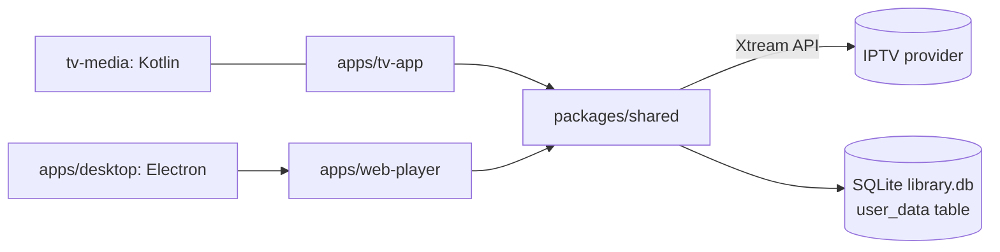

## Sign-in and accounts

### Sign-in

[What it does](FEATURES.md#sign-in)

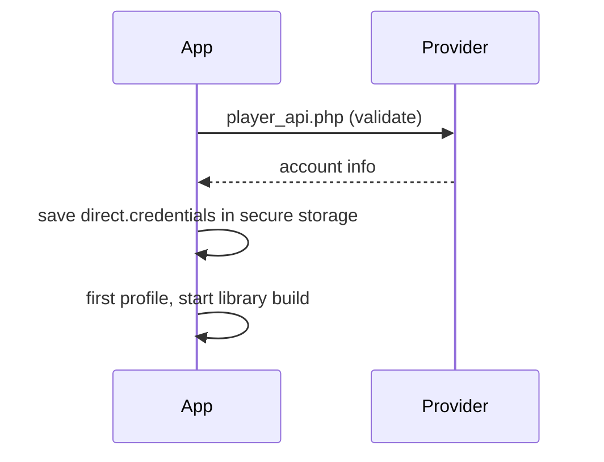

- `api.auth.login` builds an Xtream client, validates the account and saves `{serverUrl, username, password}` under `direct.credentials`. The account id is a hash of server and username.
- Secure storage: Android Keystore (`expo-secure-store`) on TV and phone; files encrypted with Electron `safeStorage` on desktop.
- On start, `auth.me()` checks the account again (10 s timeout); offline, the app carries on; a 401 signs out.
- Sign-out removes all downloads, then the credentials.

**Code:** `packages/shared/src/stores/sessionStore.ts`, `packages/shared/src/direct/directApiClient.ts`, `packages/shared/src/direct/xtream.ts`, `packages/shared/src/stores/downloadsOwner.ts`, `apps/desktop/main.mjs`, `apps/tv-app/src/screens/LoginScreen.tsx`, `apps/web-player/src/features/auth/LoginPage.tsx`

### Backup and restore

[What it does](FEATURES.md#backup-and-restore)

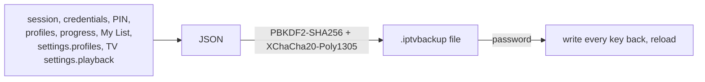

- `collectUserData` reads the keys above; library caches and downloads are left out.
- `exportUserData` needs a password of 8+ characters: PBKDF2-SHA256 (100,000 rounds, 16-byte salt) derives the key, XChaCha20-Poly1305 seals the JSON. `importUserData` refuses a file that is not a backup or comes from a newer version, and reports a file it cannot decrypt as a wrong password.
- TV and phone pick a folder or file with the Expo file system; desktop downloads a file and reads it from a file input.

**Code:** `packages/shared/src/backup/userData.ts`, `apps/tv-app/src/components/BackupDialog.tsx`, `apps/web-player/src/features/backup/BackupDialog.tsx`

## Library

### Title grouping

[What it does](FEATURES.md#title-grouping)

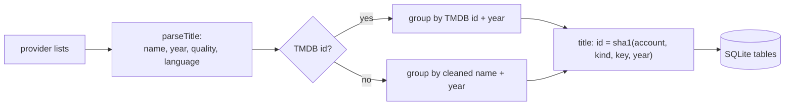

- `parseTitle` reads the clean name, year, quality, source and language from each name, including language prefixes such as "EN - " or "|DE| ".
- A copy without a TMDB id takes its name's TMDB id only when that name has exactly one; two TMDB ids for one name and year make two titles.
- The SQL version of the same rules runs in `sqlLibrary.ts` and writes items, titles and title-by-category tables to `library.db` (Android `SQLiteDatabase` on TV and phone, `node:sqlite` on desktop). On TV and phone the SHA-1 runs natively.
- A series' episodes from all its versions are merged by season and episode number.

**Code:** `packages/shared/src/direct/normalizer/parser.ts`, `packages/shared/src/direct/normalizer/matching.ts`, `packages/shared/src/direct/normalizer/pipeline.ts`, `packages/shared/src/direct/sqlLibrary.ts`, `apps/tv-app/modules/tv-media/android/src/main/java/expo/modules/tvmedia/LibraryDb.kt`, `apps/desktop/lib/libraryDb.mjs`

### Version choice and "(best)"

[What it does](FEATURES.md#version-choice-and-best)

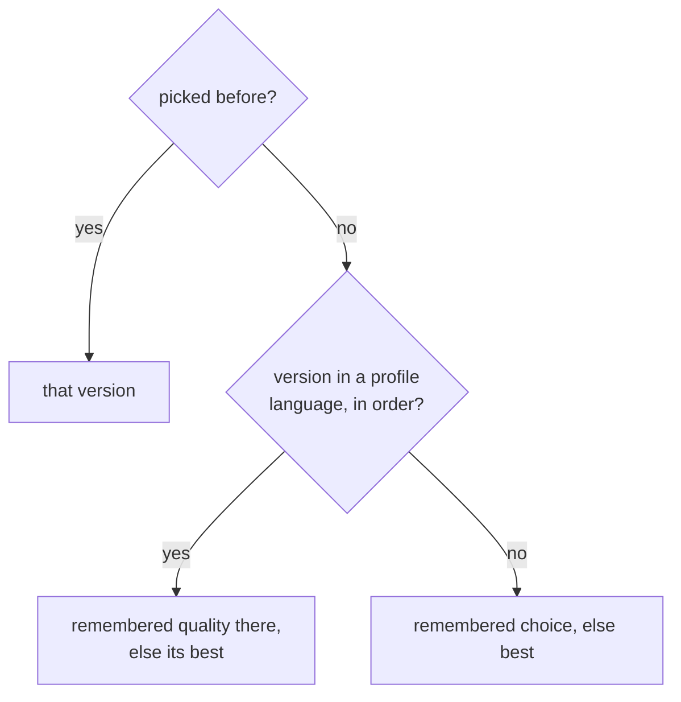

- Versions are sorted by `qualityScore` (quality, source, +5 for HDR). `bestVariant` marks "(best)" the single top score; on a tie, the first in the profile's languages, then the app language. A burned-in "EAR" version is skipped while a plain one ties.
- `startingVariant` picks the version a title starts with as shown above.
- `chooseVersion` remembers the pick for the title and saves its languages and quality in `settings.profiles`.
- `variantLabel` shows "ENG (EAR)" for English audio with Arabic subtitles in the picture.

**Code:** `packages/shared/src/playback/playbackChoices.ts`, `packages/shared/src/stores/libraryStore.ts`, `packages/shared/src/direct/normalizer/pipeline.ts`, `apps/web-player/src/features/details/VariantSelect.tsx`, `apps/tv-app/src/screens/DetailsScreen.tsx`

### Library updates

[What it does](FEATURES.md#library-updates)

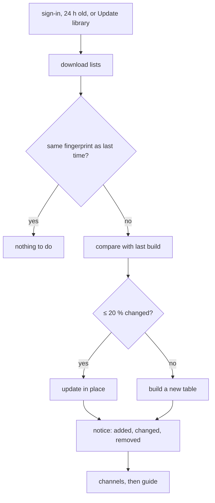

- `syncLibrary` runs on sign-in, when the saved library is over 24 h old, and from the menu.
- On TV and phone, native code writes each list straight into SQLite and computes its fingerprint; desktop downloads in JavaScript.
- Only titles whose names changed are grouped again. The counts become the message shown for 8 s.
- Channels refresh after each build and when older than 24 h; the guide every 12 h.

**Code:** `packages/shared/src/direct/directApiClient.ts`, `packages/shared/src/direct/sqlLibrary.ts`, `packages/shared/src/stores/libraryStore.ts`, `apps/tv-app/modules/tv-media/android/src/main/java/expo/modules/tvmedia/ListReader.kt`

### Library banner

[What it does](FEATURES.md#library-banner)

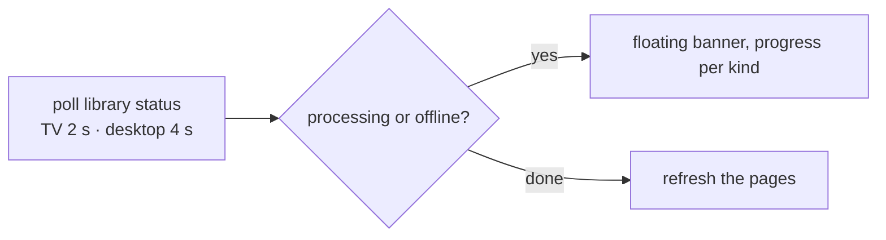

- `describeLibraryProgress` turns each kind's status into a line: waiting, downloading, titles downloaded, grouping with a percentage, failed or ready.
- TV and phone: `useLibraryWatcher` polls and `LibraryBanner` is a view that takes no focus or touches. Desktop: `LibraryBanner` polls, then clears the cached pages when an update ends.

**Code:** `packages/shared/src/stores/libraryStore.ts`, `apps/tv-app/src/useLibraryWatcher.ts`, `apps/tv-app/src/components/LibraryBanner.tsx`, `apps/web-player/src/features/shell/LibraryBanner.tsx`

## Browsing

### Home

[What it does](FEATURES.md#home)

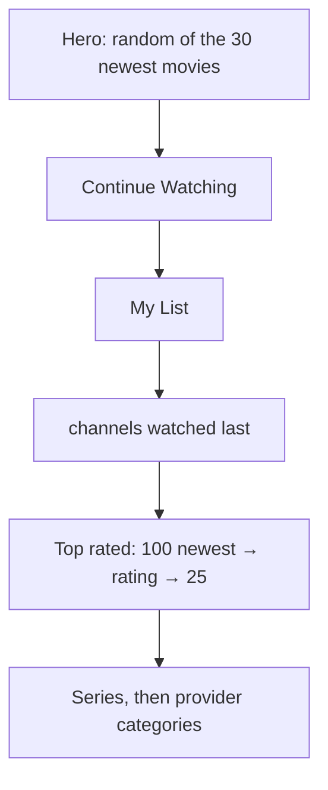

- `topRated` takes the 100 titles added last, drops unrated ones and ratings that round to 100 %, sorts by rating and keeps 25.
- TV: rows are added as the focus moves down and the focused row is centred. Phone: a virtualised list. A category row shows 10 titles and a "See all" card.
- Desktop: rows load when they scroll into view; ‹ › scroll 80 % of the width and hide at the row's ends.

**Code:** `packages/shared/src/hooks.ts`, `packages/shared/src/stores/libraryStore.ts`, `apps/tv-app/src/screens/HomeScreen.tsx`, `apps/web-player/src/features/home/HomePage.tsx`, `apps/web-player/src/components/Row.tsx`

### Continue Watching

[What it does](FEATURES.md#continue-watching)

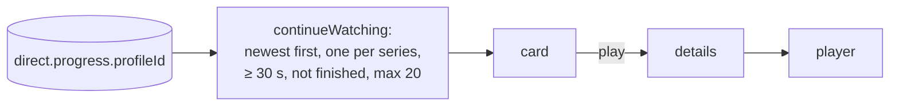

- Progress is a JSON list per profile (up to 1000 entries). A title counts as finished at 95 %, or with 120 s or less left on titles over 10 minutes.
- `playFromContinue` opens the details first and the player on top, so Back lands on the details.
- Remove deletes every unfinished episode of that series.

**Code:** `packages/shared/src/playback/rules.ts`, `packages/shared/src/stores/progressStore.ts`, `packages/shared/src/playback/targets.ts`, `apps/tv-app/src/navigation/navStore.ts`, `apps/web-player/src/ui/targets.ts`

### Continue watching on the TV home screen

[What it does](FEATURES.md#continue-watching-on-the-tv-home-screen)

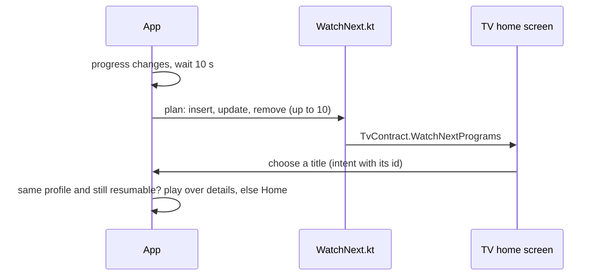

- `watchNextEntries` takes Continue Watching (10, movies and episodes with a known length). Each id is `[profileId, kind, itemId]`.
- No active profile or signed out means an empty list, which empties the row.
- A row the user removed stays removed until the title is watched again.
- Only Android TV devices (Android 8+, leanback) do anything; on phones it is a no-op.

**Code:** `apps/tv-app/src/tv/watchNext.ts`, `apps/tv-app/modules/tv-media/android/src/main/java/expo/modules/tvmedia/WatchNext.kt`, `apps/tv-app/src/App.tsx`

### Movies and Series

[What it does](FEATURES.md#movies-and-series)

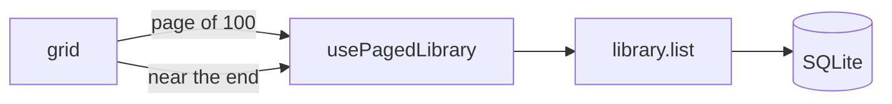

- Pages of 100 load as you scroll (desktop: an observer at the end of the grid, with a "Load more" button).
- Sorts: date added (default, newest first), name and release date, each either way, and rating. The choice is kept per section while the app runs.
- In SQLite each sort other than newest-first is an order table built the first time it is used; unrated titles go last.

**Code:** `packages/shared/src/hooks.ts`, `packages/shared/src/stores/libraryStore.ts`, `packages/shared/src/direct/sqlLibrary.ts`, `apps/tv-app/src/screens/BrowseScreen.tsx`, `apps/web-player/src/features/browse/BrowsePage.tsx`

### Category chips

[What it does](FEATURES.md#category-chips)

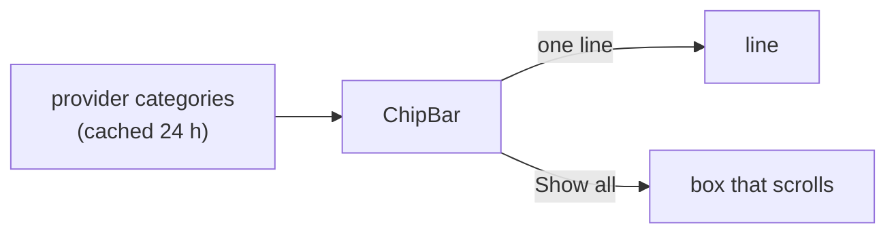

- `catalogStore.loadCategories` reads the provider's categories; the list starts with "All".
- Desktop: a `ResizeObserver` shows "Show all" only when the chips overflow.
- Phone: chips render in pages (40 on the line, 150 in the box) for providers with thousands of categories.
- TV: "All", the categories that fit (measured off screen), ‹ › to page and "Show all".

**Code:** `packages/shared/src/stores/catalogStore.ts`, `apps/tv-app/src/components/ChipBar.tsx`, `apps/web-player/src/components/ChipBar.tsx`

### Focus in the middle (TV)

[What it does](FEATURES.md#focus-in-the-middle-tv)

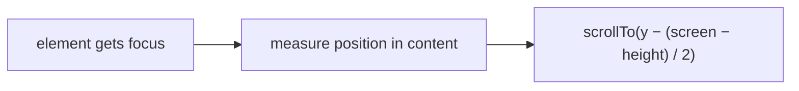

- `CenteringScrollView` gives focusable parts a `center()` call that measures them inside the scroll content and scrolls them to the middle. On the grids (`onlyCentering`) Android's own D-pad scrolling is turned off on TV so it does not add a second step. Phones get a plain scroll view.
- Grids compute each line's position from the first line's height and keep only lines near the focus mounted.
- `FocusRow` traps ← and → at a row's ends; `leftOpen` and `rightOpen` let focus out where a column sits beside it.

**Code:** `apps/tv-app/src/components/CenterScroll.tsx`, `apps/tv-app/src/components/FocusRow.tsx`, `apps/tv-app/src/screens/titles.tsx`

### Colour keys (TV)

[What it does](FEATURES.md#colour-keys-tv)

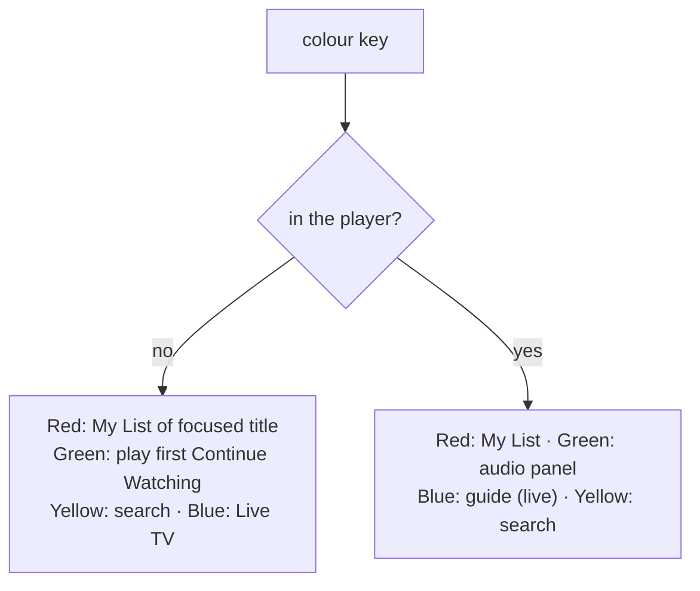

- `ColourKeys` is mounted once and listens through `useRemote`; key events are normalised to down/up pairs because some keys only report release.
- The focused card or the details page registers the title Red acts on.
- `ColourDot` draws the dot on the button a key also presses; only on TV.

**Code:** `apps/tv-app/src/tv/colourKeys.tsx`, `apps/tv-app/src/tv/remote.ts`, `apps/tv-app/src/tv/remoteEvents.ts`, `apps/tv-app/src/player/PlayerScreen.tsx`

## Covers and cards

### Card menu

[What it does](FEATURES.md#card-menu)

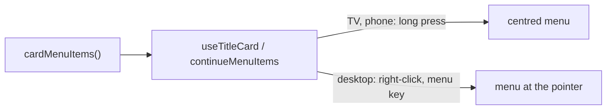

- One list of item ids for every app: details, watched / not watched, My List, and Remove on Continue Watching.
- TV and phone: a centred modal with Cancel last. Desktop: a `role="menu"` placed at the pointer or card corner; arrows and Tab move, Escape, a click outside, scrolling or resizing close it.

**Code:** `packages/shared/src/playback/watched.ts`, `packages/shared/src/hooks.ts`, `apps/tv-app/src/components/CardMenu.tsx`, `apps/web-player/src/components/CardMenu.tsx`

### Watched tag

[What it does](FEATURES.md#watched-tag)

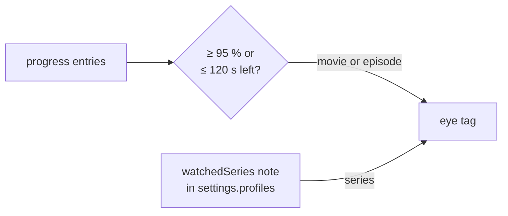

- A movie is watched when any version's progress is finished; an episode, any of its versions.
- A card cannot count a series' episodes, so the details page notes a series as watched once all episodes are, and the cover reads that note.
- Mark as watched writes finished progress; not watched deletes it.

**Code:** `packages/shared/src/playback/watched.ts`, `packages/shared/src/playback/rules.ts`, `apps/tv-app/src/components/WatchedTag.tsx`, `apps/web-player/src/components/WatchedTag.tsx`

### Quality tag

[What it does](FEATURES.md#quality-tag)

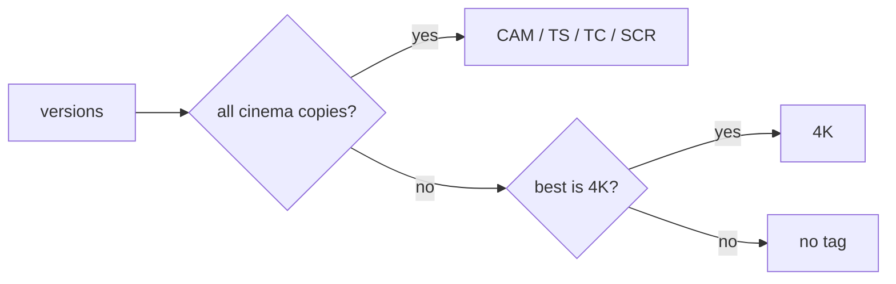

- The library computes `bestQuality` and `lowSource` per title when grouping; `useTitleCard` picks the tag.
- My List entries without these fields read them with `library.get` when the list loads.

**Code:** `packages/shared/src/hooks.ts`, `packages/shared/src/direct/normalizer/pipeline.ts`, `packages/shared/src/direct/normalizer/tags.ts`, `packages/shared/src/stores/watchlistStore.ts`

## Details

### Movie and series details

[What it does](FEATURES.md#movie-and-series-details)

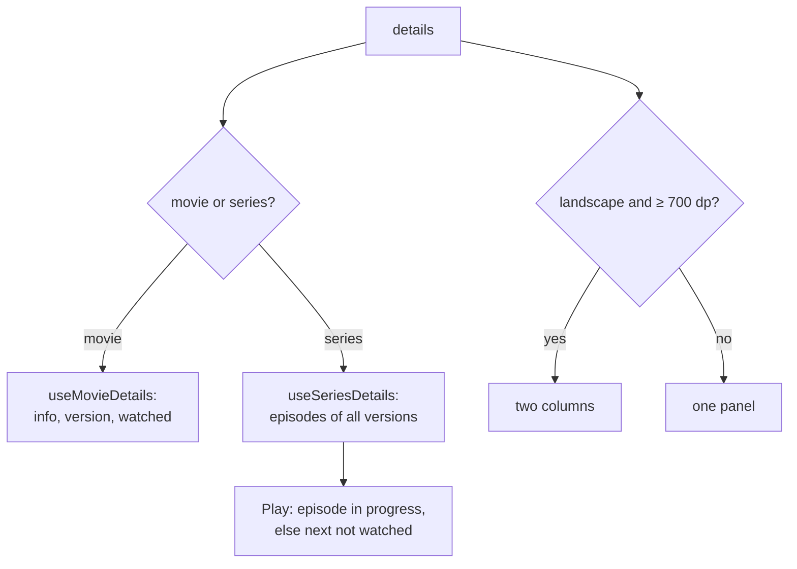

- The shared hooks load the data; each app draws it: `DetailsScreen` on TV and phone, `DetailsModal` on desktop.
- Only a series gets the right column: its header (season Watched, season choice) stays, the episode list alone scrolls; a movie's facts stay under the rest in the left one; on TV → leaves the buttons for the episodes and ← comes back.
- TV and phone read the window size; desktop follows the media query `(orientation: landscape) and (min-width: 700px)` and turns the modal into a full-window panel. On desktop the left column is at most 720 px wide.

**Code:** `packages/shared/src/hooks.ts`, `packages/shared/src/playback/watched.ts`, `apps/tv-app/src/screens/DetailsScreen.tsx`, `apps/web-player/src/features/details/DetailsModal.tsx`, `apps/web-player/src/hooks/useMediaQuery.ts`

### Seasons and episodes

[What it does](FEATURES.md#seasons-and-episodes)

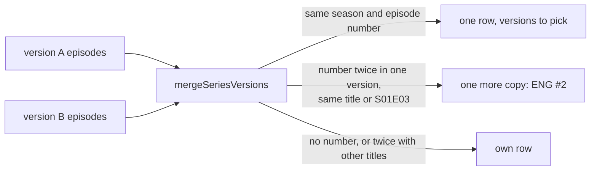

- Episodes merge by season and episode number. A version listing a number twice keeps it as one row only when the title or "S01E03" mark matches.
- The season Watched button changes only episodes whose state differs, 5 at a time.
- TV: each episode's buttons are in a focus grid, so ↑/↓ go to the same button of the next episode. The description starts rolling after 1.5 s of focus.
- Desktop: right-click opens the episode menu; a click on the description expands it.

**Code:** `packages/shared/src/playback/seriesVersions.ts`, `packages/shared/src/playback/watched.ts`, `apps/tv-app/src/components/focusGrid.ts`, `apps/tv-app/src/screens/DetailsScreen.tsx`, `apps/web-player/src/features/details/EpisodeList.tsx`

## Player

### Playback controls

[What it does](FEATURES.md#playback-controls)

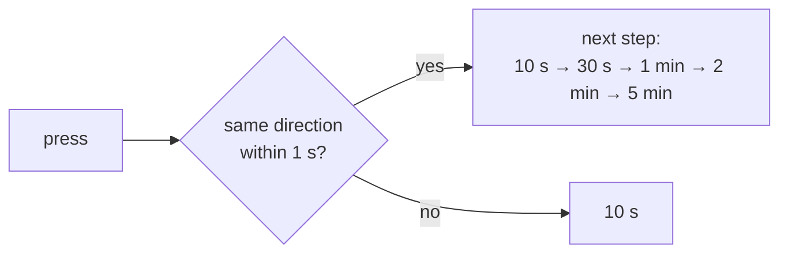

- `SkipStreak` gives the steps above for buttons, double taps and desktop keys.
- TV ←/→: `RemoteSeekController` seeks the first press at once, moves a preview for the next ones and jumps 1 s after the last. Held over 450 ms it scrubs from 10× up to 640×.
- TV media keys are handled before any open panel. Phone: landscape lock, double taps, a draggable timeline, swipes for brightness and volume.
- Desktop: keyboard and `navigator.mediaSession` media keys; the timeline shows frames from a hidden second video.

**Code:** `packages/shared/src/playback/remoteSeek.ts`, `packages/shared/src/playback/rules.ts`, `apps/tv-app/src/player/PlayerScreen.tsx`, `apps/tv-app/src/player/TouchLevels.tsx`, `apps/web-player/src/features/player/PlayerOverlay.tsx`, `apps/web-player/src/features/player/frameGrabber.ts`

### Audio, subtitles, versions and episodes

[What it does](FEATURES.md#audio-subtitles-versions-and-episodes)

```mermaid
flowchart LR
  T[tracks of the stream] --> L["trackLabel: name,<br/>else language name"]
  C["playback choice<br/>in settings.profiles"] --> K["pickTrack: language + name,<br/>language, name"]
  T --> K --> S[select track]
  U[user picks] --> C
```

- The last audio, subtitles and version picked are saved per profile and applied to every new movie or episode (not live channels).
- TV and phone select tracks in the native player; the quick drawer has Audio, Subtitles, Versions and Episodes. Desktop selects hls.js tracks.

**Code:** `packages/shared/src/playback/playbackChoices.ts`, `apps/tv-app/src/player/QuickDrawer.tsx`, `apps/web-player/src/features/player/TracksMenu.tsx`, `apps/web-player/src/features/player/tracks.ts`

### Automatic subtitles

[What it does](FEATURES.md#automatic-subtitles)

```mermaid
flowchart TD
  P[movie or episode plays] --> H{"own subtitles in a<br/>chosen subtitle language?"}
  H -->|yes| X[nothing]
  H -->|no| C{cached?}
  C -->|yes| A[add the subtitle]
  C -->|no| S["OpenSubtitles search,<br/>human-made, trusted, most downloaded"] --> D[download SRT, cache] --> A
```

- Settings (on/off, API key, optional login, languages) are one set per device, in secure storage under `settings.opensubtitles`; nothing happens while it is off or has no API key. Their languages decide, not the profile's.
- Live channels never get one. A found subtitle is cached per stream in the device's data storage.
- TV and phone add the SRT to the native player; desktop converts it to WebVTT and adds a `<track>`.

**Code:** `packages/shared/src/subtitles/openSubtitles.ts`, `apps/tv-app/src/player/PlayerScreen.tsx`, `apps/web-player/src/features/player/PlayerOverlay.tsx`

### Pause when the headphones go away

[What it does](FEATURES.md#pause-when-the-headphones-go-away)

```mermaid
flowchart LR
  A["Android: audio becoming noisy"] --> P[pause]
  B["desktop: a known audio output<br/>disappears (devicechange)"] --> P
```

- TV and phone: ExoPlayer pauses itself (`setHandleAudioBecomingNoisy`) and reports it, so the controls show paused.
- Desktop: the list of audio outputs is compared on every `devicechange`.

**Code:** `apps/tv-app/modules/tv-media/android/src/main/java/expo/modules/tvmedia/TvPlayerView.kt`, `apps/web-player/src/features/player/audioOutput.ts`

### Playback errors

[What it does](FEATURES.md#playback-errors)

```mermaid
flowchart TD
  A[next attempt: file or HLS] --> U[portal URL, then stream server]
  U -->|fails| N{more?}
  N -->|yes| A
  N -->|no| P["probe first 64 KB"] --> M["message: max connections,<br/>expired, not found, codec"]
```

- TV and phone try the original file, then HLS (live: HLS, then TS); desktop the other way round. A decoding error stops at once.
- `probeStream` reads the provider's answer and the codec from the first bytes. Desktop asks `canPlayType` and offers VLC when it cannot decode.

**Code:** `packages/shared/src/playback/sources.ts`, `packages/shared/src/playback/probe.ts`, `apps/web-player/src/features/player/playbackEngine.ts`, `apps/tv-app/src/player/PlayerScreen.tsx`

### Audio decoder (TV and phone)

[What it does](FEATURES.md#audio-decoder-tv-and-phone)

```mermaid
flowchart LR
  S["settings.playback<br/>audioDecoder"] --> P[TvPlayerView]
  P -->|ffmpeg| F[extension renderers first]
  P -->|device| D[device decoders first]
```

- The FFmpeg audio decoder (`media3-ffmpeg-decoder`) is bundled at build time unless turned off; the menu shows the choice only then.
- Changing it rebuilds the player. Decoder fallback is on either way.

**Code:** `apps/tv-app/modules/tv-media/android/build.gradle`, `apps/tv-app/src/playbackSettings.ts`, `apps/tv-app/src/components/PlaybackSettings.tsx`, `apps/tv-app/modules/tv-media/android/src/main/java/expo/modules/tvmedia/TvPlayerView.kt`

### Open in another player

[What it does](FEATURES.md#open-in-another-player)

```mermaid
flowchart LR
  B[button] --> U[stream URL + provider User-Agent]
  U -->|TV, phone| I["ACTION_VIEW chooser,<br/>headers extra"]
  U -->|desktop| V[start VLC]
```

- TV and phone: an Android chooser; MX Player and Just Player read the `headers` extra.
- Desktop: the main process looks for VLC in the usual folders and the PATH and starts it with the URL and User-Agent.
- Hidden on Kids profiles in every app.

**Code:** `apps/tv-app/src/player/externalPlayer.ts`, `apps/tv-app/src/components/ExternalPlayerButton.tsx`, `apps/tv-app/modules/tv-media/android/src/main/java/expo/modules/tvmedia/TvMediaModule.kt`, `apps/web-player/src/components/VlcButton.tsx`, `apps/desktop/main.mjs`

## Live TV

### TV guide

[What it does](FEATURES.md#tv-guide)

```mermaid
flowchart LR
  C[category] --> L["page of channels<br/>(SQLite live table)"]
  L --> E["get_short_epg per channel<br/>(cached)"]
  E --> G["layoutGuideRow:<br/>30-minute slots, gaps filled"]
```

- `useEpgGuide` loads 3 hours from the chosen time; Earlier and Later move it. Gaps become empty cells so the TV focus always has a target.
- TV: the focused category stays centred; Channel +/− move a page.

**Code:** `packages/shared/src/epg/guide.ts`, `packages/shared/src/stores/epgStore.ts`, `packages/shared/src/react.ts`, `apps/tv-app/src/screens/LiveScreen.tsx`, `apps/web-player/src/features/live/LiveTvPage.tsx`

### Guide over the playing channel

[What it does](FEATURES.md#guide-over-the-playing-channel)

```mermaid
flowchart LR
  O["TV ↑ · phone swipe up · desktop G"] --> G[guide of the channel's category]
  G -->|choose| S[switch channel in the player]
```

- Same guide data as Live TV, for the playing channel's category, showing now and next.
- TV and phone: `GuideOverlay`, closes after 6 s without input. Desktop: `GuidePanel`.

**Code:** `apps/tv-app/src/player/GuideOverlay.tsx`, `apps/web-player/src/features/player/GuidePanel.tsx`

### Channels watched last

[What it does](FEATURES.md#channels-watched-last)

```mermaid
flowchart LR
  P[live channel plays] --> A["addRecentChannel:<br/>first, no duplicates, max 20"]
  A --> S[("settings.profiles")]
  S --> H[Home row]
  S --> T["TV ↓: strip of 10"]
```

- Kept per profile in `ProfilePrefs.recentChannels`. Home shows the first live category while the list is empty.

**Code:** `packages/shared/src/playback/recentChannels.ts`, `packages/shared/src/hooks.ts`, `apps/tv-app/src/player/RecentChannelsOverlay.tsx`

## Search

### Titles, channels and programmes

[What it does](FEATURES.md#titles-channels-and-programmes)

```mermaid
flowchart LR
  Q["typed text<br/>(wait: 2× typing gap, 400-1200 ms)"] --> T[movies, series: paged]
  Q --> C["channels: max 30"]
  Q --> P["programmes: XMLTV table,<br/>on now first, max 30"]
```

- Search ignores the hidden-category filter.
- Programmes come from the provider's XMLTV guide for the next 24 hours, stored in a SQLite table (on TV split natively in batches). A programme opens its channel.
- Results filter by All, Movies, Series or Live TV.

**Code:** `packages/shared/src/search/useSearchQuery.ts`, `packages/shared/src/search/searchDelay.ts`, `packages/shared/src/direct/directApiClient.ts`, `apps/tv-app/modules/tv-media/android/src/main/java/expo/modules/tvmedia/XmltvFilter.kt`, `apps/tv-app/src/screens/SearchScreen.tsx`, `apps/web-player/src/features/browse/SearchPage.tsx`

## My List

### Watchlist

[What it does](FEATURES.md#watchlist)

```mermaid
flowchart LR
  B[bookmark or menu] --> T["toggle (undone if saving fails)"]
  T --> S[("direct.watchlist.profileId<br/>max 500")]
  S --> H[Home row, My List page, bookmark on covers]
```

- The list reloads when the active profile changes and is deleted with its profile.

**Code:** `packages/shared/src/stores/watchlistStore.ts`, `apps/tv-app/src/screens/MyListScreen.tsx`, `apps/web-player/src/features/browse/MyListPage.tsx`

## Downloads

### Offline downloads

[What it does](FEATURES.md#offline-downloads)

```mermaid
flowchart TD
  D[Download] -->|TV, phone| M["Media3 DownloadManager<br/>AES cache, key in Keystore"]
  D -->|desktop| W["AES-GCM chunks in Cache API,<br/>served by a Service Worker"]
  M & W --> P{"online in the last 30 days<br/>and not expired?"}
  P -->|yes| PL[play]
```

- TV and phone: `DownloadCenter` writes into an encrypted cache; the key is wrapped by an Android Keystore key.
- Desktop: one download at a time, chunks encrypted with a non-extractable key; records and keys in IndexedDB.
- `offlineAccess` refuses playback after 30 days offline or when the clock was set back. Sign-out deletes all downloads.

**Code:** `apps/tv-app/modules/tv-media/android/src/main/java/expo/modules/tvmedia/DownloadCenter.kt`, `apps/tv-app/modules/tv-media/android/src/main/java/expo/modules/tvmedia/OfflineKey.kt`, `apps/web-player/src/offline/downloadManager.ts`, `apps/web-player/src/offline/offlineResponder.ts`, `packages/shared/src/playback/offlineAccess.ts`

## Profiles

### Profiles and Kids

[What it does](FEATURES.md#profiles-and-kids)

```mermaid
flowchart LR
  O[app opens] --> N{one profile?}
  N -->|yes| H[Home]
  N -->|no| W["Who's watching?"] --> K{Kids?}
  K -->|yes| F["withKidsFilter on every list"] --> H
  K -->|no| H
```

- Profiles (up to 5) are stored under `direct.profiles.<account>`; each has its own progress, My List and `settings.profiles` entry.
- `withKidsFilter` keeps the categories whose names look like children's (and not adult), or the ones a parent picked, for lists, channels, the guide and search.
- Switching between Kids and other profiles clears the cached lists.

**Code:** `packages/shared/src/profiles/kidsFilter.ts`, `packages/shared/src/appContext.ts`, `packages/shared/src/stores/sessionStore.ts`, `apps/tv-app/src/screens/ProfilesScreen.tsx`, `apps/web-player/src/features/profiles/ProfilePicker.tsx`

### Parental PIN

[What it does](FEATURES.md#parental-pin)

```mermaid
flowchart LR
  A[leave Kids or manage profiles] --> P{PIN set?}
  P -->|yes| C["check salted hash<br/>5 tries, then 60 s lock"]
  P -->|no| G[go on]
  C -->|right| G
```

- The 4-digit PIN is saved as salt and hash under `pin.<account>`. Signing out deletes it.

**Code:** `packages/shared/src/stores/pinStore.ts`, `apps/tv-app/src/components/PinPad.tsx`, `apps/web-player/src/features/profiles/PinDialog.tsx`

### Content language filter

[What it does](FEATURES.md#content-language-filter)

```mermaid
flowchart LR
  UI[LanguageSettings] -->|tick order| P["ProfilePrefs.languages<br/>['ENG','GER']"]
  P --> A[appContext]
  A -->|language + languageCategoryIds| Q[library.list]
  Q --> S["SQLite: langs or hints match"]
  A -->|setVersionLanguages| V[startingVariant / bestVariant]
```

- The profile's languages are an ordered array of codes in `ProfilePrefs.languages` (stored under `settings.profiles`). Ticking appends, unticking removes; the index is the priority shown.
- `languageCategoryIds()` finds categories whose name names a chosen language (or none) using `categoryLanguages()`.
- The SQLite query keeps a title when its `langs` (audio and subtitle languages) has a chosen code or its `hints` (language-less categories) has a matching category. The browser path does the same in memory (`inLanguages()`).
- `startingVariant()` starts a title with its version in the first profile language it has; `bestVariant()` breaks quality ties in that order.

**Code:** `packages/shared/src/profiles/contentLanguages.ts`, `packages/shared/src/stores/profilePrefsStore.ts`, `packages/shared/src/hooks.ts`, `packages/shared/src/appContext.ts`, `packages/shared/src/direct/sqlLibrary.ts`, `packages/shared/src/playback/playbackChoices.ts`, `apps/tv-app/src/components/LanguageSettings.tsx`, `apps/web-player/src/features/profiles/LanguageSettings.tsx`

### Categories shown

[What it does](FEATURES.md#categories-shown)

```mermaid
flowchart LR
  UI[HiddenCategories] -->|save| P["ProfilePrefs.hiddenCategories<br/>per section"]
  P --> W[withHiddenCategories]
  W -->|drop hidden| C[categories, live channels]
  W -->|hiddenCategoryIds| L[library.list, epg.grid]
  W -.->|search: unchanged| L
```

- Hidden category ids are kept per profile and per section in `ProfilePrefs.hiddenCategories`. `useHiddenCategories` edits a draft; "Select all" hides or clears the whole section.
- `withHiddenCategories()` wraps the API: category and channel lists drop hidden ones; library and guide queries get `hiddenCategoryIds`; a search query passes through unfiltered.
- In SQLite a title is left out only when all of its categories are hidden.

**Code:** `packages/shared/src/profiles/hiddenCategories.ts`, `packages/shared/src/hooks.ts`, `packages/shared/src/direct/sqlLibrary.ts`, `apps/tv-app/src/components/HiddenCategories.tsx`, `apps/web-player/src/features/profiles/HiddenCategories.tsx`

### App language

[What it does](FEATURES.md#app-language)

```mermaid
flowchart TD
  S{"settings.uiLanguage saved?"} -->|yes| L[use it]
  S -->|no| D["matchUiLanguage(device languages)"]
  L --> P["profile's appLanguage, if set"]
  D --> P
  P --> T["t() / tn() read catalogs/*.json"]
```

- `UI_LANGUAGES` are `en`, `pt-BR`, `de` and `sh-BA`. `t()` and `tn()` (plurals) look texts up in the JSON catalogs; English is the source text.
- `createUiLanguage()` picks the language: the device's last choice (`settings.uiLanguage`), else the device language, then the active profile's `appLanguage`. `choose()` saves both.
- Device language: `I18nManager` on TV and phone, `navigator.languages` on desktop.

**Code:** `packages/shared/src/i18n/i18n.ts`, `packages/shared/src/i18n/uiLanguage.ts`, `packages/shared/src/i18n/catalogs`, `apps/tv-app/src/components/AppLanguageDialog.tsx`, `apps/web-player/src/features/shell/AppLanguageDialog.tsx`

## Devices

### Sign in and sync by QR code

[What it does](FEATURES.md#sign-in-and-sync-by-qr-code)

```mermaid
sequenceDiagram
  participant P as Phone
  participant T as TV or computer
  T->>T: start local server, show QR IPTVPAIR:1:host:port:key
  P->>T: scan QR
  P->>T: POST /pair, sign-in, profiles, progress, My List, settings (sealed with key)
  T->>T: signed out: sign in · same account: merge · other account: refuse
  T-->>P: merged data (sealed)
  P->>P: save merged data, reload
```

- The QR holds the device's address, port and a 32-byte random key. The payload is sealed with XChaCha20-Poly1305 (`sealed.ts`); a wrong key gets 403.
- `mergeMedia()` matches profiles by id, then name; progress keeps the newest entry per title; My List is the union (up to 500).
- `mergeProfilePrefs()` merges each profile's settings (`settings.profiles`): the phone's value wins, watched series and recent channels are joined. The automatic-subtitles settings go along too. A parental PIN is copied only where the TV or computer has none. Device settings (audio decoder, the device's own app language, downloads, update choices) are not sent.
- The server: `PairingServer.kt` on TV; a Node `http` server in the Electron main process on desktop. The phone scans with Google Play services' code scanner.

**Code:** `packages/shared/src/pairing/pairing.ts`, `packages/shared/src/pairing/settings.ts`, `packages/shared/src/pairing/sealed.ts`, `packages/shared/src/pairing/usePairingServer.ts`, `apps/tv-app/src/pairing/pairing.ts`, `apps/tv-app/modules/tv-media/android/src/main/java/expo/modules/tvmedia/PairingServer.kt`, `apps/web-player/src/features/pairing/SyncWithPhone.tsx`, `apps/desktop/main.mjs`

### Play on TV

[What it does](FEATURES.md#play-on-tv)

```mermaid
sequenceDiagram
  participant P as Phone
  participant T as TV
  Note over P,T: pairing: TV returns tvId, phoneId, key, port
  P->>T: POST /remote {type: play, accountId, target} (sealed)
  T->>T: check phone, age < 5 min, account, active profile
  T->>T: open the player
```

- During pairing the TV adds a remote offer (ids, a 32-byte key, a port) to its reply; both sides keep it in secure storage (`remote.phones` on TV, `remote.tv` on the phone). Desktop pairing has no offer.
- The TV listens on the first free port of 38127–38131 while signed in. Commands older than 5 minutes are refused.
- The phone tries the saved port first, then the others.

**Code:** `packages/shared/src/pairing/remote.ts`, `apps/tv-app/src/pairing/remote.ts`, `apps/tv-app/src/components/PlayOnTvButton.tsx`, `apps/tv-app/src/App.tsx`

## App

### Account menu

[What it does](FEATURES.md#account-menu)

```mermaid
flowchart TD
  A[Avatar] --> M[Menu: other profiles]
  M --> G1[Profiles]
  M --> G2[Library & devices]
  M --> G3[App]
  M --> O["Sign out · Close the app (TV, phone)"]
  G1 & G2 & G3 -->|opens in place, ← back| M
```

- TV and phone: `AccountMenu.tsx`; open state and group live in `navStore`. Kids profiles get only profile switching and Close the app. On TV a focus trap keeps the D-pad inside the menu.
- Desktop: `TopNav.tsx` keeps the state locally. Window `mousedown` and `keydown` listeners close it on a click outside or Escape; there is no mouse-leave handler.

**Code:** `apps/tv-app/src/components/AccountMenu.tsx`, `apps/tv-app/src/navigation/navStore.ts`, `apps/web-player/src/features/shell/TopNav.tsx`

### About

[What it does](FEATURES.md#about)

```mermaid
flowchart LR
  CI["build: commit + date"] --> B[buildInfo]
  N[installed version] --> D[About dialog]
  B --> D
```

- TV and phone: the version comes from the installed package (`TvMedia.installedVersion()`); commit and date from `APP_BUILD_COMMIT` and `APP_BUILD_DATE` via Expo `extra`.
- Desktop: the version from Electron; commit and date from `__BUILD_INFO__`, set by Vite at build time. The "App" row says desktop app or development build.

**Code:** `apps/tv-app/src/components/AboutDialog.tsx`, `apps/tv-app/app.config.ts`, `apps/web-player/src/features/shell/AboutDialog.tsx`, `apps/web-player/src/buildInfo.ts`, `apps/web-player/vite.config.ts`

### Diagnostics log

[What it does](FEATURES.md#diagnostics-log)

```mermaid
flowchart LR
  E[log calls, JS errors] --> R["appLog ring buffer<br/>600 entries, 3 days, redact()"]
  C["native crash → last-crash.txt"] -->|next start| R
  R -->|every 2 s| S[(diagnostics.log)]
  R --> V["Log screen: share / save, copy"]
```

- `createLogger()` keeps up to 600 entries no older than 3 days; `redact()` masks usernames and passwords in URLs.
- `shareText()` folds repeated lines into "(×N)" and keeps the newest 15,000 characters for sharing.
- TV and phone: saved as a file in app storage; `CrashLog.kt` writes native crashes, which `startupLog.ts` adds on the next start. Desktop: saved in local storage, saved as a .txt file or copied.

**Code:** `packages/shared/src/utils/logger.ts`, `apps/tv-app/src/startupLog.ts`, `apps/tv-app/src/screens/LogScreen.tsx`, `apps/tv-app/modules/tv-media/android/src/main/java/expo/modules/tvmedia/CrashLog.kt`, `apps/web-player/src/features/shell/LogDialog.tsx`

### App updates

[What it does](FEATURES.md#app-updates)

```mermaid
flowchart TD
  R["GitHub release<br/>tv-apk / desktop"] --> C{newer than installed?}
  C -->|TV, phone| A["download APK, check SHA-256,<br/>open Android installer"]
  C -->|Windows, AppImage| E["electron-updater: download,<br/>check SHA-512, install"]
  E -->|iptv:update-progress| P["UpdateProgress banner<br/>and taskbar %"]
  C -->|macOS, .deb| O[open the release page]
```

- TV and phone: `createUpdater()` reads the `tv.apk` asset of the `tv-apk` release, compares its version code with the installed one, and `AppUpdater.kt` downloads and checks it. A version you skip is kept under `update.skipped`.
- Desktop: `checkForUpdate()` in the Electron main process, about 15 s after start or from the menu; the skipped version is kept in `update-skipped.txt`.
- Download progress: TV and phone get `onUpdateProgress` from `AppUpdater.kt` into `UpdateDialog`; the desktop sends electron-updater's `download-progress` as `iptv:update-progress` (`{ version, percent }`, then `null`) to the page's `UpdateProgress` banner, and to the taskbar.
- `scripts/release-notes.mjs` adds the version's release notes to each release.

**Code:** `apps/tv-app/src/update/updates.ts`, `apps/tv-app/src/update/UpdateDialog.tsx`, `apps/tv-app/modules/tv-media/android/src/main/java/expo/modules/tvmedia/AppUpdater.kt`, `apps/desktop/main.mjs`, `apps/desktop/preload.cjs`, `apps/web-player/src/features/shell/UpdateProgress.tsx`, `scripts/release-notes.mjs`

### Close the app (TV and phone)

[What it does](FEATURES.md#close-the-app-tv-and-phone)

```mermaid
flowchart LR
  M[Close the app] --> Q{confirm}
  Q -->|yes| F[finishAndRemoveTask]
  F -->|300 ms| K[killProcess]
```

- The menu item asks first, then calls `TvMedia.closeApp()`: the activity is removed from recent apps and the process is killed, so the next start is a cold start.

**Code:** `apps/tv-app/src/components/AccountMenu.tsx`, `apps/tv-app/modules/tv-media/android/src/main/java/expo/modules/tvmedia/TvMediaModule.kt`
