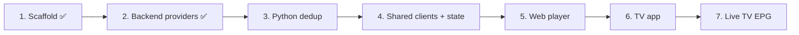

# Next Steps

## Human-Requested Backlog

Execution plan from the project brief. Each step ends with a review checkpoint. Phase 1 runs locally only (D-010).

- [x] **Step 1 — Scaffold**: monorepo, workspaces, 3 documentation files, READMEs, central `APP_NAME` config.
- [x] **Upgrade backend to .NET 10** (requested 2026-09-23, D-009).
- [x] **Step 2 — Backend**: `IMediaProvider`, `XtreamCodesProvider`, authentication proxy, user profiles, catalog endpoints, playback + stream relay (D-011 – D-015).
- [ ] **Step 3 — Python dedup service**: local queue, regex tag parsing (quality: 4K/1080p/HDTS/CAM; audio: ENG/ESP/DUAL), clean title, fuzzy grouping into master media objects, unit tests.
- [ ] **Step 4 — Shared package**: API clients, Zustand stores, domain types.
- [ ] **Step 5 — Web player**: Netflix-style UI (`#141414`, rows, backdrop trailers), hls.js/Video.js playback, timeline hover previews, ←/→ 10 s skip, variant selector, Skip Intro, next-episode countdown, episodes drawer, profile switcher, Service Worker offline cache, "My Downloads".
- [ ] **Step 6 — TV app**: D-pad spatial navigation (`TVEventHandler`), tap ←/→ 10 s skip with circular overlay, hold-to-scrub with acceleration, ↑/↓ drawer (audio/subtitles/variants), ExoPlayer `DownloadManager` private-storage cache, "My Downloads".
- [ ] **Step 7 — Live TV EPG grid**: backend EPG cache, shared state, web and TV grids.
- [ ] **Later — Cloud deployment** (deferred 2026-09-23): Azure Static Web Apps, App Service, Functions, managed database.
- [ ] **Later — Offline anti-piracy hardening** (deferred 2026-09-23): KI-002, KI-003.

## Agent Suggestions

- **CI pipeline**: GitHub Actions running `npm run typecheck test build`, `dotnet test`, `pytest` on every push.
- **Linters/formatters**: ESLint + Prettier (TS), `dotnet format` (C#), Ruff (Python).
- **Generate the shared TS client from OpenAPI** (`/openapi/v1.json`) in Step 4 so types never drift.
- **VOD playback in browsers**: decide the MKV strategy before Step 5 (KI-010).
- **Connection-limit awareness**: expose `maxConnections` to clients and warn before starting a stream that would exceed it (KI-004).
- **Local HTTPS** for LAN traffic (KI-009).
- **Before any cloud move**: SSRF guard + login rate limit (KI-008), hybrid relay/direct delivery (D-013), Bicep templates, Key Vault–backed Data Protection keys.
- **Local dev stack**: `docker-compose` with Azurite if Step 3 uses Azure Storage Queues locally.
