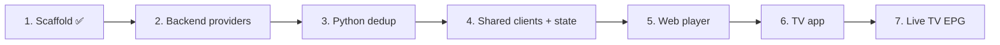

# Next Steps

## Human-Requested Backlog

Execution plan from the project brief. Each step ends with a review checkpoint.

- [x] **Step 1 — Scaffold**: monorepo, workspaces, 3 documentation files, READMEs, central `APP_NAME` config.
- [ ] **Step 2 — Backend**: `IMediaProvider`, `XtreamCodesProvider` (server URL, username, password, server-to-server), authentication proxy, user profiles.
- [ ] **Step 3 — Python dedup service**: queue trigger, regex tag parsing (quality: 4K/1080p/HDTS/CAM; audio: ENG/ESP/DUAL), clean title, fuzzy grouping into master media objects, unit tests.
- [ ] **Step 4 — Shared package**: API clients, Zustand stores, domain types.
- [ ] **Step 5 — Web player**: Netflix-style UI (`#141414`, rows, backdrop trailers), hls.js/Video.js playback, timeline hover previews, ←/→ 10 s skip, variant selector, Skip Intro, next-episode countdown, episodes drawer, profile switcher, Service Worker offline cache, "My Downloads".
- [ ] **Step 6 — TV app**: D-pad spatial navigation (`TVEventHandler`), tap ←/→ 10 s skip with circular overlay, hold-to-scrub with acceleration, ↑/↓ drawer (audio/subtitles/variants), ExoPlayer `DownloadManager` private-storage cache, "My Downloads".
- [ ] **Step 7 — Live TV EPG grid**: backend EPG cache, shared state, web and TV grids.

## Agent Suggestions

- **CI pipeline**: GitHub Actions running `npm run typecheck test build`, `dotnet test`, `pytest` on every PR.
- **Linters/formatters**: ESLint + Prettier (TS), `dotnet format` (C#), Ruff (Python).
- **Infrastructure as code**: Bicep templates for Static Web Apps, App Service, Functions, Storage Queue, Azure SQL/Cosmos DB, Key Vault.
- **.NET 10 LTS migration** before 2026-11-10 (KI-001).
- **Decide stream path early**: proxy all stream bytes through the backend vs. only metadata (cost vs. mixed-content/CORS, see KI-004).
- **Credential storage**: encrypt Xtream passwords at rest (Key Vault key or ASP.NET Data Protection); never return them to clients.
- **OpenAPI contract**: generate TypeScript client types for `packages/shared` from the backend OpenAPI document.
- **Local dev stack**: `docker-compose` with Azurite (queues/blobs) and SQL/Cosmos emulator.
