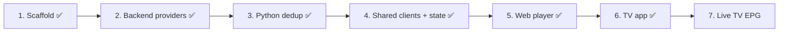

# Next Steps

## Human-Requested Backlog

Execution plan from the project brief. Each step ends with a review checkpoint. Phase 1 runs locally only (D-010).

- [x] **Step 1 — Scaffold**: monorepo, workspaces, 3 documentation files, READMEs, central `APP_NAME` config.
- [x] **Upgrade backend to .NET 10** (requested 2026-09-23, D-009).
- [x] **Step 2 — Backend**: `IMediaProvider`, `XtreamCodesProvider`, authentication proxy, user profiles, catalog endpoints, playback + stream relay (D-011 – D-015).
- [x] **Step 3 — Python dedup service** (SQLite queue, owner-approved 2026-09-23): regex tag parsing, clean titles, guarded fuzzy grouping, master media + variants, `/api/library` endpoints, tests (D-016 – D-019).
- [x] **Step 4 — Shared package**: OpenAPI-generated types, typed API client, Zustand stores (session/profiles, catalog, library, player), app context wired into web + TV (D-020 – D-022).
- [x] **Step 5 — Web player**: Netflix-style UI, hls.js engine (HLS first, MKV hint), timeline frame previews, keyboard controls, version selector, Skip Intro, next-episode countdown, episodes drawer, profiles, Continue Watching (backend progress), encrypted Service Worker downloads, My Downloads, fake Xtream panel + e2e tests (D-023 – D-027).
- [x] **Step 6 — TV app**: native focus navigation, remote handling (tap ±10 s with circle, hold-to-scrub with acceleration), ↑/↓ quick drawer, `tv-media` Expo module (ExoPlayer + Media3 DownloadManager in private storage), My Downloads, Jest tests, Android TV emulator + Maestro CI (D-028 – D-030).
- [x] **Test environment for the TV app** (requested 2026-09-23): `.github/workflows/tv-app.yml` (D-030).
- [ ] **Step 7 — Live TV EPG grid**: backend EPG cache, shared state, web and TV grids.
- [ ] **Later — Cloud deployment** (deferred 2026-09-23): Azure Static Web Apps, App Service, Functions, managed database.
- [ ] **Later — Offline anti-piracy hardening** (deferred 2026-09-23): KI-002, KI-003.

## Agent Suggestions

- **Web e2e in CI**: add the Playwright suite to `ci.yml`.
- **TV profile editing** (KI-027) and on-screen search.
- **Refresh relay URLs for long-paused TV downloads** (KI-026): re-request the playback URL on resume.
- **Sign the release APK** with a real keystore (CI secret) for sideloading updates over the debug-signed build.
- **Linters/formatters**: ESLint (incl. `react-hooks` rules; a hooks-after-return bug was caught only by review) + Prettier (TS), `dotnet format` (C#), Ruff (Python).
- **E2E in CI**: run `npm run test:e2e` (needs .NET, Python venv, ffmpeg, Chromium) on every push.
- **Trickplay sprites**: backend generates preview sprites on demand to replace the extra preview connection (KI-020).
- **Intro markers**: learn per-series intro end from user skips (KI-019).
- **URL routing** for deep links (KI-023).
- **mpegts.js** fallback for TS-only live panels (KI-022).
- **Series ranking by episode count** (KI-025).
- **VOD playback in browsers**: decide the MKV strategy before Step 5 (KI-010).
- **Connection-limit awareness**: expose `maxConnections` to clients and warn before starting a stream that would exceed it (KI-004).
- **Local HTTPS** for LAN traffic (KI-009).
- **Before any cloud move**: SSRF guard + login rate limit (KI-008), hybrid relay/direct delivery (D-013), Bicep templates, Key Vault–backed Data Protection keys.
- **Periodic library sync**: background timer (e.g. every 12 h) per active account (KI-016).
- **One-command dev start**: root script that runs backend + worker + web together.
- **TMDB enrichment**: `get_vod_info` exposes `tmdb_id`; matching by TMDB id would merge translated titles and fix KI-014.
- **Series episode merge**: series variants each have their own episode lists; merge seasons/episodes across variants for a single episode picker.
- **Manual override**: admin endpoint to split/merge masters, stored as rules the worker applies.
