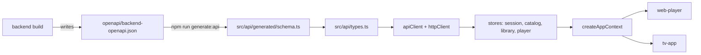

# @iptv/shared

Platform-agnostic TypeScript used by `apps/web-player` and `apps/tv-app`: config, typed API client, Zustand stores, formatting helpers.



## Usage

```ts
import { createAppContext, useAppStore } from '@iptv/shared';

const { stores, api } = createAppContext({ config: appConfig, storage: platformStorage });
await stores.session.getState().restore();                        // on startup
const status = useAppStore(stores.session, (s) => s.status);      // in React components
await stores.library.getState().loadPage('movies', { offset: 0 });
```

Each app creates one context: `apps/*/src/appContext.ts`.

## Updating the API types

After changing backend endpoints or DTOs:

```bash
dotnet build backend/Backend.sln                   # rewrites openapi/backend-openapi.json
npm run generate:api --workspace=@iptv/shared      # rewrites src/api/generated/schema.ts
```

Commit both files. `scripts/generate-api-types.test.mjs` fails if they are out of sync.

## Commands

```bash
npm run typecheck --workspace=@iptv/shared
npm run test --workspace=@iptv/shared
npm run generate:api --workspace=@iptv/shared
```

## Rules

- No DOM or React Native imports. React is allowed (peer dependency) for hooks only.
- `useAppStore` compares selector results shallowly, so selectors may return derived arrays.
- Consumed as TypeScript source. No build step.
- Never edit `src/api/generated/`.

## Structure

| Path | Purpose |
|------|---------|
| `openapi/` | Backend OpenAPI document (generated by the backend build). |
| `scripts/` | Type generator + its drift test. |
| `src/` | Package source. See [`src/README.md`](./src/README.md). |
