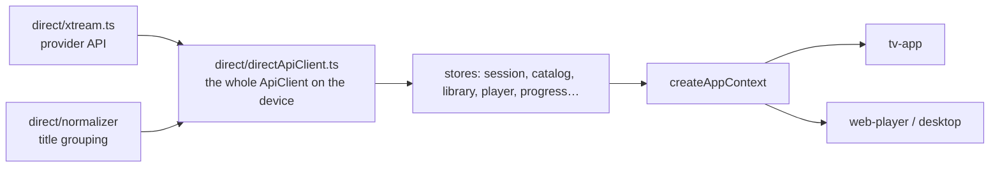

# @iptv/shared

Platform-agnostic TypeScript used by `apps/tv-app` and `apps/web-player` (and through it `apps/desktop`): the provider
client, title grouping, stores, rules and translations. The apps talk to the IPTV provider directly (D-038, D-088).


```mermaid
flowchart LR
  XT[direct/xtream.ts<br/>provider API] --> DIRECT[direct/directApiClient.ts<br/>the whole ApiClient on the device]
  NORM[direct/normalizer<br/>title grouping] --> DIRECT
  DIRECT --> STORES[stores: session, catalog, library, player, progress…]
  STORES --> CTX[createAppContext]
  CTX --> TV[tv-app]
  CTX --> WEB[web-player / desktop]
```

## Usage

```ts
import { createAppContext, useAppStore } from '@iptv/shared';

const { stores, api } = createAppContext({ config: appConfig, storage: secureStorage, direct: { dataStorage } });
await stores.session.getState().restore();                        // on startup
const status = useAppStore(stores.session, (s) => s.status);      // in React components
await stores.library.getState().loadPage('movies', { offset: 0 });
```

Each app creates one context: `apps/*/src/appContext.ts`. The data types are in `src/api/types.ts`; everything the
apps read and change goes through `ApiClient` (`src/api/apiClient.ts`).

## Commands

```bash
npm run typecheck --workspace=@iptv/shared
npm run test --workspace=@iptv/shared
```

## Rules

- No DOM or React Native imports. React is allowed (peer dependency) for hooks only.
- `useAppStore` compares selector results shallowly, so selectors may return derived arrays.
- Consumed as TypeScript source. No build step.

## Structure

| Path | Purpose |
|------|---------|
| `src/` | Package source. See [`src/README.md`](./src/README.md). |
