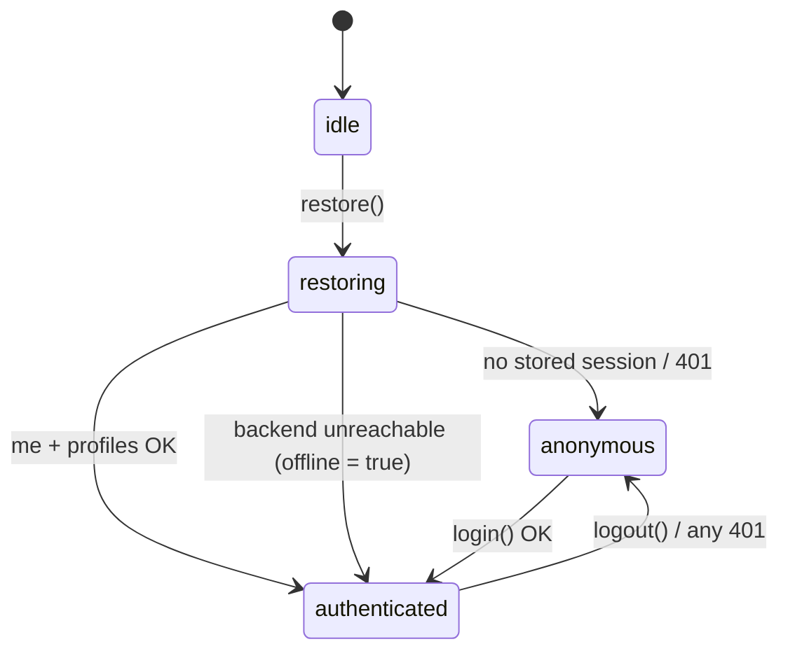

# stores

Vanilla Zustand stores (`zustand/vanilla`). Created by `createAppContext()`; read in React with `useAppStore`.

| File | State | Main actions |
|------|-------|--------------|
| `sessionStore.ts` | `status`, `token`, `account`, `profiles`, `activeProfileId`, `offline`, `lastOnlineAt` (gates downloads, D-050), `busy`, `error` | `restore`, `login`, `logout`, `selectProfile`, `create/update/deleteProfile` |
| `connectionStore.ts` | `mode` (`direct` / `server`), `serverUrl`, `loaded` | `load`, `setConnection` (persisted; native apps only, D-038) |
| `catalogStore.ts` | `categories[section]`, `liveChannels[categoryId or *]` | `loadCategories`, `loadLiveChannels`, `reset` |
| `epgStore.ts` | `grids[key]` (one guide page: category + window + offset) | `loadGrid`, `watchGrid` (polls while `refreshing`), `refresh`, `reset` |
| `libraryStore.ts` | `pages[key]`, `details[key]`, `status`, `selectedVariants`, `syncing` | `loadPage`, `loadDetails`, `refreshStatus`, `sync`, `selectVariant`, `invalidate`, `reset` |
| `playerStore.ts` | `request`, `playback`, `status`, `error` | `open`, `close` |
| `progressStore.ts` | `profileId`, `items`, `saveError` | `load`, `save` (optimistic), `remove` |
| `watchlistStore.ts` | `profileId`, `items`, `saveError` | `load`, `toggle` (optimistic, undone on error); `isOnWatchlist`, `watchlistCard` ("My List", D-055) |
| `profilePrefsStore.ts` | `prefs[profileId]`, `loaded` | `load`, `update`; per-profile preferences on this device (`settings.profiles`): the language filter (D-063). `LANGUAGE_NAMES` |
| `pinStore.ts` | `status` (`none`/`set`), `lockedUntil` | `verify`, `setPin`, `removePin`; `needsPinToOpen`, `needsPinToManage` (optional parental PIN, D-054) |
| `downloadsOwner.ts` | – | `bindDownloadsToAccount`: deletes downloads on `signOut()` and when another account signs in (D-050) |
| `resource.ts` | `Resource<T>` = `{ data, status, error, updatedAt }` | `createResourceLoader` (cache, in-flight sharing, reset-safe) |
| `storage.ts` | `KeyValueStorage` interface | `createMemoryStorage` (tests) |

Session status flow:

Selectors: `selectActiveProfile`, `selectVariant` (chosen or best variant), `isLibraryProcessing`, `describeLibraryProgress` (one line per kind: waiting, downloading, grouping N of M, ready), `findProgress`.

The progress store reloads whenever the active profile changes (wired in `appContext.ts`).
