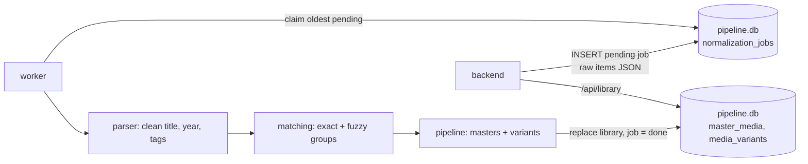

# title-normalizer

Smart Title Normalizer Engine (Python 3.11). Turns messy IPTV VOD/series lists into deduplicated master media objects with variants.



## Setup

```bash
cd services/title-normalizer
python3 -m venv .venv && source .venv/bin/activate
pip install -r requirements-dev.txt
```

## Commands

```bash
python -m pytest                          # unit + SQLite integration tests
python -m title_normalizer                # worker: polls every 5 s (Ctrl+C to stop)
python -m title_normalizer --once         # process all pending jobs, then exit
python -m title_normalizer --db PATH      # use another pipeline.db
```

The backend must have started once: it creates `pipeline.db` and its schema.

## Config

`title_normalizer/config.py` reads `APP_NAME`, `APP_SLUG`, `DATA_DIR` from the repo root `.env` (then `.env.local`). Real env vars win. Database: `<DATA_DIR>/pipeline.db`.

## Job lifecycle

| Status | Set by | Meaning |
|--------|--------|---------|
| `pending` | backend / worker retry | Waiting. |
| `processing` | worker | Claimed. Back to `pending` after 10 min without finishing. |
| `done` | worker | Library replaced. Payload cleared to `[]`. |
| `failed` | worker | 3 attempts used. `error` holds the last exception. |

## Structure

| Path | Purpose |
|------|---------|
| `title_normalizer/` | Engine + worker. No Azure imports. |
| `tests/` | pytest suite. |
| `function_app.py` | Azure Functions entry point (health only). Not used for local runs. |
| `host.json`, `local.settings.example.json` | Azure Functions host config. |
